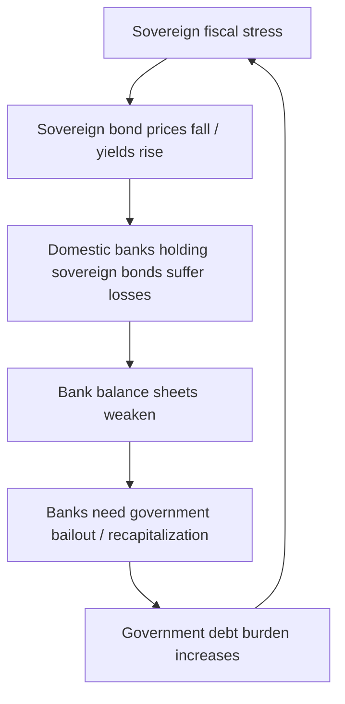
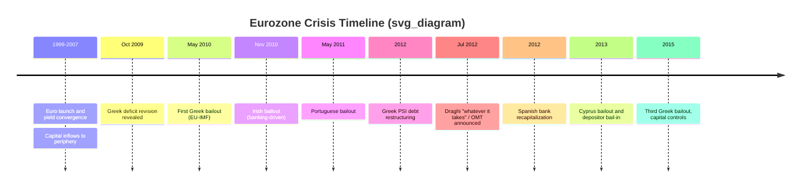

## Sovereign Debt Crises and the Eurozone Crisis

### Overview

A sovereign debt crisis occurs when a government loses the ability, or is perceived to be losing the ability, to service its outstanding debt obligations — either through outright default, forced restructuring, or reliance on emergency external financing. Unlike private debt crises, sovereign crises carry unique features: there is no supranational bankruptcy court to enforce contracts, the debtor controls its own currency (in some cases), and the debtor's cooperation is legally required for restructuring. The Eurozone crisis (2009–2015, with lingering effects into 2018) is the canonical modern case study because it combined a sovereign debt crisis with a banking crisis and a currency-design flaw, all within a monetary union that stripped member states of key policy tools.

### Theoretical Foundations of Sovereign Debt

**Why Sovereigns Borrow and Why They Default**

Governments borrow to smooth spending across time, finance counter-cyclical policy, and fund public investment. Because sovereigns cannot be forced into liquidation the way firms can, sovereign debt relies on reputational and market-access mechanisms rather than collateral seizure.

The classic theoretical framework is the Eaton-Gersovitz (1981) model, in which a sovereign chooses to default when the cost of repayment (measured in forgone consumption) exceeds the cost of default (loss of future market access, reputational damage, potential litigation, and output losses from financial disruption). This produces a key insight: default is a choice, not merely an inability to pay — it is fundamentally a cost-benefit calculation by the borrowing government.

**Debt Sustainability Analysis (DSA)**

The core analytical tool for assessing sovereign solvency is the government's intertemporal budget constraint. The debt dynamics equation is:

$$b_t = \frac{(1+i_t)}{(1+g_t)}b_{t-1} - pb_t$$

Where:

- $b_t$ = debt-to-GDP ratio at time $t$
- $i_t$ = effective nominal interest rate on debt
- $g_t$ = nominal GDP growth rate
- $pb_t$ = primary balance (revenue minus non-interest expenditure) as a share of GDP

This equation shows that debt dynamics are driven by the interest-growth differential ($i - g$) and the primary balance. When $i > g$, debt-to-GDP rises automatically unless offset by primary surpluses — this is the "snowball effect." When $i < g$, a country can run primary deficits and still see debt-to-GDP stabilize or fall.

**Key Points**

- A debt ratio can be sustainable at one interest rate and unsustainable at another — sustainability is not solely about the debt level but about the interest-growth-primary-balance triangle.
- Self-fulfilling crises are possible: if investors fear default, they demand higher yields, which raises $i$, which can push a solvent country toward genuine insolvency (a "bad equilibrium").
- This multiple-equilibria property, formalized in models building on Calvo (1988) and later applied directly to the Eurozone by De Grauwe (2011), is central to understanding why the Eurozone crisis was as severe as it was.

### The Original Sin: Currency Union Without Fiscal Union

**Structural Design of the Eurozone**

The euro (introduced 1999, physical currency 2002) created a currency union among sovereign states without a corresponding fiscal union, banking union, or lender-of-last-resort mechanism for sovereigns. This is often summarized by the "impossible trinity" applied to currency unions and by the "unholy trinity" of the Eurozone crisis: the diabolic loop between banks and sovereigns, the loss of an independent central bank as lender of last resort in national currency, and asymmetric shocks without fiscal transfers.

Three structural features made the Eurozone uniquely vulnerable:

1. **No national monetary policy**: Member states surrendered control over their own currency and interest rates to the ECB. A country facing a demand shock could not devalue its currency to restore competitiveness (unlike, e.g., the UK or the US in 2008–09).
2. **No fiscal risk-sharing**: The Stability and Growth Pact (SGP) imposed fiscal rules (3% deficit-to-GDP, 60% debt-to-GDP reference values) but there was no federal fiscal transfer mechanism comparable to US federal transfers to states in recession.
3. **Sovereign debt treated as risk-free collateral**: Under Basel banking rules, Eurozone sovereign bonds of all member states carried a 0% risk weight, meaning banks required no capital buffer to hold them. This incentivized banks — especially domestic banks — to hold large quantities of their own government's debt, creating what became known as the "doom loop" or "diabolic loop" between bank solvency and sovereign solvency.

*(Diagram: The Bank-Sovereign Doom Loop)*

**Diabolic Loop / Doom Loop Mechanism (svg_diagram)**

<svg xmlns="http://www.w3.org/2000/svg" viewBox="0 0 760 480">
<text x="380" y="30" font-size="18" font-weight="bold" text-anchor="middle" fill="#222">Bank-Sovereign Doom Loop (svg_diagram)</text>
<circle cx="220" cy="240" r="110" fill="#fde2e2" stroke="#c0392b" stroke-width="2" />
<text x="220" y="230" font-size="15" text-anchor="middle" fill="#7a1f1f" font-weight="bold">Sovereign</text>
<text x="220" y="250" font-size="13" text-anchor="middle" fill="#7a1f1f">Rising yields,</text>
<text x="220" y="267" font-size="13" text-anchor="middle" fill="#7a1f1f">fiscal stress</text>
<circle cx="540" cy="240" r="110" fill="#e2ecfd" stroke="#2c5aa0" stroke-width="2" />
<text x="540" y="230" font-size="15" text-anchor="middle" fill="#1c3b6e" font-weight="bold">Domestic Banks</text>
<text x="540" y="250" font-size="13" text-anchor="middle" fill="#1c3b6e">Hold sovereign bonds,</text>
<text x="540" y="267" font-size="13" text-anchor="middle" fill="#1c3b6e">balance sheet losses</text>
<path d="M330,200 C400,150 460,150 430,200" fill="none" stroke="#444" stroke-width="2" marker-end="url(#arrow)" />
<text x="380" y="140" font-size="12" text-anchor="middle" fill="#333">Bond losses hit bank capital</text>
<path d="M430,290 C460,340 400,340 330,290" fill="none" stroke="#444" stroke-width="2" marker-end="url(#arrow)" />
<text x="380" y="360" font-size="12" text-anchor="middle" fill="#333">Bailout raises sovereign debt</text>

<text x="380" y="420" font-size="12" text-anchor="middle" fill="#555">Feedback loop amplifies both banking and sovereign stress simultaneously</text>

</svg>

### Timeline and Anatomy of the Eurozone Crisis

**Pre-Crisis Convergence (1999–2007)**

After euro adoption, peripheral sovereign bond yields converged sharply toward German (Bund) yields, as markets priced in an implicit assumption of shared credit risk. This "convergence trade" allowed Greece, Portugal, Ireland, and Spain to borrow at near-German rates despite weaker fiscal and structural fundamentals. Cheap credit fueled housing booms (Spain, Ireland) and public spending expansion (Greece) and fed persistent current account deficits in the periphery, financed by capital inflows from core surplus countries (notably Germany) via the interbank and bond markets — a build-up of "TARGET2 imbalances" within the Eurosystem's payment settlement network.

**Trigger: The Greek Revelation (October 2009)**

The proximate trigger was the incoming Greek government's disclosure in October 2009 that the fiscal deficit for 2009 would be roughly double previously reported figures (ultimately revised to around 15% of GDP), following years of statistical misreporting. This shattered market confidence not just in Greek data but in the credibility of peripheral fiscal reporting generally, causing yield spreads across Portugal, Ireland, Italy, Greece, and Spain (collectively, and sometimes pejoratively, referred to as the "PIIGS") to widen sharply.

**Contagion Phase (2010–2012)**

- **Greece (May 2010)**: First bailout program (€110 billion) from the EU and IMF, conditional on austerity.
- **Ireland (Nov 2010)**: Bailout driven primarily by a banking crisis — the state's guarantee of bank liabilities following the 2008 property bust transformed a private banking crisis into a sovereign crisis.
- **Portugal (May 2011)**: Bailout amid weak growth and rising borrowing costs.
- **Greece (2012)**: Second bailout package plus a landmark **Private Sector Involvement (PSI)** debt restructuring — private bondholders accepted a roughly 50%+ nominal haircut, one of the largest sovereign debt restructurings in history.
- **Spain (2012)**: Direct bank recapitalization assistance (via the European Stability Mechanism) rather than a full sovereign bailout, reflecting a banking-sector-driven crisis rather than pure fiscal profligacy.
- **Cyprus (2013)**: Bailout involving unprecedented "bail-in" of uninsured bank depositors, reflecting the small state's oversized banking sector relative to GDP.

**Peak Contagion and the "Whatever It Takes" Turning Point (Summer 2012)**

Italian and Spanish 10-year yields spiked toward or past 7%, widely viewed as an unsustainable threshold. On July 26, 2012, ECB President Mario Draghi stated the ECB was ready to do "whatever it takes" to preserve the euro. This was operationalized through the announcement of **Outright Monetary Transactions (OMT)** — an unlimited, conditional bond-buying program targeting distressed sovereign debt markets. Notably, OMT was never actually activated, yet its mere announcement is widely credited with collapsing peripheral spreads — a textbook example of the "backstop effect" resolving a multiple-equilibria/self-fulfilling crisis dynamic.

**Greek Endgame (2015)**

A third bailout occurred in 2015 amid a standoff between the newly elected Syriza government and creditors, including a brief bank holiday, capital controls, and a referendum rejecting creditor terms before the government ultimately accepted a program broadly similar to what was rejected.

### Transmission Mechanisms: Sovereign-Bank-Real Economy Nexus

**The Three Interlocking Channels**

1. **Sovereign-bank channel (doom loop)**: Described above — bank holdings of domestic sovereign debt link bank and sovereign solvency.
2. **Credit crunch channel**: As bank balance sheets weakened, banks reduced lending to firms and households, causing "credit crunches" in peripheral economies independent of underlying firm creditworthiness — a mechanism studied extensively in the empirical banking literature following the crisis (e.g., using loan-level data to isolate supply-side credit contraction).
3. **Fiscal austerity/output channel**: Bailout conditionality required primary balance improvements, often via pro-cyclical austerity during recessions, which depressed GDP ($g$) — worsening the debt-to-GDP ratio through the denominator even as the numerator (debt) grew from bailout financing. This illustrates the "austerity paradox": fiscal consolidation, if it depresses growth more than it improves the primary balance, can be self-defeating for debt sustainability. The **fiscal multiplier** is central here — post-crisis IMF research (notably Blanchard and Leigh, 2013) argued that multipliers during the crisis were significantly larger than the roughly 0.5 assumed in original program forecasts, meaning austerity's growth costs were systematically underestimated.

**Sudden Stops and Capital Flow Reversal**

The crisis exhibited a classic **sudden stop** dynamic (per Calvo's terminology, developed originally for emerging markets): capital inflows that financed peripheral current account deficits reversed abruptly starting in 2010, forcing rapid current account adjustment through import compression and recession rather than gradual rebalancing.

### Institutional and Policy Responses

**Rescue Architecture**

| Mechanism | Description |
| --- | --- |
| European Financial Stability Facility (EFSF) | Temporary bailout fund (2010), issued bonds guaranteed by member states |
| European Stability Mechanism (ESM) | Permanent successor (2012), €500 billion lending capacity, funded by paid-in and callable capital |
| IMF programs | Co-financed alongside European mechanisms ("Troika" = European Commission, ECB, IMF) |
| ECB Securities Markets Programme (SMP) | 2010–2012 secondary-market sovereign bond purchases |
| Outright Monetary Transactions (OMT) | Announced 2012, unlimited but conditional; never activated |
| Long-Term Refinancing Operations (LTRO) | Cheap 3-year loans to Eurozone banks (Dec 2011, Feb 2012), easing bank funding stress and indirectly supporting sovereign bond demand via the "carry trade" |

**Structural Reforms Post-Crisis**

- **Banking Union**: Single Supervisory Mechanism (SSM, ECB-led supervision of major banks) and Single Resolution Mechanism (SRM), intended to break the doom loop by centralizing bank oversight and resolution above the national level.
- **Fiscal Compact (2012)**: Reinforced SGP rules with stricter balanced-budget requirements and automatic correction mechanisms.
- **European Semester**: Enhanced surveillance and coordination of national fiscal and structural policies.
- **Incomplete agenda**: A common deposit insurance scheme (European Deposit Insurance Scheme, EDIS) and a genuine central fiscal capacity remain, as of the last comprehensively documented period, largely unrealized — the Eurozone still lacks a full banking union and fiscal union, leaving the doom loop only partially addressed. [Inference: the precise state of EDIS negotiations and any Eurozone architecture reforms after early 2025 should be verified against current sources, as this is an active and evolving policy area.]

### Comparative Case Analysis

**Greece vs. Ireland: Two Different Crisis Origins**

- **Greece**: Primarily a *fiscal* crisis — years of deficit spending, weak tax collection, and statistical misreporting created a genuine solvency problem requiring debt restructuring (PSI).
- **Ireland**: Primarily a *banking* crisis — a domestic property bubble burst, and the government's blanket guarantee of bank liabilities (2008) converted private banking losses into public debt, causing debt-to-GDP to spike from roughly 25% (2007) to over 100% (2011) despite Ireland having been a fiscally prudent, low-debt country pre-crisis.

This distinction matters analytically: Greece needed debt relief; Ireland (and Spain) needed banking sector recapitalization and, arguably, should have had private bank creditors (not taxpayers) bear more losses — a debate that shaped subsequent EU "bail-in" rules under the Bank Recovery and Resolution Directive (BRRD).

**Key Points**

- Not all sovereign debt crises share the same root cause; policy prescriptions (austerity vs. bank resolution vs. debt restructuring) must match the underlying driver.
- The Eurozone crisis demonstrated that a currency union amplifies both fiscal crises and banking crises through the loss of independent monetary policy and the doom loop.

### Analytical Frameworks for Assessment

**Optimal Currency Area (OCA) Theory**

Robert Mundell's OCA framework holds that a currency union works well when member regions have: (1) high labor mobility, (2) price and wage flexibility, (3) fiscal transfer mechanisms, and (4) synchronized business cycles. The Eurozone crisis is widely interpreted as evidence that the euro area did not meet OCA criteria at launch — labor mobility across linguistic/cultural borders is limited, wages are relatively rigid, and there was no fiscal transfer union, making adjustment to asymmetric shocks fall disproportionately on internal devaluation (wage and price deflation) and unemployment rather than currency depreciation.

**Internal Devaluation**

Since peripheral countries could not devalue their currency to restore export competitiveness, they were forced into "internal devaluation" — reducing unit labor costs through wage cuts, public sector layoffs, and structural reforms. This process is typically much slower and more socially costly (via unemployment) than nominal currency depreciation, contributing to prolonged recessions and, in Greece's case, a depression-scale output loss (GDP contracted by roughly a quarter from peak to trough over 2008–2013).

**Debt Restructuring Frameworks**

Sovereign debt restructuring lacks a formal bankruptcy regime (unlike corporate debt), operating instead through:

- **Collective Action Clauses (CACs)**: Contractual provisions allowing a supermajority of bondholders to bind all holders to restructuring terms, reducing holdout litigation risk. The Greek PSI in 2012 famously involved retroactively inserting CACs into Greek-law bonds to force participation.
- **Paris Club / London Club**: Traditional venues for restructuring official bilateral and commercial bank debt respectively (more relevant to emerging-market sovereign crises than Greece's bond-market-dominated debt).
- **IMF lending-into-arrears policy** and debt sustainability thresholds used to determine whether IMF programs require upfront restructuring.

### Worked Example: Debt Sustainability Calculation

Consider a hypothetical peripheral economy with:

- Debt-to-GDP ($b_{t-1}$) = 120%
- Nominal interest rate ($i$) = 5%
- Nominal GDP growth ($g$) = 1%
- Primary balance ($pb$) = -2% (a primary deficit)

Applying the debt dynamics equation:

$$b_t = \frac{1.05}{1.01}(1.20) - (-0.02) = 1.247 + 0.02 = 1.267$$

Debt-to-GDP rises from 120% to approximately 126.7% in one period — illustrating how a modest interest-growth differential (4 percentage points), combined with a primary deficit, drives explosive debt dynamics typical of crisis countries like Greece in 2010–2012, where nominal growth had collapsed into negative territory while borrowing costs remained elevated.

**Example**

To stabilize debt at 120% given the same $i - g$ differential, the required primary balance is found by setting $b_t = b_{t-1}$:

$$pb^* = \left(\frac{i-g}{1+g}\right) b_{t-1} = \left(\frac{0.04}{1.01}\right)(1.20) \approx 0.0475$$

This means the government would need a primary *surplus* of roughly 4.75% of GDP merely to stabilize (not reduce) the debt ratio — illustrating why Troika-mandated primary surplus targets for Greece (initially as high as 4.5% of GDP for extended periods) were considered extraordinarily demanding by historical standards and were a central point of controversy regarding program feasibility.

### Critiques and Debates

- **Austerity vs. growth**: Critics (e.g., Krugman, Stiglitz) argued that front-loaded austerity in a demand-constrained, liquidity-trap-like environment was self-defeating, citing the underestimated fiscal multipliers noted above. Defenders of the program design argued that market confidence and fiscal credibility required visible consolidation, and that failure to adjust risked losing market access entirely.
- **ECB's role and "fiscal dominance" concerns**: Some argued the ECB's slow initial response (compared to the Federal Reserve or Bank of England) reflected the ECB's narrower price-stability mandate and legal constraints (e.g., prohibition on direct monetary financing of governments under Article 123 TFEU), while others argued OMT and later Quantitative Easing (from 2015) showed the ECB could act as a de facto backstop once political will aligned.
- **Moral hazard vs. risk-sharing**: Creditor countries (notably Germany) resisted debt mutualization (e.g., "Eurobonds") over moral hazard concerns, while debtor countries argued that asymmetric adjustment burdens without risk-sharing was both economically inefficient and politically corrosive — a tension that resurfaced, in modified form, during the COVID-19-era Next Generation EU recovery fund debate. [Inference: characterizing the *ultimate resolution* of this debate requires up-to-date sourcing beyond this document's scope.]

**Related Topics**

- Optimal Currency Area theory and Eurozone membership criteria
- Banking union architecture: SSM, SRM, and the unfinished EDIS agenda
- Sovereign default models: Eaton-Gersovitz and quantitative sovereign debt literature
- Fiscal multipliers and the austerity-growth debate
- TARGET2 imbalances and Eurosystem payment settlement mechanics
- Emerging market sovereign debt crises (Latin American debt crisis, Asian Financial Crisis) as comparative cases
- Collective Action Clauses and modern sovereign debt restructuring mechanisms
- The COVID-19 fiscal response and Next Generation EU as a partial fiscal-union step
- Quantitative Easing and unconventional monetary policy at the zero lower bound