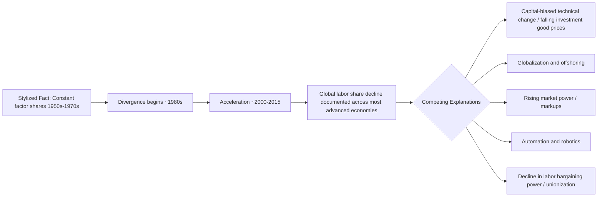
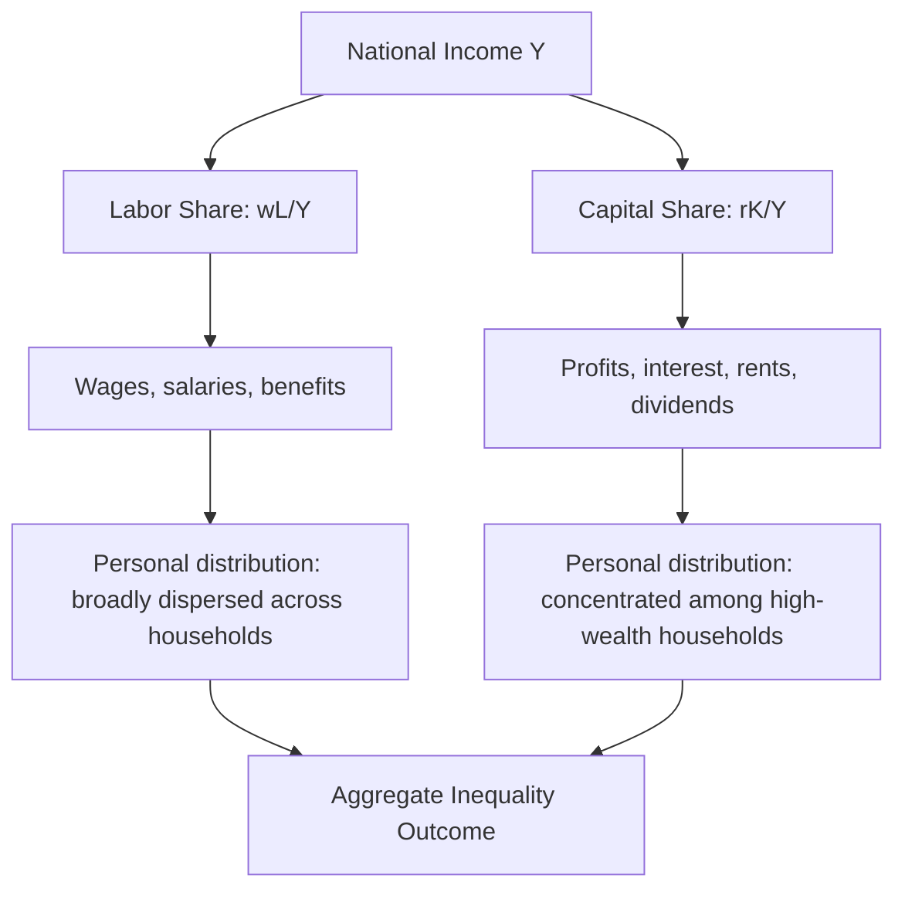

## Functional Distribution of Income: Labor versus Capital Shares

### Overview

The functional distribution of income divides national income into the shares accruing to different factors of production — primarily labor (wages, salaries, and benefits) and capital (profits, interest, rents, and dividends). This differs from the *personal* (or size) distribution of income, which examines how income is distributed across individuals or households regardless of source. For decades, the constancy of factor shares was treated as one of the "stylized facts" of growth economics (Kaldor, 1957). Since roughly the late 1970s and especially since the 1980s–2000s, a substantial body of empirical work has documented a persistent global decline in the labor share, reigniting interest in this once-settled area of macroeconomics and connecting it directly to debates on inequality, automation, and market power.

### Defining the Shares

**Basic Accounting Identity**

At the level of national accounts, gross domestic income can be decomposed as:

$$Y = wL + rK$$

Where:

- $Y$ = total output/income
- $w$ = wage rate
- $L$ = quantity of labor
- $r$ = rate of return on capital
- $K$ = capital stock

The **labor share** is defined as:

$$\text{Labor Share} = \frac{wL}{Y}$$

And the **capital share** is the complement:

$$\text{Capital Share} = \frac{rK}{Y} = 1 - \text{Labor Share}$$

**Measurement Complications**

In practice, computing these shares from national accounts data involves several well-documented adjustments:

- **Self-employment income (mixed income)**: Income earned by proprietors and the self-employed combines returns to both their labor and their capital, and national statistical agencies cannot cleanly separate the two components. Standard practice imputes a labor component to self-employment income, typically by assuming self-employed workers earn wages comparable to employees, but the choice of imputation method can materially affect the measured labor share (a point emphasized by Gollin, 2002).
- **Depreciation**: Gross versus net labor share calculations differ because gross output includes capital depreciation, which is not income to anyone; net measures (dividing by net value added) generally show different — and more volatile — trends than gross measures.
- **Housing and imputed rent**: Owner-occupied housing generates imputed rental income counted as capital income in national accounts, which can distort the capital share, especially in economies with high homeownership rates or rapidly appreciating housing markets.
- **Public sector**: Government output is often measured at cost (wages paid), mechanically pushing the public sector's "labor share" toward 100%, so aggregate labor share trends can be sensitive to the public/private sector composition of the economy.

**Key Points**

- Gollin (2002) demonstrated that once self-employment income is properly adjusted for, labor shares are remarkably similar across countries at different income levels (roughly 0.65–0.80), overturning earlier findings that developing countries had systematically lower labor shares.
- Cross-country and cross-time comparisons of labor share are highly sensitive to methodological choices (gross vs. net, adjusted vs. unadjusted for self-employment), so figures should always be checked for methodology before comparison.

### Historical Context: Kaldor's Stylized Facts

Nicholas Kaldor's 1957 list of stylized growth facts included the near-constancy of the capital share of income over long periods of economic development, alongside constant capital-output ratios and steady growth rates of capital and output per worker. This constancy was a key empirical target that early growth models were built to replicate.

**The Cobb-Douglas Production Function**

The workhorse model rationalizing constant factor shares is the Cobb-Douglas production function:

$$Y = AK^{\alpha}L^{1-\alpha}$$

Under perfect competition, profit maximization implies each factor is paid its marginal product, and a key mathematical property of the Cobb-Douglas form is that the capital share equals the *exponent* $\alpha$ and the labor share equals $(1-\alpha)$ — both constant regardless of the capital-labor ratio $K/L$. This built-in constancy made Cobb-Douglas an analytically convenient — and for a long period empirically defensible — assumption embedded throughout the Solow growth model and subsequent macroeconomics.

### The Elasticity of Substitution and Factor Shares

**CES Production Functions**

Explaining *changes* in factor shares over time requires moving beyond Cobb-Douglas (which mechanically fixes the shares) to a Constant Elasticity of Substitution (CES) production function:

$$Y = A\left[\alpha K^{\frac{\sigma-1}{\sigma}} + (1-\alpha)L^{\frac{\sigma-1}{\sigma}}\right]^{\frac{\sigma}{\sigma-1}}$$

Where $\sigma$ is the elasticity of substitution between capital and labor. The relationship between $\sigma$ and factor share movements as capital deepens (i.e., as $K/L$ rises) is:

- If $\sigma = 1$: Cobb-Douglas case — factor shares remain constant regardless of capital deepening.
- If $\sigma > 1$ (capital and labor are relatively easy substitutes): capital deepening *raises* the capital share, because the quantity effect (more capital relative to labor) dominates the price effect (falling return on capital).
- If $\sigma < 1$ (capital and labor are relatively poor substitutes/complements): capital deepening *lowers* the capital share, because the falling marginal product of capital dominates.

This framework, central to Karabarbounis and Neiman's (2014) influential analysis, provides the standard toolkit for interpreting the global labor share decline: they argue that a decline in the relative price of investment goods (driven by advances in information technology) induced capital deepening, and — under an estimated $\sigma$ modestly above 1 — this capital deepening mechanically raised the capital share (lowered the labor share) across many countries.

**Example**

Consider two economies both experiencing a 10% increase in $K/L$:

- Economy A has $\sigma = 1.25$: capital share rises, since capital and labor substitute relatively easily and firms increasingly replace labor tasks with capital, capturing a larger income share for capital.
- Economy B has $\sigma = 0.6$: capital share falls, since capital and labor are complements — more capital raises labor's marginal product more than proportionally, holding a larger share for labor even as capital intensity rises.

### The Global Labor Share Decline: Empirical Evidence

**Documented Trends**

Beginning most visibly from the 1980s and accelerating from around 2000, numerous studies (IMF World Economic Outlook 2017; Karabarbounis and Neiman, 2014; Autor et al., 2020; Dao et al., 2017 at the IMF) have documented a broad-based decline in the labor share across most advanced economies and many emerging markets, reversing the mid-20th-century pattern of relative stability.

**Key Points**

- The decline is not uniform: it is more pronounced in manufacturing than services in many countries, and more pronounced in certain sectors (notably those with high capital intensity or exposure to automation and trade).
- Superstar firm dynamics: Autor, Dorn, Katz, Patterson, and Van Reenen (2020) propose that rising industry concentration — the growing dominance of highly productive, low-labor-share "superstar firms" — can produce an aggregate labor share decline even if within-firm labor shares are relatively stable, simply through a reallocation of economic activity toward these firms.
- Global value chains and offshoring of labor-intensive production stages to lower-wage countries can lower the *measured* labor share in the offshoring country even without any change in domestic production technology.

### Competing Explanations: A Structured Comparison

| Explanation | Mechanism | Representative Evidence |
| --- | --- | --- |
| Capital-biased technical change | Falling relative price of capital equipment (especially ICT) induces capital deepening; with $\sigma > 1$, capital share rises | Karabarbounis and Neiman (2014) |
| Rising market power / markups | Firms with growing market power extract higher markups over marginal cost, mechanically reducing labor's share of revenue | De Loecker, Eeckhout, and Unger (2020) document rising average markups since ~1980 |
| Superstar firm reallocation | Economic activity concentrates in highly productive, capital-intensive, low-labor-share firms | Autor et al. (2020) |
| Globalization / offshoring | Labor-intensive stages of production shift to lower-wage economies, changing the domestic factor mix | Elsby, Hobijn, and Şahin (2013) find offshoring effects significant but partial |
| Declining labor bargaining power | Falling unionization, weaker labor protections, and increased labor market flexibility reduce labor's negotiating leverage over the surplus | Stansbury and Summers (2020) argue bargaining power decline is under-emphasized relative to technology explanations |
| Automation and robotics | Robots and AI substitute directly for routine labor tasks, particularly in manufacturing | Acemoglu and Restrepo (2020) on robot adoption and labor market outcomes |

**Note on Interpretation**

These explanations are not mutually exclusive; contemporary research (e.g., IMF 2017 WEO Chapter 3) typically finds that technology and, to a lesser extent, globalization jointly account for the largest share of the decline, with rising market power and bargaining power shifts as complementary contributing factors. [Inference: the precise quantitative decomposition across these channels remains an active area of empirical debate, and the relative weights assigned to each channel vary meaningfully across studies, datasets, and time periods.]

### Connection to Inequality

**Why Functional Distribution Matters for Personal Inequality**

Capital income is substantially more concentrated among high-income and high-wealth households than labor income. Consequently, a shift in the functional distribution toward capital tends to widen personal income inequality, since a rising share of national income flows disproportionately to those already at the top of the wealth and income distribions. This linkage is central to Thomas Piketty's *Capital in the Twenty-First Century* (2014), which emphasizes the historical relationship between the rate of return on capital ($r$) and the economy's growth rate ($g$):

$$r > g \implies \text{rising capital share and rising wealth concentration over time}$$

Piketty's argument is that when the after-tax return on capital persistently exceeds the growth rate, wealth (and the capital share of income it generates) tends to concentrate over time, absent offsetting institutional forces (progressive taxation, wars, or major policy shocks that historically compressed capital's share in the mid-20th century).

**Critiques of the Piketty Framework**

Critics (e.g., Krusell and Smith, 2015; Acemoglu and Robinson, 2015) have raised both technical points (whether $r > g$ mechanically implies rising capital *share*, which depends on the elasticity of substitution rather than following automatically) and institutional points (that political and policy responses, not mechanical dynamics, primarily determine long-run inequality outcomes). This remains a genuinely contested area in the growth and inequality literature. [Inference/Unverified — theoretical dispute: whether the $r > g$ condition robustly implies a rising capital *share* (as opposed to rising wealth-to-income ratio) depends on assumptions about $\sigma$ and savings behavior that are not universally agreed upon.]

### Policy Implications

**Labor Market Policy**

- **Minimum wage and collective bargaining**: Policies strengthening worker bargaining power (minimum wage increases, union support, sectoral bargaining) are often proposed as direct levers to raise the labor share, though effects on employment and firm competitiveness are debated in standard labor economics.
- **Active labor market policies**: Retraining and reskilling programs aimed at helping workers adapt to automation-driven skill demand shifts.

**Competition and Antitrust Policy**

Given the market-power explanation for labor share decline, several economists (e.g., associated with the "superstar firms" and markup literature) have argued for more aggressive antitrust enforcement to limit market concentration and reduce the markup-driven wedge between output price and marginal cost that suppresses labor's share.

**Tax Policy**

- Shifting relative taxation between labor and capital income (e.g., reducing payroll tax burdens while increasing capital gains or wealth taxation) directly affects the *after-tax* functional distribution, independent of the pre-tax market-determined split.
- Piketty's proposed global wealth tax is explicitly designed to counteract the $r > g$ dynamic by directly taxing the capital stock rather than only its income flow.

**Key Points**

- Functional distribution and personal distribution are related but distinct policy targets; addressing one does not automatically resolve the other (e.g., a rising labor share concentrated among top-paid executives would not reduce personal income inequality).
- Any policy response should be evaluated against the underlying *cause* of a labor share decline: interventions appropriate for a market-power-driven decline (antitrust) differ substantially from those appropriate for a technology-driven decline (education, social insurance, redistribution).

### Analytical Summary Diagram

**Related Topics**

- Piketty's $r > g$ framework and wealth concentration dynamics
- CES production functions and elasticity of substitution estimation methods
- Superstar firms, industry concentration, and markup measurement (De Loecker-Eeckhout methodology)
- Skill-biased technical change and the labor market polarization literature
- Automation, robotics, and task-based models of the labor market (Acemoglu-Restrepo framework)
- Personal (size) distribution of income and the Gini coefficient
- Optimal taxation of capital versus labor income
- Bargaining power, unionization trends, and monopsony in labor markets