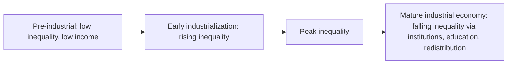

## Personal Income Distribution and Measurement

### Overview

The personal (or size) distribution of income examines how total income is distributed across individuals or households, ranked from lowest to highest, without regard to the *source* of that income (labor, capital, or transfers). This is the distributional concept most directly relevant to public discourse on "inequality," as opposed to the functional distribution (labor vs. capital shares), which concerns the factor composition of income rather than its dispersion across people. Measuring personal income distribution accurately is methodologically demanding: choices about income definition, unit of analysis, equivalence scaling, and data source can each produce materially different pictures of the same underlying economy.

### Conceptual Foundations

**What Counts as "Income"?**

Before any distribution can be measured, income must be defined. Standard national and international statistical frameworks (e.g., the Canberra Group Handbook on Household Income Statistics) distinguish several income concepts:

- **Market income**: Wages, self-employment income, capital income (interest, dividends, rent), and private transfers, before any government intervention.
- **Gross income**: Market income plus public cash transfers (pensions, unemployment benefits, social assistance).
- **Disposable income**: Gross income minus direct taxes and social security contributions — the most commonly used concept for inequality comparisons, since it reflects income actually available for consumption or saving.
- **Post-fiscal / final income**: Disposable income adjusted further for indirect taxes (e.g., VAT) and the value of in-kind government transfers (public education, healthcare) — a more comprehensive but data-intensive and methodologically contested measure.

**Key Points**

- The choice of income concept dramatically affects measured inequality: market income inequality is always higher than disposable income inequality in countries with progressive tax-and-transfer systems, so comparing a country's *market* income Gini to another country's *disposable* income Gini is a common and serious methodological error.
- The gap between market and disposable income inequality is itself an important object of study, since it measures the redistributive effect of a country's tax-and-transfer system.

**Unit of Analysis and Equivalence Scales**

Income can be measured at the individual, household, or "tax unit" level, and each choice has consequences:

- **Household-level analysis** requires an **equivalence scale** to adjust for the fact that a household of four does not need four times the income of a single person to achieve the same standard of living, due to economies of scale in shared consumption (housing, utilities, appliances).
- The most widely used scale in cross-country comparisons is the **OECD-modified equivalence scale**, which assigns a weight of 1.0 to the first adult, 0.5 to each additional adult, and 0.3 to each child; equivalized household income is then household income divided by this weighted household size, and this equivalized figure is typically assigned to *every* member of the household for distributional analysis.
- Alternative scales (the older OECD scale, the square-root scale used by the LIS Cross-National Data Center, and country-specific poverty-line-based scales) can produce non-trivial differences in measured inequality, particularly for cross-country rankings.

### Measures of Inequality

**The Lorenz Curve**

The Lorenz curve plots the cumulative share of total income (vertical axis) received by the cumulative share of the population (horizontal axis), ranked from poorest to richest. Perfect equality is represented by the 45-degree diagonal line; the further the actual Lorenz curve bows below this line, the greater the inequality.

**Lorenz Curve (svg_diagram)**

<svg xmlns="http://www.w3.org/2000/svg" viewBox="0 0 500 500">
<text x="250" y="25" font-size="16" font-weight="bold" text-anchor="middle" fill="#222">Lorenz Curve (svg_diagram)</text>
<line x1="60" y1="440" x2="460" y2="440" stroke="#333" stroke-width="2" />
<line x1="60" y1="440" x2="60" y2="60" stroke="#333" stroke-width="2" />
<text x="260" y="475" font-size="13" text-anchor="middle" fill="#333">Cumulative Share of Population</text>
<text x="25" y="250" font-size="13" text-anchor="middle" fill="#333" transform="rotate(-90 25,250)">Cumulative Share of Income</text>
<line x1="60" y1="440" x2="460" y2="60" stroke="#888" stroke-width="1.5" stroke-dasharray="6,4" />
<text x="420" y="90" font-size="12" fill="#666">Line of Perfect Equality</text>
<path d="M60,440 C150,430 250,400 330,320 C390,250 430,150 460,60" fill="none" stroke="#c0392b" stroke-width="3" />
<text x="150" y="380" font-size="12" fill="#7a1f1f" font-weight="bold">Lorenz Curve (actual distribution)</text>
<path d="M60,440 L460,60 L460,60 C430,150 390,250 330,320 C250,400 150,430 60,440 Z" fill="#f5c6c6" opacity="0.4" />
<text x="230" y="270" font-size="12" fill="#7a1f1f">Area A</text>
<text x="380" y="420" font-size="11" fill="#555">(Gini = Area A / Area under diagonal)</text>
</svg>

**The Gini Coefficient**

The Gini coefficient is the single most widely reported summary inequality statistic, derived directly from the Lorenz curve:

$$G = \frac{A}{A+B}$$

Where $A$ is the area between the line of perfect equality and the Lorenz curve, and $A+B$ is the total area under the line of perfect equality. $G$ ranges from 0 (perfect equality) to 1 (perfect inequality — one person holds all income). An equivalent and computationally common formula, based on pairwise income comparisons, is:

$$G = \frac{\sum_{i=1}^{n}\sum_{j=1}^{n} |y_i - y_j|}{2n^2\bar{y}}$$

Where $y_i$ and $y_j$ are individual incomes, $n$ is the population size, and $\bar{y}$ is mean income.

**Key Points**

- The Gini coefficient is most sensitive to changes in the *middle* of the income distribution and relatively insensitive to changes at the very top or very bottom — a widely noted limitation given contemporary interest in top-1% income shares.
- Gini coefficients are not perfectly comparable across studies unless the underlying income concept (market vs. disposable), unit of analysis, and equivalence scale are identical.

**Other Common Summary Measures**

| Measure | Definition | Key Property |
| --- | --- | --- |
| Gini coefficient | See above | Most sensitive to middle of distribution |
| Theil index | Entropy-based measure: $T = \frac{1}{n}\sum_i \frac{y_i}{\bar y}\ln\left(\frac{y_i}{\bar y}\right)$ | Perfectly decomposable into within-group and between-group components |
| Atkinson index | $A_\varepsilon = 1 - \left[\frac{1}{n}\sum_i\left(\frac{y_i}{\bar y}\right)^{1-\varepsilon}\right]^{1/(1-\varepsilon)}$ | Built on an explicit social welfare function with inequality-aversion parameter $\varepsilon$ |
| Percentile ratios (e.g., P90/P10, P50/P10) | Ratio of income at given percentiles | Robust to outliers; intuitive; ignores shape of distribution outside chosen percentiles |
| Top income shares (top 1%, top 10%) | Share of total income received by top X% | Directly captures top-end concentration missed by Gini; central to Piketty-Saez-style research |
| Coefficient of variation | Standard deviation divided by mean | Sensitive to outliers/top incomes; less commonly used for income than Gini |

**The Theil Index and Decomposability**

The Theil index's key analytical advantage over the Gini coefficient is exact decomposability: total inequality can be split into inequality *within* subgroups (e.g., within each region or education group) and inequality *between* subgroups (e.g., differences in average income across regions), with the two components summing exactly to total inequality:

$$T_{total} = T_{within} + T_{between}$$

This property makes the Theil index the preferred tool in studies decomposing, for example, how much of national inequality is attributable to rural-urban gaps versus within-rural or within-urban dispersion.

**The Atkinson Index and Normative Content**

Unlike the Gini coefficient, which is a purely descriptive statistic, the Atkinson index is explicitly derived from a social welfare function and embeds a normative inequality-aversion parameter $\varepsilon$: higher values of $\varepsilon$ place greater social weight on inequality at the lower end of the distribution. This allows the Atkinson index to answer a welfare-economics question directly — "what fraction of total income could be given up, if perfectly equally distributed, to achieve the same social welfare as the actual distribution?" — a property the Gini coefficient does not have.

### Data Sources and Measurement Challenges

**Household Surveys**

The dominant data source for personal income distribution globally is household survey data (e.g., the U.S. Current Population Survey, the EU Statistics on Income and Living Conditions [EU-SILC], the Luxembourg Income Study [LIS] harmonized cross-country database). Key limitations include:

- **Top-coding and non-response bias**: High-income households are systematically underrepresented in survey data, both because they are less likely to respond and because many surveys cap ("top-code") reported income values to protect respondent privacy, mechanically understating top-end inequality.
- **Underreporting of capital income**: Survey respondents tend to underreport capital income and self-employment income relative to labor income, biasing measured inequality downward since capital income is more concentrated at the top.

**Tax Records and the Piketty-Saez Methodology**

Given survey limitations at the top of the distribution, Thomas Piketty and Emmanuel Saez pioneered the use of income tax return data (following earlier work by Kuznets) to construct long-run, historically consistent top income share series, notably for the United States back to 1913. This approach, now implemented across dozens of countries through the **World Inequality Database (WID)**, captures top-end concentration far more accurately than household surveys but introduces its own issues:

- Tax avoidance and evasion can distort reported taxable income, particularly for capital income subject to preferential tax treatment.
- Changes in tax law (e.g., the U.S. Tax Reform Act of 1986, which incentivized shifting business income from the corporate to the individual tax base) can create discontinuities in tax-based income series that do not reflect genuine changes in underlying economic inequality — a widely-discussed methodological caution in this literature.
- Tax-unit-based data (individuals or married couples filing jointly) differs from household-based survey data, complicating direct comparison.

**Combining Sources: Distributional National Accounts**

A more recent methodological advance, associated principally with Piketty, Saez, and Zucman's **Distributional National Accounts (DINA)** framework, combines survey microdata, tax records, and national accounts aggregates to allocate 100% of national income (matching the macroeconomic totals) across the full population, including income categories poorly captured by either surveys or tax data alone (e.g., undistributed corporate profits, imputed rents). [Inference: DINA methodology remains actively debated among researchers regarding the specific imputation assumptions used to allocate non-individually-observed income categories, and different research teams applying broadly similar frameworks have produced somewhat divergent top-share estimates for some countries.]

**Key Points**

- No single data source is fully adequate on its own: household surveys understate top-end inequality; tax data misses non-filers, informal income, and is sensitive to tax-law changes; DINA-style combined approaches require substantial imputation assumptions.
- Researchers should always report which data source and income concept underlies a given inequality statistic, since "the" Gini coefficient for a country can vary meaningfully across otherwise credible sources.

### Cross-Country and Historical Patterns

**The Kuznets Curve Hypothesis**

Simon Kuznets (1955) hypothesized an inverted-U relationship between economic development and inequality: inequality first rises during early industrialization (as workers move from low-inequality agriculture to a more dispersed industrial/urban wage structure) and later falls as the economy matures and social/political institutions redistribute the gains of growth more broadly.

**Key Points**

- The original Kuznets curve was based on limited historical U.S. data and cross-sectional comparisons; subsequent research (including Piketty's own long-run work) has challenged its universality, noting that inequality has *risen* again in many advanced economies since the 1980s — an empirical pattern inconsistent with a simple, one-time inverted-U — sometimes discussed as evidence for a "Kuznets wave" rather than a single curve.
- Institutional and policy factors (education expansion, unionization, minimum wages, progressive taxation, and their subsequent partial reversal in many countries) are now generally viewed as more central than a mechanical stage-of-development process in explaining actual historical inequality trajectories.

**Recent Global Patterns**

Broadly, the period since approximately 1980 has seen rising within-country inequality in most advanced economies (documented extensively in World Inequality Report editions) alongside falling *between-country* inequality at the global level, driven substantially by rapid growth in large emerging economies (especially China and India) narrowing the gap between average incomes across countries even as gaps within many countries widened.

### Relationship to Poverty Measurement

Personal income distribution measurement is closely linked to, but distinct from, poverty measurement:

- **Relative poverty** thresholds (e.g., 60% of median equivalized income, commonly used in EU statistics) are directly derived from the income distribution itself, so relative poverty rates can rise or fall purely due to changes in the *shape* of the distribution (e.g., median income shifts) even absent any change in absolute living standards for the poor.
- **Absolute poverty** thresholds (e.g., the World Bank's international poverty line, historically $1.90/day and periodically revised — most recently to $2.15/day in 2017 PPP terms, though such thresholds are periodically rebased) are fixed in real terms and are not mechanically tied to the shape of the distribution, making them more suitable for tracking absolute living standard improvements over time, particularly in developing-country and global contexts.

### Worked Example: Computing a Simple Gini Coefficient

Consider a five-person economy with incomes: 10, 20, 30, 40, 100 (total = 200).

**Example**

Step 1 — Compute cumulative population and income shares:

| Person | Income | Cumulative Pop. Share | Cumulative Income Share |
| --- | --- | --- | --- |
| 1 | 10 | 0.20 | 0.05 |
| 2 | 20 | 0.40 | 0.15 |
| 3 | 30 | 0.60 | 0.30 |
| 4 | 40 | 0.80 | 0.50 |
| 5 | 100 | 1.00 | 1.00 |

Step 2 — Apply the trapezoidal approximation to the Gini formula:

$$G \approx 1 - \sum_{i=1}^{n}(X_i - X_{i-1})(Y_i + Y_{i-1})$$

Where $X_i$ and $Y_i$ are cumulative population and income shares respectively. Computing each trapezoid segment and summing yields $G \approx 0.36$, indicating moderate inequality — notably, the single high earner (person 5, holding 50% of total income) drives the majority of the measured dispersion, illustrating the Gini's sensitivity to concentration even in a small sample.

**Related Topics**

- The tax-and-transfer system and redistributive policy design
- World Inequality Database and Distributional National Accounts methodology in depth
- Wealth (as opposed to income) distribution and the wealth Gini
- Relative and absolute poverty measurement methodologies
- Intergenerational income mobility ("The Great Gatsby Curve")
- Top income shares and the Piketty-Saez-Zucman long-run series
- Functional distribution of income (labor vs. capital shares) as a driver of personal distribution
- Cross-country inequality comparisons and purchasing power parity (PPP) adjustments