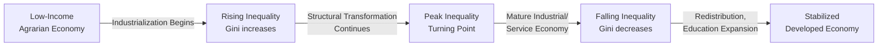

## Gini Coefficient and Lorenz Curve

### Overview

The Gini coefficient and Lorenz curve are the two most widely used tools for measuring and visualizing income or wealth inequality within an economy. The Lorenz curve provides a graphical representation of distributional inequality, while the Gini coefficient condenses that graphical information into a single summary statistic between 0 and 1.

### Historical Background

**Key Points**

- The Lorenz curve was introduced by American economist Max O. Lorenz in 1905 as a way to represent wealth distribution graphically.
- The Gini coefficient was developed by Italian statistician Corrado Gini in 1912, building on the Lorenz curve concept.
- Both tools remain the standard reference measures in macroeconomics, development economics, and public policy analysis for distributional questions.

### The Lorenz Curve

#### Definition

The Lorenz curve plots the cumulative share of total income (or wealth) earned by the bottom $x\%$ of the population, ranked from poorest to richest, against the cumulative share of the population $x\%$.

Formally, if $F(y)$ is the cumulative distribution function of income $y$, the Lorenz curve $L(p)$ is defined as:

$$L(p) = \frac{\int_0^p Q(t)\,dt}{\mu}$$

where $Q(t)$ is the quantile function (income at percentile $t$) and $\mu$ is the mean income of the population.

#### Key Properties

- $L(0) = 0$ and $L(1) = 1$ always hold, since zero population share corresponds to zero income share, and the full population holds all income.
- The curve is non-decreasing and convex when income is non-negative.
- The **line of perfect equality** is the 45-degree diagonal line $L(p) = p$, representing a scenario where every individual holds an identical income share.
- The greater the bow (sag) of the Lorenz curve below the diagonal, the greater the inequality.
- A Lorenz curve that lies entirely below another (never crosses it) indicates unambiguously higher inequality — this is called **Lorenz dominance**.

#### Diagram

<svg xmlns="http://www.w3.org/2000/svg" viewBox="0 0 500 500">
<text x="250" y="25" font-size="16" font-family="sans-serif" text-anchor="middle" font-weight="bold">Lorenz Curve (svg_diagram)</text>

<line x1="60" y1="440" x2="460" y2="440" stroke="black" stroke-width="1.5" />
<line x1="60" y1="440" x2="60" y2="60" stroke="black" stroke-width="1.5" />


<text x="260" y="475" font-size="13" font-family="sans-serif" text-anchor="middle">Cumulative Share of Population (%)</text>

<text x="25" y="250" font-size="13" font-family="sans-serif" text-anchor="middle" transform="rotate(-90 25,250)">Cumulative Share of Income (%)</text>


<text x="60" y="455" font-size="11" text-anchor="middle">0</text>

<text x="460" y="455" font-size="11" text-anchor="middle">100</text>

<text x="45" y="444" font-size="11" text-anchor="end">0</text>

<text x="45" y="65" font-size="11" text-anchor="end">100</text>


<line x1="60" y1="440" x2="460" y2="60" stroke="#888888" stroke-width="1.5" stroke-dasharray="6,4" />
<text x="400" y="90" font-size="11" font-family="sans-serif" fill="#666666">Perfect Equality</text>

<path d="M 60 440 Q 200 430, 280 360 T 460 60" fill="none" stroke="#1a5fb4" stroke-width="2.5" />
<text x="230" y="410" font-size="11" font-family="sans-serif" fill="#1a5fb4">Lorenz Curve</text>

<path d="M 60 440 L 460 440 L 460 60" fill="none" stroke="#c01c28" stroke-width="1.5" stroke-dasharray="2,3" />
<text x="380" y="430" font-size="11" font-family="sans-serif" fill="#c01c28">Perfect Inequality</text>


<text x="150" y="300" font-size="11" font-family="sans-serif" fill="`#333333`">Area A (between diagonal</text>

<text x="150" y="315" font-size="11" font-family="sans-serif" fill="`#333333`">and Lorenz curve)</text>

</svg>

### The Gini Coefficient

#### Definition

The Gini coefficient $G$ measures the area between the line of perfect equality and the Lorenz curve, expressed as a ratio of the total area under the line of perfect equality.

$$G = \frac{A}{A+B}$$

where $A$ is the area between the diagonal and the Lorenz curve, and $A+B$ is the total area under the diagonal (which always equals $0.5$ on a unit square).

Equivalently:

$$G = 1 - 2\int_0^1 L(p)\,dp$$

#### Interpretation Scale

| Gini Value | Interpretation |
| --- | --- |
| $0$ | Perfect equality — every individual has identical income |
| $\rightarrow 1$ | Perfect inequality — one individual holds all income, everyone else has none |
| $0.25$–$0.35$ | Typical of highly egalitarian developed economies (e.g., Nordic countries) |
| $0.40$–$0.45$ | Typical of the United States and many middle-inequality economies |
| $\geq 0.50$ | High inequality, common in parts of Latin America and Southern Africa |

**Note:** Real-world Gini coefficients almost never reach the theoretical bounds of 0 or 1. [Inference] The specific numeric ranges by region are broad generalizations and vary by measurement methodology and year; consult current national statistical sources for precise figures.

#### Alternative Computational Formula (Discrete Data)

For a population with $n$ individuals, incomes sorted in ascending order $y_1 \le y_2 \le \dots \le y_n$, the Gini coefficient can be computed as:

$$G = \frac{2\sum_{i=1}^{n} i \cdot y_i}{n\sum_{i=1}^{n} y_i} - \frac{n+1}{n}$$

This formula is standard in applied econometrics and is the one most commonly implemented in statistical software packages for grouped or micro-level survey data.

#### Mean Absolute Difference Formulation

An equivalent formulation expresses the Gini coefficient in terms of the average absolute difference between all pairs of incomes:

$$G = \frac{\sum_{i=1}^n \sum_{j=1}^n |y_i - y_j|}{2n^2\mu}$$

This version highlights that the Gini coefficient is fundamentally a measure of relative mean difference — how far apart, on average, any two randomly drawn individuals' incomes are, scaled by twice the mean.

### Worked Example

Consider a simplified 5-household economy with the following annual incomes (in $'000s): 10, 20, 30, 40, 100.

**Step 1: Compute total income and cumulative shares.**

| Household (ranked) | Income | Cumulative Income | Cumulative Income Share | Cumulative Population Share |
| --- | --- | --- | --- | --- |
| 1 | 10 | 10 | 5.0% | 20% |
| 2 | 20 | 30 | 15.0% | 40% |
| 3 | 30 | 60 | 30.0% | 60% |
| 4 | 40 | 100 | 50.0% | 80% |
| 5 | 100 | 200 | 100.0% | 100% |

**Step 2: Plot the Lorenz curve** using the (population share, income share) pairs: (0,0), (0.2, 0.05), (0.4, 0.15), (0.6, 0.30), (0.8, 0.50), (1.0, 1.0).

**Step 3: Apply the discrete Gini formula.**

Using $n = 5$, sorted incomes $y = [10, 20, 30, 40, 100]$, $\sum y_i = 200$:

$$\sum_{i=1}^{5} i \cdot y_i = (1)(10) + (2)(20) + (3)(30) + (4)(40) + (5)(100) = 10+40+90+160+500 = 800$$


$$G = \frac{2(800)}{5(200)} - \frac{6}{5} = \frac{1600}{1000} - 1.2 = 1.6 - 1.2 = 0.40$$

**Output:** The Gini coefficient for this 5-household economy is $G = 0.40$, indicating a moderate-to-high level of income inequality driven largely by the top household's outsized income share (50% of total income held by the top 20% of households).

### Relationship to Macroeconomic Analysis

#### Why Macroeconomists Use These Tools

- **Growth-inequality tradeoffs:** Used to test hypotheses such as the Kuznets curve, which posits an inverted-U relationship between economic development and inequality.
- **Policy evaluation:** Compares Gini coefficients before and after taxes and transfers (market income Gini vs. disposable income Gini) to measure the redistributive effect of fiscal policy.
- **Cross-country comparisons:** Standardized measure enabling comparison of inequality across countries with different currencies, price levels, and population sizes.
- **Business cycle interaction:** Used to study how recessions, inflation, and monetary policy asymmetrically affect different income deciles.

#### The Kuznets Curve Connection



[Speculation] The empirical validity of the Kuznets curve hypothesis is contested in modern development economics; many economists argue it does not hold consistently across countries or time periods, and rising inequality in several advanced economies since the 1980s runs counter to the model's predicted downward slope.

### Limitations of the Gini Coefficient

**Key Points**

- **Non-uniqueness:** Different Lorenz curves (representing different underlying distributions) can produce the *same* Gini coefficient, since the coefficient only captures the aggregate area between curves, not the shape of the distribution.
- **Insensitivity to where inequality occurs:** A given change in the Gini coefficient does not indicate *where* in the distribution the change occurred (top-heavy vs. bottom-heavy shifts can produce similar coefficient movements).
- **Sensitive to data source:** Measured Gini coefficients can vary substantially depending on whether they use income vs. consumption, pre-tax vs. post-tax data, individual vs. household units, and survey vs. administrative data sources.
- **Does not capture non-monetary inequality:** Excludes access to public goods, health outcomes, education quality, and wealth held in illiquid or non-reported assets.
- **Small-sample sensitivity:** With small populations or highly skewed samples, the discrete Gini formula can be sensitive to outliers (as shown in the worked example, where one household drove the majority of the inequality result).

### Related Inequality Measures

| Measure | Description |
| --- | --- |
| **Theil Index** | Based on information theory (entropy); decomposable into within-group and between-group inequality components |
| **Atkinson Index** | Incorporates an explicit social welfare/inequality-aversion parameter, allowing normative weighting of inequality at different points in the distribution |
| **Palma Ratio** | Ratio of income share held by the top 10% to the income share held by the bottom 40% |
| **20:20 Ratio** | Ratio of average income of the top quintile to the average income of the bottom quintile |
| **Coefficient of Variation** | Standard deviation of income divided by mean income; less commonly used for inequality but statistically related |

### Common Extensions and Applications

- **Wealth Gini vs. Income Gini:** Wealth is typically far more concentrated than income, so wealth Gini coefficients are almost always higher than income Gini coefficients for the same economy. [Inference] This pattern is broadly documented but exact magnitudes vary by country and data vintage.
- **Global Gini Coefficient:** Aggregates inequality across all individuals worldwide, treating the globe as a single distribution — used to study convergence/divergence between nations versus within-nation inequality.
- **Generalized Lorenz Curve:** Multiplies the standard Lorenz curve by mean income $\mu$, allowing comparisons of both inequality *and* absolute welfare levels simultaneously (useful when comparing countries with different average incomes).
- **Concentration Curve/Index:** A generalization of the Lorenz curve/Gini framework applied to non-income variables (e.g., health spending, education spending) ranked by income, used heavily in health economics.

### Practical Computation Notes

**Example** (conceptual, language-agnostic pseudocode for computing Gini from survey microdata):



```
function gini(incomes):
    sort incomes ascending
    n = length(incomes)
    cumulative_sum = 0
    weighted_sum = 0
    for i from 1 to n:
        weighted_sum += i * incomes[i]
    total_income = sum(incomes)
    G = (2 * weighted_sum) / (n * total_income) - (n + 1) / n
    return G
```

[Unverified] Behavior may vary slightly across statistical software packages (e.g., R's `ineq` package, Stata's `ineqdeco`, Python's `numpy`-based implementations) due to differences in bias-correction adjustments for sample vs. population Gini estimates; always check documentation for the specific finite-sample correction applied.

### Conclusion

The Lorenz curve and Gini coefficient together form the foundational toolkit for quantifying and visualizing income and wealth inequality in macroeconomic analysis. The Lorenz curve offers rich visual and distributional detail, while the Gini coefficient distills that information into a single comparable number widely used in policy design, international comparisons, and empirical growth research. Despite well-known limitations, they remain the default starting point for nearly all applied inequality analysis, often supplemented by decomposable indices like Theil or normative measures like Atkinson when finer distributional detail is required.

**Related Topics**

- Kuznets Curve and the growth-inequality relationship
- Theil Index and entropy-based inequality decomposition
- Atkinson Index and social welfare functions
- Tax incidence and redistributive fiscal policy
- Wealth inequality and capital income concentration (Piketty-style analysis)
- Poverty measurement (headcount ratio, poverty gap index)
- Human Development Index (HDI) as a non-income welfare measure
- Intergenerational income mobility and its relationship to static inequality snapshots