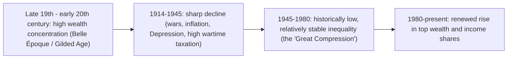

## Piketty's r-versus-g Framework and Wealth Inequality

### Overview

Thomas Piketty's $r > g$ framework, developed most comprehensively in *Capital in the Twenty-First Century* (2014) and building on decades of collaborative work with Emmanuel Saez, Gabriel Zucman, and Anthony Atkinson, argues that the relationship between the rate of return on capital ($r$) and the economy's growth rate ($g$) is a central structural driver of long-run wealth concentration. The framework reframes inequality analysis around wealth dynamics and capital accumulation rather than solely income flows, and draws on an unusually long historical dataset — some series extending back to the 18th century — to argue that the mid-20th-century era of relatively low inequality was a historical anomaly rather than a natural endpoint of capitalist development.

### The Core Inequality: $r > g$

**Formal Statement**

The central relationship is deceptively simple:

$$r > g$$

Where:

- $r$ = the average annual rate of return on capital (encompassing profits, dividends, interest, rents, and capital gains, net of inflation but typically before tax in the base formulation)
- $g$ = the economy's growth rate of output/income (and, in steady state, population plus productivity growth)

**Why This Inequality Matters: The Wealth Accumulation Mechanism**

The intuition is that if capital earns a return $r$ that exceeds the rate at which the overall economy grows ($g$), then wealth already held by capital owners grows *faster* than the economy as a whole. Absent offsetting forces (high consumption out of capital income, taxation, or one-time shocks like wars or depressions that destroy capital), wealth held by existing capital owners will mechanically become a larger share of total national wealth over time, and — since capital income accrues predominantly to the wealthy — this dynamic tends to increase the concentration of both wealth and, subsequently, capital income.

**The Wealth-to-Income Ratio ($\beta$)**

A central empirical and theoretical object in Piketty's framework is the aggregate wealth-to-income ratio, denoted $\beta = W/Y$ (total private wealth divided by national income). Piketty documents that $\beta$ was very high in 18th- and 19th-century Europe (roughly 600–700% of national income), collapsed dramatically over 1914–1950 (due to wars, inflation, and Depression-era asset destruction), and has been rising again since the 1970s–1980s, approaching or exceeding historical highs in several advanced economies by the early 21st century.

### The Two Fundamental Laws of Capitalism

**First Fundamental Law**

$$\alpha = r \times \beta$$

Where $\alpha$ is the capital share of national income, $r$ is the rate of return on capital, and $\beta$ is the wealth-to-income ratio. This is an accounting identity, not a behavioral theory: it states that the capital share of income equals the rate of return multiplied by the stock of capital relative to income. Its usefulness lies in decomposing changes in the capital share (discussed under functional income distribution) into a return component and a wealth-accumulation component.

**Second Fundamental Law**

$$\beta = \frac{s}{g}$$

Where $s$ is the economy's net savings rate and $g$ is the growth rate. This is a steady-state result from a standard capital accumulation model: in the long run, the wealth-to-income ratio settles at a level equal to the savings rate divided by the growth rate. The direct implication is that a period of *slowing growth* (falling $g$) — as many advanced economies have experienced due to demographic aging and productivity slowdowns — mechanically implies a *higher* steady-state wealth-to-income ratio for any given savings rate, which Piketty argues helps explain the observed rise in $\beta$ since the late 20th century.

**Key Points**

- The two "laws" are best understood as accounting/steady-state relationships that organize the data, not as causal theories in themselves; the causal argument for *rising inequality* requires the additional empirical claim that $r > g$ persists and that capital income remains concentrated among wealth holders.
- $\beta = s/g$ implies that structurally slower-growing advanced economies (low $g$) will tend toward higher wealth-to-income ratios than faster-growing emerging economies, all else equal — a mechanism distinct from, but complementary to, the $r > g$ argument about *concentration* of that wealth.

### Historical Evidence

**Long-Run Data Construction**

The empirical foundation of the framework rests on multi-source historical reconstructions combining tax records (estate tax and income tax data), national accounts, and — for earlier centuries — probate and property records, compiled most comprehensively through the World Inequality Database (WID), a collaborative project led by Piketty, Saez, Zucman, and a global network of researchers.

**The U-Shaped Pattern of Top Wealth and Income Shares**

A defining empirical finding is a pronounced U-shape in top income and wealth shares across the 20th century in most advanced economies (most sharply documented for the United States, United Kingdom, and France):

**Why the Mid-Century "Great Compression" Occurred**

Piketty attributes the dramatic mid-20th-century decline in wealth concentration primarily to capital destruction and policy shocks specific to the World War era — physical destruction of capital, inflation eroding the real value of financial assets and fixed-income claims, nationalizations, and, critically, historically unprecedented top marginal tax rates on income, capital gains, and estates introduced during and after the wars — rather than to any natural or automatic equalizing tendency of market economies. This is the basis for his broader claim that the 1945–1980 period was a historical *exception*, driven by specific and largely non-repeatable shocks, rather than a stable endpoint that mature capitalist economies gravitate toward.

### Theoretical Critiques and Debates

**The Elasticity of Substitution Objection**

A central technical critique, raised prominently by Matthew Rognlie (2015) and formalized by Krusell and Smith (2015), concerns the link between the wealth-to-income ratio $\beta$ and the capital *share* $\alpha$. Piketty's framework implicitly requires that a rising $\beta$ translates into a rising $\alpha$ (via the first fundamental law, $\alpha = r\beta$), but this requires the elasticity of substitution between capital and labor to be sufficiently high — specifically, above 1 in the relevant range — otherwise, as capital accumulates, the rate of return $r$ falls fast enough that the capital share can actually *decline* even as $\beta$ rises. Rognlie's empirical work suggested that once housing capital (which behaves differently from productive business capital) is excluded, the estimated elasticity of substitution may be closer to or below 1, undermining part of the mechanical link central to Piketty's argument.

**Rognlie's Housing Critique**

A related and influential point from Rognlie is that a substantial portion of the rise in $\beta$ (wealth-to-income ratios) documented by Piketty across advanced economies is attributable specifically to rising *housing* wealth (driven by rising land/housing prices relative to income) rather than to rising productive capital (machinery, equipment, business capital) accumulation — a distinction with significant implications, since housing capital and productive business capital may respond differently to taxation, have different substitutability with labor, and have different distributional consequences depending on homeownership patterns across the wealth distribution.

**Behavioral and Institutional Critiques**

Daron Acemoglu and James Robinson (2015) argue that Piketty's framework underweights the role of political institutions and policy choices in determining long-run inequality outcomes, contending that the "fundamental laws" are not iron economic laws but outcomes heavily mediated by endogenous political responses (e.g., democratic pressure for redistribution, labor market institutions) that can and historically have offset or reversed capital-driven concentration dynamics independent of the pure $r$ vs. $g$ comparison.

**Savings Behavior and Capital Income Reinvestment**

The concentration mechanism also depends critically on an assumption about *savings behavior*: the framework's inequality-amplifying dynamic requires that wealthy capital owners save/reinvest a high fraction of their capital income rather than consuming it. If the wealthy have high propensities to consume out of capital income, or if wealth is dissipated across generations through inheritance division, taxation, or poor investment choices, the mechanical $r > g$ concentration effect can be substantially weakened in practice — a point emphasized in several formal theoretical responses to Piketty's work. [Inference: the empirical magnitude of this dampening effect is contested and varies by country-specific inheritance, tax, and wealth-management institutional context.]

**Key Points**

- The $r > g$ inequality is a necessary but not sufficient condition for rising wealth concentration; the full mechanism also requires an elasticity of substitution and savings/reinvestment behavior consistent with wealth compounding faster than the economy grows.
- Critics broadly accept Piketty's historical data reconstruction as a major empirical contribution while substantially contesting the tightness of the *theoretical* link he draws between $r > g$ and inevitable rising capital share/wealth concentration.

### Policy Implications: The Global Wealth Tax Proposal

**Piketty's Proposed Response**

Given the framework's implication that market forces alone will not reliably reverse rising wealth concentration, Piketty's principal policy proposal is a **progressive global (or at minimum coordinated multilateral) tax on capital/wealth**, designed to directly reduce the net-of-tax rate of return on large fortunes below the growth rate, thereby reversing the $r > g$ dynamic at its source rather than only redistributing the resulting income flows after the fact.

**Key Design Considerations and Critiques of the Proposal**

- **Coordination problem**: A wealth tax implemented unilaterally by a single country risks substantial capital flight to lower-tax jurisdictions, motivating Piketty's emphasis on international coordination — itself a major practical and political obstacle given sovereign tax competition incentives.
- **Valuation and liquidity challenges**: Annual wealth taxes require valuing illiquid assets (private business equity, real estate, art) that lack observable market prices, creating substantial administrative and compliance complexity relative to income or consumption taxes.
- **Alternative policy instruments**: Some economists favor alternative approaches to address the same underlying concern — higher capital gains and inheritance taxation, closing preferential tax treatment for capital income relative to labor income, or strengthening existing property and estate tax enforcement — arguing these achieve similar redistributive goals with lower administrative complexity than a novel annual wealth tax.

### Empirical Status: How Well Does $r > g$ Hold Historically?

Piketty's own historical data suggest that $r > g$ has held for most of recorded economic history, with the notable exception of the mid-20th century (roughly 1914–1975), when rapid post-war growth, wartime capital destruction, and high taxation combined to compress or reverse the gap. Piketty's central historical claim is thus that the late 20th and early 21st century — characterized by high $r$ relative to a *structurally slowing* $g$ in advanced economies — represents a partial return toward the historically "normal" pattern of $r$ persistently exceeding $g$, rather than an aberration itself. [Unverified/Inference: precise contemporary estimates of the $r - g$ gap fluctuate with monetary policy conditions, asset price cycles, and measurement choices regarding which asset returns are included in $r$; readers should consult current WID or OECD wealth statistics for up-to-date figures rather than treating any single historical estimate as fixed.]

### Distinguishing Wealth Inequality from Income Inequality

**Why Wealth Concentration Typically Exceeds Income Concentration**

Wealth distributions are consistently far more concentrated than income distributions in virtually every economy for which data exists — for example, top-1% wealth shares are typically several multiples of top-1% income shares in the same country. This arises because wealth is a *stock* accumulated over time (including via inheritance, compounding returns, and multi-generational transfers), whereas income is a *flow* more directly tied to current labor market participation, which is far more broadly distributed across the population than asset ownership.

**Key Points**

- Wealth inequality and income inequality, while related through the capital-income-generates-more-wealth feedback loop central to Piketty's framework, are conceptually distinct measurement objects requiring different data sources (estate/wealth tax records and household balance sheet surveys, versus income tax and labor income data).
- Policy debates that conflate the two (e.g., proposing income-tax-only solutions to a primarily wealth-concentration-driven inequality problem) risk mismatched instruments relative to the underlying dynamic being addressed.

**Related Topics**

- Functional distribution of income and the elasticity of substitution (Rognlie critique in full technical depth)
- Wealth Gini coefficients and household balance sheet survey methodology
- Inheritance taxation and intergenerational wealth transmission
- World Inequality Database (WID) construction methodology
- Optimal capital taxation theory (Chamley-Judd and its critiques)
- Historical capital destruction events and their distributional consequences (World Wars, hyperinflation episodes)
- Housing wealth versus productive capital in modern wealth-to-income ratios
- Cross-country comparison of wealth tax design (historical European wealth taxes and their repeal)