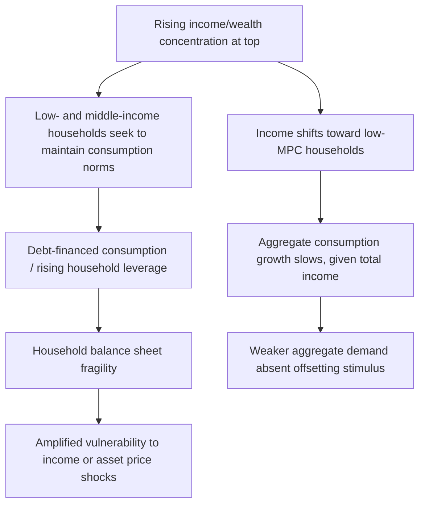
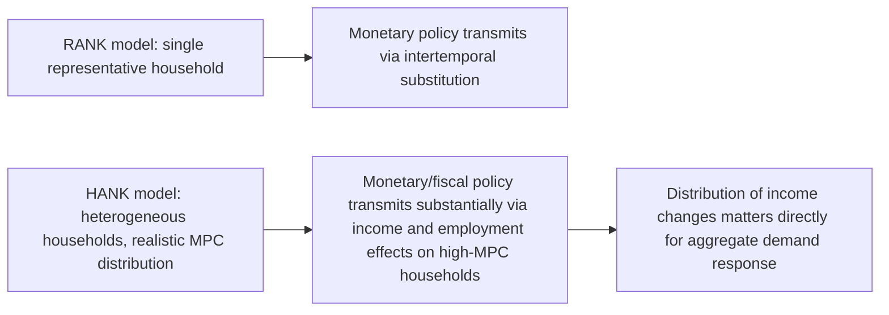

## Inequality and Aggregate Demand

### Overview

The relationship between income/wealth inequality and aggregate demand examines how the distribution of income across households — not merely its total level — affects macroeconomic outcomes such as consumption, saving, investment, and overall output. This connects distributional economics directly to core macroeconomic theory, challenging the standard representative-agent framework (in which distribution is largely irrelevant to aggregate outcomes) by emphasizing heterogeneity in spending behavior across households at different points in the income and wealth distribution. This area has grown substantially in prominence since the 2008 Global Financial Crisis, which prompted renewed interest in whether rising pre-crisis inequality contributed to macroeconomic fragility.

### Theoretical Foundation: Heterogeneous Marginal Propensities to Consume

**The Core Mechanism**

The central theoretical building block is the empirical regularity that the **marginal propensity to consume (MPC)** — the fraction of an additional dollar of income spent on consumption rather than saved — is systematically higher for lower-income and lower-wealth households than for higher-income and higher-wealth households. This is grounded in several complementary theories:

- **Diminishing marginal utility of consumption**: Standard consumer theory implies that as income rises, an increasing share of additional income is saved rather than spent, since basic needs are already met and additional consumption yields lower marginal utility.
- **Liquidity constraints**: Lower-income households are more likely to be credit-constrained or hold limited liquid assets, meaning they consume close to their current income (a "hand-to-mouth" pattern) rather than smoothing consumption via borrowing or drawing down savings, as the permanent income and life-cycle hypotheses would otherwise predict for unconstrained agents.
- **Precautionary saving heterogeneity**: Wealthier households, having already accumulated substantial buffer-stock savings, exhibit lower marginal propensities to consume out of transitory income shocks compared to households with minimal savings buffers.

**Formal Aggregate Demand Implication**

If $MPC_{low} > MPC_{high}$, then for a given level of *total* income $Y$, redistributing a fixed amount $\Delta$ from high-MPC to low-MPC households raises aggregate consumption:

$$\Delta C = \Delta \times (MPC_{low} - MPC_{high}) > 0$$

This is the theoretical foundation for the claim that a more unequal *distribution* of a given total income level tends to produce lower aggregate consumption (and, all else equal, lower aggregate demand) than a more equal distribution of the same total income — a proposition with a long lineage in underconsumptionist and post-Keynesian thought, and now studied rigorously within modern heterogeneous-agent macroeconomic models.

### The "Rajan Hypothesis": Inequality, Credit, and the 2008 Crisis

**Core Argument**

Raghuram Rajan's *Fault Lines* (2010) proposed an influential — though contested — narrative connecting rising U.S. income inequality from the 1980s onward to the 2008 financial crisis: as median household income growth stagnated relative to top incomes, political pressure emerged to expand access to credit (particularly mortgage credit, via policies supporting subprime lending and government-sponsored enterprises) as a politically expedient substitute for addressing stagnant wages directly. This credit expansion, in Rajan's account, fueled the pre-crisis housing boom and the excessive leverage that amplified the eventual crash.

**Critiques of the Rajan Hypothesis**

Subsequent empirical work (including Mian and Sufi's extensive household-level research in *House of Debt*, 2014) has generally found more support for a *credit supply*-driven account of the pre-crisis boom (financial deregulation and securitization expanding credit availability somewhat independently of underlying inequality trends) than for inequality serving as a primary causal driver of the credit expansion itself. [Inference: the relative weight of inequality-driven demand for credit versus supply-side financial innovation in explaining the 2003-2007 U.S. credit boom remains a genuinely contested empirical question rather than a settled consensus.]

### The "Keeping Up with the Joneses" / Trickle-Down Consumption Channel

**Relative Consumption and Debt Accumulation**

An alternative and complementary mechanism, formalized in models following Bertrand and Morse (2016) ("trickle-down consumption") and related to Veblen-style relative-consumption theory, proposes that rising consumption by top-income households can raise consumption *aspirations* or reference points for middle- and lower-income households (through social comparison or visible consumption effects), inducing them to increase their own consumption — often financed by debt — even without corresponding income gains. This provides a distinct channel by which rising top-end inequality could be associated with rising household leverage in the broader population, independent of the direct MPC-heterogeneity channel described above.

**Key Points**

- These two mechanisms are complementary, not mutually exclusive: heterogeneous MPCs predict *lower* aggregate consumption from a given income redistribution toward the top, while trickle-down consumption effects predict that middle/lower-income households may partially offset this via debt-financed consumption — with the debt-financed offset itself creating financial fragility risk.
- Empirically distinguishing these channels requires household-level microdata linking income, consumption, and debt over time, which has become increasingly available through administrative and financial account datasets in recent research.

### Secular Stagnation and the Inequality Channel

**Connecting to Secular Stagnation Theory**

Larry Summers's revival of the "secular stagnation" hypothesis (2013–2014) — the idea that advanced economies face a persistent tendency toward excess desired saving relative to desired investment, pushing the natural real interest rate toward zero or negative territory — explicitly incorporates rising inequality as one contributing factor, since a shift of income toward high-saving households (with high wealth and low MPC) raises aggregate desired saving for any given level of investment demand, contributing to downward pressure on the equilibrium real interest rate and creating persistent demand-side headwinds that conventional monetary policy (constrained by the zero lower bound) may struggle to offset.

**Key Points**

- The secular stagnation-inequality link operates through the aggregate saving-investment balance: rising inequality raises the aggregate propensity to save, which — absent an offsetting rise in desired investment — depresses the natural rate of interest and can leave the economy prone to demand shortfalls even with accommodative monetary policy.
- This framework has direct implications for fiscal policy debates, since fiscal stimulus targeted at high-MPC households (lower- and middle-income transfers) is predicted to have larger aggregate demand effects per dollar of spending than equivalent stimulus concentrated among high-income, low-MPC households — a consideration explicitly incorporated into fiscal multiplier estimates used in stimulus design (e.g., discussions surrounding the design of the 2008-09 and 2020-21 U.S. fiscal responses).

### Heterogeneous-Agent New Keynesian (HANK) Models

**Departure from Representative-Agent Models**

Standard New Keynesian (RANK — Representative Agent New Keynesian) models assume a single representative household, implying that the *distribution* of income and wealth across households is irrelevant to aggregate dynamics — only aggregate income matters. **HANK models** (Heterogeneous-Agent New Keynesian), developed prominently by Kaplan, Moll, and Violante (2018) and building on the broader Bewley-Huggett-Aiyagari class of heterogeneous-agent models, explicitly incorporate household heterogeneity in income and liquid/illiquid wealth holdings, generating a realistic distribution of MPCs across the population (including a substantial share of "wealthy hand-to-mouth" households who hold illiquid wealth, such as home equity or retirement accounts, but little liquid savings, causing them to behave like low-liquidity, high-MPC agents despite non-trivial net worth).

**Key Implications for Monetary and Fiscal Policy**

HANK models generate materially different transmission mechanisms for monetary policy compared to RANK models:

- In RANK models, monetary policy operates primarily through intertemporal substitution (the representative household's response to changes in the real interest rate affecting the trade-off between consuming today versus tomorrow).
- In HANK models, a substantial share of the aggregate consumption response to interest rate changes operates through **indirect general equilibrium effects** — changes in aggregate labor income and employment resulting from the policy — rather than direct intertemporal substitution by individual households, because high-MPC hand-to-mouth households respond much more strongly to changes in their *current income* than to changes in the interest rate they face on saving/borrowing decisions they are largely unable to make.
- This reframing has significant implications for the design and targeting of fiscal stimulus: transfers or tax cuts targeted at high-MPC households generate substantially larger and faster aggregate demand responses than equivalent-cost policies distributed uniformly or targeted at lower-MPC households, a result directly informing the design rationale behind targeted stimulus checks and unemployment insurance expansions in several recent fiscal policy episodes.

### Empirical Evidence on the MPC-Inequality Channel

**Microdata Estimates of Heterogeneous MPCs**

Empirical studies using natural experiments — including U.S. tax rebate episodes (2001, 2008, 2020-21 stimulus payments) studied via household survey and administrative data — consistently find substantially higher MPCs out of transitory income for lower-income, lower-liquid-wealth households (estimates often in the range of 0.3–0.6 for constrained households within the quarter of receipt) compared to considerably lower estimated MPCs for higher-income, higher-liquid-wealth households, supporting the core heterogeneous-MPC mechanism underlying the inequality-aggregate demand link. [Inference: precise MPC magnitudes vary meaningfully across studies depending on the specific income/wealth shock studied, time horizon measured, and identification strategy used, so point estimates should be treated as illustrative of the qualitative heterogeneity pattern rather than as universally fixed parameters.]

**Cross-Country and Time-Series Evidence**

Cross-country panel studies (e.g., work associated with the IMF's inequality and growth research agenda, including Ostry, Berg, and Tsangarides, 2014) have examined whether higher inequality is empirically associated with lower or less durable growth episodes, generally finding some supportive evidence, though establishing clean causal identification (rather than mere correlation, given the many confounding factors affecting both inequality and growth) remains methodologically challenging in cross-country macro data.

### Policy Implications

**Fiscal Policy Design**

- **Targeted transfers**: Given heterogeneous MPCs, fiscal stimulus efficiency (output generated per dollar of government spending, or the "bang for the buck") can be enhanced by targeting transfers toward higher-MPC (typically lower-income and lower-liquid-wealth) households, a consideration explicitly built into modern fiscal multiplier analysis.
- **Automatic stabilizers**: Unemployment insurance and other means-tested transfer programs that automatically direct resources toward income-constrained households during downturns serve a dual role — social insurance and macroeconomic stabilization — precisely because they route resources toward high-MPC agents when aggregate demand is weakest.

**Structural and Redistributive Policy**

- Policies affecting the *functional* and *personal* distribution of income (minimum wages, collective bargaining support, progressive taxation) have aggregate demand implications beyond their direct distributional or equity goals, insofar as they shift the composition of income toward higher-MPC households.
- Central banks operating under a dual mandate (e.g., the U.S. Federal Reserve) have increasingly incorporated distributional considerations into policy discussions, given the recognition that heterogeneous household responses to monetary policy affect both the transmission mechanism and the distributional incidence of that policy itself.

**Key Points**

- The inequality-aggregate demand link does not imply that redistribution is a costless "free lunch" for growth — standard efficiency-equity trade-offs (e.g., potential disincentive effects of higher taxation on labor supply or investment) remain relevant and must be weighed against the aggregate demand benefits of increased low-income household consumption.
- The strength and policy relevance of this channel is state-dependent: it matters most when the economy faces a demand shortfall (e.g., a recession, liquidity trap, or period of below-target inflation) and is less central to macroeconomic outcomes when the economy is supply-constrained or operating near full capacity, where distributional shifts in demand have more muted aggregate output effects and operate primarily through prices.

**Related Topics**

- HANK (Heterogeneous-Agent New Keynesian) model architecture in technical depth
- Secular stagnation theory and the natural rate of interest
- Fiscal multipliers and targeted versus universal stimulus design
- Household debt, leverage cycles, and financial stability (Mian-Sufi research agenda)
- Functional distribution of income as an upstream driver of aggregate MPC composition
- Permanent income and life-cycle hypotheses versus hand-to-mouth consumption behavior
- Monetary policy transmission channels under household heterogeneity
- Automatic stabilizers and counter-cyclical fiscal policy design