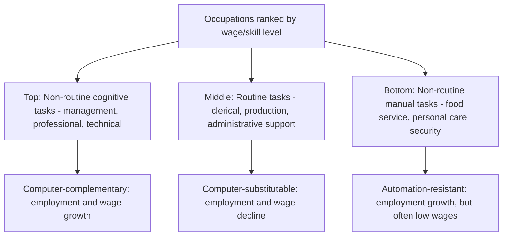

## Skill-Biased Technological Change and Wage Inequality

### Overview

Skill-biased technological change (SBTC) refers to technological progress that disproportionately increases the productivity of, and therefore the labor market demand for, higher-skilled (typically more educated) workers relative to lower-skilled workers. SBTC has been one of the dominant explanatory frameworks in labor economics for understanding the substantial rise in wage inequality — particularly the widening gap between college-educated and non-college-educated workers — observed across most advanced economies since roughly the late 1970s. The framework has since been refined, extended, and partly challenged by subsequent research emphasizing task-based and polarization dynamics.

### Theoretical Foundation

**The Canonical Supply-Demand Framework**

The baseline SBTC model treats the college/high-school wage premium as determined by the relative supply and relative demand for skilled versus unskilled labor, formalized through a constant elasticity of substitution (CES) aggregate production function distinguishing skilled ($S$) and unskilled ($U$) labor:

$$Y = \left[\theta(A_S S)^{\frac{\sigma-1}{\sigma}} + (1-\theta)(A_U U)^{\frac{\sigma-1}{\sigma}}\right]^{\frac{\sigma}{\sigma-1}}$$

Where $A_S$ and $A_U$ represent factor-augmenting technology levels for skilled and unskilled labor respectively, and $\sigma$ is the elasticity of substitution between the two labor types. Under this framework, the skill premium (wage ratio of skilled to unskilled workers) can be shown to depend on relative technology and relative supply:

$$\ln\left(\frac{w_S}{w_U}\right) = \text{const} + \frac{\sigma-1}{\sigma}\ln\left(\frac{A_S}{A_U}\right) - \frac{1}{\sigma}\ln\left(\frac{S}{U}\right)$$

**Interpreting the Formula**

This equation, central to the influential work of Katz and Murphy (1992) and later Autor, Katz, and Krueger (1998) and Acemoglu (2002), captures a "race between technology and education": the skill premium rises when relative demand for skilled labor (driven by skill-biased technology, $A_S/A_U$) grows faster than the relative supply of skilled labor ($S/U$, driven primarily by educational attainment expansion). A rising skill premium alongside a rising relative supply of educated workers is interpreted as strong evidence that relative demand shifts (skill-biased technology) must have been substantial enough to outpace even a growing supply of skilled labor.

**Key Points**

- The framework explains the "wage-education paradox" of the 1980s-2000s: despite a substantial increase in the supply of college-educated workers over this period (which should, all else equal, *reduce* the skill premium by making skilled labor relatively more abundant), the college wage premium rose substantially, implying that relative demand shifts toward skilled labor were large enough to overwhelm the supply-side effect.
- The elasticity of substitution $\sigma$ between skilled and unskilled labor is a critical and empirically estimated parameter; most estimates in this literature place $\sigma$ in the range of roughly 1.4–2.5, implying skilled and unskilled labor are relatively substitutable, which is necessary for the demand-shift mechanism to generate the observed wage premium movements.

### Empirical Motivation: The Rise of the College Wage Premium

**Documented Trends**

Beginning in the late 1970s and accelerating through the 1980s, the college wage premium (the wage differential between college-educated and high-school-educated workers) rose substantially across most advanced economies, particularly the United States and United Kingdom, reversing a period of relative stability or even compression in the preceding decades (a compression itself documented and analyzed by Goldin and Katz in *The Race between Education and Technology*, 2008).

**The Computer Revolution as the Primary SBTC Driver**

The dominant empirical proxy for skill-biased technology in this literature is the diffusion of computers and information technology into the workplace. Studies including Krueger (1993) and Autor, Katz, and Krueger (1998) find that industries and occupations with faster computer adoption experienced correspondingly faster growth in the relative demand for (and wages of) more educated workers, consistent with computers being complementary to skilled labor (e.g., abstract, analytical, and non-routine tasks) while substituting for certain tasks previously performed by less-educated workers (e.g., routine clerical and production tasks).

### Extension: The Task-Based Approach and Job Polarization

**Limitations of the Canonical SBTC Model**

By the mid-2000s, researchers observed empirical patterns inconsistent with the simple monotonic skilled-vs-unskilled SBTC framework: notably, employment and wage growth were strongest not just at the top of the skill/wage distribution but also, to a lesser extent, at the *bottom* (low-wage service occupations), with the middle of the distribution (routine manufacturing and clerical occupations) experiencing the weakest growth or outright decline — a pattern termed **job polarization**.

**The Autor-Levy-Murnane (ALM) Task Framework**

Autor, Levy, and Murnane (2003), followed by Autor, Katz, and Kearney (2006) and Acemoglu and Autor (2011), reformulated the analysis around **tasks** rather than broad skill categories, distinguishing:

- **Routine tasks**: Tasks following well-defined, codifiable procedures (e.g., bookkeeping, repetitive assembly-line work, routine clerical filing) — these tasks are the ones most directly substitutable by computerization and automation.
- **Non-routine cognitive/analytical tasks**: Tasks requiring abstract reasoning, problem-solving, creativity, and complex communication (e.g., management, professional, and technical occupations) — complementary to computer technology.
- **Non-routine manual tasks**: Tasks requiring situational adaptability, visual/motor coordination in unpredictable physical environments, and interpersonal skills (e.g., food service, personal care, security) — historically difficult to automate and generally low-wage.

**The Polarization Pattern Explained**

Under this framework, computerization directly substitutes for *routine* tasks (found predominantly in the middle of the wage/skill distribution — routine manufacturing and clerical occupations), while complementing non-routine cognitive tasks (top of the distribution) and leaving non-routine manual tasks (bottom of the distribution) relatively unaffected by automation, producing employment and wage growth concentrated at both tails with relative decline in the middle — the characteristic "polarization" or U-shaped employment change pattern by occupational wage rank documented across most advanced economies from the 1990s onward.

**Key Points**

- The task-based framework subsumes and refines the canonical SBTC model rather than fully rejecting it: technology remains skill-biased in the sense of favoring non-routine cognitive skills, but the framework's key innovation is recognizing that the skill-task mapping is not simply monotonic in education or wage level.
- Job polarization implies that middle-skill, middle-wage workers displaced from routine occupations face a genuinely difficult transition, since the growing job categories at both the top (requiring substantial additional education/cognitive skill) and bottom (low-wage, limited career progression) of the distribution are not natural destinations for displaced routine-task workers — a mechanism linked in subsequent research to rising labor market polarization's contribution to overall wage inequality and reduced intergenerational mobility in affected regions.

### Distinguishing SBTC from Competing Explanations

**Comparison with Alternative Wage Inequality Explanations**

| Explanation | Core Mechanism | Relationship to SBTC |
| --- | --- | --- |
| Skill-biased technological change | Technology raises relative demand for skilled/cognitive labor | Primary/dominant framework, especially pre-2000s |
| Task-based automation / polarization | Routine tasks substituted, non-routine tasks complemented, regardless of formal skill/education level | Refinement and extension of SBTC, not a rejection |
| Trade and globalization (Stolper-Samuelson) | Import competition and offshoring reduce relative demand for less-skilled labor in advanced economies | Complementary; empirically found to be a contributing but generally smaller factor than technology in most advanced-economy studies (e.g., Autor, Dorn, and Hanson's "China Shock" research finding substantial *regional* labor market effects) |
| Declining unionization and labor market institutions | Weakened collective bargaining reduces wage compression, particularly at the bottom/middle of the distribution | Complementary institutional channel, emphasized especially by Card and DiNardo (2002) as at least as important as SBTC for certain distributional changes (e.g., within-group wage dispersion, gender wage gaps) |
| Superstar firms and market concentration | Reallocation of economic activity toward highly productive, high-wage-paying firms | Distinct but related channel operating more at the firm level than the individual-worker skill level |

**The Card-DiNardo Critique**

David Card and John DiNardo (2002) raised an influential empirical challenge to the canonical SBTC narrative, noting that SBTC alone struggles to explain certain features of the U.S. wage distribution's evolution — notably, the *stalling* of the increase in within-group wage inequality and the college premium during parts of the 1990s despite continued computer diffusion, and the substantial role of the declining real minimum wage and deunionization in explaining wage inequality growth, particularly at the bottom of the distribution and for reducing gender wage convergence — patterns not well explained by a technology-only story.

### International Evidence and Institutional Mediation

**Cross-Country Variation**

A key piece of evidence often cited in the SBTC-versus-institutions debate is that advanced economies exposed to broadly similar technological changes (computerization diffused globally on a similar timeline) experienced markedly different magnitudes of wage inequality increase — the United States and United Kingdom saw substantially larger increases in wage dispersion than continental European economies (e.g., Germany, France) and Nordic countries over the same period, despite comparable technology adoption.

**Key Points**

- This cross-country divergence, given similar technology exposure, is widely interpreted as evidence that labor market institutions (minimum wage levels, union density and collective bargaining coverage, employment protection legislation) substantially *mediate* how much of a given technology-driven demand shift translates into actual wage inequality outcomes.
- This supports a synthesis view, now common in the literature, that technology sets the *underlying demand pressure* for skill/task reallocation, while institutions and policy determine how much of that pressure is absorbed through wage inequality versus other margins (employment reallocation, hours adjustment, or wage compression maintained through institutional wage-setting).

### Contemporary Extensions: Automation, Robotics, and AI

**Acemoglu-Restrepo Task Displacement Framework**

More recent research by Daron Acemoglu and Pascual Restrepo extends the task-based approach with an explicit distinction between the **displacement effect** (automation directly substitutes for labor in tasks it takes over) and the **reinstatement effect** (technological change also creates entirely new tasks and job categories in which labor has a comparative advantage, partially offsetting displacement). Their empirical work on industrial robot adoption (2020) finds measurable negative effects on employment and wages in regions and demographic groups most exposed to robot adoption, providing a modern, causally-identified complement to the broader SBTC/task-based literature using a specific, quantifiable technology (industrial robots) rather than the more diffuse "computerization" proxy used in earlier studies.

**Open Questions Regarding AI**

Whether large-scale generative AI and related technologies will primarily displace non-routine cognitive tasks (previously considered relatively automation-resistant under the ALM framework) — thereby altering or reversing the historical polarization pattern by affecting higher-skill occupations more than earlier computerization did — is an active and unresolved area of ongoing research. [Speculation: any specific claim about AI's net effect on the skill premium or occupational polarization pattern should be treated as forward-looking and uncertain, since robust causal empirical evidence analogous to the decades of data underlying the classical SBTC and robotics literature is not yet available at comparable scale or time horizon.]

**Related Topics**

- Job polarization and the Autor-Levy-Murnane task-based framework in technical depth
- The "China Shock" and trade-driven regional labor market adjustment (Autor-Dorn-Hanson)
- Acemoglu-Restrepo automation and robotics displacement/reinstatement framework
- Minimum wage, unionization, and labor market institutions' role in wage inequality
- Functional distribution of income as a related but distinct inequality dimension
- Educational attainment trends and the "race between education and technology" (Goldin-Katz)
- Gender wage gap evolution and its relationship to skill-biased demand shifts
- Regional and spatial wage inequality and labor market adjustment frictions