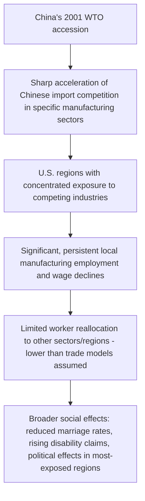
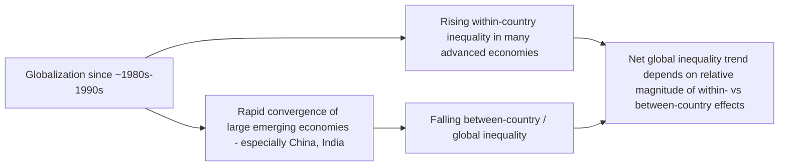

## Globalization's Effects on Income Distribution

### Overview

Globalization — the increasing integration of goods, capital, labor, and technology markets across national borders — has been a central subject of macroeconomic and trade-theoretic inquiry into rising inequality in advanced and developing economies alike. While standard trade theory predicts unambiguous aggregate efficiency gains from trade liberalization, its *distributional* consequences are theoretically ambiguous and empirically contested, generating a large and still-evolving literature spanning international trade, labor economics, and macroeconomics. This topic connects directly to skill-biased technological change and functional income distribution as a competing and complementary explanation for the same broad inequality trends observed since the late 20th century.

### Theoretical Foundations: Trade Theory and Distribution

**The Stolper-Samuelson Theorem**

The foundational trade-theoretic prediction comes from the Stolper-Samuelson theorem (1941), derived within the Heckscher-Ohlin framework of comparative advantage based on relative factor endowments. The theorem states that trade liberalization raises the real return to a country's **abundant factor** and lowers the real return to its **scarce factor**.

$$\text{Trade liberalization} \implies \hat{w}_{abundant} > \hat{P} > \hat{w}_{scarce}$$

Where $\hat{w}$ denotes the percentage change in factor returns and $\hat{P}$ the percentage change in the relative price of the good intensive in that factor.

**Application to Advanced Economies**

For capital- and skill-abundant advanced economies (relative to developing-country trading partners), the theorem predicts that trade liberalization should raise returns to capital and skilled labor (the abundant factors) while lowering returns to unskilled labor (the scarce factor, relative to developing countries) — providing a clean theoretical channel by which expanded trade with labor-abundant developing economies could contribute directly to rising wage inequality between skilled and unskilled workers in advanced economies, operating independently of (though potentially reinforcing) the skill-biased technological change channel.

**Key Points**

- The Stolper-Samuelson mechanism predicts *relative* factor price changes driven by changes in relative goods prices from trade, distinct from the technology-driven relative demand shifts central to the SBTC framework — though both mechanisms can operate simultaneously and are difficult to fully disentangle empirically.
- The theorem's stark predictions rely on strong simplifying assumptions (two goods, two factors, perfect factor mobility across sectors domestically, no transport costs) that are frequently violated in practice, motivating extensions and more empirically grounded approaches discussed below.

### The Trade-versus-Technology Debate

**Early Empirical Consensus (1990s)**

Early empirical work attempting to decompose the relative contributions of trade and technology to rising U.S. and advanced-economy wage inequality in the 1980s-1990s (surveyed extensively by Krugman, 1995, and later Feenstra and Hanson) generally concluded that trade's contribution, while real and detectable, was **modest relative to technology's contribution** — a consensus grounded partly in the observation that trade volumes with low-wage developing countries, while growing, remained a relatively small share of GDP for most advanced economies during this period, limiting the plausible magnitude of Stolper-Samuelson-type effects.

**The "China Shock" Revision**

This relatively sanguine consensus was substantially revised following the influential body of work by David Autor, David Dorn, and Gordon Hanson (beginning with their 2013 paper "The China Syndrome" and extended in numerous follow-up studies), which exploited the sharp and arguably exogenous acceleration of Chinese import competition following China's 2001 WTO accession to identify substantial, geographically concentrated negative effects on U.S. manufacturing employment, wages, and broader local labor market outcomes (including effects on marriage rates, disability claims, and political polarization in the most exposed regions).

**Key Methodological Contribution: Local Labor Market Exposure**

The "China Shock" literature's key methodological innovation was moving away from aggregate national-level trade-and-wages regressions (which struggled to detect large effects, partly due to averaging over regions with very different exposure) toward **regional/local labor market exposure** measures, exploiting the fact that different U.S. commuting zones had very different pre-existing industry compositions and therefore very different degrees of exposure to Chinese import competition — providing much sharper identification of trade's causal labor market effects than earlier national-aggregate approaches.

**Key Points**

- A central and somewhat unexpected finding of this literature is that labor market adjustment to trade shocks was substantially **slower and less complete** than canonical trade models (which typically assume relatively frictionless factor reallocation across sectors and regions) had predicted — displaced manufacturing workers in the most exposed regions did not smoothly transition into other sectors, but instead experienced prolonged local unemployment, wage declines, and labor force exit.
- This finding motivated substantial subsequent research and policy discussion on trade adjustment assistance program design and the broader question of how trade liberalization's aggregate efficiency gains should be weighed against concentrated, slow-to-resolve regional distributional costs.

### Offshoring and Global Value Chains

**Task-Level Offshoring (Distinct from Traditional Trade)**

A related but analytically distinct channel is the offshoring of specific production *tasks* or stages (rather than entire industries) to lower-wage countries, formalized in trade-theoretic models by Grossman and Rossi-Hansberg (2008) as "trading tasks." This framework emphasizes that globalization's distributional effects operate not just through which *goods* a country imports or exports (as in classical trade theory) but through which specific *tasks within* a production process are performed domestically versus abroad — with routine, easily-codified tasks generally more "offshorable" than tasks requiring proximity, tacit knowledge, or complex coordination.

**Key Points**

- The task-trade framework generates predictions that partially overlap with the routine-task automation framework discussed under skill-biased technological change: both routine, codifiable tasks are more susceptible to offshoring *and* to automation, making it empirically challenging in some contexts to cleanly separate trade-driven and technology-driven labor market effects on routine-intensive occupations.
- Offshoring can, in some models, actually *benefit* certain domestic workers (e.g., by lowering costs for the remaining domestic stages of production, potentially raising demand for domestic workers performing complementary, non-offshorable tasks), meaning the net distributional effect of offshoring is theoretically ambiguous and depends on the specific tasks and skill complementarities involved.

### Capital Mobility and Its Distributional Effects

**Financial Globalization**

Beyond goods trade, the liberalization of international capital flows (financial globalization) has its own distinct set of distributional theories and evidence:

- **Bargaining power channel**: Increased capital mobility is argued by some researchers to weaken domestic labor's bargaining position relative to capital, since capital can more credibly threaten to relocate production or investment to jurisdictions with lower labor costs or more favorable regulatory environments — a mechanism connecting financial globalization directly to the labor share decline discussed under functional income distribution.
- **Tax competition**: Capital mobility incentivizes tax competition among jurisdictions to attract mobile capital, which several researchers (including those associated with the Piketty-Saez-Zucman research agenda) argue has contributed to declining effective corporate and capital income tax rates over recent decades, with a shift in relative tax burden toward less mobile factors (notably labor), affecting the *after-tax* functional and personal income distribution independent of pre-tax market dynamics.

### Globalization's Effects in Developing Economies

**A Different Distributional Pattern**

Standard Stolper-Samuelson logic predicts that trade liberalization should *reduce* inequality in labor-abundant developing economies (by raising the relative return to their abundant factor — typically unskilled or semi-skilled labor). However, empirical evidence from several major developing-economy trade liberalization episodes (e.g., Mexico following NAFTA, and various Latin American liberalization episodes studied extensively in the 1990s-2000s trade and inequality literature) frequently found **rising**, not falling, within-country wage inequality following liberalization — a pattern sometimes termed the "wage inequality puzzle" in developing-country trade research.

**Proposed Explanations**

- **Relative factor abundance is not binary**: Many developing economies are skill-abundant *relative to even less developed trading partners* while being unskilled-labor-abundant relative to advanced economies, meaning the Stolper-Samuelson prediction depends critically on which trading partners are relevant, and liberalization vis-à-vis very poor countries (e.g., China's rise as a manufacturing exporter to other developing countries) could raise skill premia even in a "labor-abundant" developing economy.
- **Skill-biased technology transfer**: Trade liberalization is frequently associated with increased imports of capital equipment and technology embodying skill-biased technical change from advanced economies, potentially raising skill premia in the liberalizing developing economy through a technology-transfer channel operating alongside, or even dominating, the pure Stolper-Samuelson factor-price mechanism.

**Key Points**

- The developing-country evidence substantially complicates the simple prediction that "trade helps unskilled workers in labor-abundant countries," illustrating that real-world globalization effects depend heavily on the specific trading partners, technology transfer channels, and domestic policy context involved rather than following mechanically from stylized two-factor trade models.

### Global Inequality: Between-Country versus Within-Country Effects

**A Critical Distinction**

Assessing globalization's overall effect on inequality requires distinguishing between:

- **Within-country inequality**: Inequality among individuals in the same country, which — per the evidence discussed above — has generally *risen* in many advanced and several developing economies over the era of accelerated globalization since the 1980s-1990s.
- **Between-country (global) inequality**: Inequality in average incomes across different countries, which has generally *fallen* over the same period, driven substantially by rapid economic convergence in large, populous emerging economies (especially China and, to a lesser extent, India) that have been major beneficiaries of globalization-driven export-led growth and foreign direct investment inflows.

**Key Points**

- Branko Milanovic's influential "elephant curve" analysis of global income growth by percentile (documented extensively in *Global Inequality*, 2016) illustrates this pattern directly: it shows strong income growth for the global middle class (concentrated substantially in emerging Asia) and for the global top 1%, alongside much weaker growth for those around the 80th-90th global income percentile — a group disproportionately composed of lower-middle-class workers in advanced economies, whose relatively stagnant income growth is consistent with the within-country distributional pressures documented in the advanced-economy trade and technology literature.
- Whether globalization is judged to have "increased" or "decreased" inequality thus depends critically and explicitly on which inequality concept (within-country vs. global/between-country) and which population is being examined — a point of frequent talking-past-each-other in public debate that a rigorous macroeconomic treatment should always make explicit.

### Policy Implications

**Trade Adjustment Assistance**

Given evidence of slow and incomplete labor market adjustment to trade shocks (particularly from the China Shock literature), there has been renewed policy and academic interest in the design of trade adjustment assistance programs — historically criticized as underfunded and insufficiently targeted relative to the scale and persistence of the local labor market disruption documented empirically.

**Complementary Policies**

Given the empirical difficulty of cleanly separating trade and technology channels, and evidence that both operate partly through similar task-based mechanisms, many of the same policy instruments discussed under skill-biased technological change (education and retraining investment, stronger labor market institutions, geographically-targeted regional development policy) are also frequently proposed as responses to globalization-driven distributional pressures, reflecting the two channels' substantial mechanistic overlap.

**Related Topics**

- Skill-biased technological change and the task-based framework (mechanistic overlap with trade/offshoring)
- The "China Shock" literature and regional labor market adjustment in full technical depth
- Functional distribution of income: capital mobility and bargaining power channels
- Milanovic's "elephant curve" and global income growth incidence analysis
- Capital account liberalization and international tax competition
- Trade adjustment assistance program design and evaluation
- Global value chains and the economics of offshoring (Grossman-Rossi-Hansberg framework)
- Comparative development: convergence versus divergence in cross-country income levels