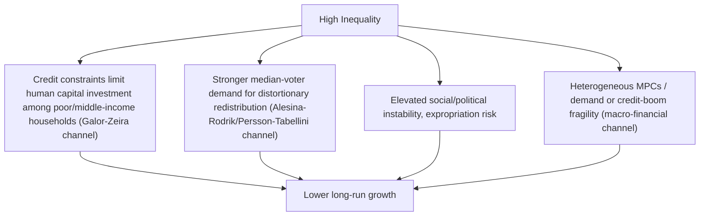

## Inequality and Economic Growth Relationship

### Overview

The relationship between inequality and economic growth is one of the most extensively studied and empirically contested questions in development and macroeconomic research. Theory offers competing predictions depending on the specific mechanism emphasized, and the empirical literature has evolved substantially over several decades — from early cross-country regressions suggesting inequality could be growth-enhancing, through a "revisionist" wave finding the opposite, to a more recent synthesis emphasizing non-linearity, channel-specificity, and the critical importance of *how* inequality arises and *how* it is addressed.

### Theoretical Channels: Why Inequality Might Help Growth

**The Classical Savings/Investment Channel**

The oldest theoretical argument, tracing to Kaldor and Kuznets, holds that inequality can be growth-enhancing because wealthier households have higher marginal propensities to *save* (the mirror image of the lower MPC discussed under inequality and aggregate demand). If capital accumulation is the primary engine of growth and investment requires savings, then concentrating income among high-saving households could, in principle, raise the aggregate savings rate and finance more investment, spurring growth — an argument especially prominent in early development economics under capital-scarcity conditions.

**Incentive and Effort Channels**

A complementary argument, rooted in standard incentive theory, holds that some degree of inequality is a necessary consequence of — and incentive for — effort, risk-taking, entrepreneurship, and human capital investment. If returns to effort and skill acquisition are heavily compressed, incentives to innovate, start businesses, or pursue costly education may be blunted, potentially reducing dynamic efficiency and long-run growth.

**Key Points**

- These arguments suggest an inequality-growth relationship that, at least at low-to-moderate levels of inequality, could be *positive*, motivating some early theoretical and policy discussions treating a degree of inequality as an acceptable or even necessary byproduct of a well-functioning growth process.
- Both mechanisms are theoretically most persuasive when capital markets are severely underdeveloped (making the savings-channel especially relevant) or when a very low level of inequality would meaningfully blunt effort incentives — the empirical relevance of these conditions in modern, financially developed economies is a major point of departure for critics.

### Theoretical Channels: Why Inequality Might Harm Growth

**Credit Market Imperfections and Human Capital Underinvestment**

The most influential "revisionist" theoretical channel, developed by Galor and Zeira (1993) and Banerjee and Newman (1993), emphasizes that in the presence of credit market imperfections (borrowing constraints, especially for human capital investment, which cannot typically be used as loan collateral), high inequality means a larger share of the population lacks sufficient wealth or collateral to finance profitable investments in education or entrepreneurship — even when the expected returns to such investment are high. This generates a channel by which inequality directly *reduces* aggregate human capital accumulation and, therefore, long-run growth, reversing the classical savings-channel prediction under realistic credit market conditions.

**Political Economy and Redistributive Pressure**

Alesina and Rodrik (1994) and Persson and Tabellini (1994) formalized a political-economy channel: in societies with high inequality, the mechanism, the *median voter* (poorer than the mean in an unequal society) has stronger incentive to support high redistributive taxation, which — if such taxation distorts investment and labor supply decisions — can reduce growth. This channel predicts that inequality's effect on growth operates *indirectly*, through the redistributive policy response inequality induces in a democratic political system, rather than through inequality's direct economic effects.

**Social and Political Instability**

Higher inequality has also been linked theoretically and empirically to increased social unrest, political instability, and heightened expropriation risk, each of which can depress investment (both domestic and foreign direct investment) by raising uncertainty about property rights and the security of returns — a channel emphasized in cross-country political economy research examining inequality's correlation with measures of political instability and conflict.

**Macroeconomic Instability and Financial Fragility**

As discussed extensively under inequality and aggregate demand, high inequality combined with heterogeneous marginal propensities to consume can generate demand shortfalls or debt-financed consumption booms (per the Rajan hypothesis and trickle-down consumption literature) that increase macroeconomic and financial fragility, potentially culminating in crises that impose substantial and persistent growth costs — a distinctly macro-financial channel linking inequality to growth through crisis risk rather than through steady-state growth dynamics directly.

### Empirical Evidence: An Evolving Consensus

**Early Cross-Country Regressions (1990s)**

Initial empirical work using cross-country growth regressions (e.g., Persson and Tabellini, 1994; Alesina and Rodrik, 1994; Clarke, 1995) generally found a **negative** correlation between inequality and subsequent growth across a broad panel of countries, providing early empirical support for the revisionist credit-constraint and political-economy channels over the classical savings-channel prediction.

**The Banerjee-Duflo Non-Linearity Finding**

Banerjee and Duflo (2003) offered an influential refinement, finding that the relationship between inequality and growth is better characterized as an **inverted-U** (non-monotonic) relationship — changes in inequality in *either* direction (increases or decreases) away from a country's "optimal" level tend to be associated with lower subsequent growth, rather than inequality having a uniformly negative (or positive) linear effect. This finding helped reconcile some of the mixed and seemingly contradictory results across the earlier cross-country literature, which had often imposed a linear specification poorly suited to detecting such non-monotonicity.

**Recent IMF and OECD Evidence**

More recent research, notably Ostry, Berg, and Tsangarides (2014, IMF) and Cingano (2014, OECD), using improved panel data techniques and longer time horizons, has generally reinforced the revisionist view for the specific context of *advanced economies over recent decades*: both studies find that higher net (post-redistribution) inequality is associated with shorter and less durable growth spells, and — importantly — find that redistributive fiscal policy itself (taxes and transfers) has, on average, **no significant direct negative effect on growth**, challenging the classical assumption that redistribution necessarily entails a substantial growth trade-off.

**Key Points**

- The Ostry-Berg-Tsangarides finding that redistribution is not, on average, growth-harmful is a particularly consequential and often-cited result, since it directly challenges the presumption (common in earlier policy debates) that reducing inequality via taxes and transfers necessarily requires accepting slower growth as a cost.
- These findings should be interpreted with appropriate caution regarding causal identification: cross-country panel growth regressions face persistent and difficult-to-fully-resolve challenges from omitted variable bias, reverse causality (growth affecting inequality, not just the reverse), and measurement error in cross-country inequality data (discussed extensively under personal income distribution and measurement) — meaning these results, while influential, do not constitute definitive causal proof to the standard of a randomized experiment. [Inference: reasonable researchers continue to debate the robustness of specific cross-country growth-inequality regression results to alternative specifications, instruments, and time periods.]

### Distinguishing Correlation from Causation: Methodological Challenges

**Reverse Causality**

A fundamental empirical challenge is that growth itself affects the evolution of inequality (as documented extensively in the Kuznets curve and skill-biased technological change literatures), meaning a simple correlation between inequality and subsequent growth cannot straightforwardly be interpreted as inequality *causing* growth outcomes without addressing this two-way relationship through appropriate econometric technique (instrumental variables, natural experiments, or structural modeling).

**Omitted Variable Bias**

Institutional quality, historical colonial legacies, natural resource endowments, geographic factors, and educational institutions plausibly affect *both* inequality and growth independently, meaning naive cross-country correlations risk attributing to inequality what may actually be driven by these underlying, harder-to-measure confounding factors — a persistent methodological concern across the cross-country growth-inequality regression literature broadly, not unique to this specific question.

**The Importance of the Source of Inequality**

A key qualitative insight emerging from recent research is that the growth relationship likely depends critically on the *source* of inequality:

- Inequality arising from unequal access to opportunity (unequal education access, discrimination, market power/rent-seeking, corruption) is more consistently found to be growth-harmful across studies distinguishing opportunity-driven from effort/talent-driven components of inequality.
- Inequality arising from genuine differences in effort, talent, innovation, and risk-taking under otherwise well-functioning, competitive markets is theoretically more consistent with the classical incentive-based growth-enhancing channel, though empirically isolating this component cleanly from opportunity-driven inequality remains a substantial measurement challenge.

**Key Points**

- This distinction — inequality of opportunity versus inequality of outcome arising from a level playing field — represents a significant conceptual advance over the earlier literature's treatment of "inequality" as a single undifferentiated statistic (typically the Gini coefficient), and is increasingly incorporated into contemporary empirical work (e.g., research on intergenerational mobility, discussed further under related topics).

### A Structured Comparative Summary

| Theoretical Channel | Predicted Sign | Key Condition for Relevance |
| --- | --- | --- |
| Classical savings/investment | Positive | Underdeveloped capital markets; savings is binding growth constraint |
| Incentive/effort | Positive (at low-to-moderate inequality) | Meaningful returns to effort/risk-taking must exist |
| Credit constraints / human capital | Negative | Imperfect credit markets, especially for education/entrepreneurship finance |
| Political economy / redistribution | Negative | Democratic political system; distortionary (not lump-sum) redistribution instruments |
| Social/political instability | Negative | High-inequality societies prone to unrest, weak property rights enforcement |
| Macro-financial fragility | Negative (via crisis risk) | Heterogeneous MPCs, credit-fueled demand substitution for stagnant wages |

### Policy Synthesis

**Moving Beyond a Single "Optimal" Inequality Level**

Given the channel-dependent and non-linear nature of the relationship, contemporary policy analysis generally avoids seeking a single universal "growth-maximizing" inequality level, instead focusing on:

- **Addressing credit constraints directly**: Expanding access to education financing and credit for productive investment among lower-income households can simultaneously reduce inequality *and* raise growth, representing a rare case where the equity-efficiency trade-off may not bind — a policy implication directly derived from the Galor-Zeira credit-constraint channel.
- **Designing efficient redistribution**: Given the Ostry-Berg-Tsangarides/Cingano finding that well-designed redistribution need not harm growth, policy focus shifts toward the *design* of tax-and-transfer systems (minimizing distortionary effects, e.g., preferring broad-based, low-distortion tax instruments over highly distortionary alternatives) rather than treating all redistribution as inherently growth-costly.
- **Distinguishing opportunity from outcome inequality**: Policies targeting unequal access (education quality gaps, discriminatory barriers, anti-competitive rent-seeking) may command broader consensus as growth-compatible interventions than policies simply compressing outcome inequality among otherwise fairly-competing agents.

**Key Points**

- The inequality-growth relationship should not be treated as a single fixed parameter but as context-dependent, varying by a country's level of financial development, quality of political and economic institutions, and the specific source and level of inequality under consideration.
- This nuanced, channel-specific view represents the current state of the literature, superseding earlier, simpler characterizations (either "inequality helps growth" or "inequality harms growth" as universal claims) that dominated the debate through the 1990s.

**Related Topics**

- Personal income distribution and measurement (data challenges underlying cross-country regressions)
- Galor-Zeira credit-constraint model of inequality and human capital investment
- Kuznets curve hypothesis and its relationship to the reverse-causality problem
- Intergenerational mobility and inequality of opportunity measurement
- Inequality and aggregate demand (macro-financial fragility channel in depth)
- Political economy of redistribution and the median voter theorem
- Optimal taxation theory and the equity-efficiency trade-off
- Financial development and credit market imperfections in growth theory