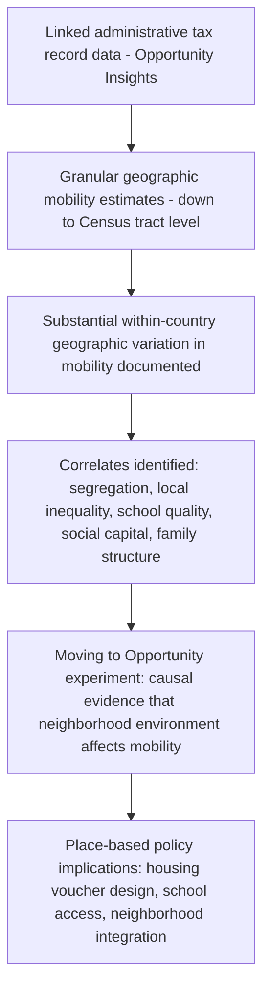

## Social Mobility and Macroeconomic Outcomes

### Overview

Social (or economic) mobility refers to the extent to which individuals' economic outcomes — income, wealth, occupational status — change relative to their parents' outcomes (intergenerational mobility) or over the course of their own lives (intragenerational mobility). While closely related to inequality, mobility is a conceptually distinct dimension of distributional analysis: two economies can have identical income Gini coefficients at a point in time while differing dramatically in whether that structure of inequality persists across generations or reshuffles substantially. This distinction has become increasingly central to macroeconomics following the development of large-scale administrative-data-based mobility measurement, most notably through the work of Raj Chetty and collaborators at the Opportunity Insights research group.

### Conceptual Framework: Types of Mobility

**Intergenerational versus Intragenerational Mobility**

- **Intergenerational mobility** measures the relationship between a child's adult economic outcomes and their parents' outcomes — the degree to which economic status is "inherited" across generations.
- **Intragenerational mobility** measures how much an individual's own economic position changes over their lifetime (e.g., moving between income quintiles from early to late career) — a distinct concept sometimes conflated with, but analytically separate from, intergenerational mobility.

**Absolute versus Relative Mobility**

- **Absolute mobility** measures whether individuals achieve higher living standards (in absolute terms) than their parents did — e.g., the widely cited Chetty et al. (2017) finding that the fraction of American children earning more than their parents (adjusted for inflation) fell from roughly 90% for children born in 1940 to around 50% for children born in the 1980s.
- **Relative mobility** measures an individual's economic *rank* relative to their own generation compared to their parents' rank relative to their generation — capturing reshuffling of relative position independent of overall growth in absolute living standards.

**Key Points**

- Absolute mobility can decline even as relative mobility remains constant, if aggregate economic growth slows and becomes more unequally distributed across the income distribution — a decomposition central to Chetty et al.'s (2017) analysis, which attributes the decline in absolute mobility more to *the more unequal distribution* of growth than to the *slowdown* in aggregate growth itself.
- This decomposition has direct macroeconomic policy relevance: it implies that even a return to historically higher aggregate GDP growth rates would not, on its own, restore historical absolute mobility levels unless that growth were also more broadly and evenly distributed across the income distribution.

### Measurement: The Intergenerational Earnings Elasticity (IGE)

**Formal Definition**

The standard summary statistic for intergenerational mobility is the **intergenerational earnings elasticity (IGE)**, estimated from a regression of the logarithm of a child's adult income on the logarithm of their parents' income:

$$\ln(y_{child}) = \alpha + \beta \ln(y_{parent}) + \varepsilon$$

The coefficient $\beta$ (the IGE) measures the percentage change in a child's expected income associated with a 1% change in parental income. A higher $\beta$ indicates *lower* mobility (outcomes more tightly linked across generations); $\beta = 0$ would indicate complete mobility (no relationship between parent and child income), while $\beta = 1$ would indicate complete immobility (child income perfectly determined by parental income in percentage terms).

**The "Great Gatsby Curve"**

Alan Krueger (2012), building on cross-country IGE estimates compiled by Miles Corak, popularized the empirical finding of a strong positive cross-country correlation between a country's *level of income inequality* (measured by the Gini coefficient) and its *intergenerational earnings elasticity* (lower mobility) — a relationship termed the "Great Gatsby Curve." Countries with higher inequality (e.g., the United States, United Kingdom) tend to also exhibit lower intergenerational mobility, while more equal countries (e.g., Denmark, Norway, Finland) tend to exhibit higher mobility.

**The Great Gatsby Curve (svg_diagram)**

<svg xmlns="http://www.w3.org/2000/svg" viewBox="0 0 550 450">
<text x="275" y="28" font-size="16" font-weight="bold" text-anchor="middle" fill="#222">The Great Gatsby Curve (svg_diagram)</text>
<line x1="70" y1="400" x2="500" y2="400" stroke="#333" stroke-width="2" />
<line x1="70" y1="400" x2="70" y2="60" stroke="#333" stroke-width="2" />
<text x="285" y="430" font-size="13" text-anchor="middle" fill="#333">Income Inequality (Gini Coefficient)</text>
<text x="35" y="230" font-size="13" text-anchor="middle" fill="#333" transform="rotate(-90 35,230)">Intergenerational Earnings Elasticity (lower mobility)</text>
<circle cx="140" cy="350" r="6" fill="#2c5aa0" />
<text x="150" y="345" font-size="11" fill="#2c5aa0">Denmark</text>
<circle cx="170" cy="330" r="6" fill="#2c5aa0" />
<text x="180" y="325" font-size="11" fill="#2c5aa0">Norway</text>
<circle cx="200" cy="300" r="6" fill="#2c5aa0" />
<text x="210" y="295" font-size="11" fill="#2c5aa0">Finland</text>
<circle cx="280" cy="230" r="6" fill="#555" />
<text x="290" y="225" font-size="11" fill="#555">Canada</text>
<circle cx="330" cy="180" r="6" fill="#555" />
<text x="340" y="175" font-size="11" fill="#555">Germany</text>
<circle cx="400" cy="130" r="6" fill="#c0392b" />
<text x="330" y="125" font-size="11" fill="#7a1f1f">United Kingdom</text>
<circle cx="440" cy="95" r="6" fill="#c0392b" />
<text x="360" y="90" font-size="11" fill="#7a1f1f">United States</text>
<line x1="100" y1="380" x2="470" y2="80" stroke="#888" stroke-width="1.5" stroke-dasharray="6,4" />
<text x="330" y="60" font-size="12" fill="#666">Fitted trend line</text>
</svg>

**Key Points**

- The Great Gatsby Curve is a *cross-sectional* correlation across countries at a point in time, not a demonstrated causal within-country relationship; establishing that *rising* inequality within a given country *causes* subsequently *falling* mobility for that same country requires additional identification beyond the cross-country correlation itself.
- The relationship is broadly consistent with, and often interpreted through the lens of, the Galor-Zeira credit-constraint theoretical channel discussed under inequality and economic growth: higher inequality, combined with imperfect credit markets for human capital investment, plausibly reduces mobility by limiting lower-income families' ability to invest in their children's education and human capital regardless of the children's underlying talent or potential.

### The Chetty/Opportunity Insights Revolution in Mobility Measurement

**Methodological Innovation**

Raj Chetty and collaborators (Hendren, Kline, Saez, and others) transformed empirical mobility research beginning around 2014 by linking anonymized U.S. federal tax records across generations, enabling — for the first time at national scale — precise estimation of intergenerational mobility not just nationally but at extremely granular geographic levels (down to individual Census tracts and commuting zones), a dramatic advance over earlier survey-based mobility estimates constrained by small sample sizes and limited geographic granularity.

**Key Empirical Findings**

- **Substantial geographic variation within countries**: Intergenerational mobility varies dramatically across different regions and even neighborhoods within the same country (documented extensively for the United States), with some commuting zones exhibiting mobility levels comparable to the most mobile countries globally (e.g., parts of the Great Plains and rural areas) and others exhibiting mobility levels comparable to some of the least mobile countries globally (e.g., parts of the Southeast) — a finding that shifted substantial research and policy attention toward *place-based* determinants of mobility rather than purely national-level policy factors.
- **The "Moving to Opportunity" and neighborhood-effects literature**: Follow-up work by Chetty, Hendren, and Katz (2016), building on the earlier Moving to Opportunity randomized housing voucher experiment, found that children who moved to lower-poverty neighborhoods at younger ages experienced significantly better adult economic outcomes, providing causally-identified evidence (via the experiment's random assignment) that neighborhood environment itself has a genuine causal effect on mobility, not merely a correlation reflecting selection of certain types of families into certain neighborhoods.
- **Key correlates of high-mobility areas**: Areas with higher mobility tend to exhibit less residential segregation (by income and race), lower income inequality at the local level, better-performing local schools, greater social capital and civic engagement, and greater family stability — though establishing the precise causal weight of each individual factor, as opposed to their joint correlation with high-mobility areas, remains an active area of ongoing research. [Inference: the relative causal importance of each of these correlated factors is not fully settled, and Chetty and collaborators' own work emphasizes that these factors are highly correlated with one another, complicating efforts to isolate individual causal channels using observational data alone.]

### Macroeconomic Implications of Mobility

**Human Capital Misallocation and Aggregate Productivity**

A distinct macroeconomic argument, formalized in growth-accounting terms by Hsieh, Hurst, Jones, and Klenow (2019) in their influential study of occupational choice by gender and race, holds that barriers to mobility (whether based on family income, discrimination, or other frictions unrelated to underlying talent) generate a direct aggregate *productivity* cost by misallocating talent away from occupations where individuals would be most productive, toward occupations determined more by background circumstance than comparative advantage. Their study estimates that a substantial portion of U.S. economic growth over 1960-2010 is attributable to the reduction of such misallocation (increased entry of women and minorities into high-skill occupations), implying that remaining mobility barriers represent an ongoing, quantifiable drag on aggregate output beyond their direct equity implications.

**Key Points**

- This "talent misallocation" framework reframes low mobility not purely as an equity concern but as a genuine aggregate *efficiency* loss — connecting mobility research directly to standard growth-accounting and misallocation literatures in macroeconomics (related to, though distinct from, the credit-constraint channel discussed under inequality and growth).
- The framework implies that policies improving mobility for historically disadvantaged or credit-constrained groups may generate aggregate growth benefits alongside their distributional benefits, potentially representing another case (alongside the Galor-Zeira credit-constraint channel) where equity and efficiency objectives are complementary rather than in tension.

**Mobility and Macroeconomic Stability**

Beyond static productivity effects, several researchers have argued that persistently low perceived economic mobility can affect macroeconomic behavior through channels including reduced human capital investment (if returns to effort are perceived as disconnected from background), altered political economy dynamics (affecting support for redistributive versus growth-oriented policy), and potentially — though this connection is more speculative and less rigorously established than the direct productivity channel — broader effects on social cohesion and institutional trust that could indirectly affect long-run investment climate and economic stability. [Speculation: the causal magnitude of these broader social-cohesion channels on macroeconomic outcomes is considerably less well-identified empirically than the direct talent-misallocation productivity channel, and should be treated as a plausible but not rigorously quantified hypothesis in the current literature.]

### Distinguishing Mobility from Inequality: Why Both Matter

**A Combined Analytical Framework**

| Scenario | Inequality Level | Mobility Level | Interpretation |
| --- | --- | --- | --- |
| High inequality, high mobility | High | High | Unequal outcomes at a point in time, but position not strongly inherited across generations — closer to a "meritocratic" but unequal society |
| High inequality, low mobility | High | Low | Unequal outcomes that are also persistent across generations — closer to a rigid, class-based structure |
| Low inequality, high mobility | Low | High | Relatively equal outcomes with substantial reshuffling of relative position across generations |
| Low inequality, low mobility | Low | Low | Relatively equal outcomes, largely because most people occupy a similar (narrow) economic range regardless of background |

**Key Points**

- A society could, in principle, exhibit substantial cross-sectional income inequality while still maintaining high mobility (position not strongly tied to parental background) — such a society might be viewed as more consistent with meritocratic ideals than an equally unequal but low-mobility society, even holding the Gini coefficient constant.
- The empirical Great Gatsby Curve pattern suggests that, at least across the countries for which comparable data exists, high inequality and low mobility tend to co-occur rather than being independent dimensions — but this is an empirical regularity, not a logical necessity, and the theoretical possibility of high-inequality/high-mobility or low-inequality/low-mobility configurations remains analytically important for interpreting any single country's specific circumstances.

### Policy Implications

**Place-Based Policy**

Given the Opportunity Insights findings on substantial geographic mobility variation, several policy proposals emphasize place-based interventions: housing voucher program redesign to encourage moves to higher-mobility neighborhoods (informed directly by the Moving to Opportunity experimental evidence), targeted investment in school quality and early childhood education in low-mobility areas, and policies addressing residential segregation.

**Early Childhood and Education Investment**

Given consistent findings (across the Chetty/Opportunity Insights body of work and the broader human capital literature, including James Heckman's extensive research on early childhood intervention returns) that mobility-relevant advantages and disadvantages emerge early in childhood and compound over time, substantial research and policy attention has focused on early childhood education and intervention programs as potentially higher-return mobility interventions than later-stage (e.g., college-focused) policies alone.

**Related Topics**

- Inequality and economic growth relationship (Galor-Zeira credit-constraint channel connection)
- Chetty/Opportunity Insights methodology and the Moving to Opportunity experiment in depth
- Talent misallocation and aggregate productivity (Hsieh-Hurst-Jones-Klenow framework)
- Personal income distribution and measurement (data underlying mobility statistics)
- Residential segregation and neighborhood effects research
- Early childhood human capital investment and returns (Heckman curve)
- Educational access and the "race between education and technology"
- Political economy of redistribution and perceived versus actual mobility