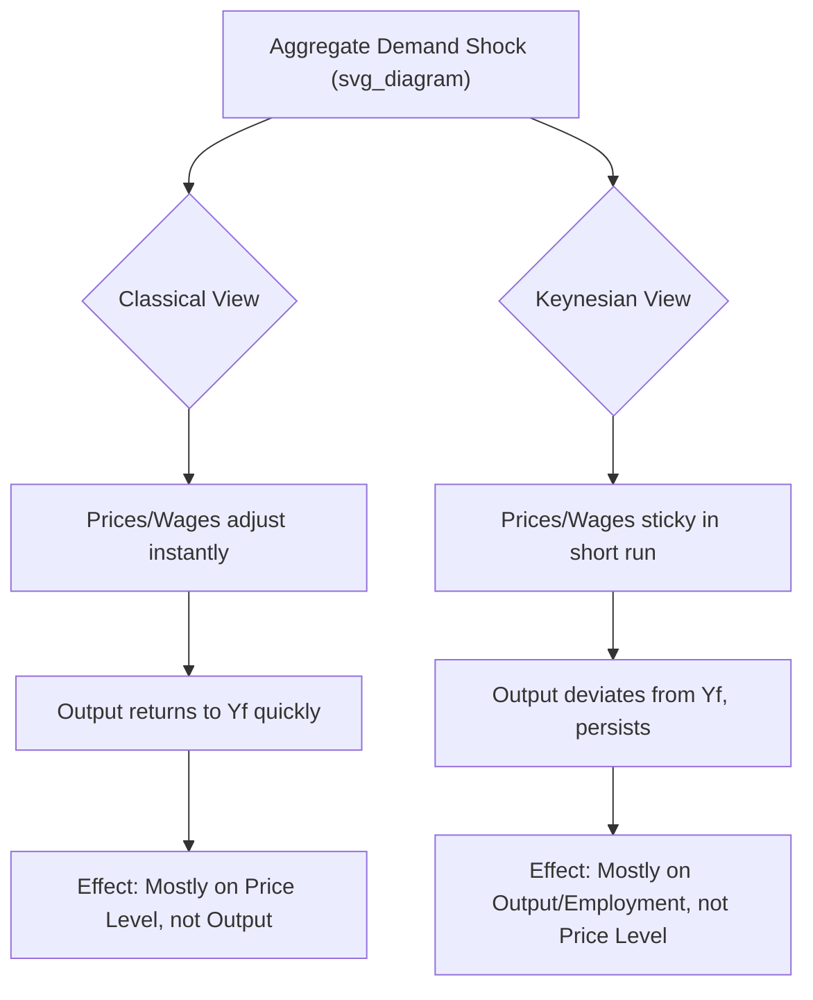
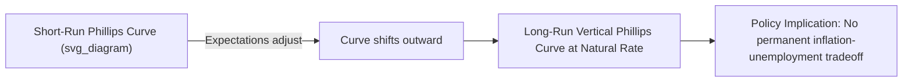

## Keynesian versus Classical Policy Prescriptions

### Overview

The Keynesian and Classical schools represent two foundational and competing paradigms in macroeconomic theory, differing fundamentally in their assumptions about market behavior, price/wage flexibility, and the appropriate role of government in stabilizing the economy. These differences produce sharply divergent policy prescriptions for addressing unemployment, inflation, and business cycle fluctuations.

### Foundational Assumptions

#### Classical Economics

**Key Points**

- Markets are inherently self-correcting through flexible prices and wages
- Say's Law: "supply creates its own demand" — aggregate production generates sufficient income to purchase all output
- The economy naturally gravitates toward full employment equilibrium
- Money is neutral in the long run — it affects only nominal variables (prices), not real variables (output, employment)
- Rational agents and perfectly competitive markets clear continuously
- Savings automatically translate into investment via a flexible interest rate (loanable funds market)

Under classical assumptions, the aggregate supply (AS) curve is vertical at the full-employment level of output ($Y_f$) even in the short run, because wages and prices adjust instantly to clear labor and goods markets.

#### Keynesian Economics

**Key Points**

- Prices and especially wages are "sticky" (rigid) downward in the short run, due to contracts, menu costs, and institutional factors (unions, minimum wage laws)
- Aggregate demand (AD), not supply, is the primary driver of short-run output and employment
- Economies can settle into equilibrium below full employment ("underemployment equilibrium") and stay there without automatic self-correction
- Say's Law is rejected — demand can fall short of what is needed to sustain full employment ("paradox of thrift")
- Expectations and "animal spirits" (business/consumer confidence) drive investment volatility, not just interest rates
- Government intervention is necessary to close output gaps when private demand is insufficient

In the Keynesian short run, the AS curve is relatively flat (or upward-sloping), meaning changes in AD affect output and employment substantially, with prices adjusting only sluggishly.

### The AD-AS Framework Compared

### Core Theoretical Divergence

| Dimension | Classical | Keynesian |
| --- | --- | --- |
| Price/wage flexibility | Fully flexible | Sticky/rigid in short run |
| Say's Law | Holds | Rejected |
| Equilibrium | Always full employment | Can be below full employment |
| Money | Neutral (affects prices only) | Non-neutral in short run |
| Interest rate role | Equilibrates saving and investment | Set partly by liquidity preference (money demand/supply) |
| Business cycles | Driven by real shocks (technology, supply) | Driven by demand fluctuations, expectations |
| Government's role | Minimal; intervention distorts markets | Active stabilizer of demand |
| Time horizon focus | "In the long run" self-correction | "In the long run we are all dead" (short-run focus) |

### Fiscal Policy Prescriptions

#### Classical View

**Key Points**

- Government deficit spending "crowds out" private investment: increased government borrowing raises interest rates, discouraging private spending by an equivalent amount
- Ricardian Equivalence (a related, more modern classical/new classical argument): rational agents anticipate future taxes needed to repay debt and increase savings today, neutralizing the stimulative effect of deficit spending
- Fiscal policy is largely ineffective at increasing real output; it can only shift resources from private to public use
- Preferred prescription: balanced budgets, minimal government spending, tax policy focused on efficiency (supply-side incentives) rather than demand management

$$Y = C + I + G + NX$$

Under full crowding-out, an increase in $G$ is offset by an equal decrease in $I$, leaving $Y$ largely unchanged.

#### Keynesian View

**Key Points**

- During a recession (demand deficiency), government spending or tax cuts can close the output gap by directly injecting demand
- The fiscal multiplier amplifies the initial spending injection through rounds of re-spending:

$$\text{Multiplier} = \frac{1}{1 - MPC(1-t)}$$

where $MPC$ is the marginal propensity to consume and $t$ is the tax rate.

- Countercyclical fiscal policy is prescribed: deficit spending during recessions, budget surpluses (or restraint) during booms
- Crowding-out is considered minimal when the economy is operating below full capacity, since idle resources absorb new spending without bidding up interest rates significantly
- Automatic stabilizers (unemployment insurance, progressive taxation) are valued for smoothing cycles without discretionary action

**Example**

A government facing a recessionary output gap of $200 billion, with an $MPC$ of 0.8 and no taxes, would need only $200B \times (1 - 0.8) = \$40$ billion in new spending, since the multiplier of $1/(1-0.8) = 5$ amplifies the initial injection to close the full gap.

### Monetary Policy Prescriptions

#### Classical View

**Key Points**

- Quantity Theory of Money: $MV = PY$, where $M$ is money supply, $V$ is velocity (assumed stable), $P$ is price level, $Y$ is real output
- Since $Y$ is fixed at full employment and $V$ is stable, changes in $M$ translate directly into changes in $P$ — money is neutral
- Monetary policy cannot affect real output or employment in the long run; it can only cause inflation or deflation
- Prescription: maintain a stable, predictable, low money supply growth rate (a rules-based approach, later echoed by Monetarists like Friedman) rather than discretionary intervention

#### Keynesian View

**Key Points**

- Monetary policy operates through the interest rate transmission mechanism: $\Delta M \rightarrow \Delta i \rightarrow \Delta I \rightarrow \Delta Y$
- In a "liquidity trap" (very low interest rates), monetary policy becomes ineffective because additional money is simply hoarded rather than spent — a scenario Keynes emphasized during the Great Depression
- Because of this potential ineffectiveness at the zero lower bound, Keynesians historically favored fiscal policy as the primary tool during deep recessions, with monetary policy as a secondary or complementary lever
- Modern (New) Keynesians incorporate active central bank interest-rate targeting (e.g., Taylor Rule-style responses) as a first-line stabilization tool, reflecting a synthesis with monetarist insights

$$i = r^* + \pi + 0.5(\pi - \pi^*) + 0.5(Y - Y^*)$$

*(Illustrative Taylor Rule form used in New Keynesian policy analysis; [Inference: exact coefficients vary by central bank and model specification])*

### The Phillips Curve Divide

**Key Points**

- Original (Keynesian) Phillips Curve: proposed a stable, exploitable inverse trade-off between inflation and unemployment, implying policymakers could permanently reduce unemployment by tolerating higher inflation
- Classical/Monetarist critique (Friedman, Phelps): the trade-off exists only in the short run; in the long run, the Phillips Curve is vertical at the "natural rate of unemployment," because expectations adjust and workers/firms are not fooled by nominal wage/price increases indefinitely
- This gave rise to the concept of the Non-Accelerating Inflation Rate of Unemployment (NAIRU)
- Stagflation in the 1970s (simultaneous high inflation and high unemployment) was seen as strong empirical evidence against the simple Keynesian trade-off and in favor of the expectations-augmented (classical-leaning) view

### Labor Market Interpretation

#### Classical

- Unemployment above the "frictional" level is voluntary or caused by market distortions (minimum wages, union bargaining power, generous unemployment benefits) that prevent wages from falling to the market-clearing level
- Prescription: deregulate labor markets, reduce wage floors and rigidities, improve labor mobility

#### Keynesian

- Involuntary unemployment can persist even when workers are willing to work at the prevailing (or lower) wage, because aggregate demand — not the wage rate — determines the number of jobs available
- Sticky nominal wages (due to contracts, social norms against nominal wage cuts) prevent the labor market from clearing quickly during downturns
- Prescription: boost aggregate demand directly through fiscal/monetary stimulus rather than waiting for or forcing wage adjustment

### Business Cycle and Role of Government Summary

| Policy Area | Classical Prescription | Keynesian Prescription |
| --- | --- | --- |
| Recession response | Do nothing (or cut taxes/deregulate for supply-side efficiency); let wages/prices fall to restore equilibrium | Increase government spending / cut taxes; expand money supply |
| Inflation response | Control money supply growth (fixed rule) | Reduce government spending / raise taxes; tighten money supply |
| Budget stance | Balanced budget over the cycle; skepticism of deficits | Deficits acceptable/necessary in downturns, surpluses in booms |
| View of unemployment | Largely voluntary/structural, self-correcting | Can be involuntary and persistent, requires active correction |
| Government's ideal size/role | Minimal, non-interventionist | Active stabilizer, "managed capitalism" |

### Synthesis: The Neoclassical Synthesis and New Keynesian Economics

**Key Points**

- Post-WWII economists (Samuelson, Hicks) built the **Neoclassical Synthesis**, merging Keynesian short-run demand management with classical long-run market-clearing, formalized in models like IS-LM
- **New Classical economics** (Lucas, Sargent, 1970s–80s) reasserted classical principles using rational expectations, arguing that anticipated policy is ineffective (Policy Ineffectiveness Proposition) because agents adjust expectations instantly
- **New Keynesian economics** (Mankiw, Romer, 1980s–90s) responded by providing microeconomic foundations for price/wage stickiness (menu costs, efficiency wages, staggered contracts), preserving a role for short-run demand management even under rational expectations
- Contemporary mainstream macroeconomic policy (central bank inflation targeting plus counter-cyclical fiscal tools) largely reflects this New Keynesian synthesis, while retaining classical/monetarist emphasis on long-run monetary neutrality and the natural rate of unemployment

### Historical Application

**Example**

- The **Great Depression (1930s)**: Classical prescriptions (balanced budgets, wage cuts, gold standard adherence) were widely applied initially and are broadly viewed as having deepened the downturn; Keynes's *General Theory* (1936) provided the intellectual basis for New Deal-style fiscal expansion.
- The **1970s Stagflation**: Keynesian demand-management tools struggled to address simultaneous inflation and unemployment, opening space for Monetarist/Classical-influenced policy (Volcker's tight-money disinflation in the early 1980s).
- The **2008 Global Financial Crisis**: Widespread coordinated fiscal stimulus (e.g., ARRA in the US) and near-zero interest rate policies reflected a Keynesian revival, particularly around liquidity trap concerns, though debates over the size and effectiveness of multipliers remained contested. [Unverified: precise empirical multiplier estimates from this period vary significantly across studies and are still debated in the literature.]

### Conclusion

The Keynesian-Classical divide centers on whether markets self-correct quickly (Classical) or can remain in prolonged disequilibrium requiring intervention (Keynesian). This translates into opposing policy defaults: Classical economics favors minimal government intervention, stable rule-based monetary policy, and confidence in flexible markets; Keynesian economics favors active, discretionary fiscal and monetary intervention to manage aggregate demand, especially during recessions. Modern macroeconomic policy generally reflects a synthesis, using classical insights for long-run price stability and Keynesian insights for short-run stabilization.

**Related Topics**

- IS-LM model and its derivation
- Monetarism and Milton Friedman's policy rules
- Rational Expectations and the Lucas Critique
- New Keynesian sticky-price/sticky-wage models
- Fiscal multiplier estimation and empirical debates
- Zero lower bound and unconventional monetary policy (QE)
- Supply-side economics and the Laffer Curve
- Austrian Business Cycle Theory (a further classical-adjacent alternative)
- Modern Monetary Theory (MMT) as a contemporary heterodox contrast