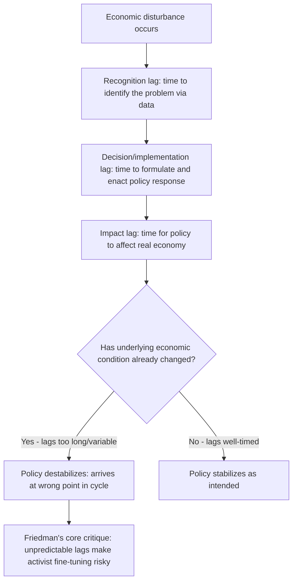
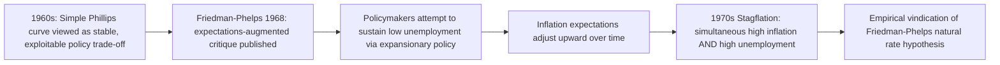

## Monetarist Critique of Activist Policy

### Overview

The monetarist critique of activist macroeconomic policy, developed principally by Milton Friedman and Anna Schwartz alongside contributors including Karl Brunner and Allan Meltzer from the 1950s through the 1970s, represents one of the most consequential challenges to Keynesian demand-management orthodoxy in the history of macroeconomic thought. Rather than rejecting the possibility that money and aggregate demand affect real output in the short run, monetarism mounted a more targeted critique: that discretionary, activist fiscal and monetary policy is more likely to destabilize than stabilize the economy, owing to long and variable lags, unreliable multiplier estimates, and the practical difficulty of correctly identifying and timely responding to economic conditions in real time.

### Theoretical Foundations

**The Quantity Theory of Money, Restated**

Friedman's "restatement of the quantity theory of money" (1956) revived and modernized the classical quantity theory as a theory of the **demand for money**, rather than treating it as a simple mechanical identity. The foundational equation:

$$MV = PY$$

Where $M$ is the money supply, $V$ is the velocity of money (the average number of times a unit of currency is spent), $P$ is the price level, and $Y$ is real output. Friedman argued that money demand — and therefore velocity — is a **stable function** of a small number of variables (permanent income, the opportunity cost of holding money relative to other assets), implying that changes in the money supply translate relatively predictably into changes in nominal income ($PY$), even though the split between $P$ and $Y$ depends on the underlying state of the economy and time horizon.

**Key Points**

- The stability-of-velocity claim is the empirical linchpin of the entire monetarist policy framework: if velocity is stable and predictable, then controlling the money supply provides a reliable lever over nominal aggregate demand, whereas if velocity is unstable or unpredictable, monetary policy's effects become correspondingly harder to forecast and control — a point that became central to later empirical challenges to monetarism (discussed below).
- This "restatement" is distinct from the older, more mechanical classical quantity theory in explicitly grounding money demand in a microeconomic portfolio-choice framework, treating money as one asset among several that households and firms hold based on relative returns and liquidity needs.

**The Permanent Income Hypothesis**

Friedman's **permanent income hypothesis** (1957) proposed that consumption depends not on current (transitory) income but on **permanent income** — households' expectation of their long-run average income — with transitory income fluctuations largely absorbed into saving rather than driving proportional changes in consumption.

$$C = k \cdot Y_P$$

Where $C$ is consumption, $Y_P$ is permanent income, and $k$ is a proportionality factor depending on the interest rate, wealth, and household preferences (with actual measured income decomposed as $Y = Y_P + Y_T$, permanent plus transitory components).

**Direct Policy Implication**

This theory directly undermines the simple Keynesian consumption function (in which consumption depends on *current* disposable income) underlying the basic fiscal multiplier logic: if a tax cut or rebate is perceived by households as **temporary**, rational households will save most of it rather than spend it (since it does not raise their assessment of permanent income), producing a substantially smaller consumption response — and therefore a smaller fiscal multiplier — than the naive Keynesian cross model predicts.

**Key Points**

- This critique has direct, continuing relevance to the design of fiscal stimulus: temporary, one-off tax rebates (e.g., some episodes of U.S. tax rebate policy studied empirically) are predicted by the permanent income hypothesis to generate weaker consumption responses than *permanent* tax changes or income increases of comparable size — a prediction with mixed but non-trivial empirical support in the subsequent literature on rebate spending responses.
- The permanent income hypothesis, along with the related life-cycle hypothesis developed by Modigliani and Brumberg, represented a broader movement in macroeconomics toward grounding aggregate relationships (like the consumption function) in explicit microeconomic optimization — a methodological precursor to the more thoroughgoing microfoundations movement associated with New Classical economics.

### The Case Against Discretionary Fiscal Policy

**Long and Variable Lags**

Friedman's central practical argument against activist stabilization policy — applying to both fiscal and monetary policy — was that policy operates with **long and variable lags** between (a) recognizing an economic problem, (b) formulating and implementing a policy response, and (c) that response actually affecting the real economy. Friedman decomposed these into:

- **Recognition lag**: The time between an economic disturbance occurring and policymakers recognizing it has occurred (complicated by data revisions and the inherent difficulty of real-time business cycle diagnosis).
- **Implementation/decision lag**: The time between recognizing a problem and enacting a policy response (particularly long for fiscal policy, which typically requires legislative action).
- **Impact lag**: The time between a policy being implemented and its full effects being realized in the economy (monetary policy is frequently estimated to operate with impact lags of many months to over a year).

**The Destabilization Risk**

Because these lags are both long and — critically — **variable and unpredictable** in duration, Friedman argued that well-intentioned countercyclical policy risks arriving **after** the economic conditions that motivated it have already changed, potentially *amplifying* rather than dampening the business cycle (e.g., stimulus intended to counter a recession arriving only once the economy has already begun to recover on its own, thereby overheating the expansion rather than smoothing the trough).

**Crowding Out and Ricardian-Adjacent Concerns**

Monetarists also emphasized that expansionary fiscal policy, particularly if deficit-financed through bond issuance, tends to raise interest rates and **crowd out** private investment — a mechanism formalizable within the IS-LM framework discussed under Keynesian-classical policy debates, and one that monetarists argued was empirically more significant than early Keynesian multiplier analyses acknowledged, further reducing fiscal policy's net effectiveness as a stabilization tool beyond the lag-based critique alone.

### The Case for Monetary Policy Rules over Discretion

**"A Program for Monetary Stability" and the k-Percent Rule**

Given the lag-based critique applying to discretionary policy generally, Friedman's constructive policy proposal (most fully articulated in *A Program for Monetary Stability*, 1960) was a **fixed monetary growth rule** — often summarized as the "k-percent rule" — in which the central bank commits to growing the money supply at a constant, pre-announced rate (approximating the long-run growth rate of real output, to maintain roughly stable prices) regardless of short-run cyclical conditions, rather than attempting discretionary countercyclical fine-tuning.

**Rationale for Rules over Discretion**

- **Removing destabilizing discretion**: A fixed rule eliminates the risk of poorly-timed discretionary interventions arising from the long-and-variable-lags problem.
- **Reducing policy uncertainty**: A credible, predictable rule reduces uncertainty facing households and firms regarding future monetary conditions, potentially improving private-sector planning and investment decisions relative to an environment of unpredictable discretionary policy shifts.
- **Precommitment against time-inconsistency**: Though formalized more rigorously later by Kydland and Prescott (1977) and Barro and Gordon (1983) within the rational expectations framework, monetarist rules-based thinking anticipated the concern that discretionary policymakers face temptation to exploit short-run trade-offs (e.g., generating surprise inflation to temporarily boost employment) in ways that are ultimately self-defeating once expectations adjust — an argument extended and formalized as the "time-inconsistency problem" in subsequent New Classical work.

**Key Points**

- The rules-versus-discretion debate initiated by Friedman's monetarist critique remains directly relevant to contemporary central bank design, having substantially influenced the modern practice of publishing explicit inflation targets, forward guidance frameworks, and rule-like policy reaction functions (e.g., variants of the Taylor rule) as ways of constraining discretion while retaining some flexibility to respond to economic conditions — representing a practical, partial synthesis between pure rules and pure discretion rather than adoption of Friedman's strict constant-growth-rate proposal in its original form.
- Friedman's proposal was for a rule governing the **money supply** specifically, reflecting the state of monetary theory and the primary policy instruments available at the time; the modern practice of most major central banks operating via **interest rate rules** (targeting a short-term policy rate, often informed by Taylor-rule-type frameworks) rather than direct money supply targets reflects both the empirical velocity-instability challenges discussed below and subsequent evolution in monetary policy implementation practice.

### The Milton Friedman-Anna Schwartz Historical Analysis

**A Monetary History of the United States**

Friedman and Schwartz's *A Monetary History of the United States, 1867-1960* (1963) provided the empirical and historical foundation for the monetarist policy critique, most famously through its analysis of the Great Depression. Friedman and Schwartz argued — contrary to prevailing views at the time that emphasized the Depression as primarily a failure of aggregate demand requiring fiscal remedy — that the Depression's severity was substantially the result of **monetary policy failure**: the Federal Reserve allowed the money supply to contract by roughly a third between 1929 and 1933 through a combination of policy errors and passivity in the face of a widespread banking crisis, transforming what might have been a moderate recession into the Great Depression's catastrophic scale.

**Key Points**

- This reinterpretation shifted substantial responsibility for the Depression's severity onto monetary policy failure rather than viewing it purely as an inherent failure of unregulated capitalism requiring primarily fiscal intervention — a historically and politically consequential reframing that directly informed the aggressive monetary policy responses (rather than reliance on fiscal policy alone) undertaken by major central banks during the 2008 Global Financial Crisis, with then-Federal Reserve Chairman Ben Bernanke (himself a scholar of the Depression's monetary history) explicitly citing this lesson in justifying the Fed's unprecedented quantitative easing programs.
- The Monetary History's methodology — using detailed historical narrative combined with monetary data to identify the causal role of monetary policy in major macroeconomic episodes — became a template for subsequent monetarist and New Classical empirical work, though its specific causal claims regarding the Depression have themselves been subject to extensive subsequent debate and refinement (including from more recent scholarship considering banking-panic and debt-deflation channels as complementary rather than purely monetary explanations).

### The Monetarist Explanation of Stagflation

**Friedman-Phelps and the Expectations-Augmented Phillips Curve**

Friedman's 1968 American Economic Association presidential address (paralleled by Edmund Phelps's independent contemporaneous work) provided monetarism's most empirically consequential and immediately vindicated prediction. Friedman argued that the observed inverse Phillips curve relationship between inflation and unemployment was not a stable, policy-exploitable long-run trade-off, but reflected **unanticipated** inflation temporarily reducing real wages and stimulating employment above its "natural rate." Once inflation expectations adjusted to any sustained inflation, the Phillips curve relationship would shift, and attempts to permanently hold unemployment below the natural rate via sustained monetary expansion would produce only **accelerating inflation**, not a durable employment gain:

$$\pi = \pi^e - \beta(u - u^*)$$

Where $\pi$ is actual inflation, $\pi^e$ is expected inflation, $u$ is unemployment, $u^*$ is the natural rate of unemployment, and $\beta > 0$. In the long run, with expectations fully adjusted ($\pi = \pi^e$), unemployment returns to $u^*$ regardless of the inflation rate, implying a **vertical long-run Phillips curve** at the natural rate.

**Empirical Vindication: The 1970s Stagflation**

The **stagflation** of the 1970s — simultaneous high inflation and high unemployment, a combination the simple original Phillips curve could not readily accommodate — was widely interpreted as strong empirical vindication of the Friedman-Phelps expectations-augmented framework over the simple exploitable-trade-off interpretation some Keynesian policymakers had previously relied upon, substantially accelerating the shift of mainstream macroeconomic and policy opinion toward monetarist and, subsequently, New Classical perspectives through the late 1970s and early 1980s.

### Empirical Challenges to Monetarism

**Velocity Instability**

The most significant empirical challenge to practical monetarist policy implementation emerged in the 1980s: the previously assumed **stability of money velocity**, central to the quantity-theory-based case for a fixed money growth rule, broke down substantially, particularly in the United States and United Kingdom, coinciding with financial deregulation, the proliferation of new financial instruments and money-market substitutes, and changes in the definition and measurement of monetary aggregates themselves.

**Consequences for Monetary Targeting**

This velocity instability undermined the practical reliability of money-supply-targeting regimes that several major central banks (including the Federal Reserve under Paul Volcker in the early 1980s and the Bank of England) had adopted partly under monetarist influence, leading most major central banks to abandon strict monetary aggregate targeting by the mid-to-late 1980s in favor of interest-rate-based policy frameworks, ultimately evolving into the modern inflation-targeting and Taylor-rule-informed frameworks that characterize most contemporary central bank practice.

**Key Points**

- The velocity instability episode represents an important case study in the empirical testing and subsequent evolution of macroeconomic policy doctrine: a theoretically compelling and initially empirically well-supported framework (stable velocity underlying monetary targeting) was substantially revised in practice once new empirical evidence (financial innovation-driven velocity instability) emerged, illustrating the iterative, evidence-responsive nature of macroeconomic policy framework evolution rather than treating any single doctrine as a permanently fixed prescription.
- Despite the practical abandonment of strict money-supply targeting, several core monetarist insights — the long-run neutrality of money, the vertical long-run Phillips curve, skepticism of activist fine-tuning, and the value of policy rules and credibility — were substantially absorbed into the subsequent New Classical and New Keynesian mainstream synthesis, meaning monetarism's *specific policy instrument* (money supply rules) was largely superseded even as many of its *theoretical and practical insights* persisted in modified form.

### Monetarism's Legacy in Contemporary Policy

**Central Bank Independence and Credibility**

The monetarist emphasis on rules, credibility, and the risks of discretionary time-inconsistency substantially influenced the global movement toward greater **central bank independence** from direct political control from the 1980s-1990s onward, reflecting the view that insulating monetary policy from short-run political pressures reduces the temptation toward destabilizing discretionary action.

**Inflation Targeting as a Modified Rule**

Modern **inflation targeting** frameworks, adopted by most major central banks since the early 1990s, can be understood as a direct descendant of the monetarist rules-based philosophy — providing a transparent, pre-announced, rule-like anchor for policy (analogous in spirit, though not mechanism, to Friedman's k-percent money growth rule) while retaining sufficient flexibility (via "flexible inflation targeting," incorporating output stabilization alongside the inflation objective) to respond to specific economic shocks — representing a practical synthesis of monetarist rules-based insights with continued acknowledgment of some role for discretionary judgment in response to unusual circumstances.

**Key Points**

- The contemporary mainstream policy consensus draws substantially on monetarist insights (long-run monetary neutrality, natural rate hypothesis, value of policy credibility and rules) while rejecting monetarism's most rigid specific prescription (a literal constant money growth rate rule), instead channeling the underlying rules-based philosophy into interest-rate-based frameworks with explicit numerical targets and enhanced central bank communication and credibility-building practices.
- The persistent tension between rules and discretion that monetarism placed at the center of macroeconomic policy debate remains actively relevant today, resurfacing in contemporary discussions of appropriate central bank responses to post-2008 zero-lower-bound conditions, unconventional monetary policy tools (quantitative easing, forward guidance), and the appropriate degree of discretion central banks should retain in responding to novel economic circumstances not well-anticipated by pre-committed rules.

**Related Topics**

- Keynesian versus classical policy prescriptions and the IS-LM synthesis framework
- Rational expectations, the Lucas Critique, and New Classical policy ineffectiveness
- The Phillips curve, natural rate hypothesis, and modern New Keynesian Phillips curve
- Central bank independence and the time-inconsistency problem (Kydland-Prescott, Barro-Gordon)
- Inflation targeting regime design and the Taylor rule
- The Great Depression: monetary versus fiscal explanations of its severity
- Fiscal multipliers and the permanent income/life-cycle hypothesis critique
- Quantitative easing and unconventional monetary policy at the zero lower bound