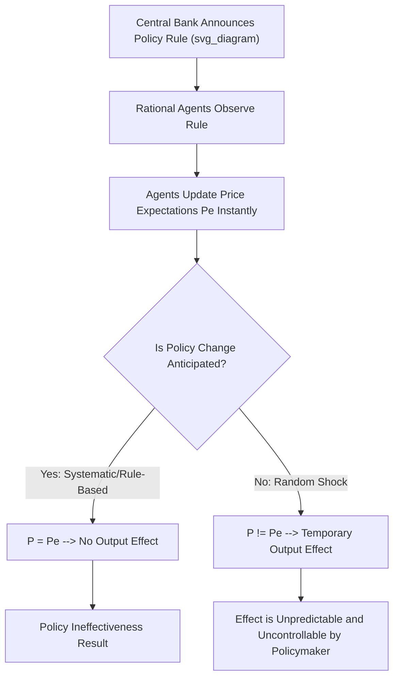

## New Classical Policy Ineffectiveness Proposition

### Overview

The Policy Ineffectiveness Proposition (PIP) is a central result of New Classical macroeconomics, developed primarily by Thomas Sargent and Neil Wallace (1975, 1976), building on Robert Lucas's work on rational expectations. It asserts that systematic, anticipated monetary (and by extension fiscal) policy cannot systematically affect real variables like output and employment — even in the short run — because rational agents anticipate the policy's effects and adjust their behavior preemptively, neutralizing it. This directly challenges the Keynesian premise that discretionary demand management can reliably stabilize the real economy.

### Theoretical Foundations

#### Rational Expectations Hypothesis

**Key Points**

- Developed by John Muth (1961) and applied to macroeconomics by Robert Lucas
- Economic agents form expectations using all available information efficiently, including knowledge of the structure of the economy and the policy rule followed by the government/central bank
- Expectations are not systematically wrong; forecast errors are random and unpredictable (white noise), not correlated with available information
- Formally, expected inflation $E[\pi_t | \Omega_{t-1}]$ equals the mathematical conditional expectation of actual inflation given the information set $\Omega_{t-1}$ available at time $t-1$

$$\pi_t^e = E[\pi_t \mid \Omega_{t-1}]$$

This contrasts with adaptive expectations (backward-looking, based on past inflation only), which rational expectations theorists argued was irrational because it ignored available information about current policy.

#### The Lucas Aggregate Supply Function

**Key Points**

- Lucas (1972, 1973) formalized a supply curve in which output deviates from its natural level only in response to *unanticipated* price level changes (a "signal extraction" problem: producers cannot immediately distinguish a general price rise from a rise in the relative price of their own good)

$$Y_t = Y_n + \alpha(P_t - P_t^e) + \varepsilon_t$$

Where:

- $Y_t$ = actual output
- $Y_n$ = natural (full-employment) level of output
- $P_t$ = actual price level
- $P_t^e$ = expected price level
- $\alpha > 0$ = sensitivity parameter
- $\varepsilon_t$ = random supply shock

**Key Points**

- If $P_t = P_t^e$ (expectations are correct), output equals its natural rate regardless of the money supply
- Only surprise (unanticipated) price changes — arising from unanticipated money supply changes — move output away from $Y_n$

### Deriving the Policy Ineffectiveness Proposition

#### Sargent-Wallace Model Setup

**Key Points**

- Combine the Lucas supply function with a quantity-theory-style aggregate demand relationship and a monetary policy rule
- Assume the central bank follows a known, systematic feedback rule:

$$m_t = \mu_0 + \mu_1 X_{t-1} + \eta_t$$

Where $m_t$ is the money supply, $X_{t-1}$ is a vector of lagged observable variables (e.g., past output, past inflation), $\mu_0, \mu_1$ are known policy response coefficients, and $\eta_t$ is a pure random (unforecastable) policy shock.

- Because the rule and the coefficients $\mu_0, \mu_1$ are assumed known to rational agents, the *systematic* component $\mu_0 + \mu_1 X_{t-1}$ is perfectly anticipated
- Agents incorporate this anticipated money supply into their price expectations $P_t^e$, so it is fully "priced in" before it takes effect
- Only the random shock $\eta_t$ — which by definition cannot be anticipated — can cause $P_t \neq P_t^e$ and thus affect real output

#### The Core Result

$$Y_t - Y_n = \alpha(P_t - P_t^e) = f(\eta_t) \text{ only}$$

**Key Points**

- Systematic (rule-based, anticipated) monetary policy has **zero effect** on the deviation of output from its natural rate
- Only unanticipated, random monetary policy shocks can move output, and by construction these cannot be systematically engineered by policymakers (if they could be anticipated, they would already be part of the "systematic" rule)
- Therefore, a central bank cannot use a known, predictable policy rule to systematically reduce unemployment or raise output above its natural rate, even temporarily
- This is a stronger claim than the long-run monetary neutrality of older Classical/Monetarist theory — PIP asserts neutrality even in the *short run*, provided the policy is anticipated

### Contrast with Keynesian and Adaptive-Expectations Models

| Feature | Keynesian / Adaptive Expectations | New Classical (Rational Expectations + PIP) |
| --- | --- | --- |
| Expectation formation | Backward-looking (based on past data) | Forward-looking (uses all available information, including the policy rule) |
| Systematic policy effect | Can systematically raise output/reduce unemployment (short run) | No effect, even in the short run, if anticipated |
| Only effective policy | Any policy (anticipated or not) | Only unanticipated ("surprise") policy |
| Phillips Curve implication | Stable exploitable trade-off | No exploitable trade-off, even short-run, for anticipated policy |
| Source of business cycles | Demand shocks, sticky wages/prices | Unanticipated monetary/real shocks (surprises), misperceptions |
| Government credibility | Not central to model outcomes | Central — announced rules are useless if the rule itself becomes anticipated |

### Distinguishing PIP from Simple Monetary Neutrality

**Key Points**

- Classical/Monetarist long-run neutrality (pre-Lucas): money is neutral *eventually*, after prices fully adjust — but a temporary short-run real effect (a Phillips Curve trade-off) is often still permitted
- Friedman-Phelps expectations-augmented Phillips Curve: allows short-run real effects when inflation is *unanticipated*, but the trade-off is not stable — it disappears as expectations catch up to actual inflation, but *catching up* takes time (adaptive expectations)
- New Classical PIP (Sargent-Wallace): removes the "catching up" delay entirely, because rational agents anticipate the policy immediately upon its announcement — there is no gap during which even a systematic policy could catch agents off guard [Inference: this distinction is what makes PIP a stronger and more specifically "policy-focused" result than generic monetary neutrality]

### Policy Implications

#### For Monetary Policy

**Key Points**

- Discretionary "fine-tuning" of the economy via systematic feedback rules is futile — it cannot reduce the variance of output around its natural rate, and can only add noise (via unanticipated shocks) that increases volatility
- Only credible commitment to low, stable, predictable money growth (rules over discretion) is prescribed — echoing Friedman's k-percent rule, but for different theoretical reasons
- Central bank "surprise" policy (e.g., unexpected rate cuts) can produce real effects, but such surprises are, by definition, non-repeatable and cannot be relied on as a systematic stabilization tool
- Credibility and transparency of central bank commitments become critically important variables in policy design — laying groundwork for later "time inconsistency" literature (Kydland and Prescott, 1977)

#### For Fiscal Policy

**Key Points**

- An analogous logic (via Ricardian Equivalence, associated with Robert Barro) extends the ineffectiveness argument to fiscal policy: anticipated deficit-financed spending is offset by increased private saving in anticipation of future taxes
- Anticipated countercyclical fiscal stimulus, if agents understand the government's response function, similarly fails to alter real aggregate demand in the New Classical framework

### Empirical Testing and the "Barro-Sargent-Wallace" Approach

**Key Points**

- Empirical tests (notably by Robert Barro in the late 1970s) attempted to distinguish "anticipated" versus "unanticipated" money growth using estimated policy reaction functions, then tested whether only the unanticipated component correlated with real output/unemployment
- Early results were seen as broadly supportive of PIP, but subsequent econometric critiques challenged the methodology (e.g., difficulty in cleanly separating anticipated from unanticipated components, sensitivity to model specification) [Unverified: the empirical literature on this remains contested and results vary by time period, country, and estimation technique]

### Major Criticisms

**Key Points**

- **Real Business Cycle (RBC) theorists** later argued that even the reliance on monetary "surprises" to generate real fluctuations was empirically weak, shifting New Classical emphasis toward real (technology) shocks instead
- **New Keynesians** (Fischer, Taylor, Phelps) countered that even with rational expectations, if wages/prices are set in *staggered, multi-period contracts* signed before the policy shock is known, systematic policy can still have real effects during the contract period, because not everyone can adjust prices simultaneously — this became known as the "Fischer-Taylor critique" of PIP
- Empirically, contractionary monetary policy (e.g., Volcker disinflation, 1979–1982) appeared to be widely known/anticipated in direction, yet was followed by a severe, prolonged recession — a pattern many economists viewed as inconsistent with pure PIP predictions [Inference: interpretation of this episode remains debated between New Classical and New Keynesian economists]
- Critics also note the assumption that agents know the "true" model of the economy and the exact policy rule coefficients is extremely demanding and arguably unrealistic

### Legacy and Influence

**Key Points**

- PIP contributed to the **Lucas Critique** (1976): traditional econometric policy models estimated on historical data are unreliable for evaluating new policies, because agents' behavioral parameters themselves depend on the (changing) policy regime
- Spurred the development of **microfounded, dynamic stochastic general equilibrium (DSGE) models** that explicitly incorporate rational expectations
- Directly informed the **time-inconsistency and credibility literature** (Kydland-Prescott, Barro-Gordon), emphasizing central bank independence and rule-based commitment devices
- Influenced central bank practice toward transparency, forward guidance, and inflation targeting — even though these tools operate somewhat differently than the pure PIP framework implies, since managing *expectations themselves* became viewed as a legitimate and powerful policy lever

### Conclusion

The Policy Ineffectiveness Proposition represents the most rigorous formal challenge to Keynesian demand-management policy, arguing that rational agents render anticipated, systematic monetary or fiscal policy powerless to alter real economic outcomes, leaving only unpredictable policy surprises with (unreliable) real effects. While its strongest form has been substantially qualified by New Keynesian sticky-price models and questioned by empirical evidence from major disinflation episodes, PIP fundamentally reshaped macroeconomic methodology — cementing rational expectations, credibility, and the Lucas Critique as permanent fixtures of modern macroeconomic policy analysis.

**Related Topics**

- The Lucas Critique and its implications for econometric policy evaluation
- Time inconsistency and the Kydland-Prescott model
- Ricardian Equivalence and Robert Barro's fiscal neutrality argument
- Real Business Cycle (RBC) theory
- New Keynesian staggered contracts (Fischer, Taylor models)
- Central bank credibility, independence, and inflation targeting regimes
- DSGE (Dynamic Stochastic General Equilibrium) modeling
- Adaptive versus rational expectations in empirical macroeconomics
- The Volcker disinflation as a case study in policy credibility