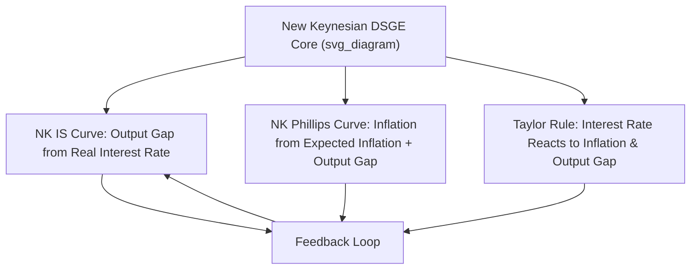

## New Keynesian Synthesis and Modern Consensus

### Overview

The New Keynesian synthesis refers to the theoretical framework that emerged from the late 1970s through the 1990s, reconciling the rational expectations revolution of New Classical economics with Keynesian insights about market imperfections and short-run non-neutrality of money. Rather than rejecting rational expectations, New Keynesians accepted it as a modeling standard while providing rigorous microeconomic foundations for price and wage stickiness, preserving a meaningful role for stabilization policy. This synthesis, further developed into what is often called the "New Neoclassical Synthesis," forms the backbone of contemporary mainstream macroeconomic policy analysis and central bank practice.

### Historical Context and Motivation

**Key Points**

- New Classical economics (Lucas, Sargent, Wallace) demonstrated in the 1970s that if agents form rational expectations, systematic policy could be ineffective (Policy Ineffectiveness Proposition), challenging the theoretical basis for Keynesian demand management
- Early Keynesian models (IS-LM, adaptive expectations) were criticized as theoretically ad hoc — assuming sticky prices/wages without explaining *why* rational, optimizing agents would tolerate such stickiness
- The **Lucas Critique** (1976) demanded that macroeconomic models be built from microeconomic foundations with stable "deep parameters" (preferences, technology) rather than reduced-form empirical relationships
- New Keynesian economists (Stanley Fischer, John Taylor, Gregory Mankiw, David Romer, Olivier Blanchard, among others) took up this challenge directly: could rigorous microfoundations generate price stickiness and thus preserve short-run monetary non-neutrality?

### Core Building Blocks of New Keynesian Theory

#### Nominal Rigidities: Staggered Price and Wage Setting

**Key Points**

- **Fischer (1977)** and **Taylor (1979, 1980)** modeled overlapping, staggered multi-period wage/price contracts: not all firms/workers reset prices or wages simultaneously
- Because only a fraction of prices adjust in any given period, in aggregate the price level adjusts sluggishly even though each individual agent is behaving rationally and optimally given their contract structure
- This staggering means systematic monetary policy *can* have real effects during the transition period — directly countering the Sargent-Wallace Policy Ineffectiveness Proposition, since not all agents can instantly reprice in response to an anticipated policy change

$$p_t = \frac{1}{2}(x_t + E_t[x_{t+1}])$$

*(Illustrative simplified two-period staggered contract pricing relationship, where $p_t$ is the aggregate price level and $x_t$ is the contract price set by firms resetting in period $t$)* [Inference: exact formulation varies across Taylor- and Calvo-style specifications]

#### Menu Costs

**Key Points**

- **Mankiw (1985)** and **Akerlof and Yellen (1985)** developed the "menu cost" explanation: firms face small fixed costs of changing posted prices (reprinting menus, updating catalogs, renegotiating contracts)
- Even small menu costs can generate significant aggregate price stickiness and substantial welfare/output effects, because firms' private incentive to adjust prices is second-order (envelope theorem: small deviations from optimal price have only small effects on individual firm profit), while the aggregate/social cost of not adjusting can be first-order
- This provided a "small individual friction, large aggregate consequence" microfoundation for nominal rigidity

#### Efficiency Wages and Labor Market Frictions

**Key Points**

- Efficiency wage theory (Shapiro-Stiglitz, 1984; Akerlof, 1982) argues firms pay wages above the market-clearing level to reduce shirking, turnover, and to elicit effort or loyalty ("gift exchange" models)
- This generates involuntary unemployment as an equilibrium outcome (not a disequilibrium anomaly), since firms rationally choose not to cut wages to the market-clearing level even when unemployed workers would accept lower pay
- Search and matching frictions (Diamond-Mortensen-Pissarides models) further formalize why unemployment persists even in equilibrium, given the time and cost involved in matching workers to jobs

#### Imperfect Competition

**Key Points**

- Unlike classical models assuming perfect competition, New Keynesian models typically assume monopolistic competition (Dixit-Stiglitz framework), giving firms some price-setting power
- This is a necessary ingredient for menu-cost and staggered-pricing models: under perfect competition, firms are price takers and the concept of a firm "choosing" a sticky price does not apply

### The New Keynesian DSGE Model (The "Three-Equation" Core)

**Key Points**

- Modern New Keynesian analysis is typically summarized in a compact three-equation Dynamic Stochastic General Equilibrium (DSGE) system, widely used in central bank policy models:

**1. New Keynesian IS Curve** (derived from household intertemporal consumption optimization/Euler equation):

$$y_t = E_t[y_{t+1}] - \sigma(i_t - E_t[\pi_{t+1}] - r_t^n)$$

**2. New Keynesian Phillips Curve** (derived from Calvo-style staggered pricing):

$$\pi_t = \beta E_t[\pi_{t+1}] + \kappa y_t$$

**3. Monetary Policy Rule** (typically a Taylor Rule):

$$i_t = r^n + \phi_\pi \pi_t + \phi_y y_t$$

Where $y_t$ is the output gap, $\pi_t$ is inflation, $i_t$ is the nominal interest rate, $r_t^n$ is the natural real interest rate, and $\beta, \sigma, \kappa, \phi_\pi, \phi_y$ are structural parameters.

**Key Points**

- Unlike the traditional backward-looking Phillips Curve, the New Keynesian Phillips Curve (NKPC) is forward-looking: current inflation depends on *expected future* inflation plus the current output gap, reflecting firms' forward-looking pricing decisions under staggered contracts
- This forward-looking structure means credible commitments about *future* policy (forward guidance) can influence *current* inflation and output — a mechanism absent in older static models

### The Taylor Rule as Policy Anchor

**Key Points**

- Proposed by John Taylor (1993) as both a descriptive and prescriptive guide for central bank interest-rate setting:

$$i_t = r^* + \pi_t + 0.5(\pi_t - \pi^*) + 0.5(y_t - y^*)$$

Where $r^*$ is the equilibrium real interest rate, $\pi^*$ is the inflation target, and $y^*$ is potential output.

- **Key Points**: The rule prescribes raising the nominal interest rate more than one-for-one with inflation above target (the "Taylor Principle," coefficient $>1$ on inflation), ensuring the *real* interest rate rises to cool an overheating economy — a condition necessary for macroeconomic stability in New Keynesian models
- Widely used descriptively to assess whether central bank policy is "too loose" or "too tight" relative to historical norms, and prescriptively as a benchmark or "systematic" component of policy that can still coexist with discretion

### The "New Neoclassical Synthesis"

**Key Points**

- Term coined by Goodfriend and King (1997) to describe the convergence of New Classical (RBC/DSGE methodology, rational expectations, general equilibrium rigor) with New Keynesian content (nominal rigidities, imperfect competition, meaningful short-run role for monetary policy)
- Reflects broad agreement across the mainstream profession on methodology (DSGE modeling) even amid continued disagreement on substantive questions (size of fiscal multipliers, effectiveness of unconventional monetary policy, degree of price stickiness)
- Central conclusions of the synthesis:
  - Money is neutral in the long run (classical insight retained)
  - Monetary policy has real short-run effects due to nominal rigidities (Keynesian insight retained)
  - Systematic, credible, rule-based policy is generally preferable to ad hoc discretion (New Classical/credibility insight retained)
  - Well-designed policy rules (e.g., inflation targeting via Taylor-Rule-like reaction functions) can improve welfare, particularly by anchoring inflation expectations

### Modern Consensus in Central Banking Practice

**Key Points**

- **Inflation targeting** became the dominant monetary policy framework globally from the 1990s onward (New Zealand 1990, Canada, UK, and eventually most major economies), directly informed by New Keynesian emphasis on expectation management and credibility
- **Independent central banks** with clear mandates are broadly favored, reflecting the time-inconsistency/credibility literature (Kydland-Prescott, Barro-Gordon) that grew alongside New Keynesian theory
- **Forward guidance** — central banks communicating future policy intentions — became a key tool, especially after 2008, directly leveraging the forward-looking nature of the NK IS and Phillips curves
- **Fiscal policy** is generally viewed in the consensus as most effective when monetary policy is constrained (e.g., at the zero lower bound), otherwise playing a secondary role to monetary policy for short-run stabilization, while automatic stabilizers remain broadly favored
- Central bank DSGE models incorporating New Keynesian features (e.g., the Federal Reserve's FRB/US model elements, the European Central Bank's New Area-Wide Model) are used operationally for forecasting and policy analysis [Inference: specific model architectures and usage evolve over time and vary by institution]

### Divergence from Pure New Classical Policy Prescriptions

| Dimension | New Classical (Pure PIP) | New Keynesian Consensus |
| --- | --- | --- |
| Anticipated policy effect | None (Policy Ineffectiveness) | Real effects possible due to staggered pricing/wages |
| Role of expectations | Neutralizes policy | Central *tool* — forward guidance leverages expectations |
| Preferred framework | Rules eliminate discretion entirely | Rules combined with limited, credible discretion ("constrained discretion") |
| Fiscal policy | Largely ineffective (Ricardian Equivalence) | Effective, especially near zero lower bound |
| Price stickiness | Not modeled / assumed away | Modeled explicitly via menu costs, staggered contracts |

### Points of Continued Debate Within the Consensus

**Key Points**

- The size of the fiscal multiplier remains empirically contested, particularly regarding its dependence on the state of the economy (larger during liquidity traps/recessions, smaller during expansions) [Unverified: multiplier estimates vary substantially across studies, countries, and time periods]
- The effectiveness and transmission mechanisms of unconventional monetary policy (quantitative easing, negative interest rates) post-2008 remain areas of active research and disagreement, as these tools operate outside the traditional interest-rate-based NK framework
- Post-Global Financial Crisis and post-COVID inflation episodes have renewed debate about the adequacy of standard NK models in capturing supply-shock-driven inflation, financial sector instability (which basic NK models often omit), and the limits of forward guidance credibility
- Behavioral and heterogeneous-agent extensions (HANK models) have emerged to address criticisms that representative-agent New Keynesian models poorly capture distributional effects of monetary policy [Inference: this is an active and evolving area of the literature rather than settled consensus]

### Conclusion

The New Keynesian synthesis successfully reconciled the analytical rigor of rational expectations and general equilibrium modeling demanded by the Lucas Critique with the Keynesian conviction that nominal rigidities create meaningful scope for stabilization policy. By grounding price and wage stickiness in microeconomic behavior (menu costs, staggered contracts, efficiency wages, imperfect competition), New Keynesians restored a theoretically defensible role for monetary and fiscal policy without abandoning rational expectations. This synthesis — often called the New Neoclassical Synthesis — now constitutes the operational core of modern central banking practice worldwide, centered on inflation targeting, credible rule-based policy, and active management of expectations, even as debates continue over specific parameters, unconventional policy tools, and model adequacy in the wake of major economic shocks.

**Related Topics**

- The New Keynesian three-equation DSGE model in depth
- Calvo pricing versus Taylor staggered-contract pricing mechanisms
- Zero lower bound economics and unconventional monetary policy (QE, forward guidance)
- Heterogeneous Agent New Keynesian (HANK) models
- Central bank independence and the time-inconsistency problem
- Inflation targeting regimes: historical adoption and design variations
- Search and matching models of unemployment (Diamond-Mortensen-Pissarides)
- Fiscal multiplier estimation across business cycle states
- Post-2008 and post-COVID critiques of New Keynesian modeling