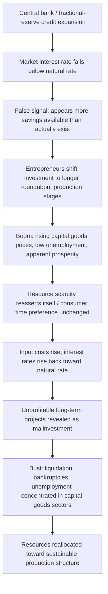

## Austrian Business Cycle Theory

### Overview

Austrian Business Cycle Theory (ABCT) is a theory of the boom-bust cycle developed primarily by Ludwig von Mises and Friedrich Hayek, associated with the Austrian School of economics. It explains recurring cycles of unsustainable credit-driven booms followed by necessary recessions as the consequence of central bank or fractional-reserve-driven distortions in the interest rate, rather than as inherent features of a market economy or as demand-side failures.

The theory's central claim: when credit expansion pushes the market interest rate below the "natural" rate consistent with actual savings, it sends a false signal to entrepreneurs, causing malinvestment that must eventually be liquidated.

### Historical Development

- **Knut Wicksell** (1898) laid groundwork with the distinction between the "natural rate of interest" (determined by the real return on capital) and the "money rate of interest" (set in loan markets).
- **Ludwig von Mises**, in *The Theory of Money and Credit* (1912), integrated Wicksell's insight with Carl Menger's capital theory and marginal utility framework to explain business cycles as a monetary phenomenon.
- **Friedrich Hayek** extended and formalized the theory in *Prices and Production* (1931) and *Monetary Theory and the Trade Cycle* (1933), introducing more rigorous capital-structure analysis and winning a share of the 1974 Nobel Memorial Prize partly for this work.
- The theory was influential in explaining the causes of the Great Depression from an Austrian perspective, and was revived academically after the 2008 financial crisis, when several Austrian economists were noted for having warned of a credit-driven housing bubble beforehand. [Inference: the extent to which specific predictions were precise versus general warnings is debated]

### Core Theoretical Building Blocks

#### 1. Roundaboutness and the Structure of Production

Austrian capital theory (drawing on Menger and Eugen von Böhm-Bawerk) treats production as occurring in stages, from raw materials to final consumer goods. More "roundabout" (capital-intensive, longer) production processes tend to be more productive but require more time and more savings to sustain.

#### 2. The Natural Rate vs. the Market Rate of Interest

- The **natural rate of interest** reflects the real trade-off society makes between present and future consumption — i.e., actual time preference and voluntary savings.
- The **market (loan) rate of interest** is the rate actually charged in credit markets, which can diverge from the natural rate when banks expand credit without a corresponding increase in real savings.

#### 3. Credit Expansion and Interest Rate Distortion

When a central bank (or a fractional-reserve banking system generally) expands the money supply through credit creation, the market interest rate falls below the natural rate. This is distinct from a fall in interest rates caused by genuinely increased voluntary saving.

#### 4. Malinvestment

Entrepreneurs interpret the artificially low interest rate as a signal that more resources are available for long-term, capital-intensive projects. They shift investment toward earlier, more roundabout stages of production (e.g., mining, construction, capital goods) — even though consumers have not actually reduced present consumption to free up the necessary real resources. This mismatch between the signaled availability of savings and the actual availability is called **malinvestment**.

#### 5. The Boom

- Rising asset prices, especially in capital goods and long-duration projects
- Falling unemployment
- Overinvestment in interest-rate-sensitive sectors (construction, capital equipment, durable goods)
- Apparent prosperity that masks a growing structural imbalance between the economy's actual resources and its planned use

#### 6. The Bust

Eventually, the intertemporal mismatch becomes apparent — through rising input prices as competing projects bid for scarce real resources, consumer preferences reasserting themselves, or the central bank tightening credit to combat rising prices. Interest rates rise back toward (or above) the natural rate, revealing that many long-term projects are unprofitable. The bust is the liquidation of malinvestments: bankruptcies, asset price declines, and unemployment concentrated in the capital-goods sectors.

**Key Austrian claim**: the recession is not the disease but the *cure* — the necessary reallocation of misallocated resources back toward sustainable patterns of production. Attempts to prevent or postpone the bust (via further credit expansion or fiscal stimulus) merely delay and often worsen the eventual correction.

### Mermaid Diagram: The ABCT Boom-Bust Mechanism

### Formal Sketch of the Mechanism

Let $r_n$ denote the natural rate of interest and $r_m$ the market rate. The Austrian claim is that credit expansion drives:

$$r_m < r_n$$

This gap induces entrepreneurs to select production processes with a longer average period of production, $T$, than is consistent with the actual intertemporal consumption preferences of households. The economy's realized capital structure $K(T)$ diverges from the sustainable structure $K^*(T)$ implied by real savings $S$:

$$K(T) \neq K^*(S)$$

The bust is the market process correcting $K(T) \to K^*(S)$ once the interest rate distortion is removed or overwhelmed by rising real resource costs.

### The Ricardo Effect and Hayekian Triangles

Hayek used the "Hayekian triangle" to visualize the stages of production, with the hypotenuse representing the time dimension of the production structure and the base representing the value of output at each stage. Credit expansion is depicted as lengthening the triangle (more roundabout production); the bust as its forced contraction.

Hayek also invoked the **Ricardo Effect**: as the boom progresses and consumer goods prices rise (due to expanding money incomes chasing a relatively unchanged flow of consumer goods early in the cycle), real wages fall relative to profits on consumer-goods production, incentivizing a shift back toward labor-intensive, shorter production processes — which can itself help trigger the reversal.

### Illustrative SVG: Hayekian Triangle Distortion (svg_diagram)

<svg xmlns="http://www.w3.org/2000/svg" viewBox="0 0 640 360">
<text x="320" y="24" font-size="16" text-anchor="middle" font-family="sans-serif" font-weight="bold">Hayekian Triangle: Sustainable vs Distorted Structure (svg_diagram)</text>

<line x1="60" y1="320" x2="600" y2="320" stroke="#333" stroke-width="2" />
<line x1="60" y1="320" x2="60" y2="60" stroke="#333" stroke-width="2" />
<text x="330" y="345" font-size="12" text-anchor="middle" font-family="sans-serif">Time (stages of production)</text>
<text x="30" y="190" font-size="12" text-anchor="middle" font-family="sans-serif" transform="rotate(-90 30,190)">Value of output</text>

<polygon points="60,320 300,320 60,140" fill="none" stroke="#2b7a3f" stroke-width="2" />
<text x="110" y="200" font-size="12" fill="#2b7a3f" font-family="sans-serif">Sustainable structure (r = natural rate)</text>

<polygon points="60,320 540,320 60,90" fill="none" stroke="#b5401e" stroke-width="2" stroke-dasharray="6,4" />
<text x="330" y="270" font-size="12" fill="#b5401e" font-family="sans-serif">Boom-distorted structure (r &lt; natural rate)</text>

<line x1="540" y1="90" x2="300" y2="140" stroke="#555" stroke-width="2" marker-end="url(#arrow)" />
<text x="470" y="105" font-size="11" fill="#555" font-family="sans-serif">Bust: forced contraction back to sustainable length</text>
</svg>

### Worked Example

Suppose the natural rate of interest, given actual household savings, is 5%. A central bank engages in expansionary open-market operations, pushing the market rate to 2%.

1. A construction firm evaluates a 10-year infrastructure project with a net present value calculation:

$$NPV = \sum_{t=1}^{10} \frac{CF_t}{(1+r)^t} - I_0$$

At $r = 2\%$, the project shows positive NPV and is undertaken. At the true $r_n = 5\%$, the same project would have negative NPV and would not have been started.

2. Multiple firms across the economy make similar decisions, concentrating investment in long-duration capital projects (real estate, heavy machinery, infrastructure).
3. As these projects proceed simultaneously, they compete for the same finite pool of real resources (skilled labor, raw materials, machine tool capacity), bidding up input costs.
4. Rising costs, and/or the central bank raising rates to control resulting price inflation, push the effective discount rate back toward 5%.
5. Recalculated at 5%, the marginal projects show negative NPV. Financing dries up, projects are abandoned or written down, and the sector undergoes layoffs and bankruptcies — the bust.

### Policy Implications (Austrian Prescription)

- **Non-intervention during the bust**: liquidation of malinvestment should be allowed to proceed rather than propped up, since propping up unprofitable projects prevents resources from being redirected to sustainable uses.
- **Sound money**: many Austrians (particularly Mises and Murray Rothbard) advocate commodity-based money (e.g., a gold standard) or free banking without central bank credit creation, to prevent the interest-rate distortion at its source.
- **Skepticism of countercyclical monetary policy**: lowering rates further in response to a bust is viewed as reinforcing the original distortion rather than correcting it — "the hangover cure is not more alcohol."
- **Distrust of fiscal stimulus**: government spending during the bust is seen as further misallocating real resources rather than addressing the underlying structural imbalance.

### Comparison with Rival Business Cycle Theories

| Theory | Primary Cause of Cycle | Prescribed Policy Response |
| --- | --- | --- |
| Austrian (ABCT) | Central bank/credit-driven interest rate distortion causing malinvestment | Avoid credit expansion; let liquidation occur; sound money |
| Keynesian | Insufficient aggregate demand / animal spirits | Fiscal and monetary stimulus during downturns |
| Monetarist | Erratic money supply growth relative to money demand | Stable, rules-based money supply growth |
| Real Business Cycle (RBC) | Real productivity/technology shocks | Minimal intervention; cycles reflect efficient responses to shocks |
| New Keynesian | Sticky prices/wages amplifying demand shocks | Active but rules-guided monetary policy (e.g., inflation targeting) |

### Major Criticisms

- **Mainstream economists** (including many New Keynesians and Monetarists) argue ABCT lacks rigorous microfoundations for why entrepreneurs would systematically fail to anticipate and correct for known central bank policy (a "rational expectations" critique).
- **Empirical testability**: critics, including Milton Friedman, argued ABCT does not explain why a bust must be as severe as the preceding boom, or why malinvestment isn't liquidated gradually rather than in a sharp recession. [Inference: this remains a live methodological dispute between Austrian and mainstream macroeconomists rather than a settled empirical question]
- **Heterogeneous capital assumption**: some critics argue the theory's reliance on capital being highly stage-specific and difficult to redeploy is overstated in modern, more flexible economies.
- **Austrian counter-response**: proponents argue mainstream models often abstract away the very heterogeneous, time-structured capital that ABCT centers on, and that this abstraction is precisely why mainstream models missed pre-2008 imbalances. [Inference: this is a contested claim advanced by Austrian-school economists, not a consensus view]

### Key Points

- ABCT explains booms and busts as the result of bank credit expansion driving the market interest rate below the natural rate.
- The boom phase features malinvestment concentrated in long-duration, capital-intensive projects.
- The bust is framed as a necessary liquidation/correction, not a policy failure to be reversed with further stimulus.
- The theory sits outside mainstream (Keynesian, Monetarist, New Keynesian) macroeconomic orthodoxy and remains a distinctive, actively debated framework rather than a widely adopted policy model in central banking institutions.

### Related Topics

- Wicksellian natural rate of interest
- Böhm-Bawerk's capital and interest theory
- Hayek's "Prices and Production" and the Hayekian triangle
- Fractional reserve banking vs. full-reserve/free banking proposals
- Real Business Cycle theory (as a contrasting supply-side framework)
- Minsky's Financial Instability Hypothesis (as an alternative credit-cycle theory)
- Time preference and intertemporal choice theory
- The 2008 financial crisis as a case study debate between Austrian and mainstream explanations