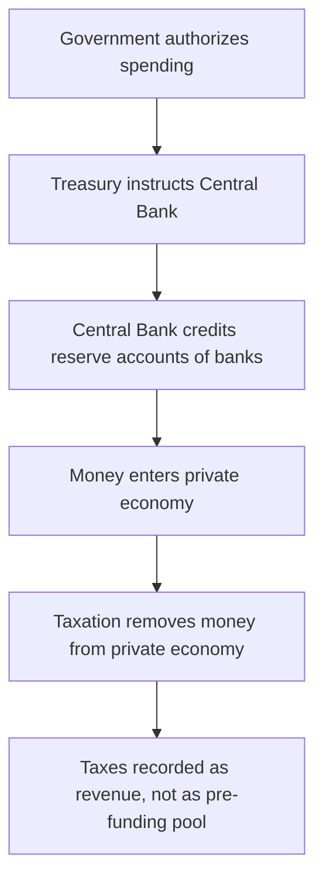

## Modern Monetary Theory Claims and Critiques

### Overview

Modern Monetary Theory (MMT) is a heterodox macroeconomic framework that reexamines the operational realities of fiat currency, sovereign debt, and government spending. It challenges several assumptions embedded in mainstream (neoclassical and New Keynesian) macroeconomics regarding the constraints facing currency-issuing governments. This entry documents MMT's core theoretical claims, its policy implications, and the major lines of critique from mainstream and other heterodox economists.

**Note on framing:** MMT is a contested framework within the economics profession. This document presents MMT's claims as articulated by its proponents and presents critiques as articulated by its critics, without asserting which side is correct on disputed empirical or normative questions.

### Intellectual Origins

**Key Points**

- MMT draws on **Chartalism** (Georg Friedrich Knapp, early 20th century), which holds that money's value derives from the state's authority to declare it acceptable for tax payments, rather than from any commodity backing.
- It incorporates ideas from **Post-Keynesian economics**, particularly Hyman Minsky's work on financial instability and endogenous money.
- Key modern proponents include Warren Mosler, L. Randall Wray, Stephanie Kelton, Bill Mitchell, and Pavlina Tcherneva.
- Stephanie Kelton's 2020 book *The Deficit Myth* brought MMT into mainstream political and media discourse.

### Core Theoretical Claims

#### 1. Sovereign Currency Issuers Cannot "Run Out" of Their Own Currency

MMT proponents argue that a government that issues its own fiat currency, borrows only in that currency, and operates under a floating exchange rate cannot become involuntarily insolvent in that currency, because it can always create additional units of currency to meet nominal obligations.

$$\text{Government Solvency Constraint (MMT view)} \neq \text{Household Budget Constraint}$$

This is often summarized as the claim that **"a sovereign currency issuer cannot go bankrupt in its own currency,"** distinguishing government finance from the finances of households, firms, or currency-users (like U.S. states, Eurozone member states, or countries with foreign-currency-denominated debt).

#### 2. Taxes Do Not Fund Spending — They Create Currency Demand and Drain Reserves

MMT inverts the conventional "tax-and-spend" sequencing. It argues that:

- The currency-issuing government spends first (crediting bank reserve accounts), and taxation occurs afterward.
- Taxes exist primarily to (a) create demand for the currency (since citizens need it to pay taxes) and (b) remove excess money from circulation to manage inflation — not to literally "fund" expenditure.
- This is often expressed as: **"Taxes drive money."**

#### 3. The Real Constraint on Government Spending Is Inflation, Not Solvency

MMT's central policy claim is that the binding constraint on government spending is the availability of real resources (labor, capital, materials) in the economy, not the availability of financial resources. Once an economy approaches full resource utilization, further spending risks demand-pull inflation.

$$\text{Spending Limit (MMT)} = f(\text{Real Resource Slack}), \quad \text{not } f(\text{Deficit-to-GDP Ratio})$$

#### 4. Government Deficits Equal Non-Government Surpluses (Sectoral Balances)

MMT relies heavily on the **sectoral balances framework**, an accounting identity showing that, by definition:

$$(G - T) = (S - I) + (M - X)$$

where $(G-T)$ is the government fiscal balance (spending minus taxes), $(S-I)$ is the private sector balance (saving minus investment), and $(M-X)$ is the net import position (imports minus exports, representing the foreign sector balance).

MMT proponents interpret persistent government surpluses as necessarily requiring the private domestic sector (in the absence of a trade surplus) to run deficits — accumulating debt — arguing this makes sustained government surpluses potentially destabilizing for private balance sheets.

#### 5. The Job Guarantee as an Inflation Anchor and Automatic Stabilizer

Rather than relying on unemployment (a "reserve army of labor," in Marxian/Post-Keynesian terminology) to discipline wage inflation, MMT proponents typically advocate for a **Job Guarantee (JG)**: a federally funded, locally administered program offering employment at a fixed wage to anyone willing to work.

- Functions countercyclically: JG employment expands automatically during downturns and contracts as private employment recovers.
- Proponents argue the fixed JG wage acts as a **price anchor** for the value of the currency and a more effective inflation-control mechanism than interest rate manipulation or unemployment-inducing austerity.

#### 6. Central Bank and Treasury Operations Are Functionally Consolidated

MMT treats the central bank and treasury as a single consolidated government sector for analytical purposes, arguing that institutional separations (like prohibitions on direct central bank financing of treasury deficits) are self-imposed political constraints rather than fundamental economic constraints.

### Policy Implications Advocated by MMT Proponents

**Key Points**

- Government budget deficits should not be evaluated by arbitrary numerical targets (e.g., 3% of GDP); the relevant metric is whether the *economy* is at full employment without excess inflation.
- Full employment can and should be a directly targeted, guaranteed policy outcome (via the Job Guarantee) rather than an indirect byproduct of monetary policy.
- Interest rate policy (as used by conventional central banks) is viewed skeptically as an inflation-control tool; some MMT proponents argue near-zero permanent policy rates are appropriate, with fiscal policy (spending and taxation) doing the primary work of demand management.
- Bond issuance by a sovereign currency issuer is reframed as an interest-rate maintenance operation (managing reserve levels) rather than a strictly necessary financing operation.

### Major Critiques of MMT

#### Critique 1: Understating Inflation Risk and the Difficulty of Real-Time Calibration

Critics, including many mainstream and some Post-Keynesian economists, argue that MMT underestimates the practical difficulty of identifying the point of full resource utilization in real time, and that by the time inflation signals appear, expectations may already be de-anchored, making disinflation costly.

[Inference] This critique reflects a broader debate in macroeconomics about the reliability of output-gap and full-employment estimates in real time, which is a well-documented methodological challenge independent of MMT specifically.

#### Critique 2: The Job Guarantee's Inflation-Anchoring Mechanism Is Unproven at Scale

Critics question whether a Job Guarantee wage could function as an effective, non-inflationary price anchor at national scale, citing concerns about:

- Potential wage-price spiral effects if the JG wage is set too high relative to the private sector.
- Administrative complexity of designing, staffing, and locally administering a program guaranteeing employment to all comers.
- Historical precedents (like public employment schemes) that critics argue do not provide clear evidence the mechanism would work as intended at the scale MMT envisions. [Speculation] Whether comparisons to historical public works programs are analytically appropriate is itself disputed between MMT proponents and critics.

#### Critique 3: Political Economy and Central Bank Independence Concerns

Critics, including economists like Kenneth Rogoff and Paul Krugman, have argued that MMT's implied fusion of fiscal and monetary policy undermines the rationale for central bank independence, which was itself established partly in response to historical episodes of politically-driven monetary financing leading to high inflation (e.g., various 20th-century hyperinflation episodes).

#### Critique 4: MMT's Claims Are Not as Novel as Presented

Some mainstream economists (including Krugman) have argued that MMT's core operational claims — that sovereign currency issuers face nominal solvency constraints different from currency users, and that deficits are less problematic when there is economic slack — are not new insights, but are already embedded in standard Keynesian and Post-Keynesian macroeconomic models (such as IS-LM extensions and functional finance, a concept originated by economist Abba Lerner in the 1940s). The critique holds that MMT's distinctive contribution lies more in its policy framing and rhetorical emphasis than in genuinely new economic mechanics.

#### Critique 5: Open-Economy and Exchange Rate Constraints Are Understated

Critics argue MMT's core claims apply most cleanly to large, closed, or floating-exchange-rate economies with strong currency demand (e.g., the United States, Japan) and understate constraints facing smaller open economies, where large-scale currency creation can trigger exchange rate depreciation, imported inflation, and capital flight — dynamics less prominent in MMT's core theoretical exposition.

[Inference] This critique is widely raised in discussions of MMT's applicability outside reserve-currency-issuing economies, though the degree of constraint faced by any specific country depends on its particular institutional and trade circumstances.

#### Critique 6: Sectoral Balances Are an Accounting Identity, Not a Causal Theory

A methodological critique holds that the sectoral balances equation is true by construction (an accounting identity) and does not by itself establish causal claims about *how* government deficits translate into private sector saving, or that resulting private debt accumulation is necessarily benign. Critics argue MMT sometimes moves from a true identity to a causal or normative conclusion without adequately bridging that gap.

#### Critique 7: Historical Hyperinflation Cases as Cautionary Evidence

Critics point to historical episodes (Weimar Germany, Zimbabwe, Venezuela) as cautionary examples of what can occur when the link between government spending and money creation is treated as unconstrained. MMT proponents typically respond that these cases involved specific compounding factors (supply-side collapse, foreign-currency-denominated debt, external shocks) rather than being simple counterexamples of "spending without limit," but critics maintain the cases still illustrate real-world risks of the mechanisms MMT describes.

### Comparison: MMT vs. Mainstream Macroeconomic View

| Dimension | Mainstream (New Keynesian/Neoclassical) View | MMT View |
| --- | --- | --- |
| Primary spending constraint | Financing costs, crowding-out, debt sustainability | Real resource availability / inflation |
| Role of taxes | Fund government spending | Manage currency demand and drain excess reserves |
| Deficit-to-GDP ratio | A key policy benchmark | Considered largely uninformative on its own |
| Inflation control tool | Central bank interest rate policy | Fiscal policy calibration and Job Guarantee wage anchor |
| Central bank independence | Generally viewed as institutionally important | Viewed as a self-imposed constraint, functionally consolidated with treasury |
| Full employment mechanism | Indirect, via aggregate demand management | Direct, via Job Guarantee |

### Empirical and Ongoing Debates

- **COVID-19 fiscal response (2020–2021):** Large-scale deficit spending across major economies, followed by the 2021–2023 inflation surge, became a focal point in MMT debates — proponents and critics disagree on how much of that inflation was attributable to fiscal expansion versus supply-chain disruption, energy price shocks, and pent-up demand. [Unverified] Attribution of the inflation surge's causes remains actively debated among economists across schools of thought, and this document does not adjudicate that dispute.
- **Japan as a reference case:** MMT proponents frequently cite Japan's decades of high public-debt-to-GDP ratios (often exceeding 200%) without hyperinflation or sovereign default as supportive evidence; critics respond that Japan's unique demographic, savings-behavior, and current-account characteristics limit its generalizability to other economies.

### Conclusion

Modern Monetary Theory offers a distinct lens on sovereign currency operations, reframing government financing constraints around real resources and inflation rather than nominal solvency. Its claims have generated substantive engagement — and substantive pushback — from across the economics profession, spanning operational description (how money and reserves actually flow), policy prescription (the Job Guarantee, deficit targets), and deeper methodological questions about the relationship between accounting identities and causal economic claims. As of the available literature, MMT remains a minority position within the economics profession but has meaningfully influenced broader public and policy discourse on fiscal space and the meaning of government deficits.

**Related Topics**

- Functional Finance theory (Abba Lerner)
- Sectoral balances and flow-of-funds accounting
- Chartalism and the state theory of money
- Central bank independence and the political economy of monetary policy
- Job Guarantee vs. Universal Basic Income as employment policy alternatives
- Post-Keynesian economics and endogenous money theory
- Fiscal space and debt sustainability analysis
- Hyperinflation case studies (Weimar Germany, Zimbabwe, Venezuela)
- Phillips Curve and the inflation-unemployment tradeoff