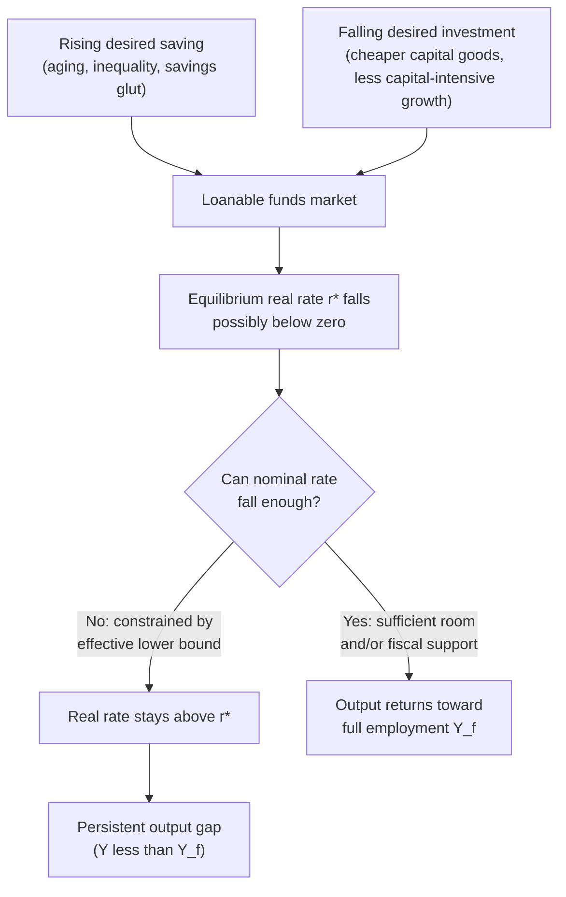

## Secular Stagnation Hypothesis

### Definition and Core Concept

The secular stagnation hypothesis holds that advanced economies can experience prolonged periods of weak growth, persistently low real interest rates, and insufficient aggregate demand, even absent a specific cyclical shock. "Secular" here means long-term or structural, as opposed to "cyclical" (short-run, self-correcting). The hypothesis argues that some economies face a chronic tendency toward excess desired saving relative to desired investment at any interest rate consistent with full employment, potentially requiring negative real interest rates to clear.

The term originates with Alvin Hansen (1938), who applied it to the U.S. economy during the Great Depression. It was revived and reformulated by Lawrence Summers beginning around 2013–2014 to explain the sluggish recovery after the 2008 global financial crisis.

### Historical Origins: Alvin Hansen (1938)

Hansen's original thesis, presented in his 1938 American Economic Association presidential address, argued that the U.S. faced a "chronic condition of underemployment" due to:

- **Population growth slowdown**: Falling birth rates reducing the need for new capital (housing, infrastructure) to accommodate a growing population.
- **Closing of the frontier**: Exhaustion of territorial expansion that had historically absorbed investment.
- **Declining rate of major technological discoveries**: Fewer capital-intensive inventions comparable to railroads.

Hansen predicted that without new outlets for investment, the U.S. economy would stagnate permanently. This prediction was widely seen as falsified by the post-WWII boom, which featured strong population growth (the Baby Boom), suburbanization, and a wave of technological and industrial expansion.

### The Summers Revival (2013–Present)

Lawrence Summers reintroduced the concept to explain why, after the 2008 financial crisis, developed economies exhibited:

- Growth well below pre-crisis trend even years into recovery.
- Persistently low inflation despite near-zero policy rates.
- Real interest rates trending downward for decades, with the equilibrium (or "natural") real rate — often denoted $r^*$ — apparently falling toward zero or below.
- Weak private investment despite low borrowing costs.
- Asset price booms (bubbles) as a symptom of insufficient safe, productive investment outlets.

Summers argued the core problem is a **structural excess of desired saving over desired investment**, meaning the interest rate needed to equate the two (the market-clearing real rate) may be negative. Since nominal interest rates are constrained by the **zero lower bound (ZLB)** (or an effective lower bound slightly below zero), central banks cannot always push real rates low enough via conventional policy to close this gap, leaving the economy chronically short of full employment.

### Theoretical Mechanism

**Key Points**

- In the simple loanable funds framework, the real interest rate ($r$) adjusts to equate desired saving ($S$) and desired investment ($I$):

$$S(r, Y) = I(r, Y)$$

- Secular stagnation posits a rightward shift in desired saving and/or a leftward shift in desired investment, such that the equilibrium $r^*$ that would clear the market at full-employment output ($Y_f$) falls below zero.
- If the effective lower bound on nominal rates is approximately zero (or slightly negative), and expected inflation is low, then the real policy rate cannot fall enough:

$$r_{min} = i_{min} - \pi^e$$

- With $i_{min} \approx 0$ and low $\pi^e$, $r_{min}$ stays above the required $r^*$, so the economy settles into an equilibrium with output below potential ($Y < Y_f$), i.e., a persistent output gap.

This is essentially a Keynesian, demand-side story: an aggregate demand shortfall becomes chronic rather than transitory because the interest-rate channel that would normally restore full employment is disabled by the lower bound.

### Proposed Causes of Excess Saving / Deficient Investment

**Demand-side and structural drivers cited in the literature:**

- **Demographic aging and slowing population growth**: Older populations and lower fertility reduce the need for new housing, schools, and infrastructure, and can increase aggregate saving (life-cycle saving for retirement) while reducing the labor force growth that drives investment demand.
- **Rising income inequality**: Higher-income households have a higher marginal propensity to save; if income shifts toward capital owners and top earners, aggregate consumption (demand) falls relative to income, raising desired saving.
- **Global savings glut**: A concept advanced by Ben Bernanke (2005) describing large current-account surpluses and reserve accumulation by countries such as China and oil exporters, pushing global saving upward and global real rates down.
- **Declining relative price of capital goods**: Technological progress (especially in IT) has lowered the cost of capital equipment, meaning a given amount of desired investment spending buys more capital, requiring less financing — reducing the flow demand for loanable funds even if capital stock growth is unchanged.
- **Shift toward less capital-intensive, "weightless" industries**: Software and services firms (e.g., large tech companies) require comparatively less physical capital investment relative to their market value or cash flow than industrial-era firms did.
- **Rising demand for safe assets**: Post-crisis regulatory changes and risk aversion increased demand for safe government bonds, depressing safe real yields independent of the marginal product of capital.
- **Slower productivity growth / weaker innovation-driven investment** (echoing Hansen's original "fewer great inventions" argument, though contested given digital-era innovation).

### Distinguishing Secular Stagnation from Related Concepts

| Concept | Core Claim | Key Proponent(s) |
| --- | --- | --- |
| Secular stagnation | Chronic demand deficiency; $r^*$ below the effective lower bound | Hansen (1938); Summers (2013–) |
| Liquidity trap | Short-run: monetary policy ineffective at ZLB because money and bonds are near-perfect substitutes | Keynes; Krugman (1998) |
| Global savings glut | Excess saving in specific surplus countries depresses global real rates | Bernanke (2005) |
| Balance sheet recession | Post-bubble private-sector deleveraging suppresses demand for a period, but is eventually self-correcting | Koo (2008) |
| Great Stagnation | Slowdown attributed to exhaustion of "low-hanging fruit" in innovation (supply-side) | Cowen (2011) |

Secular stagnation is distinguished from a liquidity trap or balance sheet recession primarily by its claimed **permanence**: it is not a temporary phase that resolves once balance sheets are repaired or a shock fades, but a structural feature of the economy going forward, absent policy intervention or a change in underlying drivers.

### Empirical Evidence Cited

**Supporting evidence:**

- Long-run decline in real interest rates across advanced economies over several decades, visible in both short-term policy rates and long-term government bond yields, predating the 2008 crisis and continuing after it.
- Sustained undershooting of inflation targets by major central banks (the Federal Reserve, ECB, Bank of Japan) in the 2010s despite near-zero or negative policy rates.
- Weak business fixed investment as a share of GDP in several advanced economies despite historically low financing costs.
- Japan's multi-decade experience since the 1990s, often cited as an early or extreme case of secular-stagnation-like dynamics (deflation, near-zero rates, weak growth).

**Countervailing evidence and critiques:**

- The post-2020 pandemic period saw a sharp rise in inflation and nominal/real interest rates across advanced economies, which some economists argue undermines the "permanently low $r^*$" narrative — though proponents note this may reflect temporary supply shocks and fiscal stimulus rather than a reversal of the underlying structural forces. [Inference]
- Estimating $r^*$ is model-dependent and subject to significant uncertainty; different estimation methodologies (e.g., Laubach-Williams models) produce materially different point estimates and confidence intervals. [Unverified regarding precise magnitude in any given period]
- Some economists (e.g., certain New Classical and real business cycle theorists) attribute persistent low growth to supply-side factors (structural productivity slowdown, demographics, regulation) rather than a demand-deficiency framework, sidestepping the loanable-funds mechanism Summers emphasizes entirely.

### Policy Implications

**Key Points**

- **Fiscal policy becomes the primary stabilization tool**, since conventional monetary policy is constrained by the effective lower bound. Summers has advocated for expansionary fiscal policy, particularly public infrastructure investment, arguing that at very low or negative real rates, the fiscal multiplier is large and government borrowing costs are minimal.
- **Higher inflation targets**: Raising the central bank's inflation target (e.g., from 2% to 3–4%) would allow more negative real rates at a given nominal lower bound, giving monetary policy more room to maneuver.
- **Unconventional monetary policy**: Quantitative easing, negative interest rate policy (NIRP), and forward guidance are tools used to push down longer-term or effectively negative real rates when the short-term policy rate is constrained.
- **Redistribution policies**: Since inequality is cited as a driver of excess saving, progressive taxation or transfers that shift income toward higher-marginal-propensity-to-consume households could raise aggregate demand.
- **Structural reforms to boost investment demand**: Policies encouraging private investment (e.g., in green energy transition, digital infrastructure) to absorb excess saving directly.

### Diagram: Loanable Funds Market Under Secular Stagnation

### Illustration: Interest Rate Determination (svg_diagram)

<svg xmlns="http://www.w3.org/2000/svg" viewBox="0 0 640 420">
<text x="320" y="28" text-anchor="middle" font-size="16" font-weight="bold" fill="#1a1a1a">Secular Stagnation in the Loanable Funds Market (svg_diagram)</text>

<line x1="80" y1="360" x2="580" y2="360" stroke="#333" stroke-width="2" />
<line x1="80" y1="360" x2="80" y2="50" stroke="#333" stroke-width="2" />
<text x="590" y="365" font-size="13" fill="#333">Quantity of Funds</text>
<text x="40" y="55" font-size="13" fill="#333">Real Rate (r)</text>

<path d="M 120 320 C 250 250, 400 150, 520 80" stroke="#2563eb" stroke-width="2.5" fill="none" />
<text x="525" y="78" font-size="12" fill="#2563eb">S (original)</text>

<path d="M 180 340 C 300 270, 430 170, 550 100" stroke="#1d4ed8" stroke-width="2.5" fill="none" stroke-dasharray="6,3" />
<text x="555" y="98" font-size="12" fill="#1d4ed8">S' (shifted, higher saving)</text>

<path d="M 520 320 C 400 260, 250 160, 130 90" stroke="#dc2626" stroke-width="2.5" fill="none" />
<text x="120" y="85" font-size="12" fill="#dc2626">I (original)</text>

<path d="M 440 340 C 330 280, 200 190, 110 130" stroke="#b91c1c" stroke-width="2.5" fill="none" stroke-dasharray="6,3" />
<text x="90" y="128" font-size="12" fill="#b91c1c">I' (shifted, lower investment)</text>

<line x1="80" y1="280" x2="580" y2="280" stroke="#666" stroke-width="1" stroke-dasharray="3,3" />
<text x="585" y="284" font-size="12" fill="#666">r = 0 (approx. lower bound)</text>

<circle cx="330" cy="200" r="5" fill="#111" />
<text x="335" y="195" font-size="11" fill="#111">Original equilibrium (r* &gt; 0)</text>

<circle cx="300" cy="310" r="5" fill="#111" />
<text x="200" y="330" font-size="11" fill="#111">New equilibrium requires r* &lt; 0</text>

<circle cx="300" cy="280" r="5" fill="#dc2626" />
<text x="200" y="270" font-size="11" fill="#dc2626">Actual rate stuck near zero</text>

<line x1="300" y1="280" x2="300" y2="310" stroke="#dc2626" stroke-width="2" marker-end="url(#arrow)" />
</svg>

### Critiques and Counterarguments

**Key Points**

- **Falsifiability concerns**: Critics note that Hansen's original 1938 prediction was overturned within a decade by unforeseen demographic and technological changes, raising the question of whether the modern version is similarly vulnerable to disconfirmation by future shifts (e.g., AI-driven investment booms). [Inference]
- **Alternative explanation — temporary balance sheet effects**: Economists such as Richard Koo argue that post-2008 weakness reflected private-sector deleveraging following a debt-fueled bubble, a self-limiting process rather than a permanent structural condition.
- **Measurement difficulty of $r^*$**: The natural rate of interest is unobservable and must be estimated via structural models, making the claim that $r^*$ is "below the lower bound" inherently model-dependent and contestable. [Unverified regarding exact magnitude]
- **Post-2021 inflation surge**: The return of above-target inflation and higher nominal/real yields in many advanced economies after 2021–2022 has been cited by some commentators as evidence against a permanently depressed $r^*$, though others argue this reflects supply shocks (pandemic, energy, geopolitical disruption) layered on top of the same underlying structural forces rather than their reversal. [Inference]

### Related Topics

- Zero lower bound (ZLB) and effective lower bound on nominal interest rates
- Natural rate of interest ($r^*$) and Laubach-Williams estimation models
- Liquidity trap theory (Keynes, Krugman)
- Global savings glut hypothesis (Bernanke, 2005)
- Balance sheet recession theory (Richard Koo)
- Unconventional monetary policy: quantitative easing, negative interest rate policy, forward guidance
- Fiscal multiplier theory and the case for infrastructure investment at low interest rates
- Demographic transition and its macroeconomic effects
- Income inequality and aggregate demand (Post-Keynesian and Neo-Kaleckian perspectives)
- Japan's "Lost Decades" as a case study
- Modern Monetary Theory (MMT) as an alternative policy response framework
- Great Stagnation hypothesis (Tyler Cowen) — supply-side innovation-slowdown counterpart