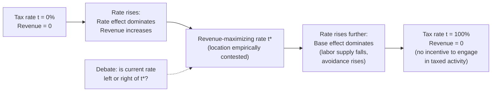

## Supply-Side Economics and Laffer Curve Debates

### Definition and Core Concept

Supply-side economics is a macroeconomic school of thought holding that economic growth is best stimulated by policies that increase the *supply* of goods and services — through incentives to work, save, and invest — rather than by managing aggregate demand. Its central policy prescriptions are lower marginal tax rates (especially on income, capital gains, and corporate profits), deregulation, and reduced government intervention in markets. The Laffer curve is the specific analytical device most associated with supply-side tax policy, depicting a hypothesized relationship between tax rates and total tax revenue collected.

Supply-side economics stands in explicit contrast to demand-side (Keynesian) approaches, which emphasize managing aggregate demand through fiscal and monetary policy to stabilize output and employment.

### Theoretical Foundations

**Key Points**

- **Incentive-based framework**: Supply-siders argue that high marginal tax rates distort the trade-off between labor/leisure and between consumption/saving, discouraging productive economic activity at the margin.
- **Say's Law influence**: Some supply-side thinking draws (loosely) on the classical idea that "supply creates its own demand" — i.e., production and income generation are the fundamental drivers of economic activity, with demand adjusting to match.
- **Emphasis on marginal rates, not average rates**: The theory focuses specifically on the tax rate applied to the *next* dollar earned, since this is what governs the decision to work an additional hour, take on an additional investment, or realize a capital gain.
- **Dynamic scoring**: Supply-side analysis argues that tax policy changes alter behavior (labor supply, investment, tax avoidance/evasion), and that revenue estimates should account for these behavioral responses rather than assuming a static tax base ("static scoring").

### The Laffer Curve

**Definition**: The Laffer curve is a stylized graph plotting tax revenue ($R$) on the vertical axis against the tax rate ($t$) on the horizontal axis, illustrating that revenue is zero at a 0% tax rate (no tax collected) and zero at a 100% tax rate (no incentive to engage in taxed activity, assuming full compliance), with revenue rising and then falling as rates increase from 0 to 100%, implying some revenue-maximizing rate $t^*$ in between.

**Formal Characterization**

$$R(t) = t \times B(t)$$

where $R$ is tax revenue, $t$ is the tax rate, and $B(t)$ is the tax base (total taxable economic activity), which itself is assumed to shrink as $t$ rises due to behavioral responses (reduced labor supply, reduced investment, increased avoidance/evasion, or relocation of economic activity).

- At low $t$, the direct "rate effect" ($t$ rising) dominates, and revenue increases with the rate.
- Beyond some threshold $t^*$, the "base effect" ($B(t)$ shrinking) dominates, and further rate increases reduce total revenue.
- $\dfrac{dR}{dt} = B(t) + t \cdot B'(t)$; the revenue-maximizing rate occurs where this derivative equals zero.

**Key Points**

- The curve's basic shape (revenue = 0 at both endpoints) is a mathematical near-truism, not itself a controversial empirical claim.
- The genuinely contested empirical question is **where** an economy's current tax rate sits relative to $t^*$ — i.e., whether current rates are on the "normal" (upward-sloping) side, where cutting rates *reduces* revenue, or the "prohibitive" (downward-sloping) side, where cutting rates *increases* revenue.
- The curve does not specify a single universal shape or peak; the location and height of $t^*$ depends on the tax type, the elasticity of the taxed activity, enforcement, the time horizon, and the broader tax system.

### Origin and Popularization

The curve is named for economist Arthur Laffer, who popularized the concept in a widely told (and only partly verified) 1974 anecdote involving a napkin sketch during a dinner meeting with Reagan administration officials Dick Cheney and Donald Rumsfeld. Laffer himself noted the underlying idea predates him, tracing informally to thinkers such as Ibn Khaldun (14th century) and John Maynard Keynes, who had both noted that very high tax rates can be self-defeating.

The concept became central to U.S. political discourse in the late 1970s and 1980s, informing the tax-cut agenda of the Reagan administration (the Economic Recovery Tax Act of 1981), which substantially reduced top marginal income tax rates.

### Elasticity of Taxable Income (ETI): The Modern Empirical Framework

**Key Points**

- Contemporary public finance economists analyze Laffer-curve questions primarily through the **elasticity of taxable income (ETI)** — the percentage change in reported taxable income in response to a percentage change in the net-of-tax rate ($1-t$).
- The revenue-maximizing top tax rate under a simplified model (assuming a Pareto-distributed income tail) can be approximated as:

$$t^* = \frac{1}{1 + a \cdot e}$$

where $a$ is a parameter describing the shape of the income distribution (the Pareto parameter) and $e$ is the ETI.

- Empirical ETI estimates vary substantially by country, income group, and time period, and are sensitive to whether the response reflects genuine changes in labor supply/investment or merely income shifting/avoidance (e.g., timing of capital gains realizations, reclassification of income between individual and corporate forms). [Unverified regarding a single universal ETI value]
- Higher estimated ETI implies a lower revenue-maximizing rate $t^*$; most empirical estimates for the U.S. and similar economies place the revenue-maximizing top rate considerably higher than the low rates sometimes implied in popular supply-side rhetoric, though estimates differ across studies. [Unverified regarding precise magnitude — highly study-dependent]

### Empirical Evidence and the 1980s Test Case

**Arguments supporting supply-side effects:**

- Following the 1981 and 1986 U.S. tax cuts, reported taxable income among top earners rose, and the share of income tax paid by top-income households increased over the subsequent years — cited by proponents as evidence that lower rates broadened the effective tax base.
- Cross-country and cross-time studies find some responsiveness of high-income taxpayers' reported income to marginal rate changes, supporting a non-zero, real ETI. [Inference regarding the strength/consistency of this effect across studies]

**Arguments against strong Laffer effects at observed U.S. rates:**

- Most economists who have studied the 1980s tax cuts — across a wide range of political perspectives — conclude that federal revenue fell (relative to what it otherwise would have been) following the major rate reductions, implying the U.S. was on the *upward-sloping* portion of the curve, not the prohibitive region. [Inference; treated as a broad professional consensus rather than a universally unanimous finding]
- The rise in top-earners' reported income share after the 1980s cuts is attributed by many economists substantially to reduced income-shifting/avoidance behavior (e.g., less use of tax shelters, more income reported as individual rather than corporate income) rather than genuine increases in labor supply or output — meaning taxable income rose without a proportional rise in real economic activity. [Inference]
- Estimates commonly cited in the professional public finance literature put the U.S. revenue-maximizing top marginal rate meaningfully above rates actually in effect for most of the post-1980s period, implying cuts below that point reduce revenue. [Unverified regarding an exact consensus figure; estimates vary by study and assumptions]

### Distinguishing Static vs. Dynamic Scoring

| Approach | Method | Typical User |
| --- | --- | --- |
| Static scoring | Assumes no behavioral change in the tax base when rates change | Historically CBO/JCT baseline approach for most provisions |
| Dynamic scoring | Incorporates estimated behavioral and macroeconomic feedback effects (labor supply, investment, growth) into revenue projections | Increasingly used for major reforms; central to supply-side revenue arguments |

**Key Points**

- Dynamic scoring is not itself synonymous with supply-side ideology — it is a modeling choice that can show revenue effects larger or smaller than static estimates depending on assumed elasticities.
- The debate over which score is more accurate hinges on empirically contested elasticity parameters (labor supply elasticity, investment responsiveness, ETI), not on the validity of dynamic modeling as a method per se.

### Supply-Side Policy Toolkit Beyond Tax Cuts

- **Capital gains and corporate tax reduction**: Intended to lower the cost of capital and encourage investment and entrepreneurship.
- **Deregulation**: Reducing compliance costs and barriers to entry, intended to increase the responsiveness of supply (business formation, labor market flexibility).
- **Reduced government spending as a share of GDP**: Some supply-side proponents pair tax cuts with spending restraint to avoid deficit-driven crowding out of private investment; others (particularly in more populist strands) emphasize tax cuts without matching spending reductions.
- **Depreciation and investment incentives**: Accelerated depreciation schedules and investment tax credits to directly lower the after-tax cost of capital expenditure.

### Diagram: Laffer Curve Shape and Revenue-Maximizing Rate

### Illustration: The Laffer Curve (svg_diagram)

<svg xmlns="http://www.w3.org/2000/svg" viewBox="0 0 640 400">
<text x="320" y="26" text-anchor="middle" font-size="16" font-weight="bold" fill="#1a1a1a">The Laffer Curve (svg_diagram)</text>

<line x1="80" y1="340" x2="580" y2="340" stroke="#333" stroke-width="2" />
<line x1="80" y1="340" x2="80" y2="60" stroke="#333" stroke-width="2" />
<text x="585" y="345" font-size="13" fill="#333">Tax Rate (t)</text>
<text x="30" y="55" font-size="13" fill="#333">Revenue (R)</text>

<text x="80" y="360" font-size="12" fill="#333">0%</text>

<text x="565" y="360" font-size="12" fill="#333">100%</text>

<path d="M 80 340 C 200 140, 400 140, 580 340" stroke="#7c3aed" stroke-width="3" fill="none" />

<circle cx="330" cy="165" r="5" fill="#111" />
<line x1="330" y1="165" x2="330" y2="340" stroke="#666" stroke-width="1" stroke-dasharray="4,3" />
<text x="335" y="160" font-size="12" fill="#111">t* (revenue-maximizing rate)</text>
<text x="300" y="360" font-size="11" fill="#333">t*</text>

<text x="140" y="250" font-size="11" fill="`#2563eb`">"Normal" region:</text>

<text x="140" y="265" font-size="11" fill="`#2563eb`">cutting rate → revenue falls</text>

<text x="410" y="250" font-size="11" fill="`#dc2626`">"Prohibitive" region:</text>

<text x="410" y="265" font-size="11" fill="`#dc2626`">cutting rate → revenue rises</text>

<circle cx="230" cy="220" r="5" fill="#059669" />
<text x="150" y="200" font-size="11" fill="#059669">Most economists: observed U.S.</text>
<text x="150" y="213" font-size="11" fill="#059669">top rates historically sit here</text>
</svg>

### Critiques of Supply-Side Economics

**Key Points**

- **"Starve the beast" critique**: Critics argue that in practice, tax cuts justified by supply-side/Laffer logic have often been followed by rising deficits rather than the promised revenue neutrality or surplus, requiring either spending cuts (rarely fully realized) or increased borrowing.
- **Distributional concerns**: Because supply-side tax cuts typically target high marginal rates (which apply most to high earners and capital income), critics argue the approach disproportionately benefits upper-income households, a concern distinct from the revenue question itself.
- **"Trickle-down" characterization**: A frequently used critical label suggesting that benefits to investors and high earners are assumed, rather than demonstrated, to flow through to broader wage and employment gains; proponents dispute this framing as a mischaracterization of the underlying incentive-based mechanism.
- **Overreach in political messaging**: Economists across the spectrum, including some who supported elements of 1980s tax reform, have distinguished between the modest, well-supported claim that *very high* rates can be counterproductive at the margin, and the stronger, more contested political claim that *most or all* observed tax cuts pay for themselves — a distinction often blurred in public debate. [Inference regarding how this distinction is typically characterized in the literature]

### Related Topics

- Elasticity of taxable income (ETI) estimation methods
- Dynamic scoring vs. static scoring in fiscal policy analysis
- Reaganomics and the Economic Recovery Tax Act of 1981
- Say's Law and classical macroeconomic theory
- Optimal taxation theory (Mirrlees framework)
- Corporate tax incidence and capital mobility
- Crowding out and the government budget constraint
- Kansas tax cut experiment (2012–2017) as a state-level case study
- Tax Cuts and Jobs Act of 2017 revenue debates
- Comparison with demand-side (Keynesian) fiscal stimulus theory