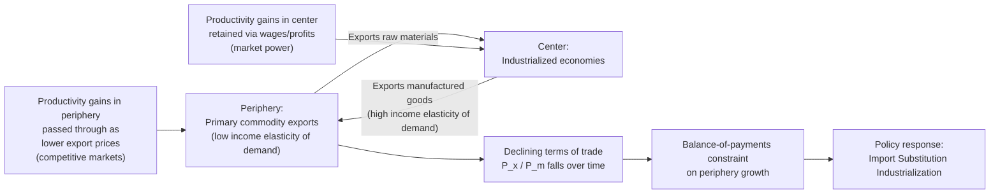

## Structuralist and Dependency Approaches to Development Macroeconomics

### Definition and Core Concept

Structuralist and dependency approaches form a family of heterodox development economics theories that explain persistent underdevelopment in peripheral (developing) economies as arising from structural rigidities, sectoral imbalances, and asymmetric positions within the international economic system, rather than from temporary market disequilibria correctable by price adjustment alone. These approaches emerged primarily in Latin America from the 1940s through the 1970s, in explicit contrast to neoclassical trade theory, which predicted that free trade and comparative advantage would allow all participating economies to converge toward prosperity.

**Structuralism** focuses on rigidities internal to developing economies (sectoral bottlenecks, institutional constraints, terms-of-trade dynamics) that prevent standard market-clearing adjustment. **Dependency theory** extends this by emphasizing that these rigidities are themselves produced and reinforced by the peripheral economy's structural position relative to industrialized "core" economies within the global capitalist system.

### Historical Origins: ECLA and Raúl Prebisch

The foundational institution is the **Economic Commission for Latin America (ECLA/CEPAL)**, established by the United Nations in 1948, under the intellectual leadership of Argentine economist **Raúl Prebisch**. Prebisch, alongside German economist Hans Singer working independently, articulated what became known as the **Prebisch-Singer hypothesis**.

**Key Points**

- Prebisch divided the world economy into a **"center"** (industrialized nations exporting manufactured goods) and a **"periphery"** (primary-commodity-exporting developing nations).
- The Prebisch-Singer hypothesis holds that the **terms of trade** (the ratio of export prices to import prices) for primary-commodity exporters tend to *decline* over the long run relative to manufactured-goods exporters, meaning peripheral economies must export ever-larger quantities of raw materials to purchase the same quantity of manufactured imports.
- Proposed mechanisms behind this declining terms-of-trade trend include:
  - Low income elasticity of demand for primary commodities (Engel's Law effects) versus higher income elasticity for manufactured goods, meaning global demand growth favors manufactures as incomes rise.
  - Asymmetric market structures: labor markets and firms in the industrialized center have more market power (unions, oligopolistic firms) to capture productivity gains as higher wages/profits, whereas competitive, often informal-labor-intensive periphery commodity sectors pass productivity gains through as *lower prices*.
  - Technological change historically concentrated in the center, with productivity gains there being retained rather than transmitted internationally through falling export prices.

$$\text{Terms of trade} = \frac{P_x}{P_m}$$

where $P_x$ is the export price index and $P_m$ is the import price index; the hypothesis predicts a secular downward trend in this ratio for periphery commodity exporters.

### Structuralist Diagnosis of Underdevelopment

**Key Points**

- **Structural heterogeneity**: Developing economies are characterized by a dualistic structure — a small, modern, capital-intensive export or urban sector coexisting with a large, low-productivity traditional or informal sector — rather than a single homogeneous market that adjusts smoothly to price signals.
- **Sectoral bottlenecks and rigid supply**: Structuralists argue that supply in key sectors (agriculture, foreign exchange, certain industrial inputs) responds sluggishly to price incentives due to institutional, infrastructural, or land-tenure constraints, meaning demand-side expansion can generate inflation or balance-of-payments crises rather than pure output growth.
- **Structural inflation**: A specific structuralist contribution (associated with economists such as Juan Noyola and Osvaldo Sunkel) holding that inflation in developing economies often originates from structural bottlenecks (e.g., inelastic food supply, foreign exchange scarcity) that get validated and propagated through accommodating monetary policy, wage indexation, and sectoral conflict over income shares — a fundamentally different inflationary mechanism than the demand-pull or cost-push stories emphasized in standard developed-economy macroeconomics.
- **Balance-of-payments constraint**: Because periphery economies depend on primary-commodity export earnings to finance manufactured imports (including capital goods needed for industrialization), foreign exchange availability becomes a binding constraint on growth, distinct from the standard closed-economy view of growth as bounded mainly by domestic saving.

### Import Substitution Industrialization (ISI)

The primary policy prescription flowing from structuralist analysis was **import substitution industrialization (ISI)**: the deliberate promotion of domestic manufacturing to replace imported manufactured goods, using tools such as:

- Tariff and non-tariff protection for infant domestic industries.
- Overvalued exchange rates to cheapen imported capital goods needed for industrialization (while implicitly taxing traditional export sectors).
- State-directed credit allocation and public investment in strategic industries.
- Multiple/differentiated exchange rate regimes favoring industrial inputs over consumer imports.

**Rationale**: If left to market forces alone, structuralists argued, peripheral economies would remain locked into low-value-added primary commodity export specialization due to the declining terms of trade and the center's head start in industrial capacity — a self-reinforcing pattern rather than a transitional stage that free trade would naturally resolve.

**Key Points — outcomes and critiques of ISI**

- ISI produced substantial manufacturing sector growth in several Latin American economies (notably Brazil, Argentina, Mexico) during the mid-20th century. [Inference regarding magnitude/attribution, though broadly documented]
- Critics (including many neoclassical and later some structuralist-sympathetic economists) point to recurring problems: chronic balance-of-payments crises as import needs for capital goods and intermediate inputs persisted even as consumer-goods imports fell; inefficient, uncompetitive protected industries that struggled to reach export-competitive scale; fiscal strain from subsidies and state-owned enterprises; and rent-seeking associated with import licensing and protection.
- The debt crises of the 1980s in Latin America (the "Lost Decade") are widely cited as marking the practical collapse of ISI as a dominant development strategy, followed by a shift toward outward-oriented, export-promotion and liberalization policies associated with the Washington Consensus. [Inference regarding causal weighting among multiple contributing factors]

### Dependency Theory

Dependency theory, associated with economists and social scientists such as **Andre Gunder Frank**, **Fernando Henrique Cardoso**, **Theotonio dos Santos**, and (in its world-systems variant) **Immanuel Wallerstein**, extends structuralist analysis into a more explicitly political-economic and, in some strands, Marxian framework.

**Core claims:**

- **Underdevelopment is produced, not merely a starting condition**: Frank's influential formulation described peripheral underdevelopment as actively generated by, and integral to, the historical development of the center — a relationship of exploitation via colonial and post-colonial trade and investment patterns, not simply a lag to be closed through catch-up growth.
- **Surplus extraction / unequal exchange**: Value produced in the periphery (through labor, resource extraction) is argued to flow toward the center through mechanisms such as repatriated profits from foreign-owned enterprises, unequal terms of trade, and debt service, structurally limiting periphery capital accumulation.
- **Comprador and dependent elites**: Some dependency theorists emphasize that local elites in peripheral economies often have interests aligned with foreign capital (as intermediaries, exporters, or local partners of multinational firms) rather than with broad-based domestic industrialization, reinforcing dependent structures politically as well as economically.
- **World-systems variant (Wallerstein)**: Recasts the center-periphery relationship as a single integrated global capitalist system with a further intermediate "semi-periphery" category, analyzing long-run cycles of hegemony and structural position rather than nation-by-nation development trajectories.

### Distinguishing Structuralism from Dependency Theory

| Dimension | Structuralism (ECLA/Prebisch) | Dependency Theory (Frank, Wallerstein) |
| --- | --- | --- |
| Core diagnosis | Sectoral/institutional rigidities and terms-of-trade decline | Systemic exploitation embedded in global capitalism |
| Policy stance | Reformist: ISI, state planning within existing system | Often more radical: structural delinking, or socialist transformation in some strands |
| Disciplinary roots | Development economics, applied trade/macro theory | Political economy, sociology, world-systems theory |
| View of catch-up growth | Possible with correct industrial policy | Some strands (Frank) view it as structurally blocked without systemic change; others (Cardoso's "dependent development") allow for growth *within* dependency |

**Key Points**

- Not all dependency theorists share a single policy conclusion; Cardoso and Faletto's "dependent development" thesis, for instance, argued that significant industrialization *could* occur within a dependent relationship (as seen in Brazil's mid-century growth), complicating simpler "dependency blocks all growth" readings of the theory.
- Structuralism is generally regarded as more empirically and policy-oriented within mainstream development economics, whereas dependency theory (especially Frank's version) is more often discussed as a broader political-economic and historical-sociological framework, with more contested standing among mainstream economists. [Inference regarding relative disciplinary reception]

### Empirical Assessment and Later Developments

**Evidence and critiques:**

- Empirical tests of the Prebisch-Singer hypothesis using long-run commodity price data have produced mixed results across time periods and commodity baskets; some studies find supporting evidence of a long-run declining trend in real commodity prices relative to manufactures, while others find the relationship period-dependent, sensitive to the specific price indices and time spans used, and not universal across all commodity categories. [Unverified regarding a single definitive empirical verdict]
- The rapid growth of several East Asian economies (South Korea, Taiwan, Singapore) using export-oriented (rather than purely import-substituting) industrial policy from the 1960s onward is frequently cited as a counter-case complicating strong dependency-theory claims that peripheral status structurally forecloses industrialization — though some scholars, including certain structuralist-influenced economists, argue these cases still involved substantial state-directed industrial policy consistent with structuralist (if not classic ISI) principles, blurring a simple dependency-versus-market dichotomy. [Inference]
- **Neo-structuralism**, emerging from the 1990s (associated with ECLA/CEPAL economists such as Osvaldo Sunkel), represents an updated version accepting greater trade openness while retaining an emphasis on active industrial policy, technology upgrading, and addressing structural heterogeneity — an attempt to reconcile core structuralist insights with the post-ISI global trading environment.
- Contemporary **new structural economics** (associated with Justin Yifu Lin) revives structuralist attention to sectoral structure and comparative advantage evolution, but argues development strategy should align with, rather than defy, an economy's evolving factor endowments — a notable departure from classic ISI's defiance of static comparative advantage.

### Diagram: Center-Periphery Trade Relationship

### Illustration: Declining Terms of Trade (svg_diagram)

<svg xmlns="http://www.w3.org/2000/svg" viewBox="0 0 640 380">
<text x="320" y="26" text-anchor="middle" font-size="16" font-weight="bold" fill="#1a1a1a">Prebisch-Singer Terms of Trade Hypothesis (svg_diagram)</text>

<line x1="80" y1="320" x2="580" y2="320" stroke="#333" stroke-width="2" />
<line x1="80" y1="320" x2="80" y2="60" stroke="#333" stroke-width="2" />
<text x="585" y="325" font-size="13" fill="#333">Time</text>
<text x="20" y="55" font-size="13" fill="#333">Terms of Trade (Px/Pm)</text>

<path d="M 100 120 C 220 150, 350 210, 560 280" stroke="#dc2626" stroke-width="3" fill="none" />
<text x="420" y="270" font-size="12" fill="#dc2626">Periphery (commodity exporters)</text>

<path d="M 100 100 C 180 130, 260 90, 340 150 S 480 200, 560 240" stroke="#f87171" stroke-width="1.5" fill="none" stroke-dasharray="3,3" />
<path d="M 100 140 C 180 170, 260 190, 340 230 S 480 260, 560 300" stroke="#f87171" stroke-width="1.5" fill="none" stroke-dasharray="3,3" />

<line x1="100" y1="200" x2="560" y2="160" stroke="#2563eb" stroke-width="3" />
<text x="420" y="150" font-size="12" fill="#2563eb">Center (manufactures exporters)</text>

<text x="100" y="340" font-size="11" fill="#333">1900s</text>

<text x="520" y="340" font-size="11" fill="#333">Present</text>

</svg>

### Related Topics

- Prebisch-Singer hypothesis and long-run commodity price data
- Import substitution industrialization (ISI): case studies (Brazil, Argentina, Mexico, India)
- Dual economy models and the Lewis model of development
- World-systems theory (Wallerstein) and core-periphery-semiperiphery framework
- Washington Consensus and structural adjustment programs
- East Asian export-oriented industrialization and developmental state theory
- Neo-structuralism and ECLA/CEPAL policy evolution
- New structural economics (Justin Yifu Lin)
- Terms-of-trade shocks and commodity-dependent economy vulnerability
- Balance-of-payments-constrained growth models (Thirlwall's Law)