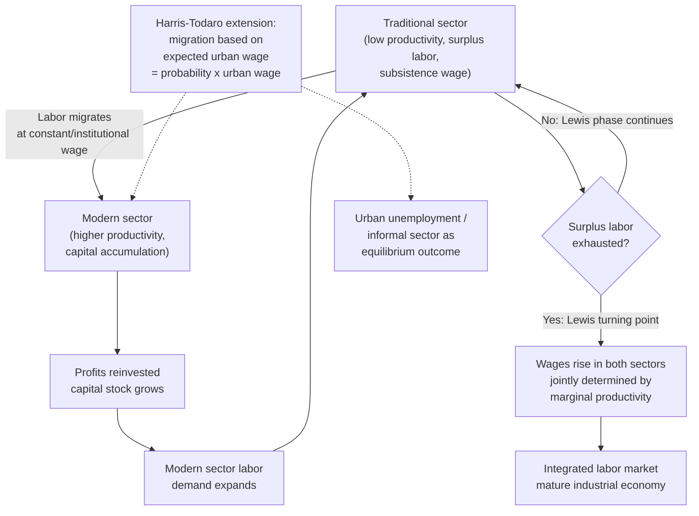

## Dual Economy Models and Structural Transformation

### Definition and Core Concept

Dual economy models analyze developing economies as consisting of two structurally distinct sectors — typically a low-productivity **traditional (subsistence/agricultural)** sector and a higher-productivity **modern (industrial/capitalist)** sector — that coexist with different technologies, wage-setting mechanisms, and labor market behavior. **Structural transformation** refers to the long-run process by which an economy's output and employment shift progressively from the traditional sector toward the modern sector, typically accompanied by rising average productivity, urbanization, and a changing sectoral composition of GDP (agriculture → industry → services).

These models sit within development macroeconomics as an attempt to explain why standard single-sector growth theory (e.g., Solow-type models) fits developing economies poorly, given the coexistence of vastly different productivity levels, wage-setting institutions, and labor absorption capacities within the same economy.

### The Lewis Model (1954)

The foundational dual economy model is due to **W. Arthur Lewis** ("Economic Development with Unlimited Supplies of Labor," 1954), for which Lewis later received the Nobel Prize in Economics (1979).

**Key Assumptions**

- The traditional sector has an effectively **unlimited (perfectly elastic) supply of labor** at a subsistence wage, because marginal product of labor in traditional agriculture is assumed to be very low or even near zero (disguised unemployment/underemployment) due to labor's abundance relative to fixed land.
- The modern sector can hire additional labor from this reserve at a constant institutional wage set modestly above the subsistence wage (often modeled as subsistence wage plus a fixed premium, e.g., 30%, to compensate for the cost/risk of migration and urban living).
- Modern-sector capitalists reinvest all profits into expanding capital stock, since labor costs are held down by the elastic labor supply, generating a growing capital-labor ratio and rising output in the modern sector.

**Formal Structure**

Modern sector output is a function of capital and labor:

$$Y_M = F(K_M, L_M)$$

with labor hired up to the point where the marginal product of labor equals the institutional wage $\bar{w}$:

$$\frac{\partial Y_M}{\partial L_M} = \bar{w}$$

Because $\bar{w}$ is held roughly constant (as long as surplus labor remains in the traditional sector), all profits ($Y_M - \bar{w}L_M$) are reinvested, capital stock $K_M$ grows, the marginal product of labor curve shifts outward, and modern-sector employment $L_M$ expands — continuously drawing labor out of the traditional sector at a constant wage.

**The Lewis Turning Point**

Structural transformation proceeds until the traditional sector's labor surplus is exhausted — the **Lewis turning point** — after which further modern-sector labor demand must bid the wage up above the subsistence-plus-premium level, since the traditional sector's marginal product of labor is no longer near zero. Beyond this point, wages in both sectors begin rising together, and the economy transitions toward a single, integrated labor market characteristic of more mature industrial economies.

### Extensions: The Ranis-Fei Model (1961)

**Gustav Ranis and John Fei** formalized and extended Lewis's framework, adding explicit attention to agricultural sector dynamics:

**Key Points**

- Divided the transition into three phases: (1) disguised unemployment with zero marginal product of labor in agriculture; (2) a phase where marginal product is positive but below the institutional wage, so labor still migrates at a constant wage; (3) the commercialization point, where agriculture becomes a fully commercialized market sector and both sectors' wages are jointly determined by marginal productivity.
- Emphasized that **agricultural productivity growth is a precondition for successful structural transformation**: if agricultural output per remaining worker does not rise as labor exits agriculture, food supply to the growing urban/modern sector can become a binding constraint, potentially reversing or stalling the terms of trade between sectors and constraining modern-sector real wages.
- This "food constraint" insight links the Lewis-Ranis-Fei framework to structuralist concerns about sectoral supply rigidities limiting growth even when demand-side conditions are favorable.

### The Harris-Todaro Model (1970)

**John Harris and Michael Todaro** addressed a puzzle the basic Lewis model did not explain well: persistently high **urban unemployment** despite ostensibly unlimited rural labor supply and rural-to-urban migration.

**Key Mechanism**

- Migration decisions are modeled as based on **expected** urban income, not the actual urban wage, since a migrant may arrive in the city and remain unemployed for some period before securing a modern-sector job.
- Expected urban wage is modeled as:

$$w_u^e = p \cdot w_u$$

where $w_u$ is the fixed (often government-set or union-negotiated) urban modern-sector wage and $p$ is the probability of obtaining a modern-sector job (often approximated as the ratio of modern-sector employment to total urban labor force).

- Migration continues as long as expected urban income exceeds the rural wage $w_r$:

$$w_u^e > w_r \quad \Rightarrow \quad \text{migration continues}$$

- Equilibrium is reached when expected incomes are equalized across rural and urban areas:

$$p \cdot w_u = w_r$$

**Key Points**

- This framework explains a **paradox**: urban unemployment can coexist with continued rural-to-urban migration in equilibrium, because migrants rationally weigh a chance at a high-wage formal job against a lower but certain rural wage.
- It generates the influential result that policies raising the urban modern-sector wage (e.g., minimum wage laws, or job-creation programs) without addressing job-creation probability can *increase* urban unemployment, by drawing in migrants faster than modern-sector job growth absorbs them — a widely cited caution against simple urban wage or employment-guarantee interventions in this literature. [Inference regarding the strength/generality of this policy implication across empirical contexts]
- The **urban informal sector** in this framework functions partly as a waiting-room/holding-pattern for migrants seeking eventual formal employment, rather than as a stable equilibrium destination.

### Structural Transformation: Empirical Patterns

**Key Points**

- The stylized empirical pattern of structural transformation — falling agricultural employment/output shares, rising industrial then services shares, and continuous rural-to-urban migration and urbanization — is well documented across a broad range of countries over their development histories (associated with the work of economists such as Hollis Chenery and, more recently, Dani Rodrik on "premature deindustrialization"). [Inference regarding the exact universality of the pattern's timing across all economies]
- **Premature deindustrialization**: A more recent empirical concern (Rodrik) that many contemporary developing economies are seeing manufacturing employment/output shares peak and decline at much lower per-capita income levels than the historical experience of early industrializers, potentially truncating the traditional Lewis-style route to development via labor-intensive manufacturing absorption. [Unverified regarding precise causal mechanisms — attributed variously to automation, trade competition from China, and services-sector productivity dynamics]
- Structural transformation is generally correlated with aggregate productivity growth because labor moves from lower-productivity (traditional) to higher-productivity (modern) activities — a "structural change bonus" distinct from within-sector productivity improvement, and separately measurable in growth decomposition exercises.

### Comparison of Dual Economy Model Variants

| Model | Key Innovation | Central Mechanism | Main Limitation Addressed |
| --- | --- | --- | --- |
| Lewis (1954) | Unlimited labor supply, constant institutional wage | Profit reinvestment drives capital growth and labor absorption | Explains sustained modern-sector capital accumulation |
| Ranis-Fei (1961) | Agricultural productivity dynamics, phased transition | Food supply/terms-of-trade constraint on transformation | Addresses agricultural sector neglect in original Lewis model |
| Harris-Todaro (1970) | Migration based on expected, not actual, wage | Urban unemployment as rational equilibrium outcome | Explains coexistence of migration and urban unemployment |

### Critiques and Limitations

**Key Points**

- **Zero marginal product of labor assumption challenged**: Empirical studies of traditional agriculture have frequently found marginal product of labor to be positive, not zero or near-zero, casting doubt on the "unlimited supply" premise in its strictest form; more moderate versions of the model (positive but low marginal product, i.e., disguised underemployment rather than true zero marginal product) are generally seen as more empirically defensible. [Inference regarding the balance of empirical findings across contexts]
- **Neglect of human capital and skills mismatch**: Basic dual economy models treat labor as largely homogeneous and interchangeable between sectors, understating the role of education, skills, and sector-specific human capital in constraining actual labor mobility and modern-sector absorption capacity.
- **Static institutional wage assumption**: The assumption of a constant modern-sector wage independent of modern-sector labor demand has been challenged as an oversimplification, particularly where labor unions, minimum wage laws, or efficiency-wage considerations create more complex wage dynamics than a fixed markup over subsistence.
- **Informal sector complexity**: Later research has emphasized that the "modern vs. traditional" or "formal vs. informal" divide is often more nuanced than a clean two-sector split, with substantial heterogeneity, mobility, and blurred boundaries within what these models treat as a single "traditional" or "informal" category.

### Diagram: Structural Transformation Process

### Illustration: Lewis Model Wage-Employment Dynamics (svg_diagram)

<svg xmlns="http://www.w3.org/2000/svg" viewBox="0 0 640 420">
<text x="320" y="26" text-anchor="middle" font-size="16" font-weight="bold" fill="#1a1a1a">Lewis Model: Modern Sector Labor Absorption (svg_diagram)</text>
<line x1="80" y1="360" x2="580" y2="360" stroke="#333" stroke-width="2" />
<line x1="80" y1="360" x2="80" y2="60" stroke="#333" stroke-width="2" />
<text x="590" y="365" font-size="13" fill="#333">Modern Sector Employment (L_M)</text>
<text x="20" y="55" font-size="13" fill="#333">Wage / MPL</text>
<line x1="80" y1="280" x2="480" y2="280" stroke="#2563eb" stroke-width="3" />
<text x="490" y="284" font-size="12" fill="#2563eb">Institutional wage (w-bar)</text>
<path d="M 480 280 C 520 250, 550 200, 580 150" stroke="#2563eb" stroke-width="3" stroke-dasharray="6,3" />
<path d="M 100 100 C 200 180, 300 250, 400 280" stroke="#dc2626" stroke-width="2.5" fill="none" />
<text x="105" y="95" font-size="11" fill="#dc2626">MPL curve (K1)</text>
<path d="M 200 100 C 300 180, 400 250, 500 280" stroke="#f87171" stroke-width="2.5" fill="none" stroke-dasharray="5,3" />
<text x="440" y="230" font-size="11" fill="#f87171">MPL curve (K2, after reinvestment)</text>
<circle cx="480" cy="280" r="5" fill="#111" />
<line x1="480" y1="280" x2="480" y2="360" stroke="#666" stroke-width="1" stroke-dasharray="3,3" />
<text x="420" y="378" font-size="11" fill="#111">Lewis turning point</text>
<line x1="240" y1="300" x2="380" y2="300" stroke="#059669" stroke-width="2" marker-end="url(#arrowL)" />
<text x="245" y="315" font-size="11" fill="#059669">Labor absorbed as capital grows</text>
</svg>

### Related Topics

- Prebisch-Singer hypothesis and structuralist trade theory
- Import substitution industrialization (ISI)
- Solow growth model as the single-sector baseline contrast
- Premature deindustrialization (Dani Rodrik)
- Informal sector economics and urban labor markets
- Rural-urban migration theory beyond Harris-Todaro (e.g., Todaro's later refinements)
- Green Revolution and agricultural productivity growth
- Growth decomposition and structural change ("structural change bonus")
- East Asian export-led industrialization as a structural transformation case study
- Human capital theory and skills mismatch in labor mobility