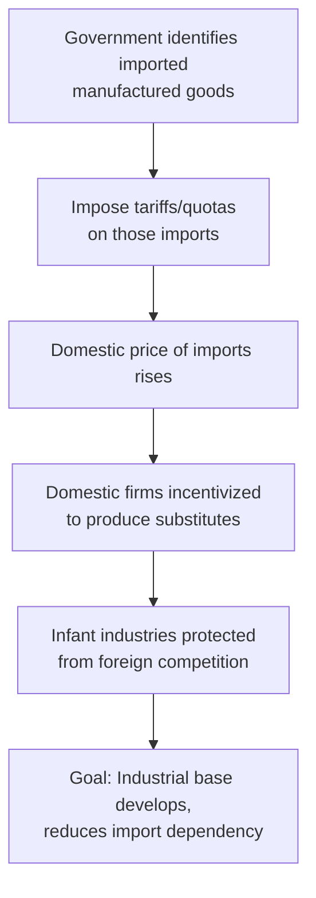
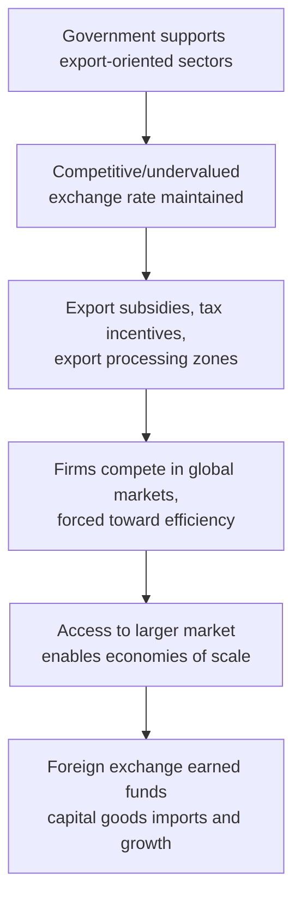

## Import Substitution Versus Export-Led Growth Strategies

### Overview

Import Substitution Industrialization (ISI) and Export-Led Growth (ELG) represent two competing development macroeconomic strategies concerning how developing economies should structure trade and industrial policy to achieve sustained growth. ISI emphasizes domestic production to replace imports behind protective barriers; ELG emphasizes producing for global markets to exploit comparative advantage and scale economies. Most real-world development paths involve elements of both, but they represent distinct theoretical and historical policy paradigms.

### Import Substitution Industrialization (ISI)

#### Definition and Core Logic

ISI is a development strategy in which a country deliberately protects domestic industries — typically through tariffs, import quotas, exchange controls, and subsidies — to replace previously imported manufactured goods with domestically produced substitutes.

**Key Points**

- Rooted in **Structuralist economics**, particularly the work of Raúl Prebisch and Hans Singer at the UN Economic Commission for Latin America (ECLA/CEPAL) in the 1950s.
- Built on the **Prebisch-Singer hypothesis**: the claim that the terms of trade for primary commodity exporters tend to deteriorate over time relative to manufactured goods, disadvantaging countries that specialize in raw material exports.
- Associated with **dependency theory**, which frames the global economy as structured into a "core" (industrialized nations) and "periphery" (commodity-exporting nations), with the periphery structurally disadvantaged by this arrangement.

#### Mechanism

#### Theoretical Justification: The Infant Industry Argument

The **infant industry argument**, tracing back to Alexander Hamilton and Friedrich List in the 19th century, holds that new domestic industries in developing economies cannot initially compete with established foreign firms that benefit from economies of scale, accumulated technological know-how, and mature supply chains. Temporary protection, the argument holds, allows domestic firms time to achieve competitive scale and productivity before being exposed to full international competition.

$$\text{Domestic Cost of Production (Year } t) > \text{World Price}, \quad \text{but } \frac{\partial \text{Cost}}{\partial t} < 0 \text{ under protection with learning effects}$$

#### Typical Policy Instruments

| Instrument | Function |
| --- | --- |
| **Tariffs** | Raise the price of imported goods relative to domestic substitutes |
| **Import quotas** | Directly limit the physical quantity of imports allowed |
| **Overvalued exchange rates** | Cheapen imported capital goods and inputs for domestic manufacturers while implicitly taxing agricultural/commodity exporters |
| **Multiple exchange rate systems** | Different rates applied to different categories of imports/exports to steer resource allocation |
| **State-owned enterprises (SOEs)** | Direct government production in strategic sectors (steel, energy, heavy manufacturing) |
| **Directed credit** | Subsidized loans channeled to targeted industrial sectors |
| **Local content requirements** | Mandates that a percentage of a product's inputs be domestically sourced |

#### Historical Applications

- **Latin America (1930s–1980s):** Argentina, Brazil, and Mexico pursued ISI extensively following the Great Depression's disruption of primary commodity export markets; often cited as the paradigm case of ISI implementation.
- **India (1950s–1991):** Pursued a strong ISI orientation under a planned-economy framework, with extensive licensing requirements ("License Raj") until liberalization reforms beginning in 1991.
- **Sub-Saharan Africa (post-independence era):** Many newly independent states adopted ISI-oriented policies as part of broader nation-building and industrialization efforts.

#### Critiques of ISI

- **Static inefficiency:** Protected industries often failed to achieve the productivity gains the infant industry argument anticipated, remaining permanently reliant on protection rather than "graduating" to competitiveness — a phenomenon critics term the industries never growing up.
- **Balance of payments crises:** ISI often requires importing capital goods and intermediate inputs even while restricting consumer goods imports, and combined with currency overvaluation, this frequently produced persistent trade deficits and foreign exchange shortages.
- **Rent-seeking and corruption:** Import licenses, quotas, and protective tariffs create scarcity rents that incentivize lobbying, corruption, and misallocation of entrepreneurial effort toward securing protections rather than improving productivity.
- **Anti-export bias:** Protecting the domestic market while implicitly taxing agricultural and commodity exports (often through overvalued exchange rates or export taxes to fund industrial subsidies) discouraged the export sectors in which many developing economies held comparative advantage.
- **Small domestic market constraint:** For smaller economies, the domestic market may be too small to allow protected industries to achieve efficient scale, unlike in large economies (e.g., Brazil, India) where ISI had more room to operate.

### Export-Led Growth (ELG)

#### Definition and Core Logic

ELG is a development strategy oriented toward producing goods and services for export to global markets, leveraging comparative advantage, achieving economies of scale through access to large international markets, and using export sector growth as the primary engine of overall economic expansion.

**Key Points**

- Associated with **neoclassical trade theory** and the East Asian development experience, particularly the "East Asian Tigers" — South Korea, Taiwan, Hong Kong, and Singapore.
- Draws on comparative advantage theory (Ricardian and Heckscher-Ohlin models), arguing that specialization according to relative factor endowments (labor, capital, land) maximizes global and domestic welfare.
- Often paired with policies attracting foreign direct investment (FDI) and integrating into global value chains (GVCs).

#### Mechanism

#### Typical Policy Instruments

| Instrument | Function |
| --- | --- |
| **Competitive/managed exchange rates** | Keep exports price-competitive in international markets |
| **Export processing zones (EPZs)** | Designated areas with reduced tariffs, tax holidays, and simplified regulation to attract export-oriented manufacturing |
| **Export subsidies and tax rebates** | Directly lower costs for firms selling into foreign markets |
| **FDI incentives** | Attract multinational firms to establish export-oriented production and transfer technology/know-how |
| **Selective industrial policy** | Government support targeted at industries identified as having export potential (notably in South Korea's chaebol-based development model) |
| **Infrastructure investment** | Ports, logistics, and trade-facilitating infrastructure to reduce export transaction costs |

#### Historical Applications

- **South Korea (1960s–1990s):** Shifted from an initial ISI phase to aggressive export promotion under Park Chung-hee, combining selective industrial policy with export targets and access to international capital, producing what is often termed the "Miracle on the Han River."
- **China (post-1978 reforms):** Deng Xiaoping-era reforms progressively opened China to export-oriented manufacturing, special economic zones, and FDI, contributing to sustained multi-decade growth.
- **Taiwan and Singapore:** Similarly pursued export-oriented industrialization with strong state coordination alongside market mechanisms.

#### Critiques of ELG

- **External demand dependency:** Growth becomes vulnerable to demand fluctuations, recessions, and protectionist measures in destination markets — export-led economies can be significantly affected by global downturns (e.g., the 1997 Asian Financial Crisis exposed vulnerabilities tied to capital account openness often paired with ELG strategies).
- **Race-to-the-bottom concerns:** Competition for export competitiveness can create downward pressure on labor and environmental standards among competing developing economies. [Speculation] The magnitude of this effect versus other explanatory factors for labor standards remains debated in the empirical trade and development literature.
- **Terms of trade risk for commodity exporters:** ELG strategies focused on primary commodities (rather than manufactured or higher value-added goods) can still be subject to the same terms-of-trade deterioration concerns raised by the Prebisch-Singer hypothesis.
- **Requires favorable global conditions:** Critics note that the East Asian ELG success stories occurred partly during a period of expanding global trade liberalization and relatively open Western markets — conditions that later-developing economies may not be able to replicate identically. [Inference] This point is frequently raised regarding the replicability of the East Asian model for current low-income economies, though views vary on how binding this constraint actually is.

### Direct Comparison

| Dimension | Import Substitution (ISI) | Export-Led Growth (ELG) |
| --- | --- | --- |
| Market orientation | Domestic market | Global/international market |
| Exchange rate policy | Often overvalued | Often competitive/undervalued |
| Trade policy | Protectionist (tariffs, quotas) | Liberalized for export sectors, sometimes protected domestically in parallel |
| Theoretical basis | Structuralism, dependency theory, infant industry argument | Comparative advantage, neoclassical trade theory |
| Primary growth engine | Domestic industrial deepening | Export sector expansion and foreign exchange earnings |
| Typical vulnerability | Balance of payments crises, inefficiency | External demand shocks, capital flow volatility |
| Historical exemplars | Latin America (pre-1980s), India (pre-1991) | South Korea, Taiwan, China (post-1978) |
| Role of the state | Direct production, licensing, protection | Coordination, targeted incentives, infrastructure, market access facilitation |

### Nuances and Hybrid Approaches

**Key Points**

- The dichotomy is often overstated: many successful East Asian economies (South Korea, Taiwan) *began* with an ISI phase before transitioning to export orientation, suggesting the strategies can be sequential rather than mutually exclusive.
- Some economists (e.g., Ha-Joon Chang) argue that virtually all currently developed economies used substantial protectionist and infant-industry policies during their own development phases, challenging a strict "ISI bad, ELG good" framing. This remains a genuinely contested claim within development economics historiography.
- The **East Asian Miracle** (World Bank, 1993) study itself acknowledged a role for selective government intervention alongside market-oriented export promotion, complicating a purely laissez-faire interpretation of the East Asian success.
- Modern development strategy increasingly emphasizes **global value chain (GVC) integration** — participating in specific stages of production networks — rather than a binary choice between full import substitution or full export orientation.

### Illustrative Growth Trajectory Comparison

<svg xmlns="http://www.w3.org/2000/svg" viewBox="0 0 550 400">
<text x="275" y="25" font-size="16" font-family="sans-serif" text-anchor="middle" font-weight="bold">Stylized GDP Growth Paths (svg_diagram)</text>

<line x1="70" y1="350" x2="500" y2="350" stroke="black" stroke-width="1.5" />
<line x1="70" y1="350" x2="70" y2="50" stroke="black" stroke-width="1.5" />

<text x="285" y="380" font-size="13" font-family="sans-serif" text-anchor="middle">Time (Decades)</text>

<text x="30" y="200" font-size="13" font-family="sans-serif" text-anchor="middle" transform="rotate(-90 30,200)">GDP per Capita (log scale)</text>

<path d="M 70 340 L 150 320 L 230 270 L 310 190 L 390 110 L 470 60" fill="none" stroke="#1a5fb4" stroke-width="2.5" />
<text x="400" y="90" font-size="11" font-family="sans-serif" fill="#1a5fb4">Export-Led Growth (e.g., South Korea)</text>

<path d="M 70 340 L 150 300 L 230 260 L 310 235 L 390 225 L 470 220" fill="none" stroke="#c01c28" stroke-width="2.5" />
<text x="380" y="245" font-size="11" font-family="sans-serif" fill="#c01c28">Import Substitution (stylized, e.g., pre-1990 Latin America)</text>

<circle cx="310" cy="235" r="4" fill="#c01c28" />
<text x="315" y="255" font-size="10" font-family="sans-serif" fill="#c01c28">BoP crisis / debt crisis point</text>
</svg>

**Note:** [Speculation] This diagram is a stylized illustrative representation for conceptual purposes, not an empirical plot of actual country-level GDP data. Real growth trajectories vary substantially by country, time period, and confounding factors beyond trade strategy alone.

### Conclusion

The ISI versus ELG debate encapsulates one of development macroeconomics' central strategic questions: whether developing economies should build industrial capacity primarily by protecting and cultivating domestic markets, or by orienting production toward international competition and global market access. Historical experience suggests neither approach guarantees success or failure on its own — outcomes depend heavily on implementation quality, complementary institutions (education, infrastructure, financial systems), exchange rate management, and the broader global trade environment. The East Asian experience of sequencing ISI into ELG, combined with selective state intervention, has become an influential (though not universally replicable or uncontested) reference case in development policy discussions.

**Related Topics**

- Prebisch-Singer hypothesis and terms of trade
- Infant industry argument and tariff policy
- Dependency theory and world-systems theory
- East Asian Miracle and the developmental state model
- Global value chains (GVCs) and trade in tasks
- Exchange rate regimes and competitive devaluation
- Structural adjustment programs (IMF/World Bank, 1980s–1990s)
- Dutch Disease and resource-based export economies
- Balance of payments crises and external debt sustainability