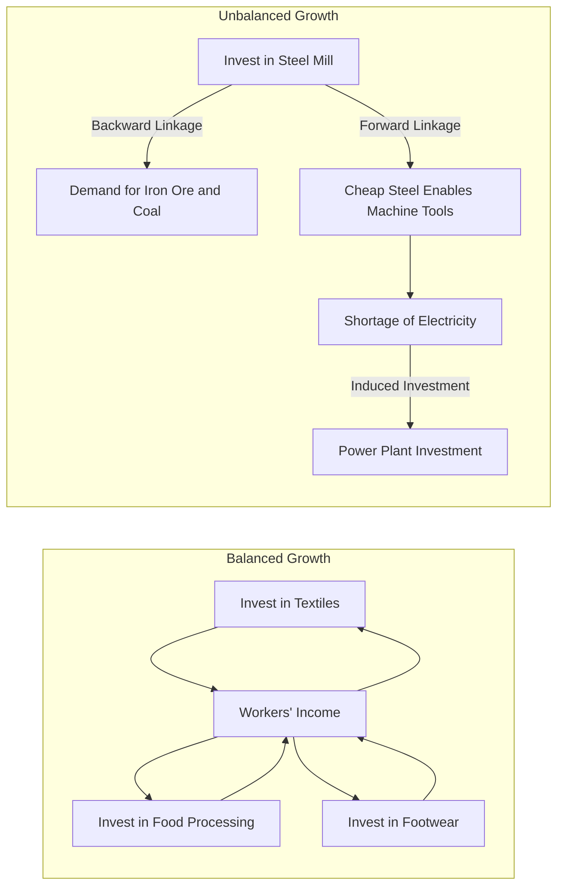

## Balanced versus Unbalanced Growth Strategies

### Overview

Balanced and unbalanced growth strategies are two competing doctrines in development economics that address how a developing economy should allocate scarce investment resources across sectors to achieve sustained industrialization and structural transformation. The debate emerged prominently in the 1950s among development economists seeking to explain why poor countries remained trapped in low-income equilibria and what investment sequencing could break that trap.

**Key Points**

- Balanced growth theory argues for simultaneous, coordinated investment across many sectors to create mutually reinforcing demand
- Unbalanced growth theory argues for deliberate concentration of investment in leading sectors to generate pressure and incentives for further investment
- Both theories respond to the same core problem: how to escape a low-level equilibrium trap with limited capital
- The debate is closely tied to theories of externalities, complementarities, and linkages between industries

### The Low-Level Equilibrium Trap Problem

Developing economies were commonly diagnosed as being stuck in a **low-level equilibrium trap**: population growth absorbs any incremental gains in output, so per capita income stagnates. Small, uncoordinated investments in a single industry often failed because:

- Demand for that industry's output depended on incomes generated elsewhere in the economy, which were not rising
- Supporting infrastructure (power, transport, credit) was absent
- Complementary inputs from other industries were unavailable domestically

This diagnosis motivated both balanced and unbalanced growth theorists, who agreed on the diagnosis but disagreed sharply on the prescription.

### Balanced Growth Theory

#### Core Proposition

Balanced growth theory, most closely associated with **Ragnar Nurkse** and earlier ideas from **Rosenstein-Rodan**, holds that a developing country should invest simultaneously in a wide range of industries so that each industry's output creates demand for the others' output.

Nurkse's central argument was framed around the **vicious circle of poverty**: low income leads to low savings, which leads to low investment, which leads to low productivity, which leads back to low income. On the demand side, a parallel vicious circle exists — low income means low purchasing power, which discourages investment in any single industry because the market is too small to absorb its output profitably.

#### Mechanism: Demand Complementarity

Nurkse's key insight was that market size is not fixed; it is itself a function of the pattern of investment. If investment is concentrated in a single industry (say, shoe manufacturing), workers newly employed there do not want to spend all their new income on shoes. Demand is diversified across many goods. Therefore, investing in shoe manufacturing alone may fail even if there is unmet aggregate demand for consumer goods generally, because the demand does not concentrate on shoes specifically.

The balanced growth solution: invest across many consumer goods industries **simultaneously** (textiles, food processing, footwear, household goods, etc.), so that workers in each new industry become customers for the outputs of the others. This expands the effective size of the market for everyone at once, resolving the demand-side vicious circle.

$$Y = \sum_{i=1}^{n} Q_i, \quad \text{where each } Q_i \text{ creates income that becomes demand for } Q_j, \; j \neq i$$

#### Rosenstein-Rodan and the "Big Push"

**Paul Rosenstein-Rodan** (1943) preceded and heavily influenced Nurkse. His "Big Push" theory argued that industrialization requires a large, coordinated wave of investment across complementary sectors because of:

- **Indivisibilities in production**: infrastructure (railways, power plants) requires large minimum efficient scale and cannot be built incrementally
- **Indivisibility of demand**: individual firms cannot internalize the demand benefits their investment creates for other firms (a pecuniary externality)
- **Indivisibility of savings**: the supply of savings needed to fund large-scale investment requires a coordinated push, since fragmented individual savings behavior is insufficient

Rosenstein-Rodan illustrated this with the parable of a shoe factory: if a single entrepreneur builds a shoe factory and employs workers previously in disguised unemployment, the new wage income is spread across many goods, so demand for shoes alone does not rise enough to justify the factory. But if many factories are built simultaneously across sectors, each sector's payroll becomes demand for the others' output.

#### Supply-Side Rationale

Balanced growth is also justified on the **input side**: many industries require complementary inputs from each other (steel needs coal and power; textiles need cotton and dyes). Developing these industries together reduces reliance on imports for intermediate goods and allows industries to feed each other's growth.

#### Critiques of Balanced Growth

- **Resource constraint**: Developing countries, by definition, lack the capital, skilled labor, and entrepreneurial capacity to invest broadly across many sectors simultaneously. The theory may prescribe a strategy that is fiscally and administratively impossible for a poor country to execute.
- **Circularity**: Some critics (notably Hirschman) argued that if a country had the resources and coordination capacity to execute balanced growth, it would arguably no longer be "underdeveloped" in the relevant sense — the theory prescribes a solution requiring the very capacities that are absent.
- **Neglect of linkages and leading sectors**: Balanced growth treats all sectors as roughly symmetric in importance, ignoring that some sectors have much larger multiplier and linkage effects than others.
- **Underestimates the role of imports**: A small, open developing economy can substitute foreign trade for some of the "balance" that Nurkse assumed had to be produced domestically — demand for a single expanding export sector need not be limited to domestic absorption.

### Unbalanced Growth Theory

#### Core Proposition

**Albert O. Hirschman**, in *The Strategy of Economic Development* (1958), argued the opposite: developing countries should deliberately concentrate investment in a **few strategically chosen leading sectors** rather than dissipate scarce resources across many sectors at once. Since developing countries lack sufficient capital, entrepreneurship, and administrative capacity to coordinate broad simultaneous investment, they should exploit disequilibria and use scarcity of resources as a *lever* for growth rather than trying to eliminate imbalance.

#### Mechanism: Linkages

Hirschman's central analytical tool is the concept of **linkages** — the ways in which investment in one industry creates profitable investment opportunities in other industries.

- **Backward linkage**: investment in an industry creates demand for inputs from upstream suppliers (e.g., a steel mill creates demand for iron ore and coal)
- **Forward linkage**: investment in an industry creates a new supply of inputs that make downstream industries profitable to establish (e.g., a steel mill makes it profitable to establish machine tool or automobile manufacturing)

$$\text{Total Linkage Effect} = \text{Backward Linkage} + \text{Forward Linkage}$$

Hirschman argued that governments and planners should identify industries with the **highest combined linkage effects** and prioritize investment there, because these industries generate the largest number of induced investment decisions elsewhere in the economy per unit of scarce capital deployed.

#### Deliberately Induced "Disequilibrium"

Unlike Nurkse, who sought to eliminate disequilibrium via coordinated simultaneous expansion, Hirschman argued that **imbalance itself is the engine of development**. Deliberately creating shortages or bottlenecks in one direction induces private and public decision-makers to respond by investing to fill the gap. Two induced mechanisms:

- **Shortages induce investment**: if a leading sector expands and creates input shortages (e.g., an electricity shortage caused by growing industrial demand), this signals profitable investment opportunities in the input sector (power generation) and pressures policymakers or investors to fill it
- **Excess capacity induces investment**: if infrastructure (e.g., a new port or power plant) is built ahead of demand, the resulting excess capacity, i.e. cheap availability of that input, induces entrepreneurs to establish new industries that can exploit it

Hirschman termed these growth patterns **"development via shortage"** and **"development via excess capacity."**

#### Social Overhead Capital (SOC) vs Directly Productive Activities (DPA)

Hirschman distinguished:

- **Social Overhead Capital (SOC)**: infrastructure such as power, transport, irrigation, and education — often lumpy, long-gestation, and typically requiring public investment
- **Directly Productive Activities (DPA)**: manufacturing and agricultural production activities that generate output directly

He argued that a sequencing strategy could go either direction:

- **SOC-first strategy**: build infrastructure ahead of demand, creating excess capacity that induces private DPA investment to exploit it
- **DPA-first strategy**: let productive activities expand until they strain existing infrastructure, creating shortages that induce public investment in SOC to relieve the bottleneck

Both sequences are examples of unbalanced growth: at any point in time, SOC and DPA are deliberately out of balance with each other, and this imbalance is what drives the next round of investment decisions.

#### The Role of the Entrepreneur and "Linkage-Induced" Decision Making

Hirschman's theory rests on a **behavioral assumption**: economic agents (private firms, state enterprises, and governments) respond to visible profit opportunities and visible bottlenecks. Unbalanced growth economizes on the genuinely scarce resource in developing countries — not capital per se, but **decision-making ability, entrepreneurship, and administrative capacity**. By creating salient, sector-specific signals (shortages or surpluses), unbalanced growth reduces the informational and coordination burden on planners, compared to balanced growth's requirement of an economy-wide simultaneous plan.

#### Critiques of Unbalanced Growth

- **Bottleneck risk**: Deliberately induced shortages, if uncorrected, can become chronic constraints (e.g., a persistent energy or transport bottleneck) rather than temporary spurs to investment, especially where private response capacity or public administrative capacity is weak. [Inference: whether shortages resolve efficiently or become entrenched constraints depends heavily on domestic institutional and market responsiveness, which varies significantly across countries.]
- **Inflationary pressure**: Persistent sectoral shortages can generate inflation in bottleneck sectors before supply responds.
- **Regional and social inequality**: Concentrating investment in leading sectors or regions can widen income and regional disparities if backward linkages do not materialize as predicted (this concern parallels Gunnar Myrdal's theory of "circular and cumulative causation" and "backwash effects").
- **Linkage measurement difficulty**: Empirically identifying which sectors have the highest linkage coefficients requires reliable input-output data, which many developing countries lacked (and still lack in a timely form), making it hard to apply Hirschman's prescription rigorously in real time. [Inference: the practical difficulty of linkage measurement is a widely cited implementation critique rather than a flaw in the theoretical logic itself.]

### Comparative Framework

| Dimension | Balanced Growth (Nurkse / Rosenstein-Rodan) | Unbalanced Growth (Hirschman) |
| --- | --- | --- |
| Investment pattern | Simultaneous, broad-based across many sectors | Sequential, concentrated in leading sectors |
| Binding constraint addressed | Insufficient market size / demand complementarity | Insufficient decision-making and entrepreneurial capacity |
| Role of disequilibrium | Something to be eliminated | Something to be deliberately induced and exploited |
| Key mechanism | Demand complementarity across industries | Backward/forward linkages and induced investment |
| Resource demands | High — requires large-scale coordinated capital and planning capacity | Lower per step — economizes scarce coordination capacity |
| Risk | Infeasible given real capital/administrative constraints | Chronic bottlenecks, inflation, inequality if linkages fail to materialize |
| Sectoral emphasis | Broad, symmetric across consumer goods industries | Selective, based on linkage coefficients (often heavy industry, infrastructure) |

### Diagrammatic Illustration

The following diagram represents the core mechanism of balanced growth (mutual demand creation) versus unbalanced growth (linkage-induced sequential investment).

### Synthesis and Country Experience

Neither doctrine has been applied in pure form. In practice, most development strategies have combined elements of both:

- **South Korea and Taiwan (1960s–1980s)** pursued strongly unbalanced, sector-targeted industrial policy (e.g., Korea's Heavy and Chemical Industry Drive of the 1970s targeted steel, shipbuilding, and petrochemicals as leading sectors with high linkage effects), consistent with Hirschman's framework, though later broadened investment as capital and administrative capacity grew.
- **The Soviet industrialization model** and some import-substitution strategies in Latin America emphasized simultaneous heavy-industry push, closer in spirit to a big-push logic, though frequently criticized for misallocating scarce capital toward capital-intensive sectors with weak linkages to the rest of the economy.
- **India's Second Five-Year Plan (Mahalanobis model, 1956)** reflected big-push logic by prioritizing simultaneous expansion of heavy industry and capital goods sectors, justified on the grounds that this would build long-run domestic capacity for further industrialization, though it was criticized for underinvesting in agriculture and consumer goods in the short run.

[Inference: The historical convergence of most successful industrializers toward *sequenced but still selectively targeted* investment (rather than either pure simultaneous balance or pure single-sector concentration) suggests that Hirschman's linkage logic proved more operationally tractable than Nurkse's coordination-heavy prescription, though this is a generalization drawn from a limited and debated set of national case studies rather than a settled empirical consensus.]

### Numerical Illustration of Linkage Prioritization

Suppose a planner must allocate a fixed capital budget $K$ across sectors $i = 1, \dots, n$, each with backward linkage coefficient $BL_i$ and forward linkage coefficient $FL_i$ estimated from an input-output table. A simplified Hirschman-style decision rule ranks sectors by total linkage:

$$\text{Rank}(i) = BL_i + FL_i$$

and allocates the marginal unit of capital to the sector with the highest total linkage score, on the reasoning that this sector will induce the greatest number of subsequent profitable investment decisions elsewhere in the economy per unit of capital committed. This is a simplification: real applications also weight linkages by employment effects, foreign exchange savings, and technological spillovers, and require reasonably reliable input-output data to compute $BL_i$ and $FL_i$ in the first place.

**Conclusion**

Balanced and unbalanced growth strategies represent two coherent but opposing answers to the same allocation problem facing capital-scarce developing economies. Nurkse and Rosenstein-Rodan located the binding constraint in insufficient aggregate demand and market size, prescribing simultaneous, economy-wide investment to create mutually reinforcing markets. Hirschman located the binding constraint in scarce entrepreneurial and administrative decision-making capacity, prescribing sequential investment in high-linkage leading sectors that induces further investment through deliberately created shortages or excess capacity. Empirical development experience since the mid-20th century has generally favored selective, linkage-based sequencing over economy-wide simultaneous investment, though successful industrializers have typically broadened investment scope as their capital and institutional capacity matured.

**Related Topics**

- Rosenstein-Rodan's Big Push theory and indivisibilities
- Input-output analysis and linkage coefficient estimation
- Import substitution industrialization (ISI) strategies
- Export-led growth and outward-oriented industrial policy
- Gunnar Myrdal's circular and cumulative causation and backwash/spread effects
- The low-level equilibrium trap (Nelson) and poverty trap models
- State-led industrial policy in East Asian newly industrialized economies
- Social overhead capital investment and infrastructure sequencing in development planning
- Dual-sector models of development (Lewis model) and structural transformation