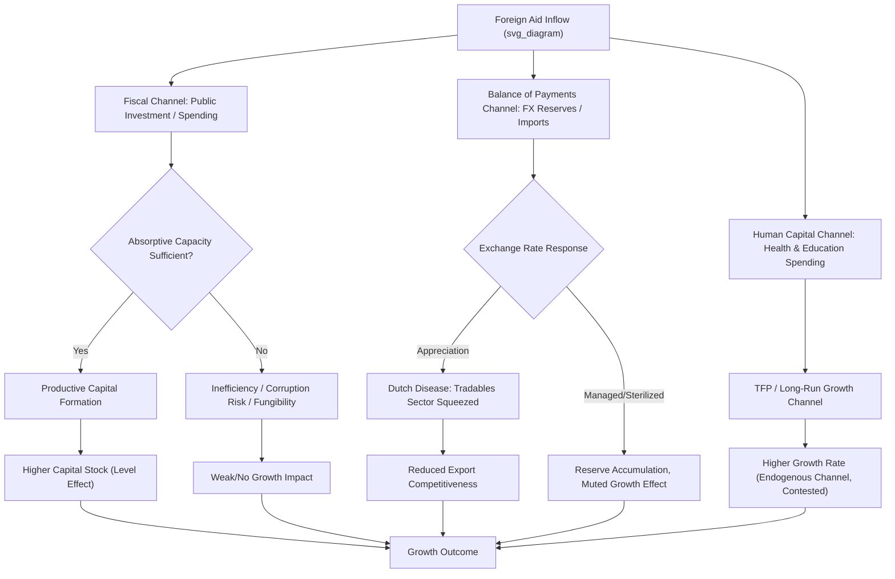

## Foreign Aid and Economic Growth

### Overview

Foreign aid refers to the voluntary transfer of resources—financial, technical, or in-kind—from one country or institution to another, typically flowing from high-income to low- and middle-income countries. In development macroeconomics, the central question is whether aid inflows raise the long-run growth rate and living standards of recipient economies, and under what conditions this occurs. This topic sits at the intersection of growth theory, macroeconomic policy, institutional economics, and empirical development economics, and it remains one of the most contested areas in the field.

### Types of Foreign Aid

**Official Development Assistance (ODA)**

Concessional financing (grants or low-interest loans) provided by governments or multilateral institutions with the primary objective of promoting economic development and welfare, as defined by the OECD Development Assistance Committee (DAC).

**Bilateral Aid**

Aid transferred directly from one donor government to a recipient government (e.g., USAID, JICA, DFID/FCDO programs).

**Multilateral Aid**

Aid channeled through international institutions such as the World Bank (IBRD/IDA), IMF, regional development banks (ADB, AfDB, IDB), and UN agencies, which pool contributions from multiple donors.

**Project Aid vs. Program Aid**

- *Project aid* is tied to specific, identifiable investments (a road, a dam, a school system).
- *Program aid* (including budget support) provides general financing to a government's budget or balance of payments, often conditioned on policy reforms.

**Tied vs. Untied Aid**

Tied aid requires recipients to spend funds on goods/services from the donor country, which can reduce the effective value of aid due to procurement inefficiencies. Untied aid allows open procurement.

**Humanitarian vs. Developmental Aid**

Humanitarian aid addresses acute crises (disasters, conflict, famine); developmental aid targets longer-run structural transformation.

**Debt Relief and Concessional Lending**

Includes HIPC (Heavily Indebted Poor Countries) and MDRI (Multilateral Debt Relief Initiative) programs, which function as a form of aid by freeing up fiscal space.

### Theoretical Channels Linking Aid to Growth

**The Financing Gap Model (Harrod-Domar Foundation)**

Early aid theory, most associated with the two-gap model (Chenery and Strout, 1966), posited that developing countries face two binding constraints on growth: a savings gap and a foreign exchange gap. Aid is modeled as filling whichever gap is larger, directly financing the investment needed to hit a growth target.

The underlying Harrod-Domar logic:

$$g = \frac{s}{k}$$

where $g$ is the growth rate, $s$ is the savings rate, and $k$ is the incremental capital-output ratio (ICOR). If domestic savings $s_d$ are insufficient to finance the investment required for a target growth rate, aid $A$ supplements domestic resources:

$$I = s_d Y + A$$

**[Inference]** This framework has been heavily criticized because it assumes capital is the binding constraint on growth and that aid translates one-for-one into productive investment, both of which are contested empirically.

**Neoclassical Growth Channel**

In a Solow-Swan framework, aid can be modeled as an addition to the capital stock, temporarily raising the investment rate above the steady-state savings rate:

$$\dot{k} = s y(k) + a - (n + \delta)k$$

where $a$ represents aid-financed investment per effective worker, $n$ is population growth, and $\delta$ is depreciation. This predicts a transitional growth boost that fades as the economy approaches a new (higher) steady-state capital stock—aid raises the *level* of output per capita, not the permanent growth rate, unless it affects total factor productivity (TFP).

**Augmented Solow / Human Capital Channel**

Aid directed at health and education can raise human capital $h$, shifting the production function:

$$Y = K^{\alpha} (Ah)^{1-\alpha}$$

This channel argues aid can affect long-run growth by raising $A$ (technology/productivity) or $h$, not merely $K$.

**Endogenous Growth Channel**

In AK-type or R&D-based models, aid financing infrastructure, institutions, or knowledge transfer could plausibly affect the long-run growth rate itself (not just the level), for example by lowering the effective depreciation rate on capital or by financing public goods with positive externalities.

**Dutch Disease Channel**

Large aid inflows can appreciate the real exchange rate, since aid dollars are typically converted to local currency and spent domestically. This can crowd out the tradable sector (particularly manufacturing and agriculture), a mechanism analogous to the resource curse literature.

**[Inference]** The magnitude of Dutch disease effects from aid is debated; some argue aid-financed imports offset the exchange rate pressure by expanding the supply of tradable goods, mitigating the real appreciation that would otherwise occur.

**Fiscal Response and Fungibility**

Aid is fungible: money designated for one purpose (e.g., a hospital) can free up government funds for another purpose (e.g., military spending), meaning aid's actual marginal use may differ substantially from its stated purpose. This complicates any simple aid-to-outcome mapping.

**Institutional and Governance Channel**

Aid can weaken domestic accountability mechanisms if governments become more responsive to donors than to citizens (the "rentier state" critique), potentially undermining tax capacity and institutional quality over time.

### Key Empirical Debates

**Aid Effectiveness: Unconditional Relationship**

Cross-country growth regressions have produced highly inconsistent results on whether aid raises growth, with estimated coefficients ranging from significantly positive to insignificant to negative depending on specification, time period, and country sample.

**The Burnside-Dollar Hypothesis (Policy Conditionality)**

Burnside and Dollar (2000) argued that aid promotes growth only in countries with "good policy" environments (sound fiscal, monetary, and trade policy), formalized via an interaction term:

$$\text{Growth}_i = \beta_0 + \beta_1 \text{Aid}_i + \beta_2 \text{Policy}_i + \beta_3 (\text{Aid}_i \times \text{Policy}_i) + \epsilon_i$$

A positive and significant $\beta_3$ would imply aid's growth effect depends on policy quality. This result was influential in shaping selective aid allocation approaches (e.g., the U.S. Millennium Challenge Corporation model).

**[Unverified]** The Burnside-Dollar result has not held up robustly to changes in country samples, time periods, or policy measures in subsequent replications, and is widely regarded in the literature as fragile rather than a settled empirical law.

**Diminishing Returns to Aid**

Some studies (e.g., Hansen and Tarp) find that aid has a positive effect on growth on average, but with diminishing returns at high levels of aid relative to GDP, implying an optimal aid intensity beyond which additional aid contributes little or even negatively to growth (absorptive capacity constraints).

**The Aid-Growth Skeptic View**

Researchers such as William Easterly have argued that decades of aid have failed to generate self-sustaining growth in many recipient countries, citing weak institutions, poor incentive design, and donor coordination failures. Dambisa Moyo's critique (*Dead Aid*) goes further, arguing aid dependence can be actively harmful by fostering corruption, reducing accountability, and discouraging private investment and domestic revenue mobilization.

**Randomized Controlled Trials (Microeconomic Turn)**

Since the 2000s, the field has shifted substantially toward micro-level RCTs (associated with Banerjee, Duflo, Kremer, and others) evaluating specific interventions (deworming, cash transfers, microfinance, conditional cash transfer programs) rather than aggregate aid-growth regressions, partly because macro-level identification is extremely difficult (reverse causality, omitted variables, heterogeneous aid composition).

**Endogeneity and Identification Problems**

A central methodological issue: aid may be allocated *because* of low growth or crises (reverse causality), biasing naive OLS estimates downward. Instrumental variable approaches (e.g., using donor-side determinants of aid, such as colonial ties or donor budget cycles) attempt to address this, but valid instruments are difficult to construct and contested.

### Aid Modalities and Growth-Relevant Design Features

**Budget Support vs. Project Aid**

Budget support offers greater ownership and lower transaction costs but higher fungibility risk and dependence on recipient public financial management (PFM) quality; project aid offers greater traceability but can bypass and weaken domestic institutions.

**Conditionality**

- *Ex-ante conditionality*: policy reforms required before disbursement (associated with IMF/World Bank structural adjustment programs).
- *Ex-post/results-based conditionality*: disbursement tied to verified outcomes (e.g., Cash on Delivery aid, Program-for-Results).

**[Inference]** Results-based aid is theoretically attractive because it aligns incentives with outcomes rather than inputs, but empirical evidence on its comparative effectiveness relative to traditional modalities is still limited.

**Aid Volatility and Predictability**

Aid flows are often pro-cyclical and volatile, which can undermine long-term fiscal planning in recipient governments; unpredictability is frequently cited as more damaging to growth than the level of aid itself.

**Absorptive Capacity**

Refers to an economy's ability to productively deploy large aid inflows without triggering inflation, exchange rate appreciation, or administrative overload. Limited absorptive capacity is a commonly cited reason for diminishing (or negative) marginal returns to aid at high aid/GNI ratios.

### Macroeconomic Management of Aid Inflows

**Spend and Absorb**

Government spends the aid and the resulting current account deficit widens (net imports rise), avoiding excess money supply growth. This is generally viewed as least inflationary but requires import capacity.

**Spend but Don't Absorb**

Government spends the aid domestically without a corresponding rise in imports, financed by running down foreign reserves or exchange rate appreciation; this risks demand-pull inflation and Dutch disease effects.

**Save (Don't Spend, Don't Absorb)**

Central bank sterilizes the aid inflow (e.g., accumulates reserves), avoiding both fiscal expansion and exchange rate effects—often used when absorptive capacity is judged low, but this also means the aid does not immediately support development spending.

$$\text{Absorption} = \text{Spending} - \Delta(\text{Reserves})$$

This framework (from IMF literature, e.g., Berg et al.) is central to technical policy dialogue between the IMF and aid-recipient central banks.

### Illustrative Numerical Example

Consider a low-income country with GDP of $20 billion, a domestic savings rate of 12% of GDP, and an ICOR of 4. Under the Harrod-Domar model, the growth rate attainable from domestic savings alone is:

$$g = \frac{s}{k} = \frac{0.12}{4} = 0.03 = 3\%$$

Suppose the government targets 6% growth. The implied required investment rate is:

$$s_{required} = g \times k = 0.06 \times 4 = 0.24 = 24\% \text{ of GDP}$$

The financing gap to be filled by aid is:

$$\text{Aid needed} = (0.24 - 0.12) \times \$20\text{B} = \$2.4\text{B}$$

**[Inference]** This calculation illustrates the mechanical logic historically used to justify aid volumes, but it assumes the ICOR is stable and that aid converts fully into productive investment—assumptions that real-world evidence frequently contradicts, which is precisely why the two-gap model fell out of favor as a policy tool even though it remains pedagogically useful.

### Diagram: Channels from Aid to Growth (svg_diagram)

### Country Cases (Illustrative Patterns)

**South Korea and Taiwan (1950s–1970s)**

Often cited as successful aid recipients where large U.S. aid inflows coincided with strong state capacity, export-oriented industrial policy, and heavy investment in education—supporting the "aid works with good institutions" view.

**Sub-Saharan Africa (multi-decade aid recipients)**

Many countries received substantial aid as a share of GNI over long periods with mixed growth outcomes, frequently cited by aid skeptics as evidence that aid alone is insufficient absent complementary institutional and policy reforms.

**Botswana**

Frequently cited as a case combining moderate aid with strong institutional quality (property rights, prudent management of diamond resource revenues) and high sustained growth, used to argue institutions condition aid effectiveness.

**[Inference]** Cross-country case comparisons are illustrative rather than conclusive on their own, since they cannot control for the many confounding factors (initial conditions, geography, external shocks, colonial history) that also differ across these cases; they are typically used alongside econometric evidence rather than as standalone proof.

### Criticisms and Alternative Perspectives

**Aid Dependence and Moral Hazard**

Sustained aid inflows may reduce recipient government incentives to build domestic tax systems and accountable institutions, a concern sometimes termed the "resource curse of aid."

**Donor Fragmentation and Coordination Costs**

Multiple donors with different reporting requirements, priorities, and disbursement schedules can impose high administrative burdens on recipient governments (a key motivation behind the 2005 Paris Declaration on Aid Effectiveness and the 2008 Accra Agenda for Action, which emphasized ownership, alignment, harmonization, and mutual accountability).

**Trade and Investment as Alternatives/Complements**

A prominent counter-position ("trade not aid") argues that market access, foreign direct investment, and remittances are more effective long-run growth drivers than aid, since they are performance-linked and market-disciplined rather than politically allocated.

**China's Alternative Model**

China's aid and financing model (often infrastructure-focused, loan-based rather than grant-based, with fewer explicit governance conditionalities) has emerged as an alternative to traditional Western/multilateral aid architecture, generating ongoing debate about debt sustainability versus infrastructure gap-filling benefits.

**[Speculation]** The long-run growth consequences of this alternative financing model relative to traditional concessional aid are still being debated in the literature and will likely remain contested as more repayment cycles play out.

### Related Topics

- Two-gap and three-gap models of development financing
- Dutch disease and the resource curse
- Debt sustainability analysis (DSA) and the HIPC/MDRI initiatives
- Foreign direct investment (FDI) versus aid as growth drivers
- Remittances and their macroeconomic effects
- Structural adjustment programs and IMF conditionality
- Institutional economics and the "institutions matter" growth literature (Acemoglu, Robinson)
- Randomized controlled trials in development economics
- Absorptive capacity and public financial management (PFM) reform
- Millennium Development Goals / Sustainable Development Goals financing frameworks
- Sovereign debt crises in low-income countries