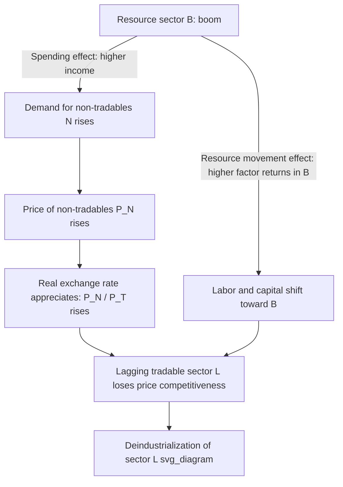

## Dutch Disease and Resource-Dependent Economies

### Definition and Origin

Dutch disease refers to the causal relationship between the intensive exploitation of natural resources and a decline in the competitiveness of a country's manufacturing (or other tradable, non-resource) sectors, transmitted through exchange rate appreciation and factor reallocation. The term originated in *The Economist* (1977), describing the deindustrialization of Dutch manufacturing following the discovery of the Groningen natural gas field in the 1960s. The gas boom raised the value of the guilder and shifted domestic resources away from tradable manufacturing, weakening non-oil export sectors.

The phenomenon is a specific case of the broader **resource curse**: the empirical observation that resource-abundant economies often grow more slowly, industrialize less, and exhibit weaker institutional development than resource-scarce economies, despite the apparent windfall.

### Core Mechanism

Dutch disease operates through two linked channels, usually modeled with a **three-sector framework**: a booming resource sector (e.g., oil, gas, minerals), a lagging tradable sector (manufacturing, agriculture), and a non-tradable sector (services, construction, retail).

**Spending effect**

A resource boom raises national income. Higher income raises demand for non-tradable goods (services, housing) whose prices are set domestically. Because non-tradables cannot be imported to satisfy excess demand, their relative prices rise. This raises the domestic price level relative to trading partners, producing a **real exchange rate appreciation**, even without any nominal exchange rate movement.

**Resource movement effect**

The booming sector bids up wages and returns to capital and labor, since it now offers higher returns than other sectors. Factors of production (labor, capital) migrate out of the lagging tradable sector into either the booming sector directly, or the non-tradable sector (which is also expanding due to the spending effect). This is sometimes called "direct deindustrialization" (labor pulled from manufacturing to resources) versus "indirect deindustrialization" (labor pulled from manufacturing to non-tradable services).

The combined result: the lagging tradable sector shrinks in relative size, both because it loses factors of production and because real appreciation makes its exports less price-competitive internationally.

### The Corden-Neary Model

The canonical formalization is Corden and Neary (1982), *Booming Sector and De-Industrialisation in a Small Open Economy*. The model has three sectors:

- $B$: booming (resource) tradable sector
- $L$: lagging (manufacturing) tradable sector
- $N$: non-tradable sector

Tradable goods prices are fixed by world markets (small open economy assumption); non-tradable prices $P_N$ are determined domestically by supply and demand. A boom in sector $B$ (from a price increase or a technology/discovery shock) raises the **real exchange rate**, defined as:

$$RER = \frac{P_N}{P_T}$$

where $P_T$ is the price of tradables. An increase in $RER$ (real appreciation) makes tradable production less profitable relative to non-tradable production, drawing resources toward $N$ and away from $L$.

**Key Points**

- The lagging sector $L$ contracts unambiguously under both the spending and resource-movement effects.
- The non-tradable sector $N$ expands unambiguously.
- The net effect on aggregate welfare is ambiguous — it depends on the size of the boom, the economy's factor mobility, and whether $L$ generates externalities (e.g., learning-by-doing, technology spillovers) that are lost when it shrinks.
- If sector $L$ is a source of dynamic externalities (as in endogenous growth models), the short-run reallocation can generate a long-run growth cost — this is the theoretical bridge from Dutch disease to the broader resource curse literature.

### Real Exchange Rate Appreciation Channel

Real appreciation can occur through two distinct routes, which matter for policy diagnosis:

1. **Nominal appreciation**: the domestic currency strengthens against foreign currencies because resource export revenues increase foreign exchange inflows (higher supply of foreign currency in the domestic FX market, or higher demand for domestic currency to purchase domestic non-tradables and assets).
2. **Domestic inflation**: even under a fixed exchange rate regime, the relative price of non-tradables rises through inflation in the non-tradable sector, achieving the same real appreciation without any nominal exchange rate movement.

This distinction matters for open-economy macro policy: a floating exchange rate transmits the shock primarily through nominal appreciation, while a fixed or managed exchange rate transmits it through domestic non-tradable inflation, holding the long-run real appreciation outcome broadly similar. [Inference — the degree of pass-through and the speed of adjustment differ meaningfully by regime, capital account openness, and monetary policy credibility, so the equivalence is asymptotic rather than exact in the short run.]

### Sovereign Wealth Funds and Fiscal Sterilization

A standard policy response is to prevent the entire resource windfall from flowing directly into the domestic economy, thereby dampening the spending effect. Common mechanisms:

- **Sovereign Wealth Funds (SWFs)**: revenue is invested abroad rather than spent domestically, converting a temporary income flow into a stock of foreign assets and smoothing fiscal spending over time. Norway's Government Pension Fund Global is the widely cited example — it invests almost entirely in foreign assets and follows a fiscal rule (historically, a 4% expected real return withdrawal guideline, later revised downward) to limit annual budget injections from oil revenue.
- **Fiscal rules / spending smoothing**: de-linking annual government expenditure from annual resource revenue, e.g., basing the budget on a long-run reference price for the commodity rather than the spot price.
- **Sterilized foreign exchange intervention**: the central bank buys foreign currency inflows (preventing nominal appreciation) while simultaneously selling domestic bonds to absorb the resulting increase in domestic money supply (preventing inflationary pressure). This is imperfect and can be costly to sustain, since it requires a stock of domestic bonds and creates a quasi-fiscal cost equal to the interest rate differential between domestic bonds issued and foreign reserves held.
- **Direct investment in tradable-sector productivity**: subsidizing R&D, infrastructure, or education aimed at the lagging tradable sector to offset the competitiveness loss, though this raises the risk of picking-winners industrial policy failures.

### Institutional and Political-Economy Dimensions

The pure Corden-Neary model is a real-side, market-clearing mechanism. Explaining why some resource-rich countries (Norway, Botswana, Chile) manage the transition well while others (Nigeria, Venezuela, Angola, historically) do not requires layering political economy on top:

- **Rent-seeking and institutional quality**: resource rents that flow through weak or extractive institutions attract rent-seeking behavior, corruption, and conflict over control of the resource, diverting talent and capital away from productive activity (Mehlum, Moene, and Torvik, 2006, distinguish "grabber-friendly" from "producer-friendly" institutions as the key moderator of whether resources are a curse or a blessing).
- **Voracity effect** (Tornell and Lane, 1999): in weak institutional settings with multiple competing claimants on fiscal resources (interest groups, political factions), a positive income shock can trigger a more-than-proportional increase in fiscal redistribution to these groups, actually *reducing* the growth rate rather than merely reallocating sectors.
- **Volatility**: commodity prices are typically more volatile than manufacturing or services prices. This volatility complicates fiscal planning, increases the cost of capital, and can produce boom-bust investment cycles that are separately damaging from the pure Dutch disease channel.
- **Dutch disease vs. resource curse**: Dutch disease is a specific real-exchange-rate/sectoral-reallocation mechanism; "resource curse" is the broader empirical regularity (Sachs and Warner, 1995, and subsequent literature) that resource abundance correlates with slower growth. Dutch disease is one proposed causal channel among several (others include institutional degradation, volatility, and rent-seeking) for the resource curse. [Unverified — the Sachs-Warner cross-country growth regressions have been contested on econometric grounds, including endogeneity of resource dependence measures and sensitivity to sample and control choices, so the strength and even sign of the unconditional resource-growth correlation remains actively debated in the empirical literature.]

### Country Cases

**Example**

- **Netherlands (1960s–1970s)**: the namesake case. Groningen gas exports appreciated the guilder and coincided with a decline in Dutch manufacturing employment share, though later reassessments attribute part of the deindustrialization to broader European trends (automation, competition from newly industrializing economies) rather than gas revenue alone.
- **Norway**: frequently cited as the canonical *avoidance* case. Combines a large SWF, a strict fiscal rule tying budget spending to expected long-run fund returns rather than current oil revenue, and strong pre-existing institutions (rule of law, low corruption) predating the oil discovery.
- **Nigeria**: oil revenue since the 1970s coincided with stagnation of the agricultural export sector (previously a major cocoa and groundnut exporter) and persistent institutional weakness, cited as a canonical resource-curse case combining Dutch disease with rent-seeking and volatility effects.
- **Botswana**: diamond-rich but frequently cited as a resource-curse counterexample due to strong property rights, prudent fiscal management (a diamond revenue-sharing arrangement with De Beers channeled through relatively accountable institutions), and sustained high growth since independence.
- **Chile**: manages copper revenue volatility through a structural fiscal balance rule and a stabilization fund (Fondo de Estabilización Económica y Social), targeting government spending to a long-run estimate of copper prices and trend GDP rather than current revenue.

### Measurement and Empirical Identification

Empirically isolating Dutch disease effects is difficult because resource booms are often correlated with other shocks. Standard approaches include:

- **Real effective exchange rate (REER) tracking**: monitoring REER appreciation against a basket of trading partners around the timing of resource discoveries or price booms.
- **Sectoral value-added and employment shares**: tracking manufacturing share of GDP or employment before and after a resource boom, often using synthetic control or difference-in-differences designs against comparable non-resource economies.
- **Cross-country panel regressions**: relating resource export share or resource rents (as % of GDP) to manufacturing growth or export diversification, controlling for institutional quality, trade openness, and initial income (following Sachs-Warner style specifications and their many robustness extensions).
- **Natural experiment / discovery-timing designs**: using the exogenous timing of resource discoveries (rather than resource abundance itself, which may be correlated with unobserved factors) as an instrument, since discovery timing is plausibly uncorrelated with prior institutional or growth trajectories (this approach follows the identification strategy popularized by Cavalcanti, Mohaddes, and Raissi, and by Lei and Michaels, in the 2010s literature on oil and gas discoveries).

### Policy Toolkit Summary

| Policy Instrument | Primary Channel Addressed | Key Limitation |
| --- | --- | --- |
| Sovereign wealth fund | Spending effect (income smoothing) | Requires fiscal discipline and governance to resist withdrawal pressure |
| Fiscal rule (spending-price delinking) | Spending effect | Politically difficult to sustain during price booms |
| Sterilized FX intervention | Nominal appreciation | Costly to sustain; limited by reserve stock and quasi-fiscal losses |
| Tradable-sector industrial policy | Resource movement effect | Risk of inefficient subsidy allocation, rent-seeking |
| Revenue transparency / institutional reform | Rent-seeking, voracity effect | Long gestation period; requires political will |
| Export diversification strategy | Long-run structural dependence | Difficult to engineer top-down; requires complementary human capital and infrastructure investment |

### Distinguishing Temporary vs. Permanent Booms

The appropriate policy response depends heavily on whether the resource shock is perceived as **temporary** (a price spike, a depleting reserve) or **permanent** (a large, long-duration reserve at a stable price). Permanent-income theory implies that a temporary windfall should be substantially saved (smoothing consumption over time), while a genuinely permanent increase in income can be spent immediately without violating intertemporal budget constraints. In practice, resource price shocks are frequently *misperceived* as permanent during the boom phase, leading to procyclical fiscal expansion that must later be reversed — a pattern documented extensively in Latin American and Sub-Saharan African commodity cycles. [Inference — the empirical frequency of this misperception versus rational updating on genuinely revised long-run price expectations is difficult to disentangle after the fact, since ex post price declines do not by themselves prove the earlier expectation was irrational.]

### Related Topics

- Resource curse and institutional quality (Mehlum-Moene-Torvik framework)
- Sovereign wealth fund design and fiscal rules
- Real exchange rate determination in open-economy macroeconomics
- Terms-of-trade shocks and small open economy models
- Export diversification and structural transformation
- Permanent income hypothesis and consumption smoothing under commodity volatility
- Rentier state theory and political economy of oil
- Voracity effect and common-pool fiscal resource problems
- Balassa-Samuelson effect (a related but distinct real exchange rate mechanism)