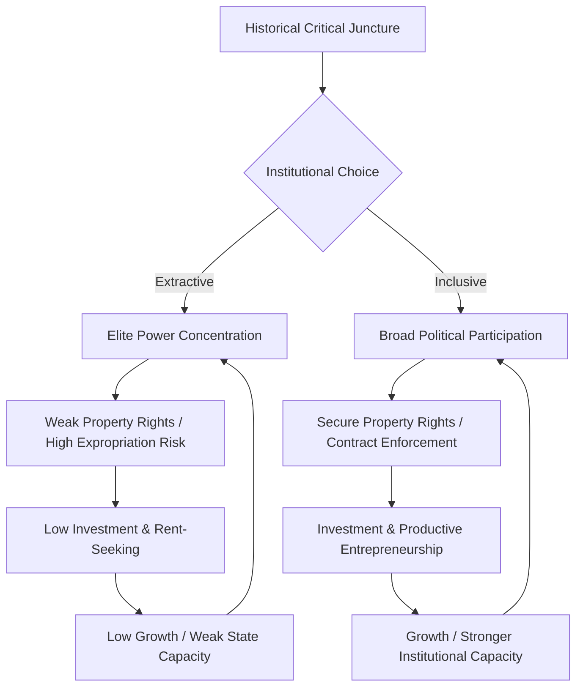

## Institutions and Macroeconomic Performance in Developing Countries

### Definition and Scope

Institutions refer to the formal and informal rules, enforcement mechanisms, and organizations that structure political, economic, and social interactions within a country. In development macroeconomics, institutional quality is treated as a fundamental determinant of long-run growth, sitting alongside or above proximate factors such as physical capital accumulation, human capital, and technology.

The distinction between **proximate causes** (savings rates, investment, education, technological adoption) and **deep/fundamental causes** (institutions, geography, culture, integration) is central to this literature. Institutions are commonly framed as the deepest of these fundamental causes because they shape the incentives that determine whether proximate factors are deployed productively.

**Formal institutions** include:

- Property rights systems and their enforcement
- Contract enforcement mechanisms and judicial independence
- Constitutional constraints on executive power
- Regulatory frameworks and bureaucratic quality
- Central bank governance structures

**Informal institutions** include:

- Social norms and trust
- Corruption tolerance/intolerance culture
- Clientelism and patronage networks
- Traditional/customary governance structures

---

### Theoretical Frameworks

#### North's Institutional Framework

Douglass North defined institutions as "the rules of the game in a society," distinguishing them from **organizations** (the players). Institutions reduce uncertainty by structuring everyday life, lowering transaction costs, and shaping the incentive structure of an economy. North argued that economic history is largely a story of institutional evolution—some societies develop institutions that align private returns with social returns (productive activity), while others develop institutions that reward rent-seeking and redistribution.

#### Acemoglu-Johnson-Robinson (AJR) Framework

The AJR framework distinguishes between:

- **Extractive institutions**: designed to transfer wealth from the population to a narrow elite, with weak property rights and high expropriation risk
- **Inclusive institutions**: broad-based political participation, secure property rights, and constraints on elite power

Their empirical strategy uses **settler mortality** as an instrumental variable for institutional quality, arguing that European colonizers established extractive institutions where they could not settle (due to disease environments) and inclusive institutions where they could settle in large numbers, replicating European institutional structures. This colonial-origin institutional divergence is argued to persist and explain a substantial share of cross-country income differences today.

$$\ln(GDP_i) = \alpha + \beta \cdot Institutions_i + X_i'\gamma + \epsilon_i$$

where $Institutions_i$ is instrumented using settler mortality, and $X_i$ is a vector of controls (geography, legal origin, etc.).

#### Rodrik-Subramanian-Trebbi: Institutions Rule

Dani Rodrik, Arvind Subramanian, and Francesco Trebbi conducted a horse race between institutions, geography, and trade integration as determinants of income levels. Their central finding was that **institutional quality "trumps" both geography and trade** in explaining cross-country income variation once endogeneity is addressed via instrumental variables (settler mortality for institutions, gravity-based measures for trade openness).

#### The Reversal of Fortune Hypothesis

Acemoglu, Johnson, and Robinson also documented a "reversal of fortune": regions that were relatively prosperous in 1500 (dense populations, urbanized, complex pre-colonial societies) tend to be relatively poor today, while sparsely populated regions became relatively rich. Their explanation is institutional: densely populated, prosperous regions were more attractive targets for extractive colonial institutions (large captive labor forces to exploit), while sparsely populated regions received settler-transplanted inclusive institutions.

---

### Channels Linking Institutions to Macroeconomic Performance

#### 1. Property Rights and Investment

Weak property rights raise the effective cost of capital by increasing expropriation risk. This distorts the investment decision:

$$E[\pi] = (1-p) \cdot \pi_{formal} - p \cdot L$$

where $p$ is the probability of expropriation/informal seizure and $L$ is the loss from expropriation. Higher $p$ suppresses long-horizon investment, shifting economic activity toward short-payback, easily-hidden, or informal-sector projects.

#### 2. Contract Enforcement and Financial Development

Weak courts and contract enforcement raise the cost of writing and enforcing financial contracts, constraining credit market depth. This is a core mechanism in the **law and finance** literature (La Porta, Lopez-de-Silanes, Shleifer, Vishny), which links legal origin (common law vs. civil law traditions) to investor protection and financial market development.

#### 3. Fiscal Institutions and Debt Sustainability

Institutional quality affects the credibility of fiscal rules, the government's ability to commit to sustainable debt paths, and susceptibility to "original sin" (inability to borrow internationally in domestic currency). Weak fiscal institutions are associated with procyclical fiscal policy—developing countries often spend more in booms and cut more in busts, amplifying volatility rather than smoothing it (contrary to standard Keynesian countercyclical policy prescriptions).

#### 4. Monetary Institutions and Central Bank Independence

Central bank independence (CBI) is an institutional variable strongly linked to inflation outcomes. Weak CBI allows fiscal dominance, where monetary policy is subordinated to financing government deficits (seigniorage), leading to chronic inflation or hyperinflation episodes.

$$\text{Seigniorage} = \frac{\Delta M}{P} = \frac{\Delta M}{M} \cdot \frac{M}{P}$$

Countries with weak institutional constraints on the executive tend to rely more heavily on seigniorage revenue relative to tax revenue, since taxation requires stronger administrative and enforcement capacity.

#### 5. Corruption and Rent-Seeking

Corruption acts as a distortionary tax on economic activity, but unlike formal taxation, it is unpredictable, non-transparent, and does not fund public goods provision. Rent-seeking diverts talent and capital toward unproductive redistributive activities (Murphy-Shleifer-Vishny "Bad Rulers" and occupational choice models) rather than productive entrepreneurship.

#### 6. Political Instability and Policy Volatility

Weak institutions are correlated with higher political instability (coups, irregular government transitions), which raises policy uncertainty. This depresses investment through an option-value channel: firms facing uncertain future policy environments delay irreversible investment.

---

### Empirical Measurement of Institutional Quality

| Index/Dataset | Source | Focus |
| --- | --- | --- |
| Worldwide Governance Indicators (WGI) | World Bank | Voice & accountability, political stability, government effectiveness, regulatory quality, rule of law, control of corruption |
| Polity5 | Center for Systemic Peace | Regime authority characteristics (democracy-autocracy spectrum) |
| ICRG (International Country Risk Guide) | PRS Group | Political, financial, and economic risk ratings |
| Doing Business (discontinued 2021) / Business Enabling Environment (B-READY) | World Bank | Regulatory quality for private sector activity |
| V-Dem (Varieties of Democracy) | University of Gothenburg | Disaggregated democracy measures |
| Freedom House Index | Freedom House | Political rights and civil liberties |
| Corruption Perceptions Index (CPI) | Transparency International | Perceived public-sector corruption |

**Measurement challenges [Inference]:** These indices are largely perception-based (surveys of experts, businesspeople), raising concerns about reverse causality (raters may infer "good institutions" partly from observed good economic outcomes) and measurement error that can bias regression coefficients toward zero (attenuation bias) or in unpredictable directions if errors correlate with other regressors.

---

### Institutions and Growth Regressions

A canonical cross-country growth regression augmented with institutions takes the form:

$$g_i = \alpha + \beta_1 \ln(y_{i,0}) + \beta_2 Institutions_i + \beta_3 X_i + \epsilon_i$$

where $g_i$ is per-capita growth, $y_{i,0}$ is initial income (testing for conditional convergence), and $X_i$ includes controls such as human capital, trade openness, and geography.

**Key empirical regularities:**

- Institutional quality is a robust predictor of long-run income levels
- The relationship with short-run growth volatility is more contested—some argue institutions matter primarily for levels, not growth rates, once income levels are reached (a "get to Denmark" framing)
- Instrumenting for institutions is essential given obvious reverse causality: richer countries can afford better courts, bureaucracies, and enforcement mechanisms

---

### Endogeneity and Identification Strategies

The central econometric challenge is that institutions and income are jointly determined. Common instrumental variable (IV) strategies include:

1. **Settler mortality** (AJR) — historical disease environment as an instrument for colonial institutional choices
2. **Legal origin** (La Porta et al.) — common law vs. civil law transplanted through colonization
3. **Latitude/distance from equator** — used cautiously as it conflates geography and institutions
4. **Population density in 1500** — proxy for the attractiveness of extractive institutions

**Critiques [Unverified/contested in literature]:**

- Glaeser, La Porta, Lopez-de-Silanes, and Shleifer argue that human capital, not institutions per se, may be the deeper determinant, with institutions following from an educated citizenry's demand for constraints on government
- Albouy raised measurement concerns about the settler mortality data underlying AJR's estimates
- Sachs emphasized geography (disease burden, agricultural productivity, transport costs) as a more direct channel than institutions, independent of colonial history

---

### Institutions and Specific Macroeconomic Outcomes

#### Growth Volatility

Developing countries with weak institutions exhibit higher output volatility. Weak institutions are associated with:

- Procyclical fiscal and monetary policy (rather than countercyclical stabilization)
- Greater exposure to terms-of-trade shocks without adequate buffers (e.g., absent sovereign wealth funds or fiscal rules)
- Higher susceptibility to sudden stops in capital flows

#### Inflation Performance

Cross-country evidence links weak central bank independence and weak fiscal institutions to persistently higher and more variable inflation. Institutional commitment devices (inflation targeting frameworks, fiscal responsibility laws, currency boards) have been adopted partly to substitute for weak underlying institutional credibility.

#### The Resource Curse

Natural resource abundance interacts with institutional quality: resource-rich countries with weak institutions tend to underperform resource-poor counterparts (the "resource curse"), driven by:

- Rent-seeking competition for control of resource revenues
- Dutch disease effects on the tradable sector, compounded by weak diversification incentives under extractive institutions
- Weakened accountability, since resource revenue reduces government dependence on taxation (and therefore on citizen consent) — the **"no taxation without representation"** logic in reverse

Countries with strong institutions prior to resource discovery (e.g., Norway, Botswana) have avoided the worst manifestations of the curse, supporting an institutions-as-moderator interpretation.

#### Sovereign Debt Crises and Default

Weak institutions correlate with higher sovereign default risk, both directly (weak commitment to repayment, "willingness to pay" problems distinct from "ability to pay") and indirectly (weak institutions reduce growth and revenue mobilization capacity, worsening debt dynamics).

$$\frac{d_{t+1}}{Y_{t+1}} = \frac{(1+r)}{(1+g)} \cdot \frac{d_t}{Y_t} - pb_t$$

Institutional weakness affects this debt dynamics equation through both $r$ (risk premium reflecting default risk) and $g$ (growth), as well as the primary balance $pb_t$ (tax administration capacity).

---

### Institutional Traps and Persistence Mechanisms

**Key Points**

- **Path dependence**: Initial institutional choices (often colonial-era) create self-reinforcing feedback loops—extractive institutions concentrate power, and concentrated power resists institutional reform that would dilute it
- **Elite capture**: Narrow elites who benefit from extractive institutions have strong incentives and resources to block reforms (median voter models break down when de facto political power diverges from de jure power)
- **Vicious/virtuous circles**: Weak institutions → low investment → low growth → weak fiscal capacity → weak state institutions (reinforcing loop); conversely, inclusive institutions → broad-based investment → growth → stronger institutional capacity
- **Critical junctures**: AJR emphasize that historical "critical junctures" (colonization, independence, crises) can shift institutional trajectories onto different paths, after which small initial differences compound over time

---

### Diagram: Institutional Transmission Mechanism to Macroeconomic Outcomes

<svg xmlns="http://www.w3.org/2000/svg" viewBox="0 0 900 480" font-family="Arial, sans-serif">
<text x="450" y="28" text-anchor="middle" font-size="18" font-weight="bold" fill="#1a1a2e">Institutions → Macroeconomic Performance (svg_diagram)</text>
<rect x="30" y="60" width="200" height="60" rx="8" fill="#dbe9f5" stroke="#2c5f8a" stroke-width="2" />
<text x="130" y="85" text-anchor="middle" font-size="13" font-weight="bold" fill="#1a1a2e">Formal Institutions</text>
<text x="130" y="103" text-anchor="middle" font-size="11" fill="#333">Property rights, courts, CBI</text>
<rect x="30" y="150" width="200" height="60" rx="8" fill="#dbe9f5" stroke="#2c5f8a" stroke-width="2" />
<text x="130" y="175" text-anchor="middle" font-size="13" font-weight="bold" fill="#1a1a2e">Informal Institutions</text>
<text x="130" y="193" text-anchor="middle" font-size="11" fill="#333">Norms, trust, corruption</text>
<rect x="330" y="60" width="220" height="60" rx="8" fill="#fdeecb" stroke="#b8860b" stroke-width="2" />
<text x="440" y="85" text-anchor="middle" font-size="13" font-weight="bold" fill="#1a1a2e">Investment &amp; Credit</text>
<text x="440" y="103" text-anchor="middle" font-size="11" fill="#333">Cost of capital, financial depth</text>
<rect x="330" y="150" width="220" height="60" rx="8" fill="#fdeecb" stroke="#b8860b" stroke-width="2" />
<text x="440" y="175" text-anchor="middle" font-size="13" font-weight="bold" fill="#1a1a2e">Fiscal &amp; Monetary Policy</text>
<text x="440" y="193" text-anchor="middle" font-size="11" fill="#333">Debt credibility, inflation control</text>
<rect x="330" y="240" width="220" height="60" rx="8" fill="#fdeecb" stroke="#b8860b" stroke-width="2" />
<text x="440" y="265" text-anchor="middle" font-size="13" font-weight="bold" fill="#1a1a2e">Resource Allocation</text>
<text x="440" y="283" text-anchor="middle" font-size="11" fill="#333">Rent-seeking vs. production</text>
<rect x="660" y="150" width="210" height="90" rx="8" fill="#e2f0d9" stroke="#4a7c2f" stroke-width="2" />
<text x="765" y="175" text-anchor="middle" font-size="13" font-weight="bold" fill="#1a1a2e">Macroeconomic Performance</text>
<text x="765" y="195" text-anchor="middle" font-size="11" fill="#333">Growth level &amp; volatility</text>
<text x="765" y="212" text-anchor="middle" font-size="11" fill="#333">Inflation, debt sustainability</text>
<text x="765" y="229" text-anchor="middle" font-size="11" fill="#333">Crisis frequency</text>
<line x1="230" y1="90" x2="330" y2="90" stroke="#555" stroke-width="2" marker-end="url(#arrow)" />
<line x1="230" y1="180" x2="330" y2="180" stroke="#555" stroke-width="2" marker-end="url(#arrow)" />
<line x1="230" y1="180" x2="330" y2="270" stroke="#555" stroke-width="2" marker-end="url(#arrow)" />
<line x1="550" y1="90" x2="660" y2="170" stroke="#555" stroke-width="2" marker-end="url(#arrow)" />
<line x1="550" y1="180" x2="660" y2="195" stroke="#555" stroke-width="2" marker-end="url(#arrow)" />
<line x1="550" y1="270" x2="660" y2="220" stroke="#555" stroke-width="2" marker-end="url(#arrow)" />
<path d="M 765 240 C 765 320, 130 350, 130 210" stroke="#a83232" stroke-width="2" fill="none" stroke-dasharray="6,4" marker-end="url(#arrow-red)" />
<text x="440" y="345" text-anchor="middle" font-size="11" fill="#a83232" font-style="italic">Feedback: performance reshapes institutional capacity over time</text>
</svg>

---

### Case Studies

#### Botswana vs. Sierra Leone

Botswana is frequently cited as a counter-example to the resource curse: strong pre-colonial institutions (Tswana chieftaincy structures with constrained authority), combined with prudent post-independence management of diamond revenues, produced sustained high growth. Sierra Leone, with weaker institutional continuity and a more predatory colonial extraction legacy, experienced conflict and resource-driven instability despite also possessing diamond wealth. **[Inference]** This contrast is widely used pedagogically to isolate the institutional variable, though other factors (ethnic homogeneity, leadership quality, geopolitical context) plausibly also contributed and are difficult to fully disentangle econometrically.

#### Korea vs. Ghana (Post-1960 Divergence)

South Korea and Ghana had comparable per-capita income levels around 1960. Over subsequent decades, divergent institutional trajectories—South Korea's state-led but increasingly rule-bound developmental institutions vs. Ghana's more volatile political and administrative institutions during much of the period—are commonly invoked in development macroeconomics as an illustration of institutions' long-run growth relevance, alongside other factors like industrial policy design, human capital investment, and export orientation.

#### Chile's Institutional Reforms

Chile's post-1980s institutional reforms—including central bank independence (1989), a structural fiscal balance rule, and stronger property rights enforcement—are associated with a marked reduction in inflation volatility and improved fiscal sustainability relative to the pre-reform period and relative to regional peers. **[Inference]** While correlational timing supports an institutional explanation, disentangling the effect of institutional reform from concurrent trade liberalization and macroeconomic stabilization policies requires more careful causal analysis than simple before/after comparison.

---

### Policy Implications and Reform Debates

#### "Getting Institutions Right" vs. "Getting Prices Right"

The Washington Consensus era (1980s–1990s) emphasized macroeconomic stabilization, liberalization, and privatization ("getting prices right"). Subsequent development economics increasingly emphasized that these reforms underperformed in weak-institution environments, shifting emphasis toward "getting institutions right" as a prerequisite or complement to price-based reforms.

#### Isomorphic Mimicry

Andrews, Pritchett, and Woolcock (Problem-Driven Iterative Adaptation / "capability traps" literature) argue that many developing-country institutional reforms fail because they adopt the **form** of best-practice institutions (laws, agency structures copied from OECD templates) without the underlying **function**, producing "isomorphic mimicry"—institutions that look right on paper (satisfying donors and international indices) but do not perform their intended function domestically.

#### Sequencing Debates

**Key Points**

- Some scholars argue institutional reform should precede market liberalization (institutions-first view)
- Others argue that growth-generating reforms can build political constituencies and fiscal capacity for institutional development (growth-first / "growth diagnostics" view, associated with Rodrik and Hausmann-Rodrik-Velasco)
- The **growth diagnostics** approach argues against generic "improve institutions" advice, instead recommending identification of the single most binding constraint in a given country context (which may or may not be institutional) before prescribing reform priorities

#### Second-Best Institutional Arrangements

Rodrik has argued for "second-best" institutional innovations tailored to local political-economy constraints rather than direct transplantation of best-practice institutions from advanced economies, citing examples such as China's dual-track pricing reforms and township-village enterprises as unorthodox but locally effective institutional adaptations during transition.

---

### Interaction with International Financial Institutions

IMF and World Bank program conditionality has increasingly incorporated **structural benchmarks** and **governance conditionality** (anti-corruption measures, central bank governance reforms, public financial management reforms) alongside traditional macroeconomic conditionality (fiscal deficit targets, monetary targets), reflecting the view that macroeconomic stabilization is unsustainable without complementary institutional reform. **[Unverified]** The effectiveness of externally-imposed governance conditionality in durably changing domestic institutions—as opposed to producing temporary compliance—remains a contested empirical question in the aid effectiveness literature.

---

### Common Analytical Pitfalls

**Key Points**

- Treating institutional quality indices as exogenous in growth regressions without addressing reverse causality
- Conflating correlation between democracy indices and growth with a causal institutional channel, when the relationship between democratization and growth is empirically mixed and context-dependent
- Assuming institutional reforms are easily transplantable across contexts without accounting for political economy constraints (isomorphic mimicry risk)
- Over-aggregating "institutions" into a single index when property rights, contract enforcement, political constraints, and bureaucratic quality can have distinct and sometimes divergent effects on macroeconomic outcomes
- Ignoring the distinction between de jure institutions (written rules) and de facto institutions (actual enforcement and practice), which can diverge substantially in developing-country contexts

---

### Related Topics

- Colonial origins of comparative development (Acemoglu-Johnson-Robinson)
- Central bank independence and inflation targeting in emerging markets
- Fiscal rules and fiscal councils in developing economies
- The resource curse and Dutch disease
- State capacity and tax administration in low-income countries
- Growth diagnostics framework (Hausmann-Rodrik-Velasco)
- Sovereign debt distress and debt sustainability analysis
- Political economy of reform and elite capture
- Law and finance literature (legal origins hypothesis)
- Democratization and economic growth empirics
- Aid effectiveness and governance conditionality
- Dual economy models and structural transformation