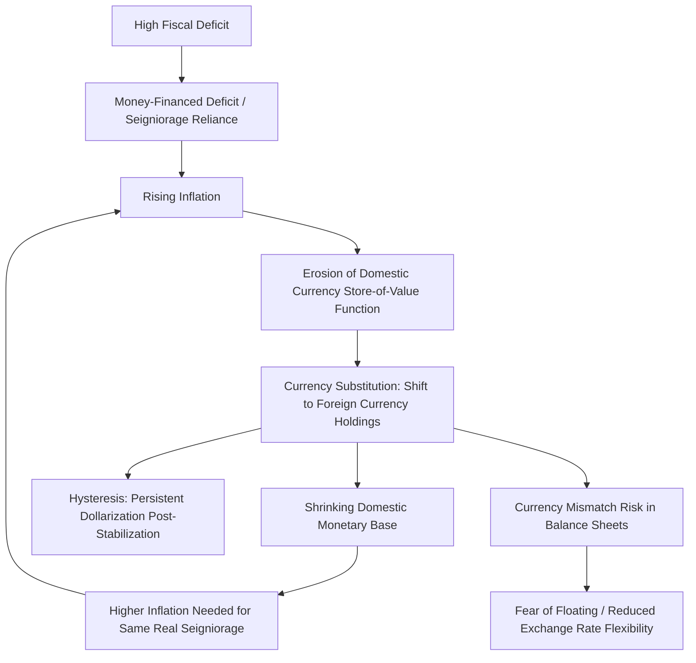

## Dollarization and Currency Substitution

### Definition and Conceptual Framework

**Currency substitution** refers to the partial or extensive use of a foreign currency alongside or in place of the domestic currency to perform the standard functions of money: unit of account, medium of exchange, and store of value. **Dollarization** is the specific, commonly used term for this phenomenon when the foreign currency involved is the US dollar, though the same dynamics apply with the euro (sometimes called "euroization") or other reserve currencies.

These terms are often used interchangeably, but a useful analytical distinction exists:

- **Currency substitution** typically refers to foreign currency use as a *medium of exchange* — i.e., transactions and payments are conducted in foreign currency.
- **Asset substitution** (sometimes distinguished separately) refers to foreign currency use as a *store of value* — residents hold savings, deposits, or bonds denominated in foreign currency, even if daily transactions still use domestic currency.

In practice, these two phenomena tend to develop sequentially and reinforce each other: asset substitution (dollarized savings) often precedes and enables full currency substitution (dollarized transactions), especially once price quoting shifts to the foreign currency.

### Types of Dollarization

**Unofficial (de facto) dollarization**

- Occurs without formal government sanction; residents voluntarily hold foreign currency cash, foreign-currency-denominated bank deposits, or use foreign currency in informal transactions.
- The domestic currency remains legal tender and the government retains formal monetary sovereignty, but the foreign currency competes with it in practice.
- This is the most common form observed historically in Latin America, the former Soviet bloc, and parts of Africa and Asia.

**Semi-official (bimonetary) dollarization**

- The foreign currency is legally permitted as a parallel legal tender alongside the domestic currency, often for specific transaction types (e.g., large purchases, contracts, or government bonds).
- Wage and price setting may occur predominantly in domestic currency while savings and large transactions occur predominantly in foreign currency.

**Official (full) dollarization**

- The domestic currency is abolished entirely (or reduced to a token/subsidiary role, e.g., for coins) and the foreign currency becomes the sole or primary legal tender.
- Examples: Ecuador (2000), El Salvador (2001), Panama (since 1904), Zimbabwe (2009, later reintroducing a domestic currency and then abandoning it again in 2024).
- Under official dollarization, the country surrenders independent monetary policy and seigniorage revenue entirely to the anchor currency's issuer.

### Causes and Drivers

**Macroeconomic instability and inflation history**

The dominant driver in the development macroeconomics literature is a history of high or hyperinflation that erodes confidence in the domestic currency's function as a store of value. Once inflation exceeds a threshold at which the domestic currency loses purchasing power faster than alternatives, rational agents shift savings into foreign currency to preserve wealth. This is frequently modeled as a **portfolio substitution** decision.

**Hysteresis effect**

A key empirical and theoretical finding is that dollarization tends to persist even after the inflation that caused it is brought under control. This is termed the **ratchet effect** or **hysteresis in currency substitution**:

- Once transaction networks, price-quoting conventions, and financial contracts (e.g., dollar-denominated mortgages) become dollarized, switching back to domestic currency imposes costs (network externalities, contract renegotiation, loss of familiarity).
- Agents may not "de-dollarize" symmetrically as inflation falls, because the foreign currency now offers a form of insurance against *future* instability, and the switching costs are asymmetric.

**Institutional and policy credibility**

- Weak central bank independence, fiscal dominance (where monetary policy is used to finance deficits), and a history of exchange rate crises reduce trust in the domestic currency.
- Financial liberalization (removing capital controls, permitting foreign currency deposits) provides the legal/technical channel through which currency substitution can occur.

**Network externalities**

Currency use exhibits network effects: the more counterparties who accept and price in a currency, the more valuable it becomes to use that currency, creating a self-reinforcing dynamic once dollarization crosses a critical mass.

**Trade and remittance exposure**

Economies with large trade shares invoiced in dollars, or with substantial remittance inflows denominated in dollars, have a structural channel that facilitates dollar accumulation and use, independent of domestic inflation dynamics.

### Theoretical Modeling Approaches

**Currency substitution in money demand models**

Standard formulations extend the money demand function to include the expected return differential between domestic and foreign currency holdings. A simplified portfolio-balance representation:

$$\frac{M_d}{M_f} = f\left(i_f - i_d + E[\dot{e}]\right)$$

Where:

- $M_d$ = domestic currency money holdings
- $M_f$ = foreign currency money holdings
- $i_d$, $i_f$ = domestic and foreign nominal interest rates
- $E[\dot{e}]$ = expected rate of depreciation of the domestic currency

As expected depreciation $E[\dot{e}]$ rises (driven by inflation expectations), the model predicts a shift in the portfolio share toward foreign currency ($M_f$ rises relative to $M_d$).

**Calvo-Vegh framework**

Guillermo Calvo and Carlos Végh's influential work formalizes currency substitution as a source of additional **inflation tax base erosion**: as currency substitution rises, the domestic monetary base shrinks relative to the economy, meaning that for a government relying on seigniorage, a *given* fiscal deficit financed by money creation requires a *higher* inflation rate to generate the same real revenue — creating a vicious cycle between inflation and further dollarization.

**Seigniorage implications**

Seigniorage revenue for the domestic government is approximately:

$$S = \frac{\Delta M_d}{P}$$

where $M_d$ is the domestic monetary base and $P$ is the price level. As currency substitution increases, the domestic monetary base $M_d$ shrinks in real and relative terms, directly reducing the government's seigniorage revenue capacity — an important fiscal cost of dollarization independent of its monetary policy implications.

### Macroeconomic Consequences

**Loss of independent monetary policy**

- Under full dollarization, the country cannot conduct independent interest rate policy or use exchange rate adjustment as a shock absorber.
- Under partial/unofficial dollarization, monetary policy transmission is weakened: interest rate changes on domestic currency instruments have muted effects on aggregate demand if a large share of credit and deposits are dollar-denominated.

**Balance sheet and currency mismatch risk**

A critical vulnerability is **currency mismatch**: firms, households, or the government may have dollar-denominated liabilities (loans) but domestic-currency-denominated income (wages, revenues in local currency). A depreciation of the domestic currency then sharply raises the real debt burden, even though it would normally help via the standard expenditure-switching channel (making exports more competitive). This is central to the **"fear of floating"** phenomenon:

- Central banks in highly dollarized economies often resist allowing their currency to depreciate, even when textbook macroeconomic conditions (e.g., a negative terms-of-trade shock) would call for it, because depreciation triggers balance sheet damage across dollar-indebted borrowers.
- This can lead to de facto pegged or heavily managed exchange rates even in countries that officially claim floating regimes.

**Financial stability risks**

- Dollarized banking systems face **liquidity risk** in foreign currency: the central bank cannot act as lender of last resort in a currency it does not issue (it cannot print dollars), limiting its ability to backstop dollar-denominated bank runs.
- **Credit risk** rises via the currency mismatch channel described above, since dollar-denominated loans to unhedged borrowers become non-performing more readily after depreciation.

**Loss of seigniorage and reduced fiscal flexibility**

As noted, the government loses the inflation tax as a (crude, distortionary, but real) financing tool. This can be beneficial from a discipline standpoint (removes the temptation of inflationary financing) but removes a shock-absorption mechanism in fiscal crises.

**Potential benefits: credibility and reduced inflation**

- Dollarization (especially official) can act as a strong nominal anchor, importing the credibility of the anchor currency's central bank and rapidly ending hyperinflation, as seen in Ecuador's stabilization after 2000.
- Reduced currency risk can lower borrowing costs and encourage foreign investment by eliminating exchange rate risk for cross-border transactions.
- It eliminates the possibility of competitive devaluation and reduces transaction costs in economies with heavy dollar trade/remittance exposure.

**Loss of exchange rate as an adjustment mechanism**

In the standard open-economy framework, nominal exchange rate depreciation is one channel for correcting external imbalances (via expenditure switching) and absorbing asymmetric shocks. Full dollarization removes this channel entirely, meaning that adjustment to negative shocks (e.g., a terms-of-trade deterioration) must occur through internal devaluation — wage and price deflation — which is typically slower and more painful, often manifesting in higher unemployment.

### Measuring Dollarization

Standard empirical proxies used in the literature and by institutions such as the IMF include:

| Measure | Formula / Definition | What It Captures |
| --- | --- | --- |
| Foreign currency deposit (FCD) ratio | Foreign currency deposits / Total deposits | Financial/asset substitution |
| Dollarization of credit | Foreign currency loans / Total loans | Currency mismatch exposure in lending |
| Currency substitution ratio | Foreign currency in circulation / (Foreign currency in circulation + Domestic currency in circulation) | Transaction-level substitution (harder to measure directly; often proxied) |
| De jure dollarization index | Categorical/qualitative index of legal foreign currency status | Institutional/legal dimension |

**Key Points**

- Foreign currency cash holdings are inherently difficult to measure directly since they circulate outside the banking system; researchers often rely on indirect proxies (e.g., US currency shipment data, survey-based estimates).
- The FCD ratio is the most widely available and used proxy due to its basis in bank supervisory data, but it captures asset substitution, not full transactional currency substitution.

### Case Studies

**Ecuador (official dollarization, 2000)**

- Adopted the US dollar as legal tender in January 2000 in response to a severe banking and currency crisis, with inflation exceeding 90% and a currency (the sucre) that had lost more than two-thirds of its value against the dollar in the prior year.
- Inflation fell sharply in subsequent years, and the economy stabilized, though Ecuador permanently lost independent monetary policy and the exchange rate as adjustment tools — a constraint that became especially binding during the 2014–2016 oil price collapse, since Ecuador is a significant oil exporter and could not use depreciation to cushion the terms-of-trade shock.

**El Salvador (official dollarization, 2001)**

- Dollarized to secure macroeconomic stability and closer financial integration with the US, a major destination for remittances and trade.
- More recently notable for adopting Bitcoin as additional legal tender in 2021, an unusual case of a formally dollarized economy introducing a second, non-fiat currency alongside the dollar. [Inference: the long-run macroeconomic effects of this dual-legal-tender arrangement remain an active empirical question given its recency and limited adoption data.]

**Zimbabwe (unofficial then official then re-abandoned)**

- Following hyperinflation that peaked at an extraordinarily high rate in 2008, Zimbabwe abandoned its domestic currency and permitted multi-currency use (predominantly USD) starting in 2009.
- Domestic currency (the RTGS dollar, later restructured) was reintroduced in phases from 2016–2019, but persistent inflation and confidence problems led to continued heavy reliance on the US dollar in practice.
- In 2024, Zimbabwe introduced a new gold-backed currency (the ZiG) in another attempt to displace dollar dependence. [Unverified: at time of writing, the durability of ZiG's stabilization and the pace of de-dollarization was still an unresolved, evolving situation requiring current data to assess.]

**Post-Soviet states and Latin America (unofficial dollarization)**

- Countries such as Argentina, Peru, Bolivia, and several post-Soviet states experienced significant unofficial dollarization following hyperinflation episodes in the late 1980s and 1990s, illustrating the hysteresis pattern: Peru and Bolivia retained substantial dollarization in bank deposits for years after inflation was brought down to low single digits.

### Dollarization vs. Related Exchange Rate Regimes

It is useful to distinguish dollarization from adjacent but distinct regimes:

- **Currency board**: The domestic currency continues to exist but is fully backed by and fixed to a foreign anchor currency at a legally fixed rate (e.g., Hong Kong's peg to the USD, Bulgaria's historical peg to the DM/euro). Unlike dollarization, the domestic currency is retained, and limited seigniorage may still exist.
- **Fixed exchange rate peg**: The central bank targets a fixed rate to a foreign currency but retains the domestic currency and discretionary ability to adjust or abandon the peg — a much weaker commitment than either a currency board or dollarization.
- **Monetary union** (e.g., the Eurozone): Multiple countries share a currency but jointly participate in its governance through a shared central bank, unlike dollarization where the small economy is a pure "price taker" with no voice in the anchor currency's monetary policy.

### De-dollarization Strategies

Policy approaches attempted by countries seeking to reverse currency substitution include:

- **Achieving and sustaining low, stable inflation** over a prolonged period to rebuild confidence in the domestic currency — the necessary but not sufficient condition given hysteresis effects.
- **Indexation mechanisms** (e.g., Chile's historical use of the UF, an inflation-indexed unit of account) that allow contracts to be denominated in domestic-currency-linked units without requiring literal foreign currency use, partially substituting for the store-of-value function without full dollarization.
- **Prudential and regulatory measures**: imposing higher reserve requirements or capital charges on foreign currency deposits/loans, or limiting the share of bank balance sheets that can be dollar-denominated, to disincentivize currency mismatch.
- **Developing domestic-currency capital markets**: issuing long-term domestic-currency government debt to create a "risk-free" domestic currency benchmark asset that can anchor a broader domestic-currency yield curve.
- **Mandated redenomination**: in rare cases, governments have required contracts and deposits above a certain size to be redenominated into domestic currency, though this carries credibility and legal risk if not carefully sequenced.

### Diagram: Currency Substitution Feedback Loop

### Related Topics

- Fear of floating and exchange rate regime choice in emerging markets
- Original sin (inability of emerging economies to borrow internationally in domestic currency)
- Sudden stops and capital flow reversals in dollarized economies
- Optimal currency area theory and monetary union trade-offs
- Fiscal dominance and central bank independence
- Balance sheet effects and the "third generation" currency crisis models
- Seigniorage and the inflation tax as government revenue sources
- Financial dollarization and macroprudential regulation