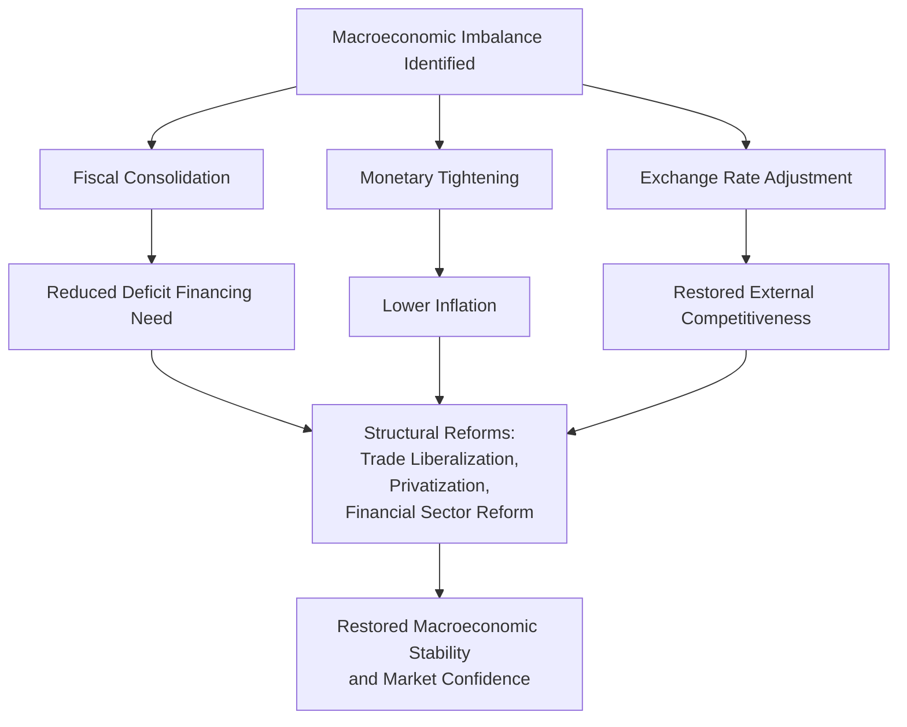
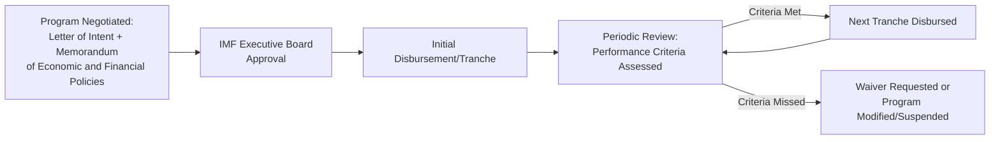

## Macroeconomic Stabilization Programs and IMF Conditionality

### Overview

Macroeconomic stabilization programs are policy packages designed to correct severe macroeconomic imbalances — typically high inflation, unsustainable fiscal deficits, balance of payments crises, or currency instability — and restore conditions for sustainable growth. IMF conditionality refers to the set of policy commitments a country must undertake in exchange for financial assistance from the International Monetary Fund. The two are closely linked historically, as IMF-supported programs are the most prominent institutional mechanism through which stabilization policy has been implemented globally since the Bretton Woods era.

### The Rationale for Stabilization Programs

#### When Stabilization Is Triggered

**Key Points**

- **Balance of payments crises:** A country runs out of foreign exchange reserves needed to pay for imports, service external debt, or defend its currency.
- **Hyperinflation or high chronic inflation:** Fiscal deficits monetized by the central bank drive persistent, accelerating price increases.
- **Currency crises:** Speculative attacks or loss of confidence force abrupt devaluation or abandonment of a fixed exchange rate regime.
- **Sovereign debt distress:** A government faces default or near-default on external or domestic debt obligations.
- **Twin deficits:** Simultaneous fiscal deficit and current account deficit, often financed by unsustainable capital inflows.

#### The Financing Gap Problem

Stabilization is fundamentally about closing a **financing gap** — the difference between a country's foreign exchange needs (imports, debt service) and its available foreign exchange resources (exports, reserves, capital inflows).

$$\text{Financing Gap} = (\text{Imports} + \text{Debt Service}) - (\text{Exports} + \text{Reserves} + \text{Capital Inflows})$$

IMF financing is designed to bridge this gap temporarily while policy adjustments close it more permanently.

### The IMF's Institutional Role

#### Historical Background

- Established in 1944 at the Bretton Woods Conference, originally to oversee the fixed exchange rate system and provide short-term balance of payments support.
- After the collapse of Bretton Woods (1971–1973), the IMF's role shifted increasingly toward crisis lending and structural adjustment, particularly for developing and emerging market economies.
- Major IMF-supported stabilization episodes include Latin America's debt crisis (1980s), the Asian Financial Crisis (1997–1998), Russia's transition crisis (1990s), Argentina (2001-2002 and subsequent programs), and various Eurozone periphery programs during the 2010–2015 sovereign debt crisis (Greece, Portugal, Ireland).

#### IMF Lending Facilities (Representative Examples)

| Facility | Typical Use Case |
| --- | --- |
| **Stand-By Arrangement (SBA)** | Short-term balance of payments support, the IMF's most traditional instrument |
| **Extended Fund Facility (EFF)** | Longer-term support for structural balance of payments problems requiring deeper reform |
| **Rapid Financing Instrument (RFI)** | Emergency assistance with limited conditionality for urgent balance of payments needs |
| **Poverty Reduction and Growth Trust (PRGT)** | Concessional lending for low-income countries |
| **Flexible Credit Line (FCL)** | Precautionary facility for countries with strong fundamentals, pre-qualified with minimal conditionality |

[Unverified] Specific facility names, terms, and eligibility criteria are periodically revised by the IMF; consult current IMF documentation for up-to-date facility structures, as this list reflects standard, long-documented facility types rather than a real-time snapshot.

### The Standard Stabilization Policy Package

#### Core Components

##### 1. Fiscal Consolidation ("Austerity")

Reducing the government budget deficit through spending cuts, tax increases, or both, aimed at reducing the government's financing needs and, where relevant, monetization of the deficit.

$$\text{Primary Balance Target} = T - G_{\text{primary}} \geq \text{Target}\%\text{ of GDP}$$

where $T$ is government revenue and $G_{\text{primary}}$ is non-interest government expenditure.

##### 2. Monetary Tightening

Raising interest rates and/or restricting money supply growth to combat inflation and support currency stability, often accompanied by central bank independence reforms to prevent future deficit monetization.

##### 3. Exchange Rate Adjustment

Devaluation (under fixed/pegged regimes) or managed depreciation (under floating regimes) to restore external competitiveness, often combined with unification of multiple exchange rates where these previously existed.

##### 4. Structural Reforms

Longer-term supply-side measures typically bundled into IMF programs, including:

- **Trade liberalization:** Reducing tariffs and non-tariff barriers.
- **Privatization:** Divesting state-owned enterprises to reduce fiscal burden and improve efficiency.
- **Financial sector reform:** Bank recapitalization, prudential regulation strengthening, interest rate liberalization.
- **Labor market reforms:** Increasing wage and employment flexibility.
- **Subsidy reform:** Reducing or better targeting energy, food, or other consumption subsidies.

### IMF Conditionality: Mechanics

#### Definition

Conditionality refers to the specific policy commitments a borrowing country agrees to as terms for receiving and continuing to receive IMF financing, monitored through a formal review process.

#### Types of Conditionality

| Type | Description |
| --- | --- |
| **Prior actions** | Specific measures a country must implement *before* the IMF Executive Board approves a loan or completes a review |
| **Quantitative performance criteria (QPCs)** | Measurable macroeconomic targets (e.g., fiscal deficit ceiling, net international reserves floor, monetary aggregate limits) that must be met by specified test dates |
| **Structural benchmarks** | Non-quantifiable structural reform milestones (e.g., passage of specific legislation, completion of a bank audit) used to track reform implementation |
| **Indicative targets** | Softer quantitative guideposts used when data uncertainty makes hard performance criteria impractical |

#### Program Review Cycle

Financing is typically disbursed in **tranches** conditional on successive reviews, rather than as a single lump sum, giving the IMF ongoing leverage to ensure policy commitments are maintained throughout the program's duration.

### Critiques of IMF Conditionality and Stabilization Programs

#### Critique 1: Pro-Cyclical Austerity Deepens Recessions

Critics, including many Post-Keynesian and structuralist economists, argue that fiscal and monetary tightening imposed during a crisis — precisely when domestic demand is already contracting — can deepen and prolong recessions rather than restore stability, a critique often summarized as **pro-cyclical conditionality**.

[Speculation] The magnitude of this effect (the "fiscal multiplier" under crisis conditions) has been the subject of extensive and unresolved empirical debate within economics, including a well-known internal IMF research reassessment around 2012–2013 regarding whether multipliers were larger than previously assumed in some contexts. Consult current IMF research documentation for the state of that debate.

#### Critique 2: One-Size-Fits-All Policy Design

Historical criticism, closely associated with economist Joseph Stiglitz, holds that IMF programs in the 1980s–1990s often applied broadly similar policy prescriptions (associated with what became known as the **Washington Consensus**) across countries with very different structural, institutional, and social circumstances, without sufficient adaptation to local context.

#### Critique 3: Social and Distributional Costs

Critics argue that subsidy removal, public sector layoffs, and spending cuts disproportionately affect lower-income populations, and that structural adjustment programs historically paid insufficient attention to social safety nets and distributional consequences, particularly in 1980s–1990s Sub-Saharan African and Latin American programs.

#### Critique 4: Sovereignty and Democratic Accountability Concerns

Some critics argue that conditionality effectively transfers significant domestic policy-making authority to an external institution, raising concerns about democratic accountability, since elected governments must implement policies substantially shaped by conditionality agreements as a condition of financing.

#### Critique 5: Moral Hazard

An opposing critique (more common among market-oriented economists) argues that IMF bailouts can create **moral hazard**: if investors and governments anticipate that the IMF will provide rescue financing during a crisis, this may reduce incentives for prudent fiscal management and risk assessment beforehand.

#### Critique 6: Premature Capital Account Liberalization

Critics of the Asian Financial Crisis-era IMF response (including some mainstream economists such as Jagdish Bhagwati and Joseph Stiglitz) argued that IMF-encouraged capital account liberalization prior to the crisis, combined with the specific stabilization measures applied during it, may have exacerbated rather than resolved the underlying instability in some cases. [Inference] This remains a debated interpretation of that specific historical episode rather than a settled consensus finding.

### IMF and Institutional Reforms Since the 1990s–2000s

**Key Points**

- Following criticism of 1980s–1990s programs, the IMF has stated increased attention to **social spending floors** in program design, intended to protect targeted social programs even amid fiscal consolidation.
- The concept of **"ownership"** — encouraging borrowing countries to design reform programs reflecting genuine domestic policy consensus, rather than externally imposed templates — has been emphasized in IMF institutional documentation since the early 2000s.
- Streamlining of structural conditionality occurred after 2002 reforms aimed at focusing conditions more narrowly on measures deemed critical to program goals.
- [Unverified] The extent to which these stated reforms have changed practical program design and outcomes is itself subject to ongoing empirical and political debate; this document does not assess that question definitively, and current IMF program design should be verified against up-to-date IMF documentation.

### Comparison: Orthodox Stabilization vs. Heterodox Alternatives

| Dimension | Orthodox (IMF-Style) Stabilization | Heterodox Alternatives |
| --- | --- | --- |
| Fiscal response to crisis | Consolidation/austerity | Counter-cyclical spending, protecting demand |
| Exchange rate policy | Often devaluation/floating | Sometimes capital controls to manage volatility |
| Sequencing emphasis | Rapid stabilization, then structural reform | Gradualism, sequencing reforms to social/institutional capacity |
| View of capital account liberalization | Generally favorable (with caveats post-1990s) | More skeptical, favoring selective capital controls |
| Primary risk emphasized | Fiscal/monetary indiscipline, inflation | Demand collapse, social/distributional costs |

### Illustrative Program Timeline

<svg xmlns="http://www.w3.org/2000/svg" viewBox="0 0 550 300">
<text x="275" y="25" font-size="16" font-family="sans-serif" text-anchor="middle" font-weight="bold">Stylized IMF Program Timeline (svg_diagram)</text>
<line x1="50" y1="150" x2="500" y2="150" stroke="black" stroke-width="2" />
<circle cx="80" cy="150" r="6" fill="#c01c28" />
<text x="80" y="130" font-size="11" text-anchor="middle" font-family="sans-serif">BoP Crisis</text>
<text x="80" y="180" font-size="10" text-anchor="middle" font-family="sans-serif">Reserves depleted</text>
<circle cx="180" cy="150" r="6" fill="#1a5fb4" />
<text x="180" y="130" font-size="11" text-anchor="middle" font-family="sans-serif">Negotiation</text>
<text x="180" y="180" font-size="10" text-anchor="middle" font-family="sans-serif">Letter of Intent</text>
<circle cx="280" cy="150" r="6" fill="#1a5fb4" />
<text x="280" y="130" font-size="11" text-anchor="middle" font-family="sans-serif">Board Approval</text>
<text x="280" y="180" font-size="10" text-anchor="middle" font-family="sans-serif">First Tranche</text>
<circle cx="380" cy="150" r="6" fill="#1a5fb4" />
<text x="380" y="130" font-size="11" text-anchor="middle" font-family="sans-serif">Review 1</text>
<text x="380" y="180" font-size="10" text-anchor="middle" font-family="sans-serif">Performance Check</text>
<circle cx="480" cy="150" r="6" fill="#2ec27e" />
<text x="480" y="130" font-size="11" text-anchor="middle" font-family="sans-serif">Program Completion</text>
<text x="480" y="180" font-size="10" text-anchor="middle" font-family="sans-serif">Stability Restored (goal)</text>
</svg>

**Note:** [Speculation] This is a generalized stylized template; actual program timelines, number of reviews, and outcomes vary substantially by country and program, and programs can also be suspended, modified, or fail to reach completion.

### Conclusion

Macroeconomic stabilization programs and IMF conditionality represent the institutionalized mechanism through which countries facing severe macroeconomic imbalances have historically sought external financing paired with policy commitments to restore fiscal, monetary, and external sustainability. While grounded in a coherent economic logic — closing financing gaps, restoring price stability, and rebuilding market confidence — the design and social consequences of these programs have generated sustained debate spanning macroeconomic effectiveness (pro-cyclicality, fiscal multipliers), distributional equity, institutional design (one-size-fits-all critiques), and questions of national sovereignty in economic policy-making. The IMF has stated it has undertaken reforms since the 1990s intended to address several of these critiques, though the practical impact of these reforms remains a subject of ongoing empirical assessment.

**Related Topics**

- Washington Consensus and structural adjustment programs
- Fiscal multipliers and the austerity-growth debate
- Currency crises and speculative attack models (first- and second-generation crisis models)
- Sovereign debt restructuring and debt sustainability analysis
- Capital controls and capital account liberalization sequencing
- Central bank independence and inflation targeting
- Balance of payments accounting and the financing gap approach
- Social safety nets in structural adjustment design
- Twin deficits hypothesis (fiscal and current account deficits)