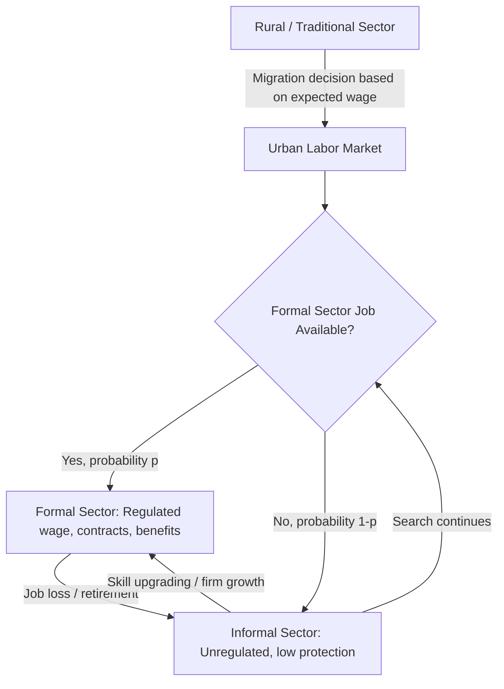

## Informality and Dual Labor Markets in Developing Economies

### Overview

Informality refers to economic activity — production, employment, and exchange — that occurs outside the regulatory, tax, and legal frameworks of the state. Dual labor market theory describes economies where labor is segmented into two structurally distinct sectors: a formal sector with regulated contracts, benefits, and legal protections, and an informal sector characterized by unregulated, often precarious employment. This duality is one of the defining structural features of developing economies and has significant implications for growth, productivity, inequality, and policy design.

### Defining Informality

**Key Points**

- The **International Labour Organization (ILO)** defines informal employment as jobs lacking basic legal or social protections, whether inside or outside informal enterprises.
- **Informal sector** refers to unincorporated enterprises that are unregistered or below a size threshold set by national legislation.
- **Informal employment** is broader than the informal sector — it includes informal jobs within formal firms (e.g., undeclared workers), domestic work, and contributing family labor.
- Distinguish between:
  - *Enterprise-based informality*: unregistered firms, no tax compliance, no legal recognition.
  - *Job-based informality*: workers lacking contracts, social security, or labor law coverage, regardless of firm status.

### Measuring Informality

Common metrics include:

- **Legalistic definition**: absence of registration, tax payment, or compliance with labor regulations.
- **Social protection definition**: lack of access to pension contributions, health insurance, or unemployment benefits.
- **Productivity definition**: informal workers concentrated in low-productivity, labor-intensive activities.

$$\text{Informality Rate} = \frac{\text{Informal Employment}}{\text{Total Employment}} \times 100$$

In many developing economies, informal employment constitutes 50–80% of non-agricultural employment, and even higher shares when agriculture is included. [Unverified — exact figures vary substantially by country, survey methodology, and year; consult ILOSTAT or national labor force surveys for current estimates.]

### Theoretical Models of Dual Labor Markets

#### 1. Lewis Model (Surplus Labor)

Arthur Lewis's dual-sector model posits a traditional (subsistence/agricultural) sector with surplus labor and near-zero marginal productivity, alongside a modern (capitalist) sector that absorbs labor at a constant "institutional" wage above subsistence. Growth occurs as capital accumulation in the modern sector draws labor out of the traditional sector until the surplus is exhausted (the "Lewis turning point").

$$w_m = w_a(1 + \theta)$$

where $w_m$ is the modern-sector wage, $w_a$ is the average agricultural wage/subsistence income, and $\theta$ is a premium reflecting urban cost-of-living or incentive requirements.

#### 2. Harris–Todaro Model

The Harris–Todaro (1970) framework explains persistent urban unemployment and informality despite rural-urban migration, by positing that migrants base decisions on **expected** urban income rather than actual urban wages.

$$E[w_u] = p \cdot w_f$$

where $p$ is the probability of securing a formal-sector job and $w_f$ is the fixed formal wage (often held above market-clearing levels due to minimum wage laws or union power). Migration continues until expected urban income equals the rural wage $w_r$:

$$p \cdot w_f = w_r$$

In equilibrium, this generates urban unemployment or absorption into an informal "waiting sector," since $p < 1$ implies a queue for formal jobs. The informal sector, in this extension, functions as a holding pattern for migrants awaiting formal employment.

#### 3. Segmented Labor Market Theory

Unlike competitive models where informality is a voluntary choice reflecting worker preferences, segmentation theory argues labor markets are structurally divided by:

- **Barriers to entry**: licensing, minimum capital requirements, skill credentialing.
- **Institutional rigidities**: labor regulations that raise formal-sector hiring costs, pushing firms to informality.
- **Discrimination and social exclusion**: informality concentrated among women, migrants, and low-caste/ethnic minority groups. [Unverified — the extent of discrimination-driven segmentation is context-dependent and contested in the empirical literature.]

#### 4. Voluntary Informality / Exit View

An alternative view (associated with Hernando de Soto and later formalized by Maloney) argues informality can be a **rational choice** rather than exclusion — informal self-employment may offer higher returns, flexibility, or autonomy than low-paying formal jobs, especially where formal-sector regulation is costly relative to its benefits.

### Diagram: Segmented Labor Market Flows

### Causes of Informality

**Key Points**

- **High regulatory costs**: costly business registration, licensing, and compliance procedures (de Soto's "extra-legal" cost thesis).
- **Labor market rigidities**: minimum wages, severance pay mandates, and firing restrictions that raise the cost of formal labor.
- **Tax burden**: high payroll taxes and corporate tax rates relative to state capacity to enforce and deliver services.
- **Weak state capacity**: limited enforcement, inspection, and judicial infrastructure to monitor compliance.
- **Low human capital**: informal workers often possess skills mismatched to formal-sector demand.
- **Dualistic industrial structure**: capital-intensive formal firms cannot absorb a rapidly growing labor force, especially amid demographic transitions.
- **Weak social contract**: when tax compliance yields few visible public benefits, firms and workers rationally opt out (the "exit" narrative).

### Consequences of Informality

| Dimension | Effect |
| --- | --- |
| Productivity | Informal firms are typically smaller, less capital-intensive, and less productive — contributing to aggregate productivity gaps (misallocation) |
| Fiscal | Erodes the tax base, limiting public investment and social spending capacity |
| Social protection | Informal workers lack pensions, health insurance, unemployment insurance, exposing them to shocks |
| Inequality | Wage gaps between formal and informal workers persist even after controlling for observable characteristics — a segmentation "penalty" |
| Macro stability | Informal sector can act as a buffer/shock absorber during recessions, moderating open unemployment but at the cost of underemployment |
| Growth | Misallocation of resources toward informal firms with limited access to credit and formal markets slows aggregate TFP growth |

### The Informal Sector as a Business Cycle Buffer

**Example**

During macroeconomic downturns, formal-sector employment often contracts sharply due to firing costs and rigid contracts, while informal employment expands as displaced workers move into self-employment or unregulated wage work. This **countercyclical informality** pattern has been documented in Latin American labor markets during the 1990s–2000s crises. [Unverified — countercyclicality is not universal; some economies show procyclical informal employment depending on sector composition and the nature of the shock.]

### Dualism and Misallocation: A Formal Framework

Consider an economy with two sectors, formal ($F$) and informal ($I$), each with production functions:

$$Y_F = A_F K_F^{\alpha} L_F^{1-\alpha}, \quad Y_I = A_I K_I^{\alpha} L_I^{1-\alpha}$$

If $A_F > A_I$ (formal firms are more productive, reflecting better technology, access to credit, and economies of scale) and labor cannot freely reallocate toward the formal sector due to entry barriers or hiring frictions, then aggregate output is:

$$Y = Y_F + Y_I < Y^*$$

where $Y^*$ is the output achievable if labor were allocated to equalize marginal products across sectors. The wedge $Y^* - Y$ represents the **misallocation loss** attributable to labor market duality — a channel emphasized in the Hsieh–Klenow style resource misallocation literature applied to developing-country informality.

### Policy Responses

**Key Points**

- **Simplification of formalization**: streamlined business registration (e.g., Brazil's *SIMPLES* regime, one-stop registration windows).
- **Reducing non-wage labor costs**: lowering payroll tax burdens or offering formalization subsidies.
- **Contributory-noncontributory tradeoffs**: expanding non-contributory social protection (e.g., universal health coverage) can reduce workers' incentive to formalize if benefits are already accessible informally — a documented unintended consequence in Latin American health reform. [Unverified — magnitude and even direction of this effect is debated across studies.]
- **Progressive labor regulation reform**: adjusting severance pay and minimum wage design to reduce the formal-informal wedge without eroding worker protections.
- **Credit and market access**: extending formal credit, insurance, and market linkages to informal firms to raise their productivity ("upgrading" strategies) rather than purely enforcement-based formalization.
- **Enforcement and inspection capacity**: strengthening labor inspectorates, though enforcement alone without addressing underlying cost structures tends to have limited and sometimes regressive effects.

### Empirical Regularities Across Developing Economies

**Key Points**

- Informality tends to **decline with GDP per capita**, but the relationship is non-linear and has notable exceptions (e.g., parts of Latin America exhibit high informality despite middle-income status — the "missing middle" phenomenon).
- Firm-size distributions in developing economies are often **bimodal**: many very small informal firms and a smaller number of large formal firms, with few medium-sized enterprises — consistent with regulatory thresholds discouraging firm growth.
- Informality is disproportionately concentrated among **youth, women, and low-education workers**.
- Urbanization and structural transformation (movement from agriculture to industry/services) generally reduce informality over the development path, echoing the Lewis framework, though services-sector informality can persist or even rise during premature deindustrialization. [Inference — this pattern is consistent with structural transformation literature but is not a universal law across all developing economies.]

### Worked Numerical Example

**Example**

Suppose a developing economy has a labor force of 40 million, with 26 million in informal employment.

$$\text{Informality Rate} = \frac{26}{40} \times 100 = 65\%$$

If the formal sector wage is $600/month and the informal sector wage is $350/month, the formal-informal wage gap is:

$$\text{Wage Gap} = \frac{600 - 350}{350} \times 100 \approx 71.4\%$$

Part of this gap reflects genuine productivity differences (compensating differential), and part may reflect segmentation rents accruing to formal-sector "insiders" — decomposing the two typically requires Mincerian wage regressions with sector controls (Oaxaca-Blinder decomposition methods).

### Diagram: Formal-Informal Wage and Employment Determination (Harris-Todaro)

<svg xmlns="http://www.w3.org/2000/svg" viewBox="0 0 640 420" font-family="Helvetica, Arial, sans-serif">
<text x="320" y="24" text-anchor="middle" font-size="15" font-weight="bold" fill="#1a1a1a">Harris-Todaro Equilibrium (svg_diagram)</text>
<line x1="70" y1="360" x2="600" y2="360" stroke="#333" stroke-width="1.5" />
<line x1="70" y1="360" x2="70" y2="40" stroke="#333" stroke-width="1.5" />
<text x="335" y="395" text-anchor="middle" font-size="12" fill="#333">Urban Employment (L_u)</text>
<text x="30" y="200" text-anchor="middle" font-size="12" fill="#333" transform="rotate(-90 30 200)">Wage</text>
<line x1="70" y1="120" x2="600" y2="120" stroke="#c0392b" stroke-width="2" />
<text x="605" y="124" font-size="11" fill="#c0392b">w_f (fixed formal wage)</text>
<path d="M 70 340 Q 300 200 600 90" stroke="#2980b9" stroke-width="2" fill="none" />
<text x="605" y="90" font-size="11" fill="#2980b9">p·w_f (expected wage)</text>
<line x1="70" y1="300" x2="600" y2="300" stroke="#27ae60" stroke-width="2" stroke-dasharray="5,3" />
<text x="605" y="304" font-size="11" fill="#27ae60">w_r (rural wage)</text>
<line x1="330" y1="360" x2="330" y2="40" stroke="#888" stroke-width="1" stroke-dasharray="3,3" />
<circle cx="330" cy="300" r="4" fill="#000" />
<text x="340" y="285" font-size="11" fill="#000">Migration equilibrium</text>
<text x="150" y="330" font-size="11" fill="#000">Informal / unemployed</text>
<text x="430" y="105" font-size="11" fill="#000">Formal employed</text>
</svg>

### Common Pitfalls and Misconceptions

**Key Points**

- Informality is **not synonymous with poverty**, though the two are correlated — some informal entrepreneurs earn more than formal-sector wage employees.
- Informality is **not solely a labor-supply phenomenon**; regulatory design and enforcement (labor-demand side) are equally central.
- Reducing informality through **enforcement alone**, without addressing regulatory costs or improving formal-sector benefits, can reduce output and employment rather than expand formalization.
- Informal and formal sectors are often **linked through subcontracting**, not fully separate — many informal firms supply inputs to formal-sector value chains.

### Related Topics

- Dutch Disease and structural transformation
- Structural transformation and the Lewis turning point
- Labor market rigidities and minimum wage policy in developing economies
- Misallocation and aggregate productivity (Hsieh-Klenow framework)
- Social protection systems and non-contributory pensions
- Urbanization and rural-urban migration models
- Firm size distributions and the "missing middle" phenomenon
- Tax base erosion and fiscal capacity in low-income countries
- Gender and informality in labor markets