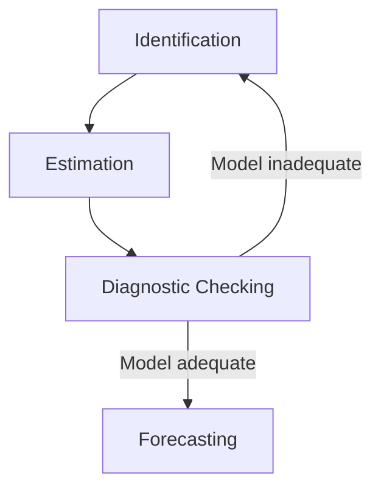
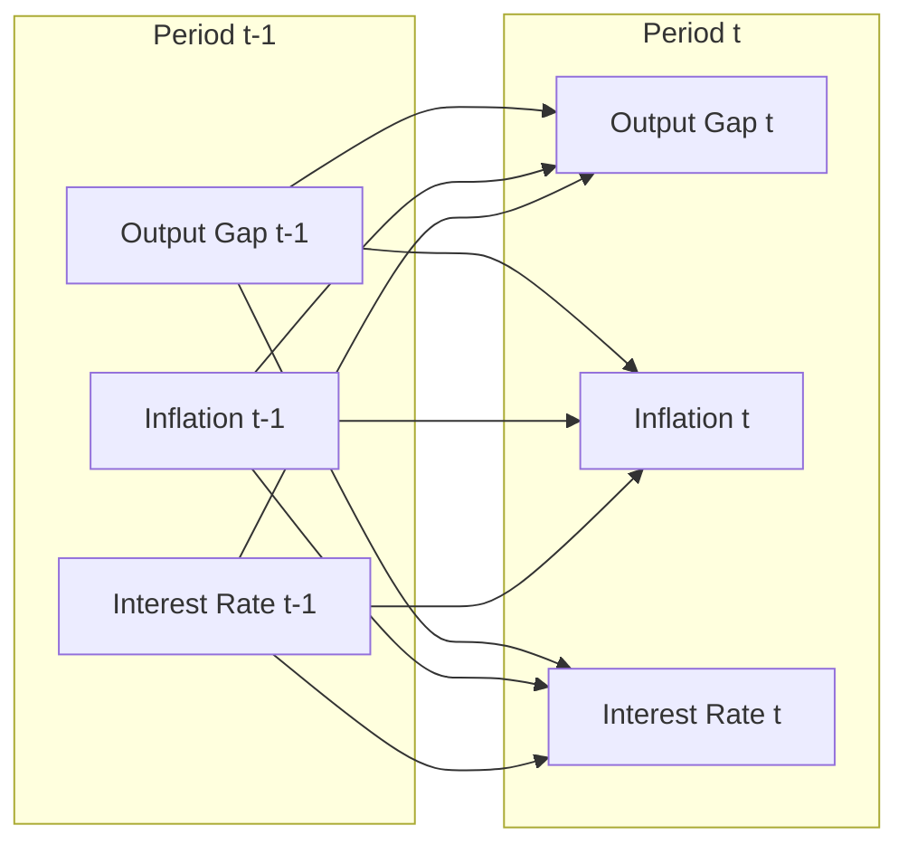

## Time Series Methods: ARIMA and VAR Models

### Overview

Time series methods form the empirical backbone of macroeconomic forecasting. Two families dominate applied macro work: univariate **ARIMA** (AutoRegressive Integrated Moving Average) models, which forecast a single series from its own history, and multivariate **VAR** (Vector Autoregression) models, which jointly model the dynamic interdependencies among several macroeconomic variables. Both rest on the assumption that past patterns in the data carry information about future outcomes, but they differ substantially in structure, use cases, and the economic questions they can answer.

---

### Foundations: Stochastic Processes and Stationarity

**Stationarity**

A time series $\{y_t\}$ is **covariance (weakly) stationary** if its first two moments do not depend on time:

$$E(y_t) = \mu \quad \text{for all } t$$

$$\text{Var}(y_t) = \sigma^2 \quad \text{for all } t$$

$$\text{Cov}(y_t, y_{t-k}) = \gamma_k \quad \text{depends only on } k$$

Stationarity is central because ARIMA and VAR models (in their standard forms) rely on stable statistical relationships. Most macroeconomic levels (GDP, price indices, money supply) are non-stationary, typically exhibiting stochastic trends; growth rates or differences are often stationary.

**Unit Roots and Differencing**

A series with a **unit root** follows a process like:

$$y_t = y_{t-1} + \varepsilon_t$$

This is a random walk — shocks have permanent effects, and variance grows with $t$. Differencing,

$$\Delta y_t = y_t - y_{t-1}$$

often converts an integrated series into a stationary one. A series requiring $d$ differences to achieve stationarity is said to be integrated of order $d$, denoted $I(d)$.

**Testing for unit roots** — the **Augmented Dickey-Fuller (ADF) test** is standard:

$$\Delta y_t = \alpha + \beta t + \rho y_{t-1} + \sum_{i=1}^{p} \phi_i \Delta y_{t-i} + \varepsilon_t$$

The null hypothesis is $\rho = 0$ (unit root present, non-stationary). Rejecting the null supports stationarity. The **KPSS test** is often used complementarily, with stationarity as the null rather than the alternative, since ADF has low power in small samples.

[Inference] In practice, ADF and KPSS often disagree at the margins for macro series with near-unit-root persistence (e.g., inflation, interest rates), so applied researchers commonly report both and exercise judgment.

---

### ARIMA Models

**Model Structure**

An ARIMA$(p,d,q)$ model combines three components:

1. **AR(p)** — Autoregressive component: current value depends on $p$ past values
2. **I(d)** — Integration order: number of differences needed for stationarity
3. **MA(q)** — Moving average component: current value depends on $q$ past forecast errors

The general form, after differencing $d$ times to obtain $w_t = \Delta^d y_t$:

$$w_t = c + \phi_1 w_{t-1} + \phi_2 w_{t-2} + \dots + \phi_p w_{t-p} + \varepsilon_t + \theta_1 \varepsilon_{t-1} + \dots + \theta_q \varepsilon_{t-q}$$

where $\varepsilon_t$ is white noise: $\varepsilon_t \sim \text{i.i.d.}(0, \sigma^2)$.

Using the lag operator $L$ (where $L y_t = y_{t-1}$), this is compactly written as:

$$\phi(L)(1-L)^d y_t = c + \theta(L)\varepsilon_t$$

with $\phi(L) = 1 - \phi_1 L - \dots - \phi_p L^p$ and $\theta(L) = 1 + \theta_1 L + \dots + \theta_q L^q$.

**Sub-cases:**

- ARIMA$(p,0,0)$ = AR$(p)$
- ARIMA$(0,0,q)$ = MA$(q)$
- ARIMA$(p,0,q)$ = ARMA$(p,q)$, applicable only if the series is already stationary

**Invertibility and Stationarity Conditions**

- The AR component is stationary if the roots of $\phi(L) = 0$ lie outside the unit circle.
- The MA component is invertible (can be rewritten as an infinite AR process) if the roots of $\theta(L) = 0$ lie outside the unit circle.

Invertibility ensures a unique, meaningful mapping between the MA representation and an equivalent AR representation, which matters for interpretation and estimation.

**The Box-Jenkins Methodology**

The classical approach to building ARIMA models proceeds in stages:

**Step 1 — Identification**

- Plot the series to detect trend, seasonality, structural breaks
- Test for stationarity (ADF, KPSS); apply differencing if needed
- Examine the **ACF** (autocorrelation function) and **PACF** (partial autocorrelation function):
  - AR$(p)$: PACF cuts off after lag $p$; ACF decays gradually
  - MA$(q)$: ACF cuts off after lag $q$; PACF decays gradually
  - ARMA$(p,q)$: both decay gradually

**Step 2 — Estimation**

Parameters are typically estimated via **Maximum Likelihood Estimation (MLE)**, since MA terms make the model nonlinear in parameters and ordinary least squares is not directly applicable in the presence of MA components.

**Step 3 — Diagnostic Checking**

- Examine residuals for remaining autocorrelation using the **Ljung-Box Q-statistic**:

$$Q = n(n+2)\sum_{k=1}^{h} \frac{\hat{\rho}_k^2}{n-k}$$

Under the null of no autocorrelation, $Q \sim \chi^2_h$ (adjusted for estimated parameters). A significant statistic indicates model misspecification.

- Check residuals for normality and homoscedasticity; residual patterns suggest returning to identification.

**Step 4 — Forecasting**

Point forecasts and confidence intervals are generated recursively using the fitted model, with forecast error variance increasing with the horizon.

**Model Selection Criteria**

When comparing candidate $(p,d,q)$ specifications, information criteria penalize overfitting:

$$AIC = -2\ln(L) + 2k$$

$$BIC = -2\ln(L) + k\ln(n)$$

where $L$ is the maximized likelihood, $k$ is the number of parameters, and $n$ is the sample size. **BIC** penalizes complexity more heavily and tends to select more parsimonious models; **AIC** tends to be more accurate for short-horizon forecasting. [Inference] In practice, macro forecasters often select the model with the lowest BIC when the goal is parsimony and interpretability, and lowest AIC when pure forecast accuracy is the priority — this is standard practice guidance rather than a universal rule.

**Seasonal ARIMA (SARIMA)**

For seasonal macro data (e.g., quarterly GDP, monthly CPI), SARIMA$(p,d,q)(P,D,Q)_s$ extends the model with seasonal AR, differencing, and MA terms at seasonal lag $s$:

$$\Phi(L^s)\phi(L)(1-L)^d(1-L^s)^D y_t = \Theta(L^s)\theta(L)\varepsilon_t$$

**Worked Example**

Suppose quarterly U.S. real GDP growth is modeled. After first-differencing log GDP achieves stationarity ($d=1$), ACF/PACF suggest an AR(1) term:

$$\Delta \ln(GDP_t) = 0.005 + 0.35 \, \Delta \ln(GDP_{t-1}) + \varepsilon_t$$

This ARIMA(1,1,0) implies growth is positively autocorrelated: above-average growth tends to be followed by above-average (though decaying) growth next quarter. A one-standard-deviation shock to $\varepsilon_t$ raises expected growth in $t+1$ by $0.35\sigma$, in $t+2$ by $0.35^2\sigma$, and so on, decaying geometrically.

**Strengths and Limitations**

- **Strengths:** parsimonious, requires only the series' own history, strong short-horizon forecasting performance, well-established inference theory
- **Limitations:** purely statistical, no economic structure or theory embedded; cannot address questions about causal relationships between variables; assumes linear dynamics; parameters may be unstable across regimes [Inference] particularly across monetary policy regime changes or structural breaks such as the 2008 financial crisis or COVID-19 shock.

---

### Vector Autoregression (VAR) Models

**Motivation**

Sims (1980) proposed VAR models as an atheoretical alternative to large-scale structural macro models, which relied on contestable identifying restrictions. VARs treat all included variables as jointly endogenous, letting the data speak with minimal a priori restrictions on dynamic relationships.

**Model Structure**

A VAR$(p)$ model with $k$ endogenous variables is a system in which each variable is regressed on lagged values of itself and all other variables:

$$Y_t = c + A_1 Y_{t-1} + A_2 Y_{t-2} + \dots + A_p Y_{t-p} + \varepsilon_t$$

where $Y_t$ is a $k \times 1$ vector of variables, $c$ is a $k \times 1$ vector of constants, each $A_i$ is a $k \times k$ coefficient matrix, and $\varepsilon_t$ is a $k \times 1$ vector of white-noise error terms (reduced-form shocks) with covariance matrix $\Sigma$.

**Example (bivariate VAR(1))** with output gap $y_t$ and inflation $\pi_t$:

$$y_t = c_1 + a_{11} y_{t-1} + a_{12} \pi_{t-1} + \varepsilon_{1t}$$

$$\pi_t = c_2 + a_{21} y_{t-1} + a_{22} \pi_{t-1} + \varepsilon_{2t}$$

Each equation includes lags of **both** variables — this cross-dependency is what distinguishes a VAR from a set of separate univariate ARIMA models.

**Estimation**

Because each equation has identical regressors (lags of all variables), **OLS applied equation-by-equation is equivalent to** the more general Generalized Least Squares/Seemingly Unrelated Regressions estimator, making VAR estimation computationally simple despite the multivariate structure.

**Lag Length Selection**

Lag order $p$ is chosen using information criteria analogous to ARIMA (AIC, BIC, HQIC) or the **likelihood ratio test** comparing nested VARs. Since additional lags rapidly consume degrees of freedom (each added lag adds $k^2$ parameters), parsimony matters more as $k$ grows.

**Stability Condition**

A VAR$(p)$ is stable (stationary) if all roots of

$$\det(I_k - A_1 z - A_2 z^2 - \dots - A_p z^p) = 0$$

lie outside the unit circle. Instability implies explosive or non-stationary dynamics, undermining standard inference and impulse response analysis.

**The Identification Problem: Reduced-Form vs. Structural VARs**

The **reduced-form VAR** above has error terms $\varepsilon_t$ that are typically correlated across equations (captured in $\Sigma$), reflecting contemporaneous co-movement not attributed to any specific structural shock. To interpret shocks economically, we need a **Structural VAR (SVAR)**:

$$B_0 Y_t = c^* + B_1 Y_{t-1} + \dots + B_p Y_{t-p} + u_t$$

where $u_t$ are structural shocks assumed mutually uncorrelated ($E(u_t u_t') = D$, diagonal), and $B_0$ captures contemporaneous structural relationships. The reduced-form errors relate to structural shocks via:

$$\varepsilon_t = B_0^{-1} u_t$$

Since $\Sigma = B_0^{-1} D (B_0^{-1})'$, recovering $B_0$ from $\Sigma$ alone is not possible without additional restrictions — $\Sigma$ has $k(k+1)/2$ unique elements, while $B_0$ has $k^2$ elements, leaving the system under-identified.

**Common Identification Schemes:**

1. **Recursive (Cholesky) identification** — Imposes a triangular ordering on $B_0$, so that variable 1 is contemporaneously unaffected by shocks to variables 2 through $k$, variable 2 is affected only by variable 1's shock, and so on. Simple but results depend on the (often arbitrary) ordering chosen. [Inference] Ordering sensitivity is widely acknowledged in the applied literature as a key weakness, though its practical severity varies by application.
2. **Short-run restrictions** — Theory-motivated zero restrictions on contemporaneous impact (e.g., monetary policy shocks do not affect output within the same quarter), following Sims (1980) and Christiano, Eichenbaum, and Evans (1999).
3. **Long-run restrictions (Blanchard-Quah)** — Restrictions on cumulative long-run effects, e.g., demand shocks have no permanent effect on output level, while supply shocks do.
4. **Sign restrictions** — Restrict the sign (not exact magnitude) of impulse responses based on theory (e.g., a contractionary monetary shock raises rates and lowers output), avoiding some of the rigidity of exact zero restrictions (Uhlig, 2005).

**Impulse Response Functions (IRFs)**

IRFs trace the dynamic effect of a one-time structural shock on all variables in the system over time:

$$\frac{\partial Y_{t+h}}{\partial u_t} = \Phi_h B_0^{-1}$$

where $\Phi_h$ are the moving-average representation coefficients obtained from the VAR's Wold decomposition. IRFs are the primary tool for answering questions like "how does GDP respond over 20 quarters to a 100 basis point monetary policy shock?"

**Forecast Error Variance Decomposition (FEVD)**

FEVD decomposes the $h$-step-ahead forecast error variance of each variable into the proportions attributable to each structural shock, quantifying relative importance of shocks in explaining fluctuations.

**Granger Causality**

Within a VAR, a variable $x$ **Granger-causes** $y$ if past values of $x$ improve the forecast of $y$ beyond what past values of $y$ alone provide. This is tested via an F-test (or Wald test) on the joint significance of $x$'s lagged coefficients in the $y$ equation:

$$H_0: a_{12,1} = a_{12,2} = \dots = a_{12,p} = 0$$

Granger causality is a statement about **predictive precedence**, not structural/economic causality — a critical distinction frequently misapplied in practice.

**Worked Example: Monetary Policy VAR**

A standard three-variable monetary VAR includes output gap ($y$), inflation ($\pi$), and the policy interest rate ($i$), often ordered $y, \pi, i$ under a Cholesky scheme (following Christiano-Eichenbaum-Evans convention), reflecting the assumption that output and inflation are pre-determined within the period relative to the policy rate, while the policy rate responds contemporaneously to both.

A contractionary monetary policy shock (unexpected rate increase) typically produces, per the standard theoretical prior:

- **Impact:** rate rises immediately (by construction)
- **Short run:** output gap declines, bottoming out after several quarters
- **Medium run:** inflation declines with a longer lag ("price puzzle" concerns arise when this doesn't hold in estimation — inflation initially rising is a well-documented empirical anomaly in some VAR specifications, often attributed to missing information about future inflation available to the central bank but not the econometrician)

[Unverified] The specific magnitude and timing of these responses vary considerably by country, sample period, and variable specification, so no single numerical response profile should be treated as universally applicable.

**VAR Diagram**

---

### Extensions of the VAR Framework

**Vector Error Correction Model (VECM)**

When variables are individually $I(1)$ but a linear combination of them is stationary, they are **cointegrated** — sharing a common stochastic trend, implying a stable long-run equilibrium relationship (e.g., consumption and income). A VECM reparametrizes the VAR to explicitly separate short-run dynamics from long-run equilibrium adjustment:

$$\Delta Y_t = c + \Pi Y_{t-1} + \sum_{i=1}^{p-1} \Gamma_i \Delta Y_{t-i} + \varepsilon_t$$

where $\Pi = \alpha \beta'$; $\beta$ contains the cointegrating vector(s) defining the long-run relationship, and $\alpha$ contains the speed-of-adjustment coefficients. The **Johansen test** is the standard procedure for determining the number of cointegrating relationships (the rank of $\Pi$).

**Bayesian VAR (BVAR)**

Standard VARs suffer from parameter proliferation ($k^2 p$ coefficients) relative to typical macro sample sizes, causing overfitting and imprecise estimates. BVARs address this by imposing prior distributions on coefficients, most commonly the **Minnesota (Litterman) prior**, which shrinks coefficients toward a random walk and shrinks own-lags less aggressively than cross-variable lags. This allows estimation of larger systems (10+ variables) with improved out-of-sample forecast accuracy relative to unrestricted VARs, particularly documented in the work of Doan, Litterman, and Sims (1984) and subsequent literature.

**Structural VAR with Long-Run Restrictions (Blanchard-Quah)**

Decomposes shocks into permanent (supply) and transitory (demand) components by restricting the long-run cumulative impulse response matrix rather than the contemporaneous one.

**FAVAR (Factor-Augmented VAR)**

Combines VARs with factor analysis to incorporate information from a large panel of macro series (Bernanke, Boivin, and Eliasz, 2005), addressing the "curse of dimensionality" while capturing broader informational content than small-scale VARs.

**Time-Varying Parameter VAR (TVP-VAR)**

Allows coefficients (and sometimes shock volatilities) to evolve over time, typically via a random walk state-space specification estimated with Kalman filtering/Bayesian methods, capturing structural change such as evolving monetary policy transmission.

---

### ARIMA vs. VAR: Comparison

| Dimension | ARIMA | VAR |
| --- | --- | --- |
| Variables | Univariate | Multivariate (system) |
| Purpose | Pure forecasting | Forecasting + structural analysis (IRFs, FEVD, Granger causality) |
| Theory content | None (purely statistical) | None in reduced form; theory enters via identification (SVAR) |
| Parameters | $p+q+1$ (roughly) | $k^2p + k$ (grows quadratically in $k$) |
| Typical use | Short-term forecasts of a single series (e.g., CPI nowcasting) | Policy transmission analysis, scenario/shock analysis |
| Data demands | Low | High (degrees-of-freedom constrained) |

---

### Diagnostic Illustration: ACF/PACF Pattern Recognition (svg_diagram)

<svg xmlns="http://www.w3.org/2000/svg" viewBox="0 0 760 340">
\<style\>
.lbl{font-family:Arial,sans-serif;font-size:13px;fill:#222;}
.ttl{font-family:Arial,sans-serif;font-size:15px;font-weight:bold;fill:#111;}
.ax{stroke:#333;stroke-width:1.5;}
.bar{fill:#3b6ea5;}
.bar2{fill:#c0504d;}
.ci{stroke:#999;stroke-width:1;stroke-dasharray:3,3;}
\</style\>
<text x="380" y="22" text-anchor="middle" class="ttl">ACF and PACF Signatures (svg_diagram)</text>

<text x="120" y="45" text-anchor="middle" class="lbl" font-weight="bold">AR(1) Process</text>

<text x="60" y="60" class="lbl">ACF</text>

<line x1="30" y1="130" x2="200" y2="130" class="ax" />

<line x1="30" y1="70" x2="30" y2="130" class="ax" />

<line x1="30" y1="90" x2="200" y2="90" class="ci" />

<line x1="30" y1="100" x2="200" y2="100" class="ci" />

<rect x="40" y="80" width="10" height="50" class="bar" />

<rect x="60" y="95" width="10" height="35" class="bar" />

<rect x="80" y="105" width="10" height="25" class="bar" />

<rect x="100" y="112" width="10" height="18" class="bar" />

<rect x="120" y="117" width="10" height="13" class="bar" />

<rect x="140" y="121" width="10" height="9" class="bar" />

<text x="115" y="150" text-anchor="middle" class="lbl">Gradual decay</text>

<text x="60" y="175" class="lbl">PACF</text>

<line x1="30" y1="245" x2="200" y2="245" class="ax" />

<line x1="30" y1="185" x2="30" y2="245" class="ax" />

<line x1="30" y1="205" x2="200" y2="205" class="ci" />

<line x1="30" y1="215" x2="200" y2="215" class="ci" />

<rect x="40" y="195" width="10" height="50" class="bar2" />

<rect x="60" y="243" width="10" height="2" class="bar2" />

<rect x="80" y="243" width="10" height="2" class="bar2" />

<rect x="100" y="243" width="10" height="2" class="bar2" />

<rect x="120" y="243" width="10" height="2" class="bar2" />

<text x="115" y="265" text-anchor="middle" class="lbl">Cuts off after lag 1</text>

<text x="380" y="45" text-anchor="middle" class="lbl" font-weight="bold">MA(1) Process</text>

<text x="320" y="60" class="lbl">ACF</text>

<line x1="290" y1="130" x2="460" y2="130" class="ax" />

<line x1="290" y1="70" x2="290" y2="130" class="ax" />

<line x1="290" y1="90" x2="460" y2="90" class="ci" />

<line x1="290" y1="100" x2="460" y2="100" class="ci" />

<rect x="300" y="80" width="10" height="50" class="bar" />

<rect x="320" y="128" width="10" height="2" class="bar" />

<rect x="340" y="128" width="10" height="2" class="bar" />

<rect x="360" y="128" width="10" height="2" class="bar" />

<text x="375" y="150" text-anchor="middle" class="lbl">Cuts off after lag 1</text>

<text x="320" y="175" class="lbl">PACF</text>

<line x1="290" y1="245" x2="460" y2="245" class="ax" />

<line x1="290" y1="185" x2="290" y2="245" class="ax" />

<line x1="290" y1="205" x2="460" y2="205" class="ci" />

<line x1="290" y1="215" x2="460" y2="215" class="ci" />

<rect x="300" y="195" width="10" height="50" class="bar2" />

<rect x="320" y="210" width="10" height="35" class="bar2" />

<rect x="340" y="217" width="10" height="28" class="bar2" />

<rect x="360" y="222" width="10" height="23" class="bar2" />

<rect x="380" y="226" width="10" height="19" class="bar2" />

<text x="375" y="265" text-anchor="middle" class="lbl">Gradual decay (alternating)</text>

<text x="640" y="45" text-anchor="middle" class="lbl" font-weight="bold">ARMA(1,1) Process</text>

<text x="580" y="60" class="lbl">ACF</text>

<line x1="550" y1="130" x2="720" y2="130" class="ax" />

<line x1="550" y1="70" x2="550" y2="130" class="ax" />

<line x1="550" y1="90" x2="720" y2="90" class="ci" />

<line x1="550" y1="100" x2="720" y2="100" class="ci" />

<rect x="560" y="82" width="10" height="48" class="bar" />

<rect x="580" y="100" width="10" height="30" class="bar" />

<rect x="600" y="110" width="10" height="20" class="bar" />

<rect x="620" y="117" width="10" height="13" class="bar" />

<text x="635" y="150" text-anchor="middle" class="lbl">Gradual decay</text>

<text x="580" y="175" class="lbl">PACF</text>

<line x1="550" y1="245" x2="720" y2="245" class="ax" />

<line x1="550" y1="185" x2="550" y2="245" class="ax" />

<line x1="550" y1="205" x2="720" y2="205" class="ci" />

<line x1="550" y1="215" x2="720" y2="215" class="ci" />

<rect x="560" y="197" width="10" height="48" class="bar2" />

<rect x="580" y="215" width="10" height="30" class="bar2" />

<rect x="600" y="223" width="10" height="22" class="bar2" />

<rect x="620" y="230" width="10" height="15" class="bar2" />

<text x="635" y="265" text-anchor="middle" class="lbl">Gradual decay</text>

<text x="380" y="305" text-anchor="middle" class="lbl" font-style="italic">Dashed lines represent approximate 95% confidence bounds under the white-noise null</text>

</svg>

---

### Software Implementation Notes

- **Python:** `statsmodels.tsa.arima.model.ARIMA`, `statsmodels.tsa.api.VAR`, `statsmodels.tsa.vector_ar.svar_model.SVAR`; `pmdarima` for automated ARIMA order selection (`auto_arima`)
- **R:** `forecast::auto.arima()`, `vars::VAR()`, `vars::irf()`, `urca::ca.jo()` for Johansen cointegration testing
- **EViews / RATS / Stata:** widely used in central bank and academic macro forecasting shops for VAR/SVAR estimation, historically favored for built-in structural identification routines

[Inference] Software defaults (e.g., automatic lag selection criteria, constant/trend inclusion) vary across packages and versions, so results should always be cross-validated against the specific documentation of the version in use rather than assumed.

---

### Practical Considerations and Common Pitfalls

- **Overdifferencing** — differencing a series more than necessary introduces spurious MA components and inflates forecast error variance
- **Spurious regression** — regressing non-stationary series on each other without cointegration can yield high $R^2$ and significant coefficients despite no genuine relationship; always test for cointegration before treating levels-VAR-in-nonstationary-data results as meaningful
- **Lag order and dimensionality tradeoff** in VARs — larger systems require either longer samples, shrinkage (BVAR), or dimension reduction (FAVAR)
- **Ordering sensitivity** in Cholesky-identified SVARs — always check robustness to reordering when structural results are ambiguous
- **Structural breaks** — parameter instability across regimes (e.g., pre/post-2008, pre/post-COVID) can invalidate both ARIMA and VAR forecasts estimated over the full sample; rolling-window or TVP specifications are common remedies
- **Price puzzle and other anomalies** in monetary SVARs often signal omitted variables (e.g., missing commodity price or forward-looking inflation expectations) rather than genuine economic effects

---

**Related Topics**

- Cointegration and the Engle-Granger two-step procedure
- Johansen maximum likelihood cointegration testing
- State-space models and the Kalman filter
- GARCH and volatility modeling for macro-financial series
- Dynamic Stochastic General Equilibrium (DSGE) models vs. VAR
- Local projections (Jordà, 2005) as an alternative to VAR-based impulse responses
- Panel VAR models for cross-country macro analysis
- Nowcasting techniques using mixed-frequency data (MIDAS, dynamic factor models)
- Forecast evaluation: Diebold-Mariano test, RMSE/MAE comparison, forecast combination