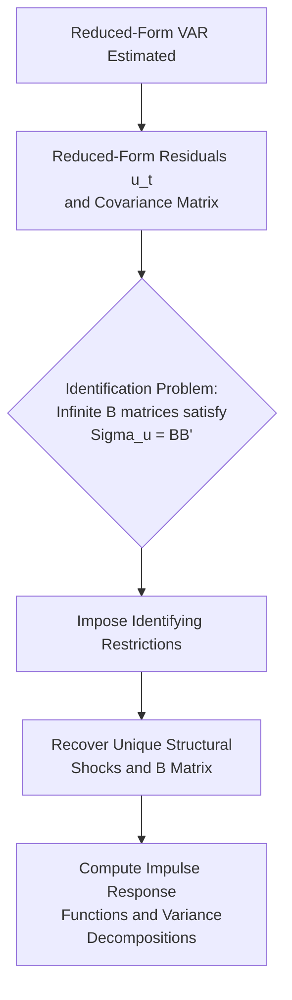
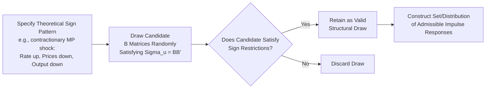

## Structural VAR Identification Strategies

### Overview

Structural Vector Autoregression (SVAR) identification strategies are the set of econometric techniques used to recover structural, economically interpretable shocks and their causal effects from reduced-form Vector Autoregression (VAR) models. Because reduced-form VARs alone cannot distinguish genuine structural shocks from arbitrary linear combinations of them, identification strategies impose additional theoretically motivated restrictions to achieve a unique, economically meaningful mapping.

### The Identification Problem

#### From Reduced-Form to Structural VAR

A reduced-form VAR expresses each variable in a system as a linear function of lagged values of all variables plus a residual (reduced-form error) term:

$$Y_t = A_1 Y_{t-1} + A_2 Y_{t-2} + \dots + A_p Y_{t-p} + u_t$$

where $Y_t$ is a vector of endogenous variables, $A_i$ are coefficient matrices, and $u_t$ is the vector of reduced-form residuals with covariance matrix $\Sigma_u$.

The structural VAR posits that these reduced-form residuals are themselves linear combinations of underlying, economically meaningful **structural shocks** $\varepsilon_t$ (e.g., a monetary policy shock, a technology shock, a demand shock), which are assumed mutually uncorrelated:

$$u_t = B\varepsilon_t, \quad \text{where } E[\varepsilon_t \varepsilon_t'] = I$$

#### Why Identification Is Needed

The reduced-form covariance matrix $\Sigma_u$ contains $\frac{n(n+1)}{2}$ unique elements (for an $n$-variable system), but the structural matrix $B$ has $n^2$ unknown elements. Since $\Sigma_u = BB'$, this system is **underdetermined** — infinitely many matrices $B$ satisfy this relationship (any $B \cdot Q$ for an orthogonal matrix $Q$ also satisfies it). Identification strategies impose $\frac{n(n-1)}{2}$ additional restrictions to pin down a unique $B$.

$$\text{Restrictions Needed} = n^2 - \frac{n(n+1)}{2} = \frac{n(n-1)}{2}$$

### Major Identification Strategies

#### 1. Short-Run (Contemporaneous) Restrictions — Cholesky/Recursive Identification

The most common and computationally simplest approach imposes a **recursive causal ordering** on the variables, restricting the contemporaneous impact matrix $B$ to be lower-triangular via Cholesky decomposition.

**Mechanism:** Variables are ordered such that earlier variables in the ordering can contemporaneously affect later variables, but not vice versa (later variables affect earlier ones only with a lag).

$$B = \begin{pmatrix} b_{11} & 0 & 0 \\ b_{21} & b_{22} & 0 \\ b_{31} & b_{32} & b_{33} \end{pmatrix}$$

**Example application (illustrative, standard monetary VAR ordering):** In a classic three-variable monetary policy VAR with output, prices, and the policy interest rate, a common recursive ordering places output and prices before the interest rate, reflecting an assumption that output and prices do not respond contemporaneously (within the same period) to monetary policy shocks, while the policy rate can respond contemporaneously to output and price shocks.

**Key Points**

- Introduced into modern macroeconomics prominently by Christopher Sims (1980) as an alternative to the large structural macroeconometric models of the time.
- The ordering choice is not derived from the data — it is an assumption imposed by the researcher based on institutional or theoretical priors about the relative speed of variable responses.
- Results can be sensitive to the chosen ordering, particularly for variables with plausible contemporaneous bidirectional relationships. [Speculation] The degree of sensitivity varies by application and variable set; robustness to ordering choice is often checked explicitly in applied work by testing alternative orderings.

#### 2. Long-Run Restrictions (Blanchard-Quah Decomposition)

Rather than restricting contemporaneous relationships, this approach imposes restrictions on the **long-run cumulative effects** of shocks, typically based on theoretical propositions about which shocks can have permanent versus purely temporary effects.

**Canonical example — Blanchard and Quah (1989):** In a two-variable VAR of output growth and unemployment, the identifying restriction imposes that **demand shocks have no long-run effect on the level of output**, while **supply shocks can have permanent effects**, consistent with standard neoclassical growth theory (output is ultimately supply-determined in the long run, while demand shocks only cause temporary deviations).

$$\lim_{k \to \infty} \sum_{j=0}^{k} C_j^{(1,2)} = 0$$

where $C_j^{(1,2)}$ represents the long-run cumulative impulse response of output to the demand shock, restricted to zero.

**Key Points**

- Long-run restrictions require the researcher to specify economically motivated long-run neutrality propositions, drawing directly on theoretical macroeconomic models (e.g., real business cycle theory, monetary neutrality propositions).
- Estimates of long-run restrictions can be imprecise in finite samples, since long-run cumulative responses are estimated from a finite number of observed lags and can be sensitive to specification choices. [Inference] This finite-sample imprecision concern is well-documented in the SVAR econometrics literature as a general property of long-run identified VARs, not specific to any one application.

#### 3. Sign Restrictions

Sign restriction approaches identify structural shocks by imposing restrictions only on the **direction (sign)** of impulse responses for a specified number of periods, rather than requiring exact zero restrictions on contemporaneous or long-run coefficients.

**Example (illustrative, standard demand/supply shock identification):** A contractionary monetary policy shock might be identified by requiring that it produces a non-negative interest rate response, a non-positive price level response, and a non-positive output response for several periods following the shock — consistent with standard macroeconomic theory predictions about monetary tightening, without pinning down exact magnitudes.

**Key Points**

- Developed prominently by economists including Christopher Sims, Harald Uhlig, and others in the late 1990s–2000s as an alternative to exact zero restrictions, since theory often provides clearer guidance on the *sign* of a response than its exact magnitude or timing.
- Because many candidate structural matrices can satisfy a given sign restriction set, this approach typically produces a **set-identified** (rather than point-identified) range of admissible impulse responses, often summarized via the full distribution of admissible draws rather than a single point estimate.
- Sign restrictions avoid some of the stronger, more theory-dependent assumptions of recursive or long-run approaches but introduce their own interpretive challenges regarding how to summarize a set-identified (rather than uniquely identified) result.

#### 4. External Instruments / Proxy SVAR (SVAR-IV)

This approach identifies structural shocks using an external instrument — a variable correlated with the structural shock of interest but uncorrelated with other structural shocks in the system — analogous to instrumental variables estimation in cross-sectional econometrics.

**Example application:** High-frequency identification of monetary policy shocks using changes in federal funds futures prices in a narrow window around FOMC announcements (an approach associated with research by economists including Refet Gürkaynak, Brian Sack, Eric Swanson, and later formalized within the SVAR-IV framework by Christiane Baumeister, James Hamilton, and others; also closely associated with work by Karel Mertens and Morten Ravn on fiscal shock identification).

$$E[Z_t \varepsilon_{mp,t}] \neq 0, \quad E[Z_t \varepsilon_{j,t}] = 0 \text{ for } j \neq mp$$

where $Z_t$ is the external instrument and $\varepsilon_{mp,t}$ is the monetary policy shock of interest.

**Key Points**

- This approach has become particularly influential for **monetary policy shock identification**, since high-frequency financial market data around policy announcements can plausibly isolate the unexpected/surprise component of policy actions, addressing endogeneity concerns present in recursive approaches.
- Instrument validity (relevance and exogeneity) is the central identifying assumption and, as with instrumental variables methods generally, cannot be fully tested — it relies on institutional/theoretical justification for why the chosen instrument satisfies both conditions.

#### 5. Heteroskedasticity-Based Identification

This approach exploits changes in the volatility (variance) of structural shocks across different periods or regimes to achieve identification, based on the insight that if shock variances differ across regimes while the underlying structural relationships (the $B$ matrix) remain stable, this variance information can help separately identify the structural parameters.

[Unverified] This method (associated with researchers including Roberto Rigobon and others) is a somewhat more specialized/advanced identification approach relative to the four above; its practical implementation details and specific assumptions about regime-switching in shock variances should be verified against the specific methodological papers for rigorous application.

#### 6. Narrative/Sign-and-Narrative Combined Approaches

Some SVAR identification approaches incorporate **narrative evidence** — historical, qualitative documentation of the nature and timing of specific shocks (e.g., Romer and Romer's narrative-based monetary policy shock series derived from Federal Reserve historical records) — either as a standalone identification strategy or combined with sign restrictions to further narrow the set of admissible structural models.

### Comparative Summary of Identification Strategies

| Strategy | Restriction Type | Key Assumption | Common Application |
| --- | --- | --- | --- |
| Recursive/Cholesky | Contemporaneous, exact | Causal ordering of contemporaneous effects | General-purpose monetary/business cycle VARs |
| Long-run (Blanchard-Quah) | Long-run cumulative, exact | Certain shocks have no permanent effect | Supply vs. demand shock decomposition |
| Sign restrictions | Direction only, set-identifying | Theoretically predicted response signs | Monetary policy, oil price shocks |
| External instruments (SVAR-IV) | Instrument correlation conditions | Valid excludable instrument exists | High-frequency monetary policy shocks, fiscal shocks |
| Heteroskedasticity-based | Cross-regime variance differences | Stable structural relationships, varying shock variances | Specialized regime-based applications |
| Narrative | Historical/qualitative shock dating | Accurate historical shock classification | Romer-Romer style monetary shock series |

### Post-Identification Analysis Tools

#### Impulse Response Functions (IRFs)

Once identified, SVARs are used to trace the dynamic effect of a one-unit (or one-standard-deviation) structural shock on each variable in the system over subsequent time periods.

$$\text{IRF}_{i,j}(h) = \frac{\partial Y_{i,t+h}}{\partial \varepsilon_{j,t}}$$

representing the response of variable $i$ at horizon $h$ to structural shock $j$.

#### Forecast Error Variance Decomposition (FEVD)

Decomposes the forecast error variance of each variable at a given horizon into the proportion attributable to each structural shock, providing a measure of the relative importance of different shocks in driving fluctuations in each variable.

#### Historical Decomposition

Decomposes the actual historical path of each variable into the cumulative contributions of each identified structural shock over time, used to narrate historical episodes (e.g., "how much of the 2021–2023 inflation surge is attributable to identified supply shocks versus demand shocks") according to the specific identified model.

### Critiques and Practical Considerations

**Key Points**

- **Identification is never fully "tested":** All SVAR identification strategies rest on assumptions that are not directly testable from the data alone — the validity of any given identification scheme depends on the plausibility of its underlying economic assumptions (ordering choice, long-run neutrality claims, sign pattern predictions, or instrument validity).
- **Sensitivity to specification:** Results can be sensitive to lag length selection, sample period, variable selection (omitted variable bias can contaminate structural shock recovery), and the specific identifying restrictions chosen — robustness checks across alternative specifications are standard practice in applied SVAR research.
- **Non-uniqueness across strategies:** Different identification strategies applied to conceptually the same underlying question (e.g., monetary policy shock effects) can produce meaningfully different impulse response estimates, reflecting the different assumptions each imposes. [Inference] This divergence across identification approaches is a well-documented feature of the empirical SVAR literature and is one reason cross-validation using multiple identification strategies is often considered good applied practice.
- **The "price puzzle":** A well-known empirical anomaly in some recursively identified monetary VARs, where a contractionary monetary policy shock appears to be followed by a temporary *increase* in prices — widely interpreted in the literature as reflecting the VAR's failure to adequately control for the central bank's forward-looking response to anticipated inflation, rather than reflecting genuine structural behavior, motivating alternative identification approaches (including sign restrictions and external instruments) partly in response to this puzzle.

### Conclusion

Structural VAR identification strategies provide the essential bridge between purely statistical, reduced-form time series relationships and economically interpretable structural shocks and their causal dynamic effects. The major approaches — recursive/Cholesky, long-run restrictions, sign restrictions, external instruments, heteroskedasticity-based methods, and narrative approaches — each impose different types of theoretically motivated restrictions to resolve the fundamental underidentification problem inherent in reduced-form VARs, with tradeoffs between the strength of required assumptions, the precision of resulting estimates (point-identified versus set-identified), and applicability to specific research questions. Contemporary empirical macroeconomic practice frequently employs multiple identification strategies in parallel as a robustness check, given that no single approach is universally regarded as definitively superior across all applications.

**Related Topics**

- Reduced-form VAR estimation and lag selection criteria (AIC, BIC)
- Impulse response function estimation and confidence bands (bootstrap methods)
- DSGE model estimation and its relationship to SVAR methodology
- Local projections as an alternative to VAR-based impulse response estimation
- High-frequency identification of monetary policy shocks
- Romer-Romer narrative approach to monetary policy shocks
- The price puzzle and its resolutions in monetary VAR literature
- Time-varying parameter VARs and structural break considerations
- Bayesian VAR estimation and shrinkage priors