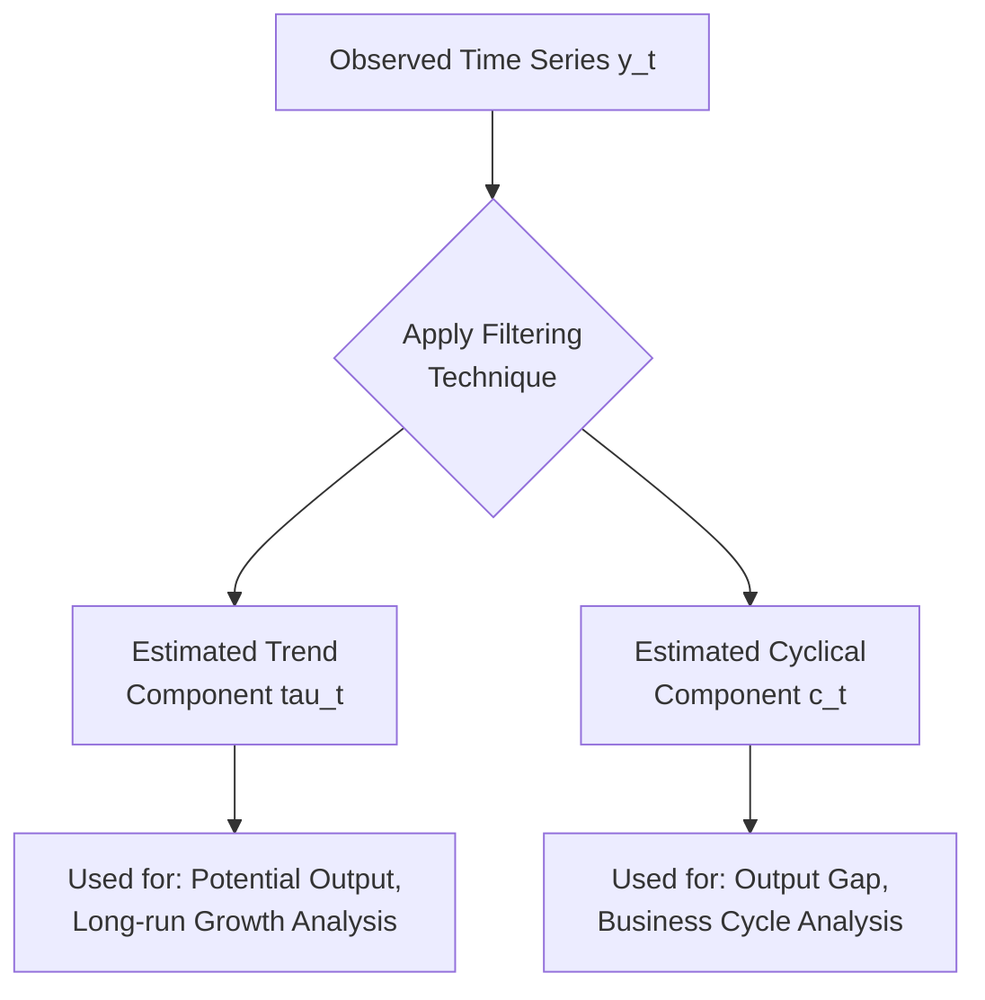

## Filtering Techniques: Hodrick-Prescott Filter and Alternatives

### Overview

Filtering techniques decompose a macroeconomic time series into a smooth long-run **trend component** and a cyclical (or irregular) **deviation component**, allowing analysts to isolate business cycle fluctuations from underlying growth trends. The Hodrick-Prescott (HP) filter is the most widely known such technique in applied macroeconomics, though it carries well-documented statistical limitations that have motivated several alternative filtering approaches.

### The General Trend-Cycle Decomposition Problem

#### Conceptual Framework

Most macroeconomic filtering techniques begin from the premise that an observed series $y_t$ (often in log form) can be decomposed as:

$$y_t = \tau_t + c_t$$

where $\tau_t$ is the unobserved trend (potential/permanent) component and $c_t$ is the unobserved cyclical (transitory) component. Since neither component is directly observed, filtering techniques impose statistical assumptions to extract an estimate of each.

### The Hodrick-Prescott (HP) Filter

#### Origin and Definition

Introduced by Robert Hodrick and Edward Prescott in a widely circulated 1980 working paper (formally published in 1997), the HP filter estimates the trend component $\tau_t$ by solving a minimization problem that balances two competing objectives: fitting the trend closely to the actual data, and keeping the trend smooth (limiting excessive curvature).

$$\min_{\{\tau_t\}} \sum_{t=1}^{T} (y_t - \tau_t)^2 + \lambda \sum_{t=2}^{T-1} \left[(\tau_{t+1} - \tau_t) - (\tau_t - \tau_{t-1})\right]^2$$

- The first term penalizes deviation of the trend from the actual data (goodness of fit).
- The second term penalizes changes in the trend's growth rate (a second-difference smoothness penalty), discouraging the trend from tracking short-run fluctuations.
- $\lambda$ is the **smoothing parameter**, controlling the tradeoff between fit and smoothness.

#### Choice of Smoothing Parameter

| Data Frequency | Conventional $\lambda$ Value |
| --- | --- |
| Annual | 100 |
| Quarterly | 1,600 |
| Monthly | 14,400 |

These specific values were originally proposed by Hodrick and Prescott based on their assessment of the relative variance of cyclical versus trend shocks in quarterly U.S. macroeconomic data. [Inference] While the $\lambda = 1600$ quarterly convention is very widely used in applied practice, the appropriateness of this specific numerical choice for data of different frequencies, countries, or historical periods has been questioned by some researchers, and alternative values are sometimes used depending on the specific application and desired degree of smoothness.

#### Limiting Cases

$$\lambda \to 0 \implies \tau_t \to y_t \quad \text{(trend equals the actual series, no smoothing)}$$

$$\lambda \to \infty \implies \tau_t \to \text{linear trend} \quad \text{(maximal smoothness, trend approaches a straight line)}$$

#### The Output Gap Application

The HP filter is most commonly applied in macroeconomics to estimate **potential output** and the resulting **output gap**:

$$\text{Output Gap}_t = \frac{Y_t - Y_t^{\text{potential}}}{Y_t^{\text{potential}}} \times 100$$

where $Y_t^{\text{potential}}$ is the HP-filtered trend component of real GDP and $Y_t$ is actual real GDP.

### Well-Documented Limitations of the HP Filter

#### 1. The End-Point Problem

**Key Points**

- Because the smoothness penalty relies on values both before and after each point in the series, trend estimates near the **beginning and end** of the sample are based on less information than estimates in the middle of the sample, making them less reliable and subject to greater revision as new data arrives.
- This is particularly problematic for real-time policy applications (e.g., current output gap estimation for monetary policy decisions), since the most policy-relevant estimate — the most recent data point — is also the least reliable one produced by the filter.

#### 2. Spurious Cyclicality (The Hamilton Critique)

James Hamilton's influential 2018 paper ("Why You Should Never Use the Hodrick-Prescott Filter") raised several formal econometric critiques:

- **Spurious dynamic relationships:** Hamilton demonstrated that the HP filter can introduce spurious cyclical patterns and dynamic relationships between filtered series that do not reflect genuine economic relationships in the underlying data, even when applied to simulated random walk data with no true cyclical structure.
- **Lack of a clear underlying statistical model:** Hamilton argued the HP filter's smoothing parameter choice lacks a rigorous statistical foundation connecting it to the actual data-generating process of macroeconomic series, unlike an explicitly specified time series model with a clear stochastic structure.
- **Proposed alternative:** Hamilton proposed a regression-based filter (detailed below) as a preferred alternative addressing these specific concerns.

[Inference] Hamilton's critique has generated substantial discussion and some methodological shift in the applied macroeconomics literature since 2018, though the HP filter continues to be widely used in practice, including by several central banks and international institutions, alongside growing use of alternative methods; the degree to which the profession has shifted away from HP filtering specifically is an evolving and not fully settled matter.

#### 3. Sensitivity to the Smoothing Parameter and Sample Period

The extracted cyclical component can be materially sensitive to the choice of $\lambda$ and to the specific sample period used, particularly around sample endpoints, raising concerns about the robustness of output gap estimates used for policy purposes.

### Alternative Filtering Techniques

#### 1. The Hamilton (2018) Regression Filter

Hamilton's proposed alternative estimates the cyclical component as the residual from a regression of the current value of the series on its own lagged values from several periods earlier (typically using a two-year, i.e., 8-quarter, horizon for quarterly data):

$$y_{t+h} = \beta_0 + \beta_1 y_t + \beta_2 y_{t-1} + \beta_3 y_{t-2} + \beta_4 y_{t-3} + \varepsilon_{t+h}$$

The cyclical component is then defined as the forecast error: $c_t = y_{t+h} - \hat{y}_{t+h}$, where $\hat{y}_{t+h}$ is the fitted value from this regression estimated using data through period $t$.

**Key Points**

- This approach avoids the two-sided smoothing that creates HP's end-point problem, since it relies only on past data (an $h$-period-ahead regression using lags), producing a filter that is naturally suited to real-time, one-sided application.
- Hamilton recommended $h = 8$ (two years ahead) for quarterly U.S. GDP data as a standard default choice. [Unverified] The generalizability of this specific horizon choice to other countries, frequencies, or variables should be assessed on a case-by-case basis rather than assumed universally optimal.

#### 2. The Baxter-King (Band-Pass) Filter

Developed by Marianne Baxter and Robert King (1999), this filter is explicitly designed to isolate fluctuations within a specified **frequency band**, consistent with the conventional definition of business cycles as fluctuations lasting between 6 and 32 quarters (1.5 to 8 years).

$$c_t = \sum_{k=-K}^{K} a_k y_{t-k}$$

where the weights $a_k$ are constructed to approximate an ideal band-pass filter that passes through fluctuations within the target frequency range while attenuating both very short-run noise and very long-run trend movements.

**Key Points**

- Requires truncating an infinite moving average to a finite number of leads/lags $K$, which necessarily means losing observations at both ends of the sample (a more severe practical data-loss problem than the HP filter's end-point unreliability).
- Provides a more theoretically grounded frequency-domain justification for what should be classified as "cyclical" versus "trend," directly tied to the standard business cycle frequency definition, compared to the HP filter's purely statistical smoothness-based approach.

#### 3. The Christiano-Fitzgerald Filter

An asymmetric band-pass filter developed by Lawrence Christiano and Terry Fitzgerald (2003) that improves on Baxter-King by using all available data points (an asymmetric, sample-dependent weighting scheme) rather than truncating and losing endpoint observations, at the cost of a less exact frequency-domain approximation than the symmetric Baxter-King filter.

#### 4. Unobserved Components Models (Structural Time Series Models)

Rather than applying a mechanical statistical filter, unobserved components (UC) models explicitly specify a stochastic process for the trend and cyclical components (e.g., the trend following a random walk with drift, the cycle following a stationary autoregressive process) and estimate them jointly via maximum likelihood, typically implemented using the **Kalman filter**.

$$\tau_t = \tau_{t-1} + \mu_{t-1} + \eta_t, \quad \eta_t \sim N(0, \sigma_\eta^2)$$

$$c_t = \phi_1 c_{t-1} + \phi_2 c_{t-2} + \varepsilon_t, \quad \varepsilon_t \sim N(0, \sigma_\varepsilon^2)$$

**Key Points**

- Provides an internally consistent probabilistic model with estimable parameters and associated confidence intervals for the trend and cycle, addressing Hamilton's critique that the HP filter lacks an explicit underlying statistical model.
- Requires distributional and functional form assumptions about the trend and cycle processes, which themselves represent modeling choices that could be mis-specified.
- Closely related to, and sometimes implemented via, **Beveridge-Nelson decomposition**, an alternative model-based trend-cycle decomposition derived from ARIMA model estimation.

#### 5. Multivariate/Production Function-Based Approaches (Potential Output Estimation)

Distinct from purely statistical univariate filters, central banks and international institutions (e.g., the Federal Reserve, IMF, OECD, European Commission) often estimate potential output using **structural production function approaches**, combining a Cobb-Douglas-style production function with separately estimated trends in labor supply (via NAIRU estimation), capital stock, and total factor productivity.

$$Y_t^{\text{potential}} = A_t^{\text{trend}} \cdot (K_t)^{\alpha} \cdot (L_t^{\text{trend}})^{1-\alpha}$$

**Key Points**

- Incorporates economic structure and multiple data sources (labor market data, capital stock estimates, productivity trends) rather than relying solely on the statistical properties of a single output series.
- Requires separate, often uncertain, trend estimates for each underlying input (labor, capital, productivity), which can introduce compounding estimation uncertainty. [Speculation] Whether multivariate structural approaches produce more reliable real-time potential output estimates than univariate statistical filters is debated, and evaluation depends heavily on the specific comparison period and country.

### Comparative Summary

| Filter | Approach | Real-Time Suitability | Key Limitation |
| --- | --- | --- | --- |
| Hodrick-Prescott (HP) | Two-sided smoothness penalty minimization | Poor (end-point problem) | Spurious cyclicality (Hamilton critique), arbitrary $\lambda$ |
| Hamilton Regression Filter | One-sided lag regression, forecast-error-based | Good (designed for real-time use) | Choice of horizon $h$ somewhat ad hoc; less established track record |
| Baxter-King Band-Pass | Frequency-domain truncated moving average | Poor (loses endpoint observations) | Data loss at both sample ends |
| Christiano-Fitzgerald | Asymmetric frequency-domain filter | Moderate (uses all data points) | Less exact frequency approximation than Baxter-King |
| Unobserved Components (Kalman Filter) | Explicit stochastic model, MLE estimation | Moderate to good (model-dependent) | Requires distributional/model specification assumptions |
| Production Function Approach | Structural, multivariate | Depends on component trend reliability | Compounds uncertainty from multiple underlying trend estimates |

### Illustrative Trend-Cycle Decomposition

<svg xmlns="http://www.w3.org/2000/svg" viewBox="0 0 550 320">
<text x="275" y="25" font-size="16" font-family="sans-serif" text-anchor="middle" font-weight="bold">Stylized Trend-Cycle Decomposition (svg_diagram)</text>
<line x1="50" y1="270" x2="500" y2="270" stroke="black" stroke-width="1.5" />
<line x1="50" y1="270" x2="50" y2="50" stroke="black" stroke-width="1.5" />
<text x="275" y="300" font-size="12" font-family="sans-serif" text-anchor="middle">Time</text>
<text x="20" y="160" font-size="12" font-family="sans-serif" text-anchor="middle" transform="rotate(-90 20,160)">Log Output</text>

<path d="M 50 220 L 90 200 L 130 215 L 170 170 L 210 190 L 250 140 L 290 160 L 330 110 L 370 130 L 410 90 L 450 105 L 490 70" fill="none" stroke="#333333" stroke-width="1.5" />
<text x="440" y="60" font-size="10" font-family="sans-serif" fill="#333333">Actual Series y_t</text>

<path d="M 50 225 L 490 90" fill="none" stroke="#1a5fb4" stroke-width="2.5" stroke-dasharray="6,3" />
<text x="380" y="150" font-size="10" font-family="sans-serif" fill="#1a5fb4">HP-Filtered Trend (tau_t)</text>

<path d="M 50 290 Q 100 280, 150 295 T 250 285 Q 300 300, 350 280 T 450 290" fill="none" stroke="#c01c28" stroke-width="2" />
<text x="350" y="315" font-size="10" font-family="sans-serif" fill="#c01c28">Cyclical Component (c_t), shown separately below trend</text>
</svg>

### Practical Guidance for Applied Use

**Key Points**

- Most practitioners now recommend **reporting results from multiple filtering methods** as a robustness check, given that no single filter is universally regarded as definitively superior, and different filters can produce materially different cyclical estimates for the same underlying data.
- For real-time policy applications (e.g., current output gap assessment), one-sided filters (Hamilton regression filter, Kalman-filtered UC models using only historical data) are generally preferred over the standard two-sided HP filter, specifically to avoid the end-point unreliability problem.
- For historical, full-sample research applications where end-point concerns are less relevant (e.g., studying business cycle properties over a long completed historical period), the HP filter's limitations are somewhat less consequential, though Hamilton's spurious-cyclicality critique remains a general methodological concern regardless of sample position.
- [Unverified] Specific central bank practices regarding which filter(s) are used operationally for official potential output and output gap estimates vary by institution and are periodically revised; consult the specific institution's current published methodology documentation for authoritative current practice.

### Conclusion

Filtering techniques provide the essential empirical toolkit for separating trend and cyclical components in macroeconomic time series, underpinning widely used concepts like the output gap and potential output. While the Hodrick-Prescott filter remains historically dominant and widely taught due to its simplicity and long track record, well-documented limitations — particularly the end-point problem and Hamilton's spurious-cyclicality critique — have motivated a range of alternatives, including the Hamilton regression filter, band-pass filters (Baxter-King, Christiano-Fitzgerald), unobserved components models, and structural production function approaches. Contemporary best practice generally favors methodological pluralism, comparing results across multiple filtering approaches rather than relying on any single technique as definitively authoritative.

**Related Topics**

- Output gap estimation and monetary policy rules (Taylor Rule inputs)
- NAIRU estimation and the Phillips Curve
- Kalman filter and state-space model estimation
- Beveridge-Nelson decomposition
- Potential output estimation methodologies (IMF, OECD, Federal Reserve approaches)
- Business cycle frequency definitions and spectral analysis
- Real-time data and data revision effects on filtered estimates
- Wavelet-based time-frequency decomposition methods
- Structural VAR identification strategies (complementary empirical method)