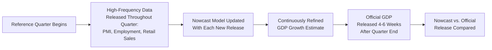
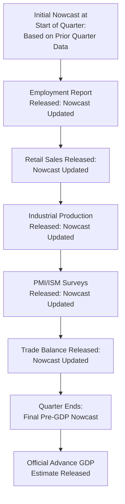

## Nowcasting Techniques

### Overview

Nowcasting refers to the estimation of the current or very near-term state of the economy — most commonly current-quarter GDP growth — using a wide range of higher-frequency data that becomes available before official, lower-frequency statistics (like quarterly GDP) are released. Nowcasting addresses a fundamental practical problem in macroeconomic monitoring: the variables policymakers most care about (GDP, in particular) are published with substantial delay, while numerous related indicators are available in near real time.

### The Core Problem Nowcasting Solves

#### Publication Lag and the Information Gap

**Key Points**

- Official quarterly GDP figures are typically published with a lag of four to six weeks after the end of the reference quarter (with an "advance" estimate followed by subsequent revisions), meaning policymakers and forecasters must often make decisions well before knowing how the current or even the just-completed quarter actually performed.
- Nowcasting fills this gap by systematically combining higher-frequency, earlier-released indicators — industrial production, retail sales, employment reports, purchasing managers' indices, financial market data, even alternative data sources — into a continuously updated estimate of current economic activity.
- The nowcast is distinct from a traditional forecast in that it targets the **current or most recently completed period**, not a genuinely future period, though the distinction becomes less sharp as the target period approaches its actual end date.

### The Mixed-Frequency Data Problem

#### Why Standard Time Series Methods Fall Short

Nowcasting inherently requires combining data released at different frequencies (daily financial market data, weekly jobless claims, monthly industrial production, quarterly GDP) and, critically, at different and irregular **publication lags** relative to their own reference periods — a structure known as a **ragged edge** dataset, where more recent columns of the data matrix have progressively more missing values for series not yet released.

$$\text{Data Matrix (Ragged Edge)}: \quad X_{i,t} = \begin{cases} \text{observed} & \text{if series } i \text{ released for period } t \\ \text{missing} & \text{if not yet released} \end{cases}$$

Standard regression techniques are not naturally designed to handle this irregular, continuously evolving missing-data pattern, motivating specialized nowcasting methodologies.

### Major Nowcasting Methodologies

#### 1. Dynamic Factor Models (DFM)

The dominant methodological approach in professional nowcasting, dynamic factor models extract a small number of common latent "factors" summarizing the co-movement across a large panel of macroeconomic indicators, based on the premise that most business cycle fluctuations across many series are driven by a few common underlying forces.

$$X_{i,t} = \lambda_i F_t + \xi_{i,t}$$

$$F_t = \Phi_1 F_{t-1} + \Phi_2 F_{t-2} + \dots + u_t$$

where $X_{i,t}$ is the observed indicator $i$ at time $t$, $F_t$ is the vector of unobserved common factors, $\lambda_i$ are factor loadings specific to each series, and $\xi_{i,t}$ is an idiosyncratic (series-specific) component.

**Key Points**

- Estimated via the **Kalman filter**, which naturally accommodates the ragged-edge missing-data problem by treating not-yet-released observations as missing values within a state-space framework, updating the factor estimate incrementally as each new data release arrives.
- The **New York Fed's Nowcasting Report** and the **Atlanta Fed's GDPNow** (though the latter uses a somewhat different, more direct bridge-equation-based methodology) are prominent, publicly available real-world examples of this general approach applied to U.S. GDP.
- Because the Kalman filter updates recursively, a DFM-based nowcast can be re-estimated efficiently each time a new data release arrives, without needing to re-estimate the entire model from scratch — a computationally important property given the near-continuous flow of new data releases.

#### 2. Bridge Equations

A simpler, longer-established approach that "bridges" the frequency gap by first forecasting missing values of monthly indicators to complete the current quarter, then aggregating them to a quarterly frequency, and finally regressing GDP growth on these completed quarterly aggregates.

$$\Delta \text{GDP}_q = \alpha + \sum_{i} \beta_i \cdot \bar{x}_{i,q} + \varepsilon_q$$

where $\bar{x}_{i,q}$ represents the quarterly aggregate (e.g., average or sum) of monthly indicator $i$, with any missing months within the quarter first forecasted using simple univariate time series models (e.g., ARIMA) before aggregation.

**Key Points**

- Conceptually simpler and more transparent than dynamic factor models, since each indicator's contribution to the final GDP estimate can be traced directly through an explicit regression equation.
- Historically associated with earlier nowcasting practice (particularly at European central banks and statistical agencies) before dynamic factor model approaches became more dominant in leading central bank nowcasting frameworks.

#### 3. MIDAS (Mixed Data Sampling) Regressions

MIDAS regressions directly regress a low-frequency target variable (e.g., quarterly GDP growth) on higher-frequency explanatory variables (e.g., monthly or weekly indicators) without first aggregating the high-frequency data to match the low-frequency target, instead using a flexible parametric lag-weighting structure.

$$y_t^{(Q)} = \alpha + \beta \sum_{k=0}^{K} w(k;\theta) x_{t-k/m}^{(m)} + \varepsilon_t$$

where $x^{(m)}$ is the higher-frequency (sampled $m$ times per low-frequency period) explanatory variable, and $w(k;\theta)$ is a flexible weighting function (commonly an Almon lag polynomial or exponential Almon specification) governing how much weight is placed on each high-frequency lag.

**Key Points**

- Developed prominently by Eric Ghysels and coauthors in the early-to-mid 2000s, MIDAS avoids the information loss that can occur from naive temporal aggregation (e.g., simply averaging three months of an indicator into a single quarterly figure), instead directly exploiting the specific timing pattern within the quarter.
- Particularly useful when the timing of the current partial-quarter high-frequency data (e.g., only the first two months of a quarter's industrial production have been released) needs to be exploited fully without waiting for the remainder of the quarter to complete.

#### 4. Machine Learning-Based Nowcasting

More recent nowcasting research has explored machine learning methods (regularized regression such as LASSO/Ridge, random forests, and neural network architectures) applied to very large panels of potential predictor variables, including non-traditional "alternative data" sources.

**Alternative/big data sources increasingly incorporated into nowcasting research and practice include:**

- Satellite imagery (e.g., nighttime lights, parking lot occupancy, agricultural yield estimates)
- Credit card and payment transaction data
- Search engine query volume (e.g., Google Trends-based indicators)
- Mobile phone location and mobility data
- Text-based sentiment indicators derived from news articles or social media

[Speculation] The incremental forecasting value added by machine learning methods and alternative data sources relative to well-specified traditional dynamic factor models remains an active area of empirical research, with mixed findings across different studies, variables, and time periods; this is not a settled question in the nowcasting literature, and results appear to be context- and application-specific.

### Prominent Real-World Nowcasting Systems

| System | Institution | Core Methodology (as documented) |
| --- | --- | --- |
| GDPNow | Federal Reserve Bank of Atlanta | Bridge-equation-style approach directly tracking the components of GDP via the expenditure method |
| Nowcasting Report | Federal Reserve Bank of New York | Dynamic factor model, updated with each relevant data release |
| Weekly Economic Index (WEI) | Federal Reserve Bank of New York (originally; also referenced by Dallas Fed) | High-frequency composite index of underlying economic conditions |
| Euro area nowcasting models | European Central Bank and various national central banks | Various, including dynamic factor models and bridge equations |

[Unverified] Specific current methodological details, model specifications, and even the continued operational status of any particular named nowcasting product are subject to change and periodic revision by the publishing institutions; consult each institution's current published methodology notes for authoritative, up-to-date details rather than relying solely on this general description.

### The Nowcast Update Process

#### Illustrative Real-Time Update Sequence

Each new data release generates a specific, quantifiable **news contribution** — the amount by which the nowcast estimate changed in response to the surprise component (deviation from what was already expected) of that particular release, a diagnostic feature emphasized in dynamic factor model-based nowcasting frameworks (particularly associated with the methodology underlying the New York Fed's approach).

$$\text{News Contribution}_i = b_i \times (\text{Actual}_i - \text{Expected}_i)$$

where $b_i$ is a model-derived weight reflecting indicator $i$'s historical relationship to GDP, and the term in parentheses is the surprise component of the release relative to prior market or model expectations.

### Evaluation of Nowcast Accuracy

**Key Points**

- Nowcast accuracy is typically evaluated using the same general point-forecast metrics used in broader forecast evaluation (RMSE, MAE), but applied specifically at very short horizons and tracked across the sequence of successive updates within a quarter, to assess how much accuracy improves as more within-quarter data becomes available.
- A key evaluation question specific to nowcasting is whether accuracy **improves monotonically** as the quarter progresses and more data is incorporated — generally expected, though not guaranteed, since occasionally later data releases can be noisier or less informative than data released earlier in the quarter for certain economic episodes.
- Nowcasts are also evaluated for their ability to anticipate major official data revisions, since a nowcast's own accuracy is sometimes assessed against both the initial (advance) GDP release and the subsequently revised, final GDP figures.

### Comparative Summary of Methodologies

| Method | Handles Ragged-Edge Data | Complexity | Typical Institutional Use |
| --- | --- | --- | --- |
| Bridge Equations | Requires separate forecasting of missing months first | Low | Earlier-generation central bank practice, still used in some frameworks (e.g., GDPNow-style) |
| Dynamic Factor Models (Kalman Filter) | Yes, natively via state-space formulation | Moderate to high | New York Fed Nowcasting Report, many national central banks |
| MIDAS Regressions | Partially (via flexible lag weighting) | Moderate | Academic research, some central bank applications |
| Machine Learning Approaches | Varies by implementation | High | Emerging research applications, increasingly explored operationally |

### Limitations and Critiques

**Key Points**

- **Model and specification risk:** Nowcast accuracy depends heavily on the chosen set of input indicators and model specification; including too many weakly relevant series can introduce noise, while omitting genuinely informative series reduces accuracy — indicator selection remains partly a matter of institutional judgment and ongoing empirical refinement.
- **Structural break vulnerability:** Like other empirical macroeconomic models, nowcasting models estimated on historical relationships between indicators and GDP can perform poorly during periods of unusual structural change (e.g., the sharp historical relationships between many indicators and GDP were notably disrupted during the 2020 COVID-19 pandemic period, a widely documented episode in nowcasting literature). [Inference] The specific magnitude and duration of this disruption is well-documented as a general challenge across many nowcasting models during that period, though exact performance figures vary by specific model and institution.
- **Real-time data revision uncertainty:** Since nowcasts rely on real-time (unrevised, first-release) high-frequency data, and that underlying data is itself often revised later, part of the eventual nowcast-to-actual GDP gap reflects data revision rather than genuine model error, complicating clean attribution of forecasting performance.
- **Communication challenges:** Because nowcasts update frequently (sometimes daily or weekly) and can shift meaningfully with each new data release, communicating appropriate uncertainty and avoiding over-interpretation of a single updated estimate is an ongoing practical challenge for institutions publishing nowcasts to the public.

### Conclusion

Nowcasting techniques address a fundamental practical challenge in macroeconomic monitoring: the mismatch between the publication lag of key target variables like GDP and the much higher frequency and timeliness of related economic indicators. Dynamic factor models, exploiting the Kalman filter's natural ability to handle irregular, ragged-edge mixed-frequency data, have become the dominant methodological approach among major central banks, complemented by bridge equations, MIDAS regressions, and increasingly, machine learning approaches incorporating novel alternative data sources. While nowcasting has become an established and widely used tool for real-time economic monitoring, it remains subject to the same general limitations facing empirical macroeconomic models — structural break vulnerability, specification risk, and the complexities introduced by data revisions — requiring careful interpretation alongside, rather than as a full replacement for, traditional structural analysis and judgment.

**Related Topics**

- Dynamic factor models and the Kalman filter
- MIDAS regression and mixed-frequency econometrics
- Leading, lagging, and coincident indicators
- Forecasting evaluation and accuracy metrics
- Alternative/big data applications in macroeconomic monitoring
- Real-time data and the ALFRED/real-time data revision literature
- GDPNow and New York Fed Nowcasting Report methodologies
- Machine learning applications in macroeconomic forecasting
- Business cycle dating and the NBER methodology