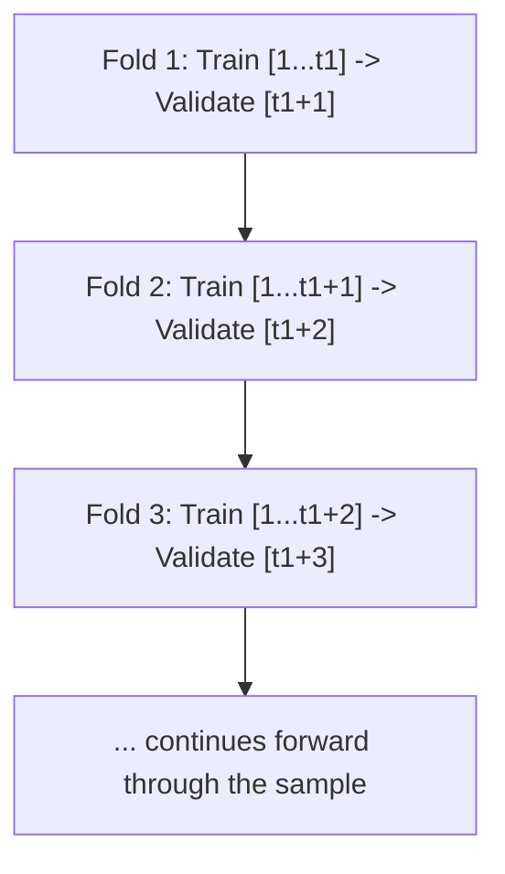

## Machine Learning Applications in Macroeconomic Forecasting

### Overview

Machine learning (ML) methods have moved from the periphery to an increasingly standard part of the empirical macroeconomist's toolkit, motivated by the growth of high-dimensional datasets ("big data"), the need to capture nonlinearities that linear time series models (ARIMA, VAR) cannot, and improvements in computational feasibility. ML methods trade the interpretability and clean asymptotic theory of classical econometrics for flexibility in functional form and the ability to handle many predictors relative to sample size — a persistent constraint in macro applications, where quarterly or monthly series rarely offer more than a few hundred observations. This topic surveys the major ML methods applied to macro forecasting, how they are adapted for time series structure, and the evidence on their comparative performance.

---

### Why Machine Learning in Macroeconomics: Motivation

**The "Curse of Dimensionality" in Macro Forecasting**

Central banks and forecasting agencies routinely track hundreds of indicators (surveys, prices, financial variables, labor market series). Classical regression breaks down when the number of predictors $p$ approaches or exceeds the number of observations $n$: OLS coefficients become imprecise or inestimable, and unrestricted VARs become infeasible. ML regularization and dimension-reduction techniques were largely developed to handle exactly this setting.

**Nonlinearity and Regime-Dependence**

Many macro relationships are plausibly nonlinear: the Phillips curve may flatten at low unemployment, financial conditions may transmit differently during crises versus tranquil periods, and fiscal multipliers may vary with the state of the business cycle. Linear ARIMA/VAR models cannot capture these features without explicit (and often ad hoc) specification, whereas tree-based and neural network methods can approximate nonlinear functional forms flexibly, without the researcher pre-specifying the nonlinearity.

**Structural vs. Predictive Objectives**

[Inference] A widely-held view in the literature is that ML methods are generally better suited to **pure prediction** tasks (nowcasting, short-horizon forecasting) than to **causal/structural inference** (estimating policy multipliers, identifying structural shocks), because most standard ML algorithms are not designed to recover parameters with a clean causal interpretation. This is an active area of methodological development (e.g., causal forests, double/debiased machine learning) rather than a settled boundary.

---

### Bias-Variance Tradeoff in a Forecasting Context

The expected forecast error decomposes as:

$$E[(y - \hat{f}(x))^2] = \underbrace{[\text{Bias}(\hat{f}(x))]^2}_{\text{model too simple}} + \underbrace{\text{Var}(\hat{f}(x))}_{\text{model too flexible}} + \underbrace{\sigma^2}_{\text{irreducible error}}$$

Classical linear time series models sit toward the low-variance/high-bias end when the true relationship is nonlinear or high-dimensional; unregularized ML methods (e.g., a deep, unpruned tree) sit toward the low-bias/high-variance end and overfit small macro samples without regularization. **Every ML method discussed below is, at its core, a different strategy for managing this tradeoff** — this is the unifying conceptual thread across the section.

---

### Regularized Regression Methods

**Ridge Regression**

Shrinks coefficients toward zero via an $L_2$ penalty, minimizing:

$$\hat{\beta}^{ridge} = \arg\min_{\beta} \sum_{t=1}^{n}\left(y_t - x_t'\beta\right)^2 + \lambda \sum_{j=1}^{p}\beta_j^2$$

Ridge shrinks correlated predictors (common among macro series, which are often highly collinear) together rather than selecting among them, improving out-of-sample stability without performing variable selection.

**LASSO (Least Absolute Shrinkage and Selection Operator)**

Uses an $L_1$ penalty, which — unlike ridge — can shrink coefficients exactly to zero, performing simultaneous estimation and variable selection:

$$\hat{\beta}^{lasso} = \arg\min_{\beta} \sum_{t=1}^{n}\left(y_t - x_t'\beta\right)^2 + \lambda \sum_{j=1}^{p}|\beta_j|$$

This is particularly useful in macro forecasting when the researcher suspects only a subset of a large candidate predictor set (e.g., from FRED-MD, a widely used database of ~130 monthly U.S. macro series) is genuinely informative for the target variable.

**Elastic Net** combines both penalties, addressing LASSO's tendency to arbitrarily select just one variable from a group of highly correlated predictors:

$$\hat{\beta}^{enet} = \arg\min_{\beta} \sum_{t=1}^{n}\left(y_t - x_t'\beta\right)^2 + \lambda\left[\alpha \sum_j |\beta_j| + (1-\alpha)\sum_j \beta_j^2\right]$$

**Selecting $\lambda$ (the penalty/tuning parameter):** in cross-sectional applications, $k$-fold cross-validation is standard; in time series, this must be adapted (see the "Time Series Cross-Validation" section below) to avoid using future information to tune a model evaluated on the past.

---

### Dimension Reduction: Factor Models and Principal Components

**Principal Component Analysis (PCA) / Diffusion Index Forecasting**

Rather than selecting a subset of predictors, factor-based methods summarize a large panel of $N$ predictors $X_t$ (an $N \times 1$ vector) into a small number of latent common factors $F_t$:

$$X_t = \Lambda F_t + e_t$$

where $\Lambda$ is an $N \times r$ matrix of factor loadings and $e_t$ is idiosyncratic (largely predictor-specific) noise. The **Stock-Watson diffusion index approach** (Stock & Watson, 2002) then forecasts the target using the extracted factors rather than the full predictor set:

$$y_{t+h} = \alpha + \beta(L)\hat{F}_t + \gamma(L) y_t + \varepsilon_{t+h}$$

Factors are typically estimated via PCA on the standardized predictor panel, exploiting the idea that a small number of common macro-financial shocks drive comovement across hundreds of series.

**Partial Least Squares (PLS)** — related to PCA, but constructs latent components that maximize covariance with the *target* variable specifically, rather than only explaining variance within the predictor panel; can improve forecast relevance when the dominant common factors in $X_t$ are not the ones most predictive of $y_t$.

---

### Tree-Based Methods

**Regression Trees**

Partition the predictor space into regions via recursive binary splits, fitting a constant (typically the mean) within each terminal node (leaf). Single trees are intuitive and capture nonlinear/interaction effects automatically but tend to overfit and are unstable (high variance) — small changes in the training data can produce very different tree structures.

**Random Forests** (Breiman, 2001)

Address single-tree instability by averaging predictions across many trees ($B$), each grown on a bootstrap resample of the data with a random subset of predictors considered at each split:

$$\hat{f}_{RF}(x) = \frac{1}{B}\sum_{b=1}^{B} T_b(x)$$

The random predictor subsampling decorrelates individual trees, reducing variance of the ensemble relative to a single deep tree, at some cost in interpretability (though **variable importance measures** partially restore interpretability by ranking predictors' contribution to overall predictive accuracy).

**Gradient Boosting (e.g., Gradient Boosted Trees, XGBoost, LightGBM)**

Builds trees sequentially, with each new (typically shallow) tree fit to the **residuals** of the current ensemble, incrementally reducing bias:

$$\hat{f}_m(x) = \hat{f}_{m-1}(x) + \nu \cdot h_m(x)$$

where $h_m$ is the $m$-th tree fit to the pseudo-residuals (negative gradient of the loss function) and $\nu$ is a learning rate controlling the contribution of each successive tree (a smaller $\nu$ requires more trees but generally improves generalization). [Inference] Boosted trees are widely reported in the forecasting-competition literature (e.g., M4/M5 competitions) as strong performers on structured/tabular prediction tasks generally, and this has motivated their adoption in several macro nowcasting applications, though performance relative to simpler benchmarks in any specific macro series should be verified empirically rather than assumed.

---

### Neural Networks and Deep Learning

**Feedforward Neural Networks**

A single-hidden-layer network maps inputs to output via:

$$\hat{y}_t = g\left(\sum_{j=1}^{H} w_j \cdot \phi\left(\sum_{i=1}^{p} v_{ji}x_{it} + b_j\right) + c\right)$$

where $\phi(\cdot)$ is a nonlinear activation function (e.g., ReLU, sigmoid, tanh), $H$ is the number of hidden units, and weights $(v, w)$ are estimated by minimizing a loss function via backpropagation and gradient-based optimization (e.g., stochastic gradient descent, Adam).

**Recurrent Neural Networks (RNNs) and LSTMs**

Standard feedforward networks do not naturally encode sequential/temporal dependence. **Recurrent Neural Networks** introduce a hidden state $h_t$ updated recursively:

$$h_t = \phi(W_x x_t + W_h h_{t-1} + b)$$

allowing information from earlier time steps to influence later predictions. Plain RNNs suffer from the **vanishing/exploding gradient problem** over long sequences — gradients used in training shrink or grow exponentially as they are backpropagated through many time steps, making it difficult to learn long-range dependencies.

**Long Short-Term Memory (LSTM)** networks (Hochreiter & Schmidhuber, 1997) address this via a gating mechanism (input, forget, and output gates) that regulates information flow through a persistent **cell state** $C_t$:

$$f_t = \sigma(W_f[h_{t-1}, x_t] + b_f) \quad \text{(forget gate)}$$

$$i_t = \sigma(W_i[h_{t-1}, x_t] + b_i) \quad \text{(input gate)}$$

$$C_t = f_t \odot C_{t-1} + i_t \odot \tilde{C}_t \quad \text{(cell state update)}$$

LSTMs (and the related, simpler **Gated Recurrent Unit, GRU**) have been applied to macro series with mixed evidence of outperforming classical benchmarks; [Inference] a recurring finding across several published comparisons is that deep learning methods provide the largest gains in **data-rich, high-frequency, or nonlinear settings** (e.g., high-frequency financial nowcasting) and show less consistent advantage over well-specified ARIMA/VAR/factor models for standard low-frequency macro aggregates like quarterly GDP, where sample sizes are small relative to typical deep learning data requirements.

**Transformer Architectures**

More recently, attention-based Transformer architectures (originally developed for natural language processing) have been adapted to time series forecasting (e.g., Temporal Fusion Transformers, Informer). These use **self-attention** mechanisms to weight the relevance of different time steps directly, rather than processing sequentially as in RNNs:

$$\text{Attention}(Q,K,V) = \text{softmax}\left(\frac{QK^T}{\sqrt{d_k}}\right)V$$

[Speculation] Given the limited length of most macro time series relative to the data volumes for which Transformers were originally designed, the practical benefit of Transformer architectures for standard macro aggregate forecasting (as opposed to high-frequency financial or large-panel applications) remains an open empirical question in the literature as of this writing, rather than an established result.

---

### Adapting Machine Learning to Time Series: Critical Methodological Issues

**Time Series Cross-Validation**

Standard $k$-fold cross-validation randomly shuffles data into folds — this is invalid for time series because it allows future observations to inform predictions of the past, creating **look-ahead bias**. The standard alternative is:

This is essentially the **pseudo-out-of-sample rolling/recursive evaluation scheme** (see the forecast evaluation topic) applied specifically as the *tuning* mechanism for ML hyperparameters, not merely the final evaluation step — hyperparameters (e.g., $\lambda$ in LASSO, tree depth, number of hidden units) must themselves be selected using only information available up to each point in time.

**Feature Engineering for Macro ML**

Because many ML methods do not automatically encode time-series structure, standard practice includes:

- Including multiple **lags** of each predictor as separate features
- **Differencing/transforming** series for stationarity, following conventions like those in the FRED-MD codebook (log-differencing for real variables, differencing rates)
- Constructing **leading indicator** features (e.g., yield curve spreads, survey diffusion indices)

**Feature Importance and Interpretability**

A major critique of ML in macro policy contexts is the **black-box problem** — a random forest or neural network's internal logic is not directly interpretable in the way an OLS or VAR coefficient is. Mitigation tools include:

- **Permutation feature importance** (how much accuracy degrades when a feature is randomly shuffled)
- **Partial Dependence Plots (PDPs)** — show the marginal effect of a feature on the prediction, averaging over other features
- **SHAP (SHapley Additive exPlanations) values** — game-theoretic decomposition attributing each prediction to individual feature contributions, increasingly used in central bank research to make ML nowcasts more interpretable for policy communication

---

### Notable Applications in Macroeconomic Forecasting

**Nowcasting**

ML methods are especially prominent in **nowcasting** — estimating the current-quarter value of a slowly-released variable (e.g., GDP) using higher-frequency indicators (e.g., monthly industrial production, weekly financial data, even alternative data like satellite imagery or search-engine query volumes) available before the official release. Dimension-reduction (factor models, PLS) and regularized regression (LASSO) are widely used here because the predictor set is large and high-frequency relative to the target.

**Recession Prediction / Classification**

Recession forecasting is often framed as a classification problem (recession vs. no recession) rather than continuous-value regression, motivating:

- **Logistic regression with regularization** (e.g., penalized probit/logit)
- **Random forests / gradient boosting classifiers**
- Evaluated via classification metrics such as the **Area Under the ROC Curve (AUC)**, since standard RMSE/MAE are not appropriate for binary outcomes

**Inflation Forecasting**

A substantial applied literature compares ML methods (random forests, LASSO, neural networks) against traditional Phillips-curve and ARIMA benchmarks for inflation forecasting. [Inference] Findings across this literature are mixed and time-period dependent: some studies report ML gains concentrated in specific episodes (e.g., periods of unusual volatility such as 2021–2023 post-pandemic inflation), while in calmer periods simple univariate benchmarks are difficult to beat — this is consistent with the broader, long-standing finding in macro forecasting that naive/simple benchmarks are a persistently high bar (echoing the Meese-Rogoff-style results found in exchange rate forecasting).

---

### Comparison: Classical Time Series vs. Machine Learning Methods

| Dimension | ARIMA / VAR | Regularized Regression (LASSO/Ridge) | Tree Ensembles | Neural Networks |
| --- | --- | --- | --- | --- |
| Handles high dimensionality | Poorly (VAR) / N/A (ARIMA) | Well (built for this) | Well | Well, but data-hungry |
| Captures nonlinearity | No (standard form) | No (linear in transformed features) | Yes, automatically | Yes, automatically |
| Interpretability | High | Moderate (sparse coefficients) | Moderate (importance measures) | Low (black-box) |
| Data requirements | Low-moderate | Moderate | Moderate | High |
| Structural/causal interpretation | Possible (via SVAR) | Limited | Limited | Very limited |
| Established macro track record | Very long (decades) | Growing since ~2000s | Growing since ~2010s | Still developing |

---

### Ensemble and Hybrid Approaches

Given the mixed and context-dependent performance of any single method, a widely-adopted practical strategy is **forecast combination** — averaging or optimally weighting forecasts from multiple models (classical and ML) — since combination has long been empirically shown to often outperform any single constituent model (Bates & Granger, 1969; a result that appears to extend to ML-classical combinations in more recent work). Hybrid architectures — e.g., using an ARIMA or VAR to capture linear dynamics and feeding residuals into an ML model to capture remaining nonlinear structure — are also actively explored.

---

### Practical Implementation Notes

- **Python:** `scikit-learn` (Ridge, Lasso, ElasticNet, RandomForestRegressor), `xgboost` / `lightgbm` for gradient boosting, `statsmodels` for factor extraction, `tensorflow`/`keras` or `pytorch` for LSTM/Transformer implementations, `sktime` and `darts` for time-series-specific ML pipelines with built-in walk-forward validation
- **R:** `glmnet` (LASSO/ridge/elastic net), `randomForest`, `gbm`/`xgboost`, `keras` (R interface), `forecast` and `fable` ecosystems for integrating ML with classical time series workflows

[Inference] As with the classical software note in prior topics, exact default hyperparameters, cross-validation schemes, and preprocessing conventions differ across packages and versions, so implementation details should be verified against current package documentation rather than assumed.

---

### Practical Pitfalls Specific to ML in Macro Forecasting

- **Overfitting in small samples** — macro datasets (often <300 quarterly observations) are small by ML standards; highly flexible models (deep trees, large neural nets) risk memorizing noise rather than signal without strong regularization
- **Look-ahead bias** — using standard (non-time-series-aware) cross-validation, or including revised/final data as if available in real time, inflates apparent ML performance relative to what would have been achievable historically
- **Non-stationarity and regime change** — a model trained on one macroeconomic regime (e.g., low-inflation, zero-lower-bound era) may generalize poorly to a structurally different regime (e.g., post-2021 inflation surge); this is a more acute risk for flexible ML models than for theoretically-grounded structural models, since ML models have no built-in mechanism to extrapolate beyond patterns observed in training data
- **Publication/reporting bias** — as with any empirical literature, there is a risk that studies finding large ML outperformance are more likely to be published or cited than null results, so the aggregate literature should be read with appropriate caution regarding average expected gains
- **Loss of structural interpretation** — ML nowcasts are generally not suited to answering counterfactual policy questions ("what would happen to output if the policy rate rose 100bp") without additional causal-inference-specific adaptations, unlike identified SVARs or DSGE models

---

**Related Topics**

- Dynamic factor models and the Stock-Watson diffusion index framework in depth
- Double/debiased machine learning and causal forests for policy evaluation
- Alternative and high-frequency data in nowcasting (satellite, search trends, transaction data)
- Model Confidence Set and combining forecasts across many candidate models
- Explainable AI (XAI) techniques for policy-relevant ML forecasting
- Regime-switching and Markov-switching models as a classical alternative to ML nonlinearity
- FRED-MD/FRED-QD databases and standard macro data transformation conventions
- Hyperparameter tuning strategies for time-series-aware machine learning pipelines