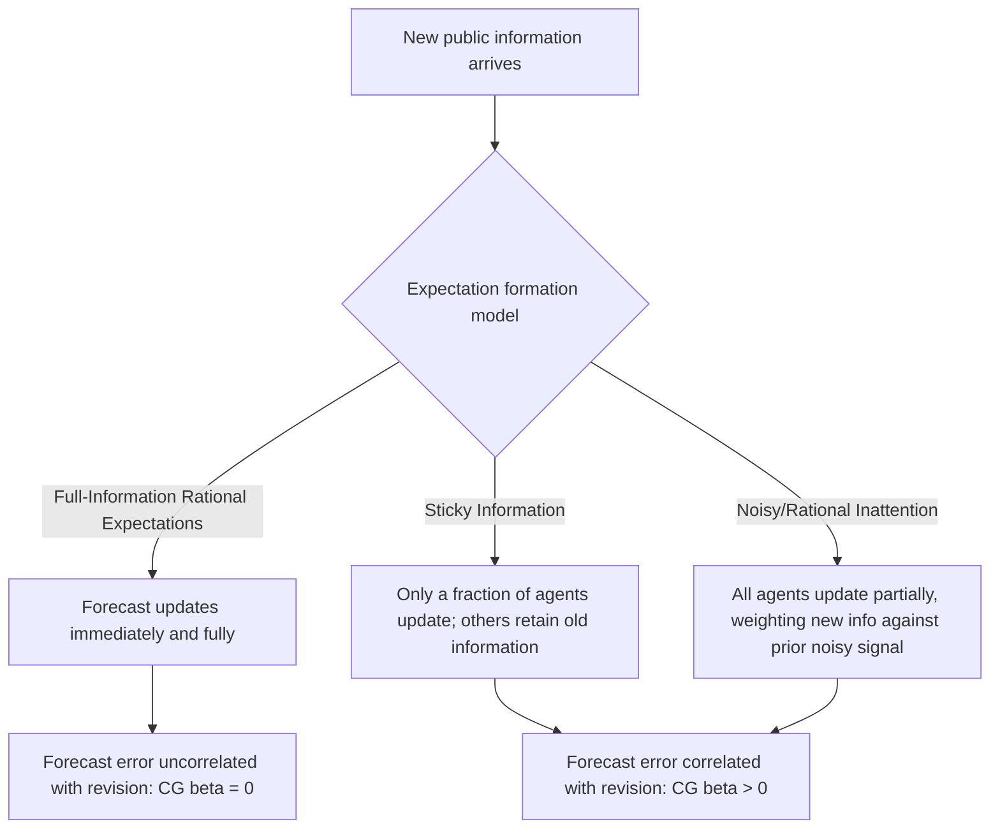

## Survey-Based Forecasting and Consensus Estimates

### Overview

Survey-based forecasting aggregates the subjective predictions of professional forecasters, businesses, consumers, or market participants into a composite ("consensus") view of future macroeconomic conditions. Unlike model-based approaches (ARIMA, VAR, DSGE), survey forecasts directly capture the judgment, private information, and information-processing of real economic agents, making them both a forecasting tool in their own right and a rich object of study for testing theories of expectation formation — most notably rational expectations. This topic covers the major survey instruments, methods of aggregating individual forecasts into consensus measures, the use of survey data to test expectation-formation theories, and the practical strengths and limitations of survey-based forecasting relative to model-based alternatives.

---

### Major Survey Instruments in Macroeconomics

**Survey of Professional Forecasters (SPF)**

Conducted quarterly by the Federal Reserve Bank of Philadelphia (inheriting a survey originally run by the American Statistical Association and National Bureau of Economic Research beginning in 1968), the SPF collects forecasts from a panel of professional economists for variables including real GDP growth, inflation (CPI and PCE), unemployment, interest rates, and corporate profits, at multiple horizons (current quarter through several quarters ahead, plus annual and long-run projections). It is among the longest-running and most heavily studied survey datasets in macroeconomics, providing a rich panel for testing forecast rationality and disagreement over multiple business cycles.

**Consensus Economics**

A commercial survey service polling several hundred economists across many countries monthly, covering GDP, inflation, interest rates, exchange rates, and other indicators, widely used by financial market participants, central banks, and international institutions (e.g., the IMF, in constructing "consensus forecast" benchmarks in its World Economic Outlook analyses).

**Blue Chip Economic Indicators**

A U.S.-focused monthly survey of business economists, historically influential in Federal Reserve and Treasury forecasting comparisons, covering similar variables to the SPF with a private-sector-oriented panel composition.

**Central Bank Surveys of Market Participants**

Many central banks conduct their own surveys of professional forecasters or market participants — for example, the Federal Reserve's Survey of Market Participants and Survey of Primary Dealers, the Bank of England's Survey of External Forecasters, and the European Central Bank's Survey of Professional Forecasters (modeled closely on the U.S. SPF). These often specifically target the central bank's own future policy actions, providing a direct read on market expectations for monetary policy.

**Household and Business Expectations Surveys**

- **University of Michigan Survey of Consumers** — collects consumer inflation expectations and broader sentiment, used both as a forecasting input and as a measure of household expectation formation
- **New York Fed Survey of Consumer Expectations (SCE)** — a more granular, panel-based survey of household expectations across inflation, income, house prices, and labor market outcomes
- **National Federation of Independent Business (NFIB) Small Business Survey** and similar business surveys — capture firm-level expectations for hiring, prices, and investment, often used as leading indicators

**Purchasing Managers' Index (PMI) Surveys**

Diffusion-index surveys (e.g., ISM Manufacturing and Services PMI in the U.S., S&P Global/Markit PMIs internationally) ask managers whether conditions (new orders, employment, prices paid) are improving, unchanged, or worsening. The **diffusion index** is constructed as:

$$DI = \%\text{Improving} + 0.5 \times \%\text{Unchanged}$$

A reading above 50 conventionally indicates expansion; below 50, contraction. PMIs are especially valued as **leading, high-frequency, timely indicators** — released well before official hard data (e.g., GDP), making them central inputs to nowcasting models (see the machine learning/nowcasting topic).

---

### Constructing Consensus Estimates: Aggregation Methods

**Simple (Equal-Weighted) Mean or Median**

The most common consensus measure is simply the cross-sectional mean or median of individual forecasts at a point in time:

$$\bar{y}_{t+h|t} = \frac{1}{N}\sum_{i=1}^{N} y_{i,t+h|t}$$

The **median** is often preferred to the mean in published consensus figures (e.g., Blue Chip, Consensus Economics headline figures) because it is more robust to outlier forecasts from individual panelists.

**Rationale for Equal Weighting: The Forecast Combination Puzzle**

A long-standing empirical finding (originating with Bates & Granger, 1969, and repeatedly confirmed in subsequent literature) is that simple equal-weighted averages of forecasts frequently outperform theoretically "optimal" weighting schemes (e.g., inverse-MSE weighting) out-of-sample. This **"forecast combination puzzle"** arises because optimal-weight estimators require estimating a covariance structure of forecast errors, and this estimation error often outweighs any theoretical gain from unequal weighting — particularly in the short, noisy samples typical of macro data. [Inference] This is one of the more robust stylized facts in the forecasting literature, though it does not imply equal weighting is optimal in *every* application; performance-based weighting can still add value when individual forecasters' track records are stable and well-estimated over a long history.

**Performance-Weighted Combination**

An alternative approach weights individual forecasts inversely to their historical forecast error variance:

$$w_i = \frac{1/\sigma_i^2}{\sum_{j=1}^{N} 1/\sigma_j^2}$$

so historically more accurate forecasters receive higher weight in the consensus. This requires a sufficiently long track record per forecaster to estimate $\sigma_i^2$ reliably — a substantial practical limitation, since survey panels have panelist turnover.

**Trimmed Mean**

Removes the highest and lowest $k\%$ of forecasts before averaging, reducing sensitivity to extreme outlier submissions while retaining more information than the median alone.

---

### Measuring Forecast Disagreement

Beyond the central-tendency consensus figure, the **cross-sectional dispersion** of individual forecasts is itself a widely-studied and economically meaningful object, often used as a proxy for macroeconomic uncertainty.

**Standard Measures of Disagreement:**

$$\text{Disagreement}_t = \sqrt{\frac{1}{N}\sum_{i=1}^{N}\left(y_{i,t+h|t} - \bar{y}_{t+h|t}\right)^2}$$

or, more robust to outliers, the **interquartile range (IQR)**:

$$\text{Disagreement}_t = Q_{75} - Q_{25}$$

**Disagreement vs. Uncertainty — a Crucial Distinction**

Disagreement (cross-sectional variance of point forecasts) is **not** the same concept as forecast uncertainty (the width of an individual forecaster's own subjective probability distribution). It is possible for forecasters to agree closely on a point forecast (low disagreement) while each individually reporting wide uncertainty bands (high individual uncertainty) — for example, in the immediate aftermath of a shock whose direction is clear but magnitude is highly uncertain. The SPF's inclusion of **individual density forecasts** (not just point forecasts) allows researchers to construct and separately study both concepts, an approach developed extensively by D'Amico and Orphanides, Boero, Smith, and Wallis, and others in the SPF literature.

**Uses of Disagreement Measures**

- Proxy for **macroeconomic uncertainty**, used in empirical studies of uncertainty's effects on investment, consumption, and output (related to but distinct from other uncertainty proxies like the VIX or the Baker-Bloom-Davis Economic Policy Uncertainty index)
- Input to **behavioral/expectations-formation models** — persistent disagreement is difficult to reconcile with a pure full-information rational expectations framework, where all agents observe the same public information and should converge on similar forecasts

---

### Testing Rational Expectations with Survey Data

Survey panels provide a direct, observable measure of expectations, enabling tests of expectation-formation theories that are not possible using purely model-based inflation/output expectations proxies.

**Testing Full-Information Rational Expectations (FIRE)**

Under FIRE, forecast errors should be unpredictable using any information available at the time the forecast was made:

$$E_t[y_{t+h} - \hat{y}_{i,t+h|t}] = 0$$

This is tested via **Mincer-Zarnowitz-style regressions** (see the forecast evaluation topic) applied to individual or consensus survey forecasts, and via **Coibion-Gorodnichenko (CG) regressions** (2015), which regress the ex-post forecast error on the ex-ante forecast *revision*:

$$y_{t+h} - \bar{y}_{t+h|t} = \alpha + \beta\left(\bar{y}_{t+h|t} - \bar{y}_{t+h|t-1}\right) + u_t$$

Under FIRE, $\beta = 0$: revisions to consensus forecasts should not predict subsequent forecast errors, since all relevant information should already be incorporated. **Empirically, $\beta$ is very frequently estimated to be significantly positive** across many countries, variables, and survey datasets — a robust and influential stylized fact in the expectations literature. A positive $\beta$ indicates **information rigidity**: forecasters underreact to new information, so that a positive forecast revision (news causing forecasters to revise up) predicts that the subsequent forecast error will also tend to be positive (the actual outcome exceeds even the revised forecast).

**Models of Information Rigidity**

The Coibion-Gorodnichenko finding has motivated theoretical models explaining *why* rational forecasters might exhibit predictable, systematic underreaction rather than the instantaneous full adjustment assumed under classical FIRE:

- **Sticky Information models** (Mankiw & Reis, 2002) — agents update their full information set only infrequently (e.g., due to costs of acquiring/processing information), so at any point in time some agents' forecasts still reflect stale information
- **Noisy/Imperfect Information (Rational Inattention) models** (Sims, 2003; Woodford, 2003) — agents observe public information with idiosyncratic noise and rationally choose to devote limited attention to precisely tracking it, given a fixed information-processing capacity, leading to partial, gradual adjustment even though no information is technologically unavailable

Both frameworks can rationalize a positive Coibion-Gorodnichenko coefficient without abandoning the assumption that agents are individually rational, distinguishing them from purely behavioral (non-rational) explanations of the same empirical pattern.

**Diagram: Rational vs. Rigid Expectation Adjustment**

---

### Survey Forecasts as Inputs to Empirical Macro Models

**Directly Measured Expected Inflation in the Phillips Curve**

Rather than relying on model-implied or backward-looking (adaptive) inflation expectations, empirical Phillips curve estimation increasingly incorporates **directly measured** survey expectations (from SPF, Michigan, or breakeven inflation from Treasury Inflation-Protected Securities markets) as the expectations term:

$$\pi_t = \pi_t^e + \kappa (u_t - u_t^*) + \varepsilon_t$$

where $\pi_t^e$ is proxied by survey-based expected inflation rather than derived purely from a statistical model of past inflation (e.g., an AR process), addressing long-standing concerns that model-implied expectations may not represent the beliefs actually held by wage- and price-setters.

**Survey Forecasts as Model Benchmarks**

As discussed in the forecast evaluation topic, the SPF/Consensus Economics consensus is a standard **benchmark** against which statistical and ML forecasting models are compared, on the premise that it reflects the aggregated private information and judgment of professional forecasters. [Inference] A widely-cited (though not universal) empirical finding is that survey consensus forecasts are difficult to consistently outperform for several key macro variables at short-to-medium horizons, particularly for inflation and GDP growth, though evidence varies by variable, horizon, and time period, and some studies do find model-based or ML approaches adding value at very short (nowcasting) horizons where model updates can exploit higher-frequency information faster than survey collection cycles allow.

**Fed's Own Forecasts vs. Private-Sector Surveys**

The Federal Reserve's own staff forecasts (the "Greenbook," now "Tealbook," released with a substantial lag for research purposes) and the FOMC's **Summary of Economic Projections (SEP)** provide additional survey-like consensus objects specific to policymakers, and are separately studied for evidence of superior information (e.g., research by Romer & Romer, 2000, examining whether Fed staff forecasts outperform private-sector consensus, generally finding evidence that Fed forecasts have historically contained additional predictive information beyond available private forecasts, [Unverified] though the persistence and current-day magnitude of this "Fed information advantage" continues to be debated and re-examined in more recent literature).

---

### Strengths and Limitations of Survey-Based Forecasting

**Strengths**

- Directly captures judgment, private information, and qualitative factors (e.g., regulatory changes, geopolitical events) not easily encoded in structural or statistical models
- High-frequency instruments (PMIs, consumer sentiment) provide timely leading signals well ahead of official statistical releases
- Provides a natural, model-free benchmark against which to judge model-based forecast value-added
- Rich micro-panel structure (individual-level SPF/SCE data) enables study of expectation formation and heterogeneity, not just aggregate point forecasts

**Limitations**

- **Strategic and reputational incentives** — individual forecasters may have incentives to herd toward consensus (avoiding being conspicuously wrong) or, conversely, to differentiate themselves with bold outlier calls to build reputation, distorting the informational content of individual submissions
- **Panel composition changes** — survey panels experience entry and exit of participants over time, complicating time-series comparability of disagreement measures
- **Infrequent updating** — most professional surveys are conducted monthly or quarterly, limiting their use for very high-frequency (daily/weekly) nowcasting relative to financial market-based or alternative-data measures
- **Point forecasts obscure asymmetric risk perception** — a single point forecast (or even the consensus mean) can mask meaningfully different individual risk assessments; this motivated the SPF's inclusion of density forecasts, but many other survey instruments still report point estimates only
- **Anchoring and behavioral biases** — some evidence (particularly in household/consumer expectations surveys such as the Michigan survey) suggests expectations can be influenced by recent, salient personal experiences with prices (e.g., gasoline prices) disproportionately relative to their contribution to the broader inflation basket — a well-documented behavioral departure from pure rational information-processing among *non-professional* respondents in particular

---

### Comparison: Survey-Based vs. Statistical/ML Forecasts

| Dimension | Survey/Consensus | ARIMA/VAR | Machine Learning |
| --- | --- | --- | --- |
| Information source | Human judgment, private information | Own/joint historical dynamics | Historical patterns, large predictor sets |
| Timeliness | Limited by survey frequency | As frequent as data allows | As frequent as data allows |
| Captures structural breaks/regime shifts | Potentially yes (human judgment can incorporate qualitative shifts) | Only if explicitly modeled (TVP, breaks) | Limited (extrapolates from training data) |
| Interpretability | High (transparent methodology, if not the underlying judgment) | High | Variable (low for deep learning) |
| Systematic bias documented | Yes (information rigidity, CG-regression evidence) | Possible (Mincer-Zarnowitz test) | Possible (requires similar rationality-style testing) |

---

### Practical Example: Using SPF Data for Forecast Evaluation

Suppose a researcher wants to test whether SPF consensus GDP growth forecasts are unbiased over 1998Q1–2023Q4. The standard workflow:

1. Obtain SPF median forecast $\hat{y}_{t+1|t}$ for real GDP growth (available from the Philadelphia Fed's public SPF database) and align with the corresponding realized value $y_{t+1}$ (choosing a specific data vintage — e.g., the first-released "advance" estimate — to respect real-time information availability, per the real-time data considerations discussed in forecast evaluation)
2. Estimate the Mincer-Zarnowitz regression: $y_{t+1} = \alpha + \beta \hat{y}_{t+1|t} + u_t$
3. Test $H_0: \alpha=0, \beta=1$ jointly via an F-test
4. Separately estimate the Coibion-Gorodnichenko regression using the quarter-over-quarter revision in the SPF consensus to test for information rigidity

[Inference] This is a standard, widely-replicated workflow structure in the empirical expectations literature; specific numerical results (magnitude of bias, significance of the CG coefficient) depend on the exact sample period and variable chosen and should not be assumed to replicate identically across studies or time periods.

---

**Related Topics**

- Coibion-Gorodnichenko regressions and tests of information rigidity in depth
- Sticky information vs. rational inattention models of expectation formation
- The New York Fed Survey of Consumer Expectations microdata structure
- Real-time data vintages and their interaction with survey-forecast evaluation
- Breakeven inflation and market-based measures of inflation expectations (TIPS spreads)
- Fed "information effect" in monetary policy announcements
- Behavioral economics of household inflation expectations
- Forecast combination and the forecast combination puzzle