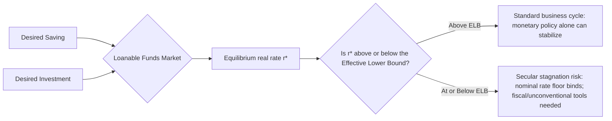

## Secular Stagnation and the Natural Rate of Interest Decline

### Overview

Secular stagnation refers to a hypothesized persistent state of weak aggregate demand, low economic growth, and a chronically depressed **natural (equilibrium) real rate of interest** ($r^*$), potentially so low that conventional monetary policy struggles to achieve full employment and target inflation even with nominal rates near zero. The concept, dormant since Alvin Hansen's 1938 formulation, was revived prominently by Lawrence Summers (2013–2014) in the aftermath of the Global Financial Crisis, when advanced economies exhibited a persistent combination of slow recoveries, below-target inflation, and policy rates constrained by the **effective lower bound (ELB)**. This topic covers the theoretical mechanics of $r^*$, the secular stagnation hypothesis and its proposed causes, empirical estimation methods, policy implications, and the principal critiques and counter-evidence.

---

### The Natural Rate of Interest: Theoretical Foundations

**Wicksellian Origins**

The concept traces to Knut Wicksell (1898), who defined the natural rate as the interest rate at which saving equals investment when output is at its potential level, and at which inflation is neither accelerating nor decelerating. Formally, in a simple flexible-price framework:

$$r^* = \text{the real interest rate consistent with output at potential } (y_t = y_t^*) \text{ and stable inflation}$$

**Modern New Keynesian Formulation**

In the canonical New Keynesian model, $r^*$ (also called the neutral rate) emerges from the household Euler equation under flexible prices:

$$r_t^* = \rho + \frac{1}{\sigma} E_t[\Delta y_{t+1}^*]$$

where $\rho$ is the household's rate of time preference (impatience), $\sigma$ is the (inverse of the) intertemporal elasticity of substitution, and $E_t[\Delta y_{t+1}^*]$ is expected growth in potential output. This equation directly links $r^*$ to the economy's underlying growth rate — a central theoretical link exploited throughout the secular stagnation literature: if trend growth ($E_t[\Delta y^*_{t+1}]$) falls, $r^*$ falls correspondingly (holding time preference and the elasticity of substitution fixed).

**Role in Monetary Policy**

$r^*$ is the benchmark against which the **current real policy rate** is compared to assess monetary policy stance:

$$\text{Policy stance} = r_t - r_t^*$$

- If $r_t > r_t^*$: policy is contractionary (restrictive) relative to neutral
- If $r_t < r_t^*$: policy is expansionary (accommodative) relative to neutral

This comparison underlies the **Taylor Rule** framework, in which $r^*$ serves as the anchor around which the recommended nominal policy rate is set:

$$i_t = r_t^* + \pi_t + \phi_\pi(\pi_t - \pi^*) + \phi_y(y_t - y_t^*)$$

A declining $r^*$ mechanically compresses the room central banks have to cut nominal rates before hitting the effective lower bound during a downturn, which is the core operational concern motivating the secular stagnation debate.

---

### The Secular Stagnation Hypothesis

**Hansen's Original (1938) Formulation**

Alvin Hansen, writing during the Great Depression, hypothesized that mature industrial economies would face chronically insufficient investment demand due to slowing population growth and a diminishing frontier of profitable capital-intensive innovation, resulting in persistent underemployment absent active fiscal intervention.

**Summers' Revival (2013–2014)**

Summers argued that advanced economies, particularly the U.S. and euro area, faced a similar structural problem post-2008: the real interest rate required to equate desired saving and desired investment at full employment had fallen below zero, or at least uncomfortably close to the effective lower bound, given persistently weak private investment demand relative to elevated desired saving. Under this diagnosis, standard monetary policy (limited to a nominal floor near zero, absent unconventional tools) would be structurally insufficient to close the output gap, implying a persistent risk of the economy settling into equilibria with excess saving, low growth, and below-target inflation — a mirror image of the pre-2008 conventional wisdom that low rates were merely cyclical.

**Diagram: Secular Stagnation vs. Standard Business Cycle**

---

### Proposed Causes of the $r^*$ Decline

The literature identifies several, largely complementary, structural forces argued to have pushed $r^*$ lower across advanced economies since roughly the 1980s–1990s, accelerating after 2008.

**1. Demographic Change**

Slowing population growth and rising life expectancy increase the pool of retirement-age savers relative to working-age borrowers/investors, raising aggregate desired saving (a "life-cycle" saving motive channel) while also reducing labor-force growth and thus the growth-driven component of $r^*$ in the Euler-equation framework above. [Inference] Demographic transition is among the most frequently cited and most robustly quantified drivers in the empirical literature (e.g., work by Carvalho, Ferrero, and Nechio, 2016; Gagnon, Johannsen, and López-Salido, 2021), because population aging trends are directly observable and project forward with relatively high confidence, unlike more speculative behavioral or technological channels.

**2. Rising Income and Wealth Inequality**

Higher-income and wealthier households have a lower marginal propensity to consume (higher saving rates) than lower-income households; a shift in income distribution toward higher-saving groups mechanically raises aggregate desired saving at any given interest rate, pushing down the market-clearing $r^*$ (a mechanism emphasized by Summers and Rachel, 2019, among others).

**3. Global Saving Glut**

Bernanke's (2005) "global saving glut" hypothesis, originally proposed to explain pre-2008 low long-term rates, complements the secular stagnation narrative: persistent current account surpluses in export-oriented emerging economies (particularly China) generated a large pool of savings seeking safe assets, exerting downward pressure on global long-term real rates.

**4. Decline in the Relative Price of Capital Goods and Investment Demand**

A documented long-run decline in the relative price of capital equipment (partly reflecting technological progress, particularly in information technology) means a given level of desired investment *spending* now purchases more physical capital, reducing measured aggregate investment demand relative to GDP even without a change in the desired capital *stock* — a mechanism explored by Sajedi and Thwaites (2016) and others as a contributor to the secular decline in investment's share of GDP.

**5. Rise of "Intangible Capital" and Reduced Capital Intensity of Growth**

The growing share of intangible investment (software, R&D, organizational capital, branding) relative to traditional physical capital in modern economies may require less external financing and lower aggregate capital formation per unit of output than earlier industrial-era growth, potentially reducing aggregate investment demand for a given level of desired output growth.

**6. Slowing Total Factor Productivity (TFP) Growth**

Robert Gordon's (2016) "The Rise and Fall of American Growth" thesis argues that the productivity gains from historical general-purpose technologies (electrification, the internal combustion engine, indoor plumbing) were larger and more broadly transformative than more recent information-technology-driven gains, implying a structural slowdown in trend TFP growth — directly lowering $r^*$ via the growth term in the Euler-equation relationship. This is a direct point of debate with more optimistic views regarding the growth potential of digitalization, AI, and other emerging technologies.

**7. Increased Demand for Safe Assets**

Post-2008 regulatory reforms (increased bank capital and liquidity requirements) and heightened risk aversion following the financial crisis increased institutional and household demand for safe, liquid assets (particularly government bonds), depressing safe real yields specifically — a mechanism distinguished in the literature from the broader decline in the *risk-free natural rate* concept, since it operates partly through a widening risk/liquidity premium rather than solely through the underlying saving-investment balance.

---

### Empirical Estimation of $r^*$

Because $r^*$ is unobservable (a theoretical construct, not a directly measured market rate), its estimation requires model-based inference, and different methodologies can yield materially different point estimates for the same period and country.

**Laubach-Williams (LW) Model**

The most widely cited and replicated approach (Laubach & Williams, 2003, updated regularly by the Federal Reserve Bank of New York) is a **semi-structural, unobserved-components model** estimated via the Kalman filter, jointly estimating $r^*$, potential output, and trend growth from a small system linking the output gap, inflation (via a Phillips curve), and the real interest rate gap (via an IS-curve-like relationship):

$$\tilde{y}_t = a_1 \tilde{y}_{t-1} + a_2 \tilde{y}_{t-2} + a_3(r_{t-1} - r_{t-1}^*) + \varepsilon_t^{\tilde{y}}$$

$$\pi_t = b_\pi \pi_{t-1} + b_y \tilde{y}_{t-1} + \varepsilon_t^{\pi}$$

$$r_t^* = c \cdot g_t + z_t$$

where $\tilde{y}_t$ is the output gap, $g_t$ is trend output growth, and $z_t$ is a residual "other factors" component capturing influences on $r^*$ not explained by trend growth alone (e.g., time preference shifts, safe-asset demand). The LW model has become the standard reference estimate cited by the Federal Reserve and widely used in academic and policy work, though the New York Fed itself publishes updated estimates with periodic methodological revisions.

**Holston-Laubach-Williams (HLW) Cross-Country Extension** (2017) extends the framework to jointly estimate $r^*$ for the U.S., euro area, U.K., and Canada, documenting a broadly common downward trend across these economies — supporting the view that secular stagnation forces are substantially global/common rather than purely country-specific.

**Term-Structure/Finance-Based Approaches**

Alternative methods extract $r^*$-consistent signals from the yield curve and inflation-indexed bond markets — for example, using the long end of the real yield curve (TIPS yields in the U.S.) as a market-based proxy for the long-run expected real rate, under the assumption that term premia can be adequately controlled for.

**DSGE-Based Estimates**

Fully structural New Keynesian DSGE models (e.g., variants building on Smets & Wouters, 2007) can generate model-consistent $r^*$ estimates as a byproduct of full-model estimation, though these estimates tend to be more sensitive to specific structural assumptions (e.g., the specification of preferences, capital adjustment costs) than the more agnostic semi-structural LW approach.

**Documented Empirical Pattern**

[Inference] Across essentially all major estimation methodologies (LW/HLW, term-structure-based, and DSGE-based), the broad qualitative finding is consistent: estimated $r^*$ for major advanced economies (U.S., euro area, Japan, U.K.) has trended significantly downward from the 1980s/1990s through approximately 2020, with estimates for several economies approaching zero or even into negative territory in the years just before and during the COVID-19 pandemic. The **precise numerical level** of $r^*$ estimates varies meaningfully across methodologies and is subject to substantial real-time estimation uncertainty (wide confidence bands around point estimates are a well-documented feature of the LW methodology specifically), so specific point estimates should be treated with appropriate caution rather than as precise, uncontested figures.

---

### Policy Implications

**Constraints on Conventional Monetary Policy**

A low or negative $r^*$ means the nominal policy rate required to achieve an accommodative real rate stance during a downturn is correspondingly low, increasing the frequency and duration with which the effective lower bound is expected to bind — a central concern motivating extensive research into unconventional monetary policy tools over the 2010s.

**Unconventional Monetary Policy Tools**

- **Quantitative Easing (QE)** — large-scale asset purchases aimed at compressing long-term yields and term premia when the short-term policy rate is constrained at the ELB
- **Forward Guidance** — committing to future policy paths to influence current long-term rates and expectations, operating through the expectations-hypothesis component of the yield curve
- **Negative Interest Rate Policy (NIRP)** — adopted by the ECB, Bank of Japan, and several other central banks (though not the Federal Reserve), pushing policy rates modestly below zero; [Unverified] the effectiveness and side effects (particularly on bank profitability and financial stability) of NIRP remain actively debated in the literature, without full consensus
- **Average Inflation Targeting / Makeup Strategies** — the Federal Reserve's 2020 framework revision explicitly cited the ELB-secular-stagnation concern as a motivation, committing to allow inflation to run moderately above target following periods of below-target inflation, aiming to raise average inflation expectations and thereby the effective policy space available before hitting the ELB

**Fiscal Policy Implications**

A central policy implication drawn by Summers and others is that if monetary policy alone is structurally insufficient to close persistent demand shortfalls at the ELB, a larger and more active role for **countercyclical (and potentially persistently expansionary) fiscal policy** is warranted, including sustained public investment, particularly since a low $r^*$ also directly lowers the government's cost of debt service, altering the calculus around fiscal sustainability (see the related debt-sustainability and $r < g$ literature, e.g., Blanchard's 2019 AEA presidential address).

**Fiscal Multipliers Near the Effective Lower Bound**

A related theoretical literature (e.g., Christiano, Eichenbaum, and Rebelo, 2011) argues that fiscal multipliers are larger than normal specifically when the policy rate is constrained at the ELB, because expansionary fiscal policy does not induce the offsetting interest-rate increase that would otherwise partially crowd out its effect in normal times — providing additional theoretical support for a more active fiscal role during secular-stagnation-type episodes.

---

### Critiques and Counter-Evidence

**Post-Pandemic Inflation Surge (2021–2023)**

The sharp, sustained inflation surge across advanced economies following the COVID-19 pandemic and subsequent monetary tightening cycle (with policy rates rising substantially above the effective lower bound across most major central banks) has prompted renewed debate over whether secular stagnation forces remain as dominant as argued in the pre-pandemic literature, or whether structural, supply-side, and fiscal-policy shifts (e.g., pandemic-related fiscal transfers, supply chain disruptions, deglobalization pressures, and elevated government borrowing) may be pushing $r^*$ back upward. [Speculation] Whether the post-2022 environment represents a durable reversal of the pre-pandemic secular stagnation trend or a temporary deviation before a return to a lower long-run $r^*$ is, as of this writing, an unresolved and actively researched question rather than a settled empirical conclusion; updated LW-style estimates should be consulted directly for the most current reading, since this is a rapidly evolving area.

**Measurement and Model Uncertainty Critiques**

Critics note that $r^*$ estimates (particularly from the LW model) are subject to substantial real-time revision as new data arrive and are highly sensitive to model specification choices (e.g., how trend growth is modeled, what "other factors" residual term captures) — raising concern that policy decisions calibrated tightly to a specific point estimate of an inherently imprecisely measured and model-dependent quantity carry meaningful risk.

**Alternative Explanations for Low Pre-2020 Rates**

Some economists have argued that the pre-pandemic low-rate environment reflected a combination of factors distinct from (or in addition to) Summers' secular stagnation demand-shortfall diagnosis, including specifically post-crisis balance-sheet deleveraging dynamics (a temporary, not permanently structural, phenomenon per Rogoff's "debt supercycle" framing) and central bank credibility/anchoring effects on long-run inflation expectations that may not be permanent structural features of the economy.

**Endogeneity of Investment to Policy and Institutional Factors**

Some critiques argue that weak measured investment demand may partly reflect specific, potentially reversible policy or institutional factors (e.g., corporate market concentration and reduced competitive pressure to invest, as emphasized in some industrial-organization-oriented critiques) rather than purely exogenous structural/demographic/technological forces, implying that targeted competition or industrial policy — rather than only demand-management fiscal/monetary tools — could be part of an effective response.

---

### Comparison: Secular Stagnation vs. Standard Cyclical Downturn Framing

| Dimension | Standard Cyclical View | Secular Stagnation View |
| --- | --- | --- |
| Nature of the demand shortfall | Temporary, self-correcting given sufficient monetary accommodation | Potentially persistent/structural |
| $r^*$ | Assumed roughly stable around a historical norm | Structurally depressed, potentially near or below zero |
| Sufficiency of conventional monetary policy | Generally sufficient given enough rate cuts | Potentially insufficient due to the effective lower bound |
| Role prescribed for fiscal policy | Primarily automatic stabilizers; discretionary fiscal policy secondary | Larger, potentially sustained active role warranted |
| Post-pandemic relevance | N/A (framework doesn't specifically address this) | Actively debated given rate normalization post-2022 |

---

### Practical/Analytical Example

Suppose the Laubach-Williams estimate for U.S. $r^*$ falls from approximately 2% in the late 1990s to near 0.5% by the late 2010s (illustrative of the qualitative, widely-documented downward trend rather than a specific vintage's exact published figures, which the reader should consult directly from the New York Fed's published LW series for precise, current values). If the Federal Reserve's inflation target is 2%, this implies a **nominal** neutral rate of roughly 2.5% (0.5% + 2%) rather than the roughly 4% (2% + 2%) that would have prevailed under the earlier $r^*$ estimate. During a recession requiring, say, a 3-percentage-point real rate cut below neutral to stabilize output, the required nominal policy rate would need to fall to approximately -0.5% under the lower-$r^*$ regime — below the effective lower bound — whereas the same real accommodation would have been achievable with a nominal rate of about 1% under the higher, earlier-era $r^*$ estimate. This stylized arithmetic illustrates precisely the mechanical channel through which a falling $r^*$ compresses the space for conventional monetary accommodation.

---

**Related Topics**

- The Laubach-Williams model in full technical detail (Kalman filter specification)
- Effective lower bound constraints and unconventional monetary policy toolkits
- The $r < g$ debate and public debt sustainability (Blanchard, 2019)
- Global saving glut hypothesis and international capital flows
- Demographic transition models and macroeconomic implications of population aging
- Average inflation targeting and central bank framework reviews
- Robert Gordon's productivity slowdown thesis and techno-optimist counterarguments
- Term premium estimation and market-based measures of long-run real rates