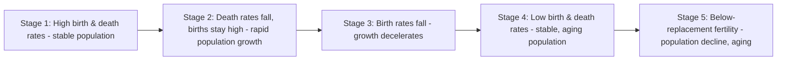

## Demographic Aging and Long-Run Macroeconomic Effects

### Overview

Demographic aging — the sustained rise in the median age and old-age dependency ratio of a population, driven jointly by declining fertility rates and rising life expectancy — is among the most predictable, slow-moving structural forces shaping long-run macroeconomic outcomes. Unlike business-cycle shocks, demographic transitions unfold over decades and are forecastable with relatively high confidence from current age-structure data, making them a distinctive input to long-run macroeconomic analysis. This topic covers the theoretical channels through which aging affects growth, saving, interest rates, and fiscal sustainability; the overlapping-generations (OLG) modeling framework used to formalize these effects; empirical evidence across major economies; and policy responses.

---

### The Demographic Transition: Empirical Patterns

**Stages of Demographic Transition**

Demographic transition theory describes a broadly common sequence observed across countries at different stages of economic development:

Most advanced economies (Japan, much of Western Europe, South Korea) are now in Stage 4 or 5; many emerging economies (much of Latin America, Southeast Asia) are transitioning through Stage 3; a smaller number of primarily lower-income economies (parts of Sub-Saharan Africa) remain in earlier stages.

**Key Demographic Metrics**

- **Total Fertility Rate (TFR)** — average number of children a woman would have given current age-specific fertility rates; the **replacement rate** (needed for long-run population stability absent migration) is approximately 2.1 in most developed-country contexts
- **Old-Age Dependency Ratio** — population aged 65+ divided by population aged 15–64 (working-age), typically expressed as a percentage
- **Median Age** — the age at which half the population is older and half younger

**Documented Global Patterns**

Fertility rates have fallen substantially below replacement level across most advanced economies (notably Japan, South Korea, Italy, and much of the rest of the EU), while life expectancy has risen due to improved healthcare, nutrition, and public health. [Inference] United Nations Population Division and national statistical agency projections consistently show old-age dependency ratios rising substantially across nearly all major economies through mid-century, though exact trajectories depend on future fertility, mortality, and net migration assumptions that carry inherent long-horizon uncertainty — the reader should consult current UN World Population Prospects data directly for the most recent projections and vintage-specific figures, since these are periodically revised.

---

### Theoretical Framework: The Overlapping Generations (OLG) Model

**Basic Structure**

The **Diamond (1965) OLG model** is the workhorse framework for analyzing demographic effects on saving, capital accumulation, and growth. Agents live for two (stylized) periods — working-age and retirement — and must allocate lifetime resources across both:

$$\max_{c_{1,t}, c_{2,t+1}} u(c_{1,t}) + \beta u(c_{2,t+1})$$

subject to:

$$c_{1,t} + s_t = w_t \quad \text{(working period)}$$

$$c_{2,t+1} = s_t(1+r_{t+1}) \quad \text{(retirement period)}$$

where $c_{1,t}$ and $c_{2,t+1}$ are consumption while working and retired, $s_t$ is saving, $w_t$ is the wage, and $r_{t+1}$ is the return on saving. This life-cycle structure directly implies that **saving is undertaken specifically to finance retirement consumption**, creating a mechanical link between the size of the retirement-age cohort (relative to the working-age cohort financing it) and aggregate saving behavior.

**Capital Accumulation and the Dependency Ratio**

In the standard OLG framework, the capital stock per worker in the next period is determined by the current working generation's saving, divided by the *size of the next generation*:

$$k_{t+1} = \frac{s_t}{1+n}$$

where $n$ is the population growth rate. This equation reveals two offsetting demographic channels operating through population growth:

- **Lower $n$ (slower population/labor-force growth)** mechanically raises capital per worker $k_{t+1}$ for a given level of aggregate saving $s_t$, since that saving is spread across a smaller next-generation labor force — a "capital dilution" effect running in the *opposite* direction from the aggregate-demand-reduction channel emphasized in secular stagnation analysis
- Simultaneously, an aging population (more retirees relative to workers) tends to raise the *aggregate* saving rate through the life-cycle mechanism (more of the population is in the high-saving, pre-retirement/retirement phase), reinforcing capital deepening

**Life-Cycle Hypothesis (Modigliani, 1966)**

The **Life-Cycle Hypothesis** formalizes the saving-age relationship: individuals dissave when young (borrowing against future income), save during peak working years, and dissave again in retirement (running down accumulated assets), producing a hump-shaped age-saving profile:

$$\text{Saving Rate}(age) = \begin{cases} \text{negative/low} & \text{young} \\ \text{high, peaking mid-career} & \text{working prime-age} \\ \text{negative (dissaving)} & \text{retired} \end{cases}$$

A population with a *large share of prime-working-age individuals* (a "demographic dividend" configuration) tends to exhibit a higher aggregate saving rate than one with a large elderly (dissaving) or young (low/negative-saving) share — this age-structure effect is central to understanding how the *timing* of demographic transition, not just its ultimate steady state, matters for aggregate saving and growth.

---

### Channel 1: Labor Force and Potential Output Growth

The most direct growth-accounting channel: potential output growth can be decomposed (in a simple Cobb-Douglas framework) as:

$$g_Y \approx g_A + \alpha g_K + (1-\alpha) g_L$$

where $g_A$ is TFP growth, $g_K$ is capital growth, $g_L$ is labor-input growth, and $\alpha$ is capital's income share. A shrinking or slower-growing working-age population directly reduces $g_L$, mechanically lowering potential output growth absent offsetting increases in labor force participation, capital deepening, or productivity growth. Japan is the most frequently cited real-world illustration, having experienced a shrinking working-age population since the mid-1990s alongside a multi-decade period of low measured GDP growth (though the precise causal decomposition between demographic and other factors, such as the post-bubble balance-sheet adjustment, remains debated).

**Offsetting Margins**

- **Labor force participation** — rising female labor force participation and increased participation among older workers (partly induced by pension reforms raising retirement ages) can partially offset working-age population decline
- **Immigration** — net migration inflows of working-age individuals directly augment $g_L$ and can meaningfully alter the demographic trajectory, a policy lever distinct from fertility (which operates with multi-decade lags before affecting the labor force)
- **Capital deepening and automation** — a shrinking labor force can induce substitution toward capital-intensive and automated production processes, partially offsetting the direct labor-input drag (an active area of research examining whether robotics/automation adoption rates are systematically higher in more rapidly aging economies)

---

### Channel 2: Saving, Investment, and the Natural Rate of Interest

As introduced in the secular stagnation topic, demographic aging is one of the most robustly quantified drivers of the estimated decline in $r^*$ across advanced economies. The mechanism operates through two, partially offsetting, channels within the OLG/life-cycle framework:

**Saving-Side Effect**

An aging population with a large cohort approaching or in retirement (still accumulating or just beginning to draw down savings) can raise aggregate desired saving, pushing down the market-clearing real interest rate needed to equate saving and investment — this is the dominant channel emphasized in most secular-stagnation-oriented demographic literature (e.g., Carvalho, Ferrero, and Nechio, 2016).

**Dissaving/Drawdown Effect (Longer Horizon)**

As the aging cohort *fully* transitions into retirement and begins running down accumulated assets (dissaving) to finance consumption, this could eventually reverse and begin to *raise* real interest rates, since a larger retired, dissaving population reduces net aggregate saving relative to a scenario with the same population but a younger age structure. [Inference] The relative timing and magnitude of these two offsetting phases (the initial saving buildup vs. the eventual dissaving drawdown) is sensitive to model assumptions (e.g., bequest motives, the specific age-profile of saving, whether the transition is anticipated) and is an area of ongoing modeling refinement rather than a settled, universally-agreed quantitative sequence.

**Reduced Investment Demand**

A shrinking or slower-growing labor force reduces the amount of capital investment needed to maintain a constant capital-labor ratio (less new capital is required to equip fewer new workers), directly reducing aggregate investment *demand* — reinforcing, alongside the saving-side effect, the downward pressure on $r^*$ operating through the standard saving-investment equilibrium framework introduced in the secular stagnation topic.

---

### Channel 3: Fiscal Sustainability — Pension and Healthcare Systems

**Pay-As-You-Go (PAYGO) Pension System Strain**

Most advanced-economy public pension systems operate on a **pay-as-you-go** basis, in which current workers' contributions directly fund current retirees' benefits, rather than each generation pre-funding its own retirement through accumulated individual assets. The sustainability of a PAYGO system depends directly on the **support ratio** (workers per retiree):

$$\text{Support Ratio} = \frac{\text{Working-age population}}{\text{Retired population}}$$

A declining support ratio — the direct arithmetic consequence of population aging — mechanically strains PAYGO system finances, requiring some combination of: rising contribution (payroll tax) rates on a shrinking relative worker base, reduced benefit generosity, a higher statutory retirement age, or general-revenue transfers/increased public borrowing to close the funding gap.

**Healthcare Expenditure Growth**

Age-specific healthcare spending typically rises sharply in later life; an aging population share, combined with generally rising per-capita healthcare costs (partly independent of demographics, reflecting medical technology advancement), places substantial additional pressure on public healthcare budgets (e.g., Medicare in the U.S., National Health Service funding in the U.K.), often projected as an even larger long-run fiscal pressure than pension systems alone in many advanced-economy long-term fiscal sustainability analyses (e.g., CBO long-term budget outlook publications in the U.S. context).

**Long-Run Fiscal Sustainability Arithmetic**

The basic government debt dynamics condition:

$$\Delta b_t = (r_t - g_t) b_{t-1} - pb_t$$

where $b_t$ is the debt-to-GDP ratio and $pb_t$ is the primary balance (surplus positive), shows that demographic aging affects fiscal sustainability through *both* terms: it raises required primary spending (pension and healthcare obligations, worsening $pb_t$) while its effect on $(r-g)$ is ambiguous and debated — a lower $r^*$ (partly demographically driven, as discussed above) could ease debt sustainability by reducing the interest-growth differential, even as it simultaneously reflects and may coincide with lower trend growth $g$, which independently worsens the same differential. This ambiguity is a live area of research connecting the demographic and secular-stagnation/$r^*$ literatures directly to fiscal sustainability analysis.

---

### Channel 4: Inflation and Monetary Policy Transmission

**Theoretical Ambiguity on Inflation**

The relationship between demographic aging and inflation is theoretically ambiguous and has generated a genuinely unsettled empirical debate:

- **Deflationary channel** — an aging, slower-growing population may reduce aggregate demand growth and investment demand more than it reduces aggregate supply/potential output, exerting disinflationary pressure (broadly consistent with Japan's multi-decade experience of low growth accompanied by persistently low, and at times negative, inflation)
- **Inflationary channel** — Goodhart and Pradhan (2020), in an influential and contrarian contribution, argue the *opposite*: as the large working-age cohort (the historical "demographic dividend" generation, e.g., the Baby Boomers) transitions into retirement, the shrinking relative supply of working-age labor could raise real wages and labor's bargaining power, creating cost-push inflationary pressure that reverses several decades of disinflationary globalization-and-demographics-driven trends

[Inference] This represents a genuine, unresolved dispute within the academic and policy literature rather than a settled consensus; the divergent theoretical predictions (which channel dominates depends on assumptions about relative demand vs. supply effects, and about labor-market bargaining dynamics) mean the net inflationary or disinflationary effect of aging is an actively contested empirical question, and post-pandemic inflation dynamics have been cited by proponents on both sides of this debate as at least partially consistent with their view.

---

### Cross-Country Illustrative Comparison

| Economy | Demographic Stage | Key Documented/Cited Feature |
| --- | --- | --- |
| Japan | Advanced aging, shrinking population since ~2010s | Longest-running real-world case study; multi-decade low growth/low inflation; earliest and most aggressive unconventional monetary policy response |
| Germany, Italy | Advanced aging, low fertility | Significant projected old-age dependency ratio increases; substantial pension system reform debates within the EU |
| South Korea | Extremely low fertility (among the lowest globally) | [Unverified] Frequently cited in recent demographic literature and journalism as a leading-edge case of rapid fertility decline, though longer-run macroeconomic consequences are still emerging and should be assessed against current, dedicated demographic research rather than this general overview |
| United States | Moderate aging, partially offset by immigration | Slower aging trajectory than Japan/Europe historically, though projected old-age dependency ratio still rises materially over coming decades per Social Security Administration and Census Bureau long-run projections |
| China | Rapid aging following historical one-child policy period | Notable case of "getting old before getting rich" relative to historical advanced-economy aging trajectories at comparable per-capita income levels |

[Inference] Specific current dependency-ratio and fertility figures for any of these economies should be verified against current UN, OECD, or national statistical agency data, since demographic statistics are periodically updated and this table is intended to illustrate qualitative stylized patterns rather than serve as a precise current data source.

---

### Policy Responses

**Pension System Reforms**

- **Raising the statutory retirement age**, indexed either to fixed schedules or automatically to life expectancy (adopted in various forms across several European pension systems)
- **Parametric reforms** — adjusting contribution rates, benefit formulas, or cost-of-living adjustment mechanisms
- **Shift toward funded/defined-contribution elements** — partially or fully pre-funded individual retirement accounts, reducing (though not eliminating, given transition costs) direct exposure to the PAYGO support-ratio arithmetic

**Immigration Policy**

Expanding working-age immigration is among the most direct policy levers capable of altering a country's demographic trajectory on a shorter timescale than fertility-focused interventions (which take approximately two decades to affect the labor force), though immigration policy involves substantial political economy considerations beyond pure macroeconomic demographic arithmetic.

**Pro-Natalist Policies**

Policies aimed at raising fertility rates (childcare subsidies, parental leave, direct financial incentives) have been adopted in various forms in several low-fertility countries (e.g., various Nordic and East Asian economies); [Unverified] the empirical evidence on the magnitude and persistence of such policies' effects on completed fertility rates is mixed across the literature and should be assessed via current, country-specific empirical studies rather than assumed to be uniformly effective.

**Labor Force Participation Policies**

Policies encouraging extended working lives (phased retirement options, age-discrimination protections, reskilling programs for older workers) and increased participation among underrepresented groups (e.g., childcare support to raise female labor force participation) can partially offset working-age population decline's direct effect on $g_L$.

**Productivity-Enhancing Policies**

Given the direct growth-accounting link between slower labor force growth and potential output growth, increased emphasis on productivity growth (via R&D investment, automation adoption, education/human capital investment) as a substitute growth driver is a commonly proposed policy complement to demographic-specific interventions.

---

### Practical Numerical Illustration

Consider a stylized economy with the growth-accounting decomposition $g_Y = g_A + 0.3 \cdot g_K + 0.7 \cdot g_L$ (capital share $\alpha = 0.3$). Suppose working-age population growth $g_L$ falls from a historical average of 1.0% annually to -0.5% annually (a realistic order-of-magnitude shift for several aging advanced economies), while $g_A$ (TFP growth) and $g_K$ (capital growth) remain unchanged at their historical averages of 1.0% and 2.5% respectively:

$$\Delta g_Y = 0.7 \times (-0.5\% - 1.0\%) = 0.7 \times (-1.5\%) = -1.05 \text{ percentage points}$$

This stylized calculation illustrates the direct arithmetic magnitude by which a shift of this size in labor force growth alone could mechanically reduce potential GDP growth by slightly over one percentage point annually, absent any offsetting increase in participation rates, capital deepening, or TFP growth — a magnitude broadly consistent with (though not a precise replication of) estimates found in various growth-accounting studies of aging advanced economies. [Inference] This is an illustrative, stylized calculation using representative parameter values, not a specific country's actual empirically estimated growth decomposition.

---

**Related Topics**

- Overlapping generations (OLG) models in full technical detail
- Life-cycle hypothesis and empirical age-saving profile estimation
- Pay-as-you-go vs. funded pension system design and transition costs
- Secular stagnation and the natural rate of interest decline (related chapter topic)
- Immigration economics and labor market effects
- Long-term fiscal sustainability analysis and generational accounting
- Automation, robotics adoption, and labor force substitution in aging economies
- Goodhart-Pradhan demographic reversal and inflation hypothesis