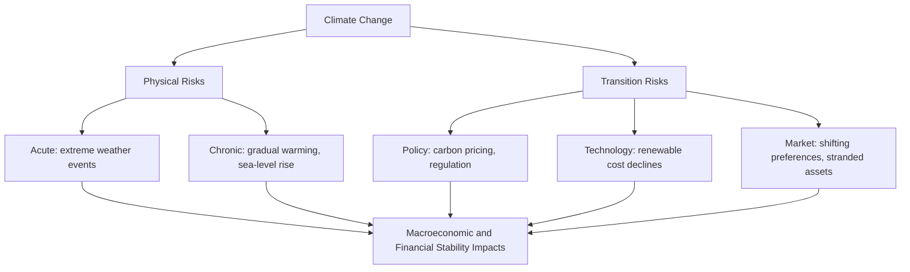

## Climate Change and Macroeconomic Modeling

### Overview

Climate change presents a distinctive challenge to macroeconomic modeling: it involves long-horizon, highly uncertain, partially irreversible physical processes interacting with economic systems through channels operating over decades to centuries, alongside near-term policy and transition dynamics that are directly relevant to current business-cycle and financial-stability analysis. This has produced two broadly distinct but increasingly interconnected modeling literatures — **Integrated Assessment Models (IAMs)**, which link climate science to long-run economic damage and optimal policy analysis, and **climate-augmented macro-financial models**, which incorporate climate-related physical and transition risks into shorter-horizon DSGE, VAR, and financial-stability frameworks used by central banks and regulators. This topic covers both strands, their underlying theory, key results, and their significant methodological and empirical limitations.

---

### Two Channels of Climate-Economy Interaction

The literature distinguishes two broad categories of climate-related economic risk, a taxonomy now standard in central bank and regulatory climate risk assessments (e.g., the Network for Greening the Financial System, NGFS):

**Physical Risks**

Direct economic damages from climate change itself:

- **Acute physical risks** — damages from discrete extreme weather events (hurricanes, floods, wildfires, heatwaves), whose frequency and/or severity are attributed by climate science to a changing climate
- **Chronic physical risks** — gradual, sustained shifts (rising average temperatures, sea-level rise, shifting precipitation patterns) affecting agricultural productivity, labor productivity (particularly in outdoor/heat-exposed sectors), coastal real estate values, and infrastructure

**Transition Risks**

Economic costs and disruptions arising from the *policy, technological, and market shifts* required to reduce greenhouse gas emissions and adapt to a lower-carbon economy:

- Carbon pricing (taxes or cap-and-trade systems) raising costs for emissions-intensive sectors
- **Stranded assets** — fossil fuel reserves, extraction infrastructure, and carbon-intensive capital that become uneconomical or unusable before the end of their expected useful life due to regulation or shifting demand
- Rapid technological shifts (renewable energy cost declines, electrification) disrupting incumbent industries and associated employment
- Shifts in consumer preferences and investor capital allocation away from carbon-intensive assets and sectors

---

### Integrated Assessment Models (IAMs)

**Purpose and Structure**

IAMs couple a simplified representation of the climate system (translating greenhouse gas emissions into atmospheric concentrations and global temperature change) with an economic growth model (translating temperature change into economic damages, and economic activity into emissions), enabling analysis of optimal climate policy — most centrally, the **Social Cost of Carbon (SCC)**, the present-value economic damage caused by emitting one additional ton of CO₂.

**The DICE Model (Dynamic Integrated Climate-Economy)**

Developed by William Nordhaus (awarded the 2018 Nobel Memorial Prize in Economic Sciences substantially for this body of work), DICE is the most widely cited and replicated IAM framework. Its core structure extends a standard Ramsey-style optimal growth model with a climate module:

**Economic block** (simplified Ramsey growth framework):

$$Y_t = A_t K_t^\gamma L_t^{1-\gamma}$$

$$\Omega(T_t) = \frac{1}{1 + \psi_1 T_t + \psi_2 T_t^2} \quad \text{(damage function)}$$

$$Y_t^{net} = \Omega(T_t) \cdot [1-\mu_t]^{\theta} \cdot Y_t$$

where $Y_t^{net}$ is output net of both climate damages (via the damage function $\Omega(T_t)$, decreasing in temperature $T_t$) and abatement costs (the term involving emission-reduction rate $\mu_t$, since reducing emissions is itself economically costly). Output is allocated between consumption and investment, with the social planner (or decentralized economy under a chosen policy) optimizing intertemporal welfare subject to this net-of-damage resource constraint.

**Climate block** (simplified carbon-cycle and temperature model):

$$M_t = \text{atmospheric carbon stock, evolving with emissions } E_t \text{ net of natural removal}$$

$$T_t = \text{global temperature, responding to radiative forcing from } M_t \text{ with a lag}$$

**Optimal Carbon Tax / Social Cost of Carbon**

The model's central policy output is the optimal carbon price path — the Pigouvian tax that internalizes the marginal external damage of emissions — derived from the shadow price of the carbon-stock constraint in the planner's optimization:

$$SCC_t = -\frac{\partial W/\partial E_t}{\partial W/\partial C_t}$$

the ratio of the marginal welfare cost of an additional unit of emissions to the marginal utility of consumption, expressed in consumption-equivalent (dollar) terms.

**Other Major IAM Frameworks**

- **PAGE (Policy Analysis for the Greenhouse Effect)** — used prominently in the UK Stern Review (2006); incorporates explicit uncertainty via Monte Carlo simulation over key parameters
- **FUND (Climate Framework for Uncertainty, Negotiation and Distribution)** — features more regionally disaggregated damage estimates than DICE
- **RICE (Regional DICE)** — a multi-region extension of DICE incorporating cross-country heterogeneity in damages, abatement costs, and strategic interaction in climate policy

**The Discount Rate Debate**

A central, long-running and consequential controversy in IAM-based policy analysis concerns the choice of the **social discount rate** ($\rho$ in the Ramsey formula), because IAM-derived SCC estimates are extremely sensitive to this parameter given the multi-century damage horizon involved:

$$r = \rho + \eta \cdot g$$

(the Ramsey discounting formula, where $\rho$ is pure time preference, $\eta$ is the elasticity of marginal utility with respect to consumption, and $g$ is consumption growth). The **Stern Review (2006)** used a very low pure time-preference rate ($\rho \approx 0.1\%$, justified on ethical grounds regarding intergenerational equity — arguing there is no ethical basis for discounting the welfare of future generations purely because of when they are born), yielding a much higher effective discount rate implication and correspondingly higher estimated SCC and more aggressive recommended near-term abatement, whereas Nordhaus's DICE calibrations historically used higher $\rho$ values closer to observed market rates, yielding lower SCC estimates and a more gradual recommended abatement path. [Inference] This discount-rate sensitivity is widely regarded in the literature as the single most consequential modeling choice driving divergent policy recommendations across IAM studies, more so than differences in the underlying climate science or damage function specification — a point emphasized in methodological reviews of the IAM literature (e.g., critiques by Robert Pindyck and others).

---

### Critiques of IAMs

**The Damage Function Critique**

Pindyck (2013, "Climate Change Policy: What Do the Models Tell Us?") and subsequent critics argue that IAM damage functions are largely calibrated to limited historical data on *moderate* temperature changes and extrapolated, often via simple low-order polynomial functional forms, to the much larger temperature increases relevant for long-run policy scenarios — a functional form choice with limited empirical grounding for extreme, non-linear, and potentially catastrophic outcomes (tipping points, large-scale ecosystem collapse) that may not be well captured by smooth polynomial damage functions calibrated on more moderate historical experience.

**Fat-Tailed/Catastrophic Risk Critique**

Martin Weitzman's **"dismal theorem"** (2009) argues that under sufficiently fat-tailed uncertainty about extreme, catastrophic climate outcomes, standard expected-utility cost-benefit analysis (as employed by DICE-style IAMs) can break down — the potential for very low-probability, very high-damage catastrophic outcomes can dominate the expected-value calculation in ways that make precise point-estimate policy recommendations from standard IAMs poorly suited to genuinely characterizing the relevant tail risk, implying a stronger justification for a precautionary-principle-style approach to abatement than expected-value IAM optimization alone would suggest.

**Aggregation and Regional Heterogeneity**

Global-aggregate IAMs (like standard DICE) can obscure substantial cross-regional heterogeneity in both climate damages (tropical/lower-latitude and lower-income regions are widely projected to face disproportionately larger physical damages) and abatement costs, motivating the more regionally disaggregated RICE-style and other multi-region extensions, though these introduce additional complexity around modeling strategic interaction and burden-sharing across regions/countries.

---

### Climate in Short-to-Medium-Run Macro Models

Distinct from the long-horizon IAM tradition, a growing literature incorporates climate-related shocks and transition dynamics directly into standard **DSGE and macro-financial modeling frameworks** used for business-cycle analysis, monetary policy, and financial stability assessment — a literature substantially developed and adopted by central banks and financial regulators over the 2018–2024 period.

**Climate Shocks as Supply Shocks**

Physical climate shocks (e.g., a drought reducing agricultural output, or an extreme heat event reducing labor productivity) are often modeled analogously to standard **negative supply/productivity shocks** in a New Keynesian framework, entering the production function or a TFP process:

$$Y_t = A_t(1 - D_t) K_t^\alpha L_t^{1-\alpha}$$

where $D_t$ represents a climate-damage factor reducing effective TFP. This framing allows analysis of climate shocks' implications for the classic monetary policy tradeoff, since a negative supply shock (reducing output while, absent offsetting factors, potentially raising some prices — e.g., food/energy price spikes) can create a stagflationary combination complicating standard central bank stabilization objectives.

**Climate-Related Financial Stability Risk**

Central banks and financial regulators increasingly incorporate climate scenarios into **stress-testing frameworks**, examining how physical risks (e.g., insured losses from extreme weather concentrated in bank and insurer balance sheets) and transition risks (e.g., a rapid, disorderly repricing of carbon-intensive assets creating losses for financial institutions with concentrated exposure) could propagate through the financial system and amplify into broader macro-financial instability — conceptually extending standard macro-financial amplification/financial-accelerator mechanisms (e.g., Bernanke-Gertler-Gilchrist-style balance-sheet channels) to climate-specific shock sources.

**NGFS Climate Scenarios**

The **Network for Greening the Financial System (NGFS)**, a coalition of central banks and supervisors, has developed and periodically updated a standardized set of climate scenarios widely used across central bank and regulatory climate stress-testing exercises, generally organized along two dimensions:

| Scenario Category | Description |
| --- | --- |
| Orderly Transition | Climate policy implemented early and predictably; physical risks contained, transition risks manageable |
| Disorderly Transition | Climate policy delayed then implemented abruptly; larger transition risk/asset repricing shocks |
| Hot House World | Insufficient mitigation policy globally; severe physical risks realized, minimal transition risk |
| Too Little, Too Late | Combination of delayed, insufficient policy action with both elevated physical and transition risks materializing |

[Inference] The specific quantitative parameterizations of these NGFS scenario categories are periodically updated (multiple vintages have been released since the framework's introduction), so current analytical or policy work should reference the most recently published NGFS scenario vintage directly rather than assuming figures from any earlier version remain current.

---

### Carbon Pricing: Macroeconomic Mechanics

**Carbon Tax**

A direct per-unit tax on carbon emissions (or carbon content of fuel), setting a known, fixed price:

$$p_{CO_2} = \tau \quad \text{(fixed by policy)}$$

with the resulting quantity of emissions reduction determined endogenously by the economy's response to that price signal (uncertain quantity outcome, certain price).

**Cap-and-Trade (Emissions Trading System)**

Sets a fixed cap on aggregate emissions (allocated or auctioned as tradable permits), with the market-clearing price determined endogenously by supply (the fixed cap) and demand for permits:

$$Q_{CO_2} = \bar{Q} \quad \text{(fixed by policy)}, \quad p_{CO_2} \text{ determined by market}$$

yielding certain quantity outcomes but uncertain (potentially volatile) prices — a classic quantity-vs-price instrument choice tradeoff (following the Weitzman 1974 prices-vs-quantities framework) applied to climate policy design, with the relative desirability of each instrument depending on the relative slopes of marginal abatement cost and marginal damage curves.

**Macroeconomic Transmission of Carbon Pricing**

A carbon price operates macroeconomically similarly to a negative supply shock concentrated in carbon-intensive sectors: raising costs and prices for emissions-intensive goods (energy, certain manufacturing and transportation), with aggregate effects depending on the scale of the carbon price, the economy's carbon intensity, the extent of revenue recycling (e.g., carbon tax revenue returned via household rebates or reduced other taxes, which can offset some aggregate demand and distributional effects), and the speed/predictability of implementation (disorderly, unanticipated implementation generally associated with larger transition-risk-style disruption than a gradual, well-telegraphed path).

---

### Green Fiscal Policy and Public Investment

**Green Fiscal Multipliers**

A related applied literature examines whether public investment specifically targeted at green/low-carbon infrastructure (renewable energy, grid modernization, public transit) carries different fiscal multiplier properties than conventional public investment, given potential complementarities with private green investment and, in some specifications, larger employment effects in renewable versus fossil-fuel energy sectors per dollar invested. [Inference] Empirical estimates of green fiscal multipliers specifically (as distinct from general public investment multipliers) remain a comparatively less mature and more actively developing area of the empirical literature relative to the much longer-established general fiscal multiplier literature, so specific multiplier magnitudes cited in this space should be treated with somewhat greater caution regarding their robustness and generalizability across country contexts.

**Border Carbon Adjustments**

Mechanisms (e.g., the EU's Carbon Border Adjustment Mechanism) that impose a carbon-price-equivalent charge on imports from jurisdictions with less stringent carbon pricing, designed to address both **carbon leakage** (production/emissions relocating to jurisdictions with weaker climate policy rather than genuinely reducing global emissions) and competitiveness concerns for domestic emissions-intensive industries facing unilateral carbon pricing.

---

### Empirical Estimation Challenges

**Identifying Causal Climate Effects on Growth**

A substantial empirical literature (e.g., Dell, Jones, and Olken, 2012, and subsequent work) uses panel data with country/region and year fixed effects, exploiting *within-country variation in weather* (as a plausibly exogenous proxy for climate-related shocks, distinct from long-run climate itself which does not vary at high frequency within a location) to estimate the effect of temperature on economic growth, generally finding a robust negative association between higher temperatures and growth, particularly pronounced in poorer, hotter (often tropical/lower-latitude) countries — though extrapolating short-run weather-shock elasticities to long-run climate-change damage projections requires additional, debated assumptions about the extent to which economies can adapt over longer horizons than captured in weather-shock identification strategies.

**Uncertainty and Tail Risk in Empirical Damage Estimation**

Beyond the point-estimate damage functions discussed above, an active literature examines the **distribution** of possible climate outcomes and associated economic damages, given genuine scientific uncertainty about key climate sensitivity parameters (e.g., how much warming results from a given atmospheric CO₂ concentration) — directly connecting to the Weitzman fat-tail critique discussed above and motivating more explicitly probabilistic/scenario-based (rather than single-point-estimate) approaches to both academic and policy-relevant climate-economic analysis.

---

### Comparison: IAM vs. Macro-Financial Climate Modeling Approaches

| Dimension | Integrated Assessment Models (DICE, PAGE, FUND) | Climate-Augmented DSGE/Macro-Financial Models |
| --- | --- | --- |
| Time horizon | Multi-decade to multi-century | Business-cycle to medium-term (years) |
| Primary purpose | Optimal long-run climate policy, Social Cost of Carbon | Business-cycle stabilization, financial stability, stress testing |
| Key output | Optimal carbon tax path, welfare analysis | Impulse responses, financial stability metrics, scenario losses |
| Institutional users | Academic researchers, government cost-benefit analysis (e.g., regulatory impact assessments citing SCC) | Central banks, financial regulators (e.g., NGFS scenario stress tests) |
| Central methodological controversy | Discount rate choice, damage function specification | Model calibration to genuinely novel, non-stationary climate-shock processes without long historical precedent |

---

### Practical Illustration: Stylized Social Cost of Carbon Sensitivity

To illustrate the discount-rate sensitivity discussed above: suppose a ton of CO₂ emitted today causes an expected $50 of economic damage occurring, on average, 100 years in the future (a simplified single-period stand-in for a distributed damage stream). The present value of this damage under two different discount rate assumptions:

$$PV_{low} = \frac{\$50}{(1+0.015)^{100}} \approx \$50 \times 0.222 \approx \$11.10$$

$$PV_{high} = \frac{\$50}{(1+0.05)^{100}} \approx \$50 \times 0.0076 \approx \$0.38$$

A discount rate difference of just 3.5 percentage points (1.5% vs. 5%, both economically plausible depending on underlying assumptions) produces roughly a **29-fold difference** in the present-value damage estimate for the identical physical damage assumption. This stylized arithmetic directly illustrates why the discount-rate debate is widely regarded as the most consequential single modeling choice in IAM-based Social Cost of Carbon estimation, dwarfing in practical policy impact many of the more scientifically-grounded parameter disputes over the underlying climate sensitivity or damage function curvature.

---

**Related Topics**

- The Ramsey optimal growth model and social discount rate theory in depth
- Weitzman's dismal theorem and fat-tailed catastrophic risk economics
- NGFS climate scenario framework and central bank stress-testing methodology
- Carbon pricing instrument design: taxes vs. cap-and-trade (Weitzman prices-vs-quantities)
- Weather-shock identification strategies in empirical climate-growth studies
- Green fiscal multipliers and public investment in low-carbon infrastructure
- Stranded assets and financial stability implications of energy transition
- Border carbon adjustment mechanisms and international trade policy