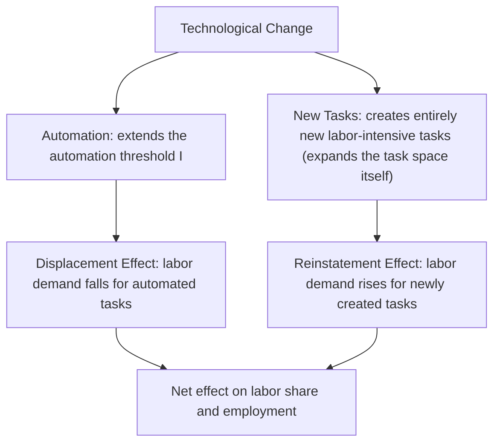

## Automation, Artificial Intelligence, and Labor Markets

### Overview

The macroeconomics of automation and artificial intelligence examines how technologies that substitute for or complement human labor affect aggregate employment, wages, the labor share of income, and the distribution of economic outcomes across skill groups, occupations, and regions. This literature sits at the intersection of growth theory, labor economics, and, increasingly, the study of a genuinely novel technological wave (generative AI and large language models) whose full macroeconomic implications remain actively researched and are subject to substantially more uncertainty than the effects of more historically-precedented automation technologies. This topic covers the task-based modeling framework central to contemporary analysis, the routine-biased technical change literature, labor share and wage inequality evidence, and emerging analysis of generative AI specifically.

---

### Historical Context: Automation Anxiety and Its Precedents

Concern that machines will permanently displace human labor is a recurring theme across economic history — from the Luddite movement (early 19th century, opposing textile mechanization) through Keynes's 1930 essay warning of "technological unemployment," to repeated waves of automation-anxiety literature accompanying mechanization, computerization, robotics, and now AI. [Inference] A standard observation drawn from this long history in the academic literature is that, in aggregate, historical automation waves have generally not produced sustained mass unemployment, instead being associated with labor reallocation across sectors and occupations, rising average living standards, and shifting (not simply shrinking) demand for labor — though this historical pattern does not by itself establish that the same aggregate outcome will necessarily hold for future or currently unfolding automation waves, particularly given the qualitatively different characteristics of AI relative to prior mechanical/routine-task automation (discussed below), and reasonable economists differ on how much weight to place on historical precedent alone.

---

### The Task-Based Framework: Theoretical Foundation

**Motivation for Moving Beyond the Standard Production Function**

The canonical Cobb-Douglas or CES production function, combining capital and labor as broad aggregate inputs, cannot capture a central empirical feature of automation: technology does not substitute for labor *uniformly* across all jobs, but rather for specific **tasks** within jobs, with substitutability varying substantially by task type. The **task-based framework**, developed principally by Daron Acemoglu and Pascual Restrepo (building on earlier work by Zeira, 1998, and Autor, Levy, and Murnane, 2003), addresses this directly.

**Core Structure (Acemoglu-Restrepo, 2018 and related work)**

Output is produced by combining a continuum of tasks indexed $i \in [0,1]$:

$$Y = \left(\int_0^1 y(i)^{\frac{\sigma-1}{\sigma}} di\right)^{\frac{\sigma}{\sigma-1}}$$

Each task can be produced using either labor or capital (where technologically feasible):

$$y(i) = \alpha(i) l(i) + \beta(i) k(i)$$

with a technology frontier $I \in [0,1]$ defining which tasks *can* currently be automated (tasks below the threshold $I$ can be produced by capital; tasks above cannot yet be automated and require labor).

**Two Distinct Margins of Technological Change**

This framework's central conceptual contribution is decomposing "technology" into two economically distinct effects operating on labor demand:

**Displacement Effect**

When a task previously performed by labor becomes automatable (the threshold $I$ rises), labor is directly displaced from that task, reducing labor demand and (all else equal) putting downward pressure on wages and the labor share of income — this is the effect most emphasized in popular automation-anxiety narratives.

**Reinstatement Effect**

Technological change simultaneously often creates **entirely new tasks and job categories** in which labor has a comparative advantage (historically: machine operators, industrial designers, software engineers, and — a currently-debated contemporary example — AI trainers, prompt engineers, and AI oversight/auditing roles), expanding the task space in ways that *increase* labor demand and can offset or even exceed the displacement effect.

**Net Effect and Empirical Ambiguity**

Acemoglu and Restrepo's key theoretical point is that the *net* effect of any given technological wave on employment, wages, and the labor share is **ambiguous a priori** — it depends on the relative magnitude of displacement versus reinstatement, which is fundamentally an empirical question specific to each technology and time period, not something derivable from theory alone.

---

### Routine-Biased Technical Change (RBTC)

**The Autor-Levy-Murnane (ALM) Framework (2003)**

A closely related and highly influential strand of the literature classifies job tasks along two dimensions: **routine vs. non-routine**, and **cognitive vs. manual**, arguing that computerization historically substituted most directly for **routine** tasks (those following well-defined, codifiable, rule-based procedures — e.g., bookkeeping, assembly-line operation, basic data processing) regardless of whether those routine tasks were cognitive or manual, while complementing **non-routine** tasks at both ends of the skill spectrum:

| Task Type | Examples | Historical Automation Effect |
| --- | --- | --- |
| Non-routine cognitive | Management, complex problem-solving, creative work, professional/technical judgment | Complemented (demand and wages tend to rise) |
| Routine cognitive | Bookkeeping, basic clerical work, standard data entry | Substituted (demand and wages tend to fall) |
| Routine manual | Assembly-line production, repetitive machine operation | Substituted (demand and wages tend to fall) |
| Non-routine manual | Food service, personal care, security, many hands-on trades | Historically least affected by computerization specifically (though robotics and physical AI applications are an evolving frontier here) |

**Job Polarization**

The empirical prediction and widely-documented consequence of RBTC is **labor market polarization** — relative employment and wage growth concentrated at both the top (high-skill, non-routine cognitive) and bottom (low-skill, non-routine manual) of the occupational skill distribution, with the *middle* of the distribution (routine cognitive and routine manual jobs — historically a major source of stable, often unionized, middle-class employment) experiencing relative decline. This "hollowing out of the middle" pattern has been documented extensively across U.S. and European labor markets from roughly the 1980s onward (e.g., Autor & Dorn, 2013; Goos, Manning, and Salomons, 2014).

---

### The Labor Share of Income

**The Puzzle of the Declining Labor Share**

A substantial body of empirical work (notably Karabarbounis and Neiman, 2014, and Autor, Dorn, Katz, Patterson, and Van Reenen, 2020) documents a broad-based decline in labor's share of national income across most advanced economies from roughly the early 1980s through at least the mid-2010s — a notable departure from the historically stable labor share long treated as one of Kaldor's stylized facts of economic growth.

**Proposed Explanations**

- **Capital-augmenting automation** — within the task-based framework, an increased pace of automation (a rising displacement effect relative to reinstatement) directly predicts a falling labor share, since a larger portion of value-added accrues to capital in newly-automated tasks
- **Decline in the relative price of capital equipment** — as discussed in the demographic-aging topic, falling equipment prices (partly IT-driven) increase capital's effective substitutability for labor at any given real interest rate, a mechanism formally connected to the labor-share decline by Karabarbounis and Neiman (2014) via an elasticity-of-substitution-between-capital-and-labor greater than one
- **Rising market concentration/superstar firms** — Autor, Dorn, Katz, Patterson, and Van Reenen (2020) document that the aggregate labor share decline is substantially concentrated in the reallocation of activity toward high-productivity, lower-labor-share "superstar firms" within industries, rather than a uniform within-firm decline across the economy
- **Globalization and offshoring** — increased international trade and offshoring of routine-task-intensive production to lower-wage countries, operating through a related but analytically distinct channel from domestic automation

[Inference] These explanations are generally treated in the empirical literature as complementary, overlapping contributors rather than mutually exclusive competing hypotheses, with most studies finding a role for multiple channels simultaneously rather than attributing the full labor-share decline to any single cause.

---

### Empirical Evidence: Industrial Robots

**The Acemoglu-Restrepo Robot Studies**

A prominent and heavily-cited empirical strand (Acemoglu & Restrepo, 2020, "Robots and Jobs: Evidence from US Labor Markets," and related cross-country work) uses variation in industrial robot adoption across U.S. commuting zones (exploiting differences in local industry exposure to robot-adopting industries, following a Bartik-style shift-share instrumental variable identification strategy) to estimate robots' local labor market effects, generally finding negative effects on both employment and wages in commuting zones more exposed to robot adoption, with effects concentrated particularly among workers without a college degree and in routine manual occupations, consistent with the displacement channel of the task-based framework operating at meaningful local labor market scale, at least over the specific historical sample period and geography studied.

**General Equilibrium and Aggregate vs. Local Effects**

An important methodological caveat, emphasized in follow-on literature, is that **local labor market studies** (comparing more- vs. less-exposed regions) estimate *relative* local effects, which need not equal the *aggregate/national* net employment effect if there is any general-equilibrium reallocation of demand or labor across regions, or if aggregate reinstatement effects (new task creation) are more spatially diffuse than the concentrated local displacement effects being measured — a distinction relevant to interpreting the broader macroeconomic implications of any single local-labor-market automation study.

---

### Generative AI and Large Language Models: An Emerging, Distinct Case

**Why Generative AI May Differ from Prior Automation Waves**

A substantial and rapidly evolving research literature (concentrated particularly from roughly 2022 onward, following the widespread public deployment of large language models) argues that generative AI differs qualitatively from prior automation technologies in ways with potentially distinct macroeconomic implications:

- **Exposure concentrated in cognitive, non-routine tasks** — unlike the routine-biased pattern of prior computerization (which primarily displaced routine tasks), generative AI shows meaningful capability in *non-routine cognitive* tasks (writing, coding, analysis, customer service dialogue) previously considered relatively automation-resistant under the RBTC framework, potentially implying a distinct pattern of occupational exposure than historical automation waves
- **Skill-level exposure pattern debated** — several empirical studies (e.g., Eloundou, Manning, Mishkin, and Rock, 2023, using an occupational-task-exposure methodology; Felten, Raj, and Seamans, various years) find that exposure to generative AI capability is, if anything, **higher among higher-education, higher-wage occupations** than the historically routine-task-concentrated (often middle-wage) exposure pattern of earlier automation — a potentially significant departure from the job-polarization pattern documented for prior technology waves
- **Complementarity vs. substitution within occupations** — a distinct and actively-researched question from *occupational exposure* is whether AI, within an exposed occupation, primarily *substitutes* for the tasks in question (reducing labor demand for that occupation) or *complements* worker productivity (augmenting output per worker without necessarily reducing headcount) — early empirical field-experiment-based evidence (e.g., studies of AI-assisted customer support and coding tasks) has found productivity gains concentrated particularly among lower-skilled/less-experienced workers within a given occupation in several specific studied contexts, a pattern sometimes termed a "leveling" effect on within-occupation productivity dispersion, though the generalizability of this finding across occupations and the longer-run employment (as opposed to short-run productivity) implications remain open questions

**Genuine Uncertainty in This Literature**

[Speculation] Given how recently generative AI has been deployed at scale, the empirical literature specifically quantifying its aggregate labor market and macroeconomic effects (as opposed to occupational exposure/task-overlap measures, which are more established) remains in an early and rapidly developing stage as of this writing; claims about aggregate employment, wage, or labor-share effects specifically attributable to generative AI should be treated as considerably more provisional and subject to revision than the more established, longer-studied literature on industrial robots and routine-biased technical change discussed above. Readers seeking the current state of this specific literature should consult recent research directly, given how quickly it is evolving.

---

### Policy Responses and Debates

**Universal Basic Income (UBI)**

Proposed by some as a response to potential widespread technological displacement, providing an unconditional income floor decoupled from labor market participation; [Inference] the economic debate over UBI centers substantially on funding mechanisms, labor supply effects (whether unconditional income transfers meaningfully reduce work incentives, an empirical question examined in various randomized pilot studies with mixed and context-dependent findings), and whether targeted alternatives (wage subsidies, earned income tax credits, sector-specific retraining programs) might address displacement concerns more cost-effectively than a universal, non-targeted transfer.

**Robot Tax Proposals**

Proposals (associated prominently with Bill Gates's 2017 public comments, though contested among economists) to tax capital that displaces labor, intended to slow the pace of automation and/or fund worker transition support; mainstream economic critique generally argues such a tax could reduce productivity growth and capital investment broadly, potentially proving a blunt and distortionary instrument relative to more directly targeted labor-market and social-insurance policies, and raises significant practical difficulty in precisely defining and measuring "robot" capital for tax purposes.

**Active Labor Market Policies and Retraining**

Government-funded retraining, job-search assistance, and relocation support programs aimed at facilitating worker transitions from displaced to expanding occupations/sectors — a policy response consistent with the task-based framework's emphasis on facilitating the reallocation implied by the reinstatement-effect mechanism, though empirical evidence on retraining program effectiveness is genuinely mixed across the broader active-labor-market-policy evaluation literature, with effectiveness varying by program design and target population.

**Education Policy and Skill-Biased Technical Change**

Given the RBTC/polarization evidence, a substantial policy literature emphasizes education and skill-development policy (STEM education, vocational/technical training aligned with complementary-skill demand) as a longer-run structural response, connecting to the broader "race between education and technology" framing (Goldin & Katz, 2008) of how educational attainment growth has historically interacted with skill-biased technological change to shape the evolution of wage inequality.

---

### Comparison: Historical Automation Waves vs. Generative AI

| Dimension | Industrial Robots / Historical Computerization | Generative AI (LLMs) |
| --- | --- | --- |
| Primary task exposure | Routine (cognitive and manual) | Non-routine cognitive (writing, analysis, coding, dialogue) |
| Skill-level exposure pattern | Concentrated in middle-skill occupations (polarization) | Debated; some evidence of higher exposure among higher-education occupations |
| Empirical evidence base | Extensive, multi-decade (robots, computerization) | Limited, rapidly evolving as of this writing |
| Dominant documented local labor market effect | Displacement generally found in exposed local labor markets (e.g., robot-exposure studies) | Not yet well-established at comparable local-labor-market empirical rigor |
| Within-occupation effect evidence | Primarily substitution/displacement framing | Mixed evidence of complementarity/productivity augmentation in several early field studies |

---

### Practical Illustrative Example: Task-Based Framework Arithmetic

Consider a simplified two-task economy where task A (currently performed by labor) becomes automatable, while simultaneously a new task C is created that only labor can perform. Suppose:

- Displacement effect: task A's automation reduces labor demand by 100 units of labor-equivalent output
- Reinstatement effect: new task C creates demand for 70 units of labor-equivalent output

Net labor demand effect: $-100 + 70 = -30$ units — a net *negative* effect on labor demand in this illustrative scenario, despite the simultaneous creation of new tasks, because reinstatement (70) did not fully offset displacement (100) in this specific numerical example. [Inference] This is a deliberately simplified numerical illustration of the task-based framework's core displacement-vs-reinstatement logic, not an estimate of any actual empirically-measured technology's real-world net effect — actual studies (such as the Acemoglu-Restrepo robot papers) estimate these magnitudes empirically for specific technologies, time periods, and geographies rather than assuming stylized illustrative values of this kind.

---

**Related Topics**

- Acemoglu-Restrepo task-based model in full technical/mathematical detail
- Job polarization and the Autor-Dorn "consumption amenities" model of local labor markets
- Labor share decline: superstar firms and market concentration evidence
- Skill-biased technical change and the "race between education and technology"
- Generative AI occupational exposure studies (Eloundou et al., Felten et al.)
- Universal Basic Income: theory, funding, and pilot program evidence
- Active labor market policy design and retraining program evaluation
- Offshoring, trade, and labor market effects (the "China shock" literature)