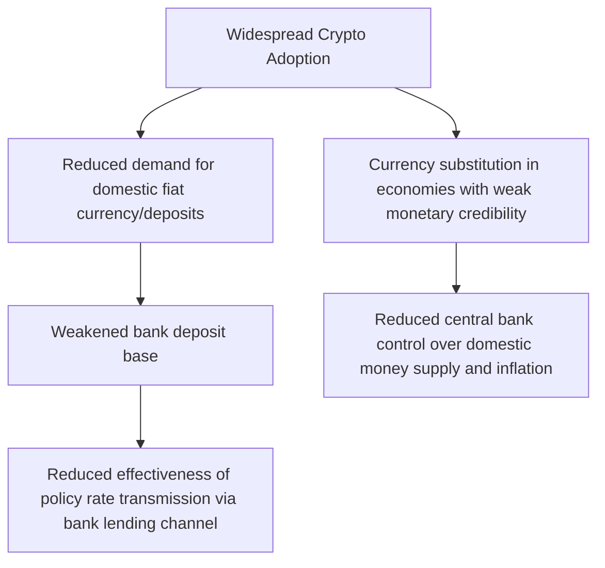

## Cryptocurrency and Monetary Policy Implications

### Overview

Cryptocurrency and related digital-asset innovations raise a distinct set of questions for monetary economics: whether decentralized digital currencies can function as genuine money under standard monetary theory criteria, how widespread cryptocurrency adoption might affect monetary policy transmission and financial stability, and how central banks should respond — both defensively (regulation) and proactively (through Central Bank Digital Currencies, CBDCs). This is a rapidly evolving area where market structure, regulatory frameworks, and technology have changed substantially even within the past few years, so this topic synthesizes the standard analytical frameworks alongside a note on where current developments should be verified directly.

---

### Cryptocurrency Against the Classical Functions of Money

Standard monetary economics evaluates any candidate money against three canonical functions: **medium of exchange**, **unit of account**, and **store of value**. This framework provides the natural starting point for assessing cryptocurrencies' monetary properties.

**Medium of Exchange**

For an asset to function effectively as a medium of exchange, it needs to be widely accepted, low-cost and fast to transact with, and resistant to counterfeiting or double-spending — a problem cryptocurrencies solve cryptographically via distributed ledger/blockchain consensus mechanisms rather than through a trusted central intermediary. In practice, [Inference] Bitcoin and most other major cryptocurrencies have seen only limited use as an everyday transactional medium of exchange relative to their use as an investment/speculative asset, a pattern widely noted in the empirical and policy literature (e.g., Bank for International Settlements research), reflecting factors including price volatility (discussed below), transaction throughput limitations on some networks, and variable transaction fees.

**Unit of Account**

Prices are rarely quoted or contracts denominated in cryptocurrency terms even in jurisdictions with active crypto markets; goods and services are overwhelmingly still priced in official fiat currency, with cryptocurrency serving as a payment *method* (converted to/from fiat at the point of transaction) rather than the underlying unit of account — a distinction with substantive economic content, since a genuine unit-of-account role would require price stability that most cryptocurrencies have not historically exhibited.

**Store of Value**

This is the function most actively debated. Proponents (particularly of Bitcoin, often framed as "digital gold") argue its fixed, algorithmically-capped supply (21 million bitcoin, by protocol design) provides a scarcity-based store of value analogous to gold, immune to the discretionary supply expansion possible with fiat currencies. Critics counter that **realized price volatility** has historically been substantially higher than for both fiat currencies and traditional stores of value like gold, undermining the store-of-value case in the short-to-medium run, even if a longer-run store-of-value role remains a matter of ongoing debate among analysts. [Unverified] Bitcoin's volatility and its correlation with other risk assets (e.g., equities) have varied considerably across different market periods, so any specific volatility or correlation statistic should be checked against current data rather than assumed to be stable over time.

**Verdict in the Mainstream Monetary Economics Literature**

[Inference] The dominant view expressed in central bank research and mainstream monetary economics (though not universally shared, and contested by cryptocurrency proponents) is that most existing cryptocurrencies function today predominantly as **speculative assets** rather than as money in the full classical sense, given their limited unit-of-account role and historically high volatility undermining consistent store-of-value and medium-of-exchange performance — while acknowledging that specific sub-categories, particularly stablecoins (discussed below), are designed specifically to address the volatility limitation and merit separate analysis.

---

### Stablecoins: A Distinct Category

**Design and Mechanism**

Stablecoins are cryptocurrencies specifically designed to maintain a stable value, typically pegged to a fiat currency (most commonly the U.S. dollar), addressing the volatility critique directly. Major design approaches include:

- **Fiat-collateralized stablecoins** — backed by reserves of the referenced fiat currency and/or short-term liquid assets (e.g., Treasury bills) held by the issuer, redeemable roughly 1:1 (subject to issuer solvency and reserve quality)
- **Crypto-collateralized stablecoins** — backed by a basket of other cryptocurrencies, typically over-collateralized to absorb the collateral assets' own price volatility
- **Algorithmic stablecoins** — attempt to maintain the peg via automated supply-adjustment mechanisms (minting/burning tokens in response to price deviations) without direct asset backing — a design that has proven particularly fragile in practice, most notably illustrated by the May 2022 collapse of the TerraUSD (UST) algorithmic stablecoin, which lost its dollar peg and precipitated broader contagion across crypto markets

**Monetary and Financial Stability Relevance**

Because fiat-collateralized stablecoins function similarly to a **narrow bank or money-market-fund-like liability** (a claim redeemable for fiat currency, backed by a reserve portfolio), their systemic importance and regulatory treatment has become a central focus of financial stability analysis at institutions including the Financial Stability Board, the Bank for International Settlements, and national regulators, particularly regarding: the quality and liquidity of reserve assets backing large stablecoins, the potential for "runs" analogous to historical money-market-fund runs if redemption confidence is questioned, and the systemic interconnection between large stablecoin issuers and traditional financial markets (e.g., through Treasury bill holdings).

---

### Cryptocurrency and Monetary Policy Transmission

**Potential Channels of Interference with Transmission**

If cryptocurrency adoption became sufficiently widespread as a genuine substitute for domestic fiat currency in transactions and saving, several theoretical channels could weaken standard monetary policy transmission:

**Currency Substitution Concerns in Emerging Markets**

[Inference] The theoretical concern regarding cryptocurrency-driven currency substitution is generally considered most salient for economies with weak monetary credibility, high domestic inflation, capital controls, or underdeveloped banking systems — historical analogues to "dollarization" phenomena observed in various emerging and developing economies — rather than for advanced economies with credible, low-inflation central banks and well-developed financial systems, where fiat currency and bank deposits face comparatively limited genuine substitution pressure from cryptocurrency specifically as of current adoption levels. El Salvador's 2021 adoption of Bitcoin as legal tender is frequently cited as a notable real-world test case of state-level cryptocurrency monetary integration; [Unverified] the macroeconomic outcomes and current legal status of this policy should be verified against current reporting given ongoing policy evolution, since Salvadoran cryptocurrency policy has continued to develop since initial adoption.

**Limited Evidence of Aggregate Transmission Impairment to Date**

[Inference] As of current available evidence, most central bank and academic analyses have not found strong evidence that cryptocurrency adoption has materially impaired monetary policy transmission in major advanced economies, reflecting cryptocurrency's still-limited role as a genuine transactional medium of exchange relative to bank deposits and fiat currency, though this is an evolving assessment that could change with shifts in adoption patterns, stablecoin growth, or technology (this is precisely the kind of empirical, evolving claim that should be checked against the most current central bank research and BIS/IMF assessments rather than assumed static).

---

### Financial Stability Implications

**Contagion Channels**

The crypto market's growing interconnection with traditional finance — through institutional investment, crypto-linked exchange-traded products, stablecoin reserve holdings of traditional assets (e.g., Treasury bills), and bank/financial-institution exposure to crypto firms — creates potential channels through which crypto-market stress could transmit to broader financial markets, a concern that intensified following high-profile 2022 events including the TerraUSD collapse and the subsequent failure of the FTX exchange.

**Leverage and Opacity**

Crypto markets have historically featured significant leverage (via derivatives and lending platforms) and, in various segments, limited transparency regarding counterparty risk and asset custody practices relative to traditional regulated financial institutions — concerns directly motivating the expanding international regulatory focus (discussed below) on prudential standards, disclosure requirements, and custody rules for crypto-asset service providers.

**Bank Exposure and Prudential Treatment**

Basel Committee on Banking Supervision guidance has established a prudential framework for banks' cryptocurrency exposures, generally applying substantially more conservative capital treatment to unbacked/volatile crypto-assets than to traditional assets, reflecting regulators' assessment of their distinct risk profile; [Inference] specific capital requirement parameters have been refined since initial framework publication and should be checked against the current Basel framework text for precise, up-to-date figures.

---

### Regulatory Responses

**Divergent International Approaches**

Regulatory treatment of cryptocurrency has varied substantially across jurisdictions, ranging from comprehensive dedicated regulatory frameworks (e.g., the EU's Markets in Crypto-Assets, MiCA, regulation) to more fragmented, agency-by-agency regulatory approaches applying existing securities, commodities, and banking law frameworks to crypto assets on a case-by-case basis (a pattern historically more characteristic of U.S. regulatory treatment, though this has continued to evolve), to more restrictive approaches in some jurisdictions including outright trading or mining restrictions. [Unverified] Given the pace of regulatory development in this area across multiple major jurisdictions, current regulatory status in any specific jurisdiction should be verified directly rather than assumed from this general overview, since this is an area of active and ongoing legislative and regulatory change.

**Anti-Money Laundering and Illicit Finance Concerns**

A distinct regulatory concern, somewhat separate from core monetary-policy transmission questions, centers on cryptocurrency's use in money laundering, sanctions evasion, and other illicit finance, motivating expanding "travel rule" and know-your-customer (KYC) requirements applied to crypto exchanges and service providers in most major jurisdictions' regulatory frameworks.

---

### Central Bank Digital Currencies (CBDCs): The Proactive Policy Response

**Definition and Motivation**

A CBDC is a digital liability of the central bank itself (as opposed to a commercial bank deposit or a private cryptocurrency), representing a direct digital analogue to physical currency. Central bank interest in CBDC development has been motivated by several distinct considerations:

- Providing a **public-sector digital payment alternative** as cash usage has declined in many economies, preserving public access to central bank money in digital form
- **Defensive response** to private cryptocurrency and stablecoin growth, aiming to maintain monetary sovereignty and the central bank's role at the center of the payment system
- **Payment system efficiency and financial inclusion** objectives, particularly emphasized in several emerging-market CBDC projects
- **Cross-border payment efficiency** — a frequently cited potential benefit given the historically high cost and slow settlement of traditional cross-border payment/correspondent-banking arrangements

**Retail vs. Wholesale CBDC**

- **Retail CBDC** — available directly to the general public and businesses for everyday transactions, functioning as a digital analogue to physical cash
- **Wholesale CBDC** — restricted to use among financial institutions for interbank settlement, a more incremental extension of existing central bank reserve/settlement systems rather than a direct public-facing innovation

**Design Considerations and Tradeoffs**

- **Disintermediation risk** — a widely-discussed concern is that an attractive, interest-bearing (or even non-interest-bearing but simply convenient) retail CBDC could draw deposits away from commercial banks, potentially reducing bank lending capacity and altering the structure of financial intermediation, a concern motivating various proposed design mitigants (e.g., holding limits, tiered remuneration structures making CBDC less attractive as a large-scale savings vehicle relative to bank deposits)
- **Privacy vs. traceability tradeoff** — full transaction traceability (useful for anti-money-laundering and tax-compliance purposes) conflicts with the privacy characteristics of physical cash, a tension central to ongoing CBDC design debates across jurisdictions
- **Monetary policy implementation implications** — a widely-adopted CBDC could, in principle, provide central banks a more direct tool for monetary policy implementation (e.g., theoretically enabling more direct "helicopter money"-style transfers or more granular interest-rate-setting on CBDC holdings), though these more far-reaching implementation possibilities remain largely theoretical and are not standard features of CBDC projects currently in active development or pilot phases

**Global CBDC Development Status**

[Inference] As of recent survey data (e.g., from the Bank for International Settlements, which conducts periodic central bank surveys on this topic), a substantial majority of the world's central banks have been engaged in some form of CBDC research, pilot, or development work, with a smaller number having progressed to live retail CBDC issuance (e.g., the Bahamas' Sand Dollar, Nigeria's eNaira) or advanced pilot phases (e.g., China's e-CNY, the ECB's digital euro preparatory work). [Unverified] Given how actively this area is developing across many jurisdictions simultaneously, the current status of any specific country's CBDC project should be verified against current central bank publications and BIS survey data directly, since project status, timelines, and design details are subject to frequent revision and this represents exactly the kind of "current state of a specific initiative" question that benefits from direct verification rather than general background knowledge.

---

### Comparison: Cryptocurrency, Stablecoins, and CBDC

| Dimension | Cryptocurrency (e.g., Bitcoin) | Stablecoin | CBDC |
| --- | --- | --- | --- |
| Issuer | Decentralized/no central issuer | Private company/consortium | Central bank |
| Value stability | Historically volatile | Designed to be pegged/stable | Stable (equals fiat currency 1:1 by definition) |
| Legal tender status | Rare (El Salvador notable exception) | No | Yes, if issued as such |
| Primary current use case | Speculative investment, some payments | Crypto-market trading settlement, some payments | Payment system modernization, monetary sovereignty |
| Central bank/regulatory relationship | External, subject to regulation | External, increasingly regulated (e.g., MiCA) | Direct central bank liability |
| Credit/counterparty risk | Platform/custody risk, no backing | Issuer/reserve-quality dependent | None (central bank liability) |

---

### Practical Illustrative Example: Reserve Composition and Stablecoin Run Risk

Consider a simplified stablecoin with $10 billion in circulation, backed by a reserve portfolio of 80% short-term Treasury bills and 20% commercial paper/less-liquid assets. If a loss of confidence triggers redemption requests equal to 30% of circulating supply ($3 billion) within a short window, the issuer must liquidate reserve assets to meet redemptions. If Treasury bills can be liquidated near face value quickly but the commercial paper component requires a liquidity discount (say, a 5% haircut under stressed-market liquidation) or cannot be sold quickly enough to meet the redemption window, this reserve-composition mismatch could produce exactly the kind of run-like dynamic that concerns financial stability regulators — directly analogous to a traditional money-market-fund "breaking the buck" scenario. [Inference] This is a stylized illustrative mechanism description of a widely-discussed generic financial stability concern, not a description of any specific stablecoin's actual current reserve composition or risk profile, which vary significantly by issuer and should be assessed based on that issuer's current, published reserve attestations.

---

**Related Topics**

- Stablecoin reserve regulation and money-market-fund-style run risk in depth
- CBDC design tradeoffs: disintermediation risk and tiered remuneration models
- Currency substitution and dollarization in emerging market economies
- Basel Committee prudential framework for bank crypto-asset exposures
- Cross-border payment system reform and correspondent banking inefficiencies
- Decentralized Finance (DeFi) and its distinct macro-financial stability questions
- Financial Stability Board and BIS international crypto-regulatory coordination
- El Salvador's Bitcoin legal tender policy as a case study