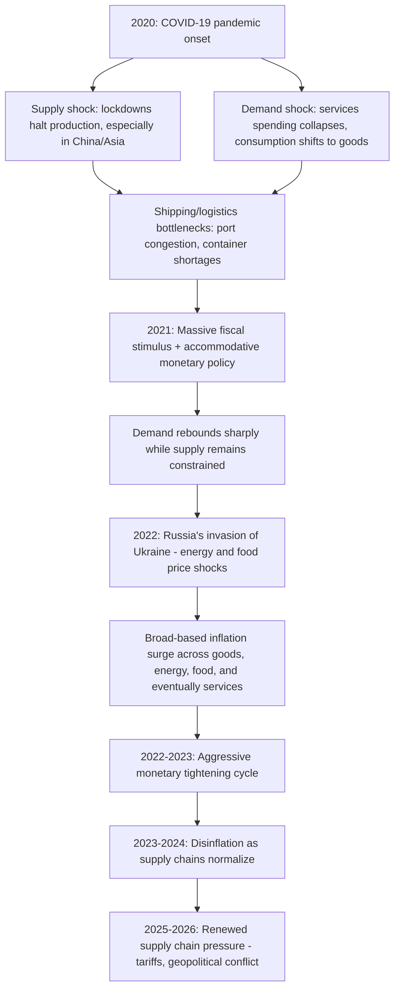

## Post-Pandemic Inflation Dynamics and Supply Chain Shocks

### Overview

The 2021–2023 global inflation surge — the sharpest sustained rise in consumer prices across advanced economies in roughly four decades — presented a rich natural experiment for macroeconomic theory, combining an unprecedented combination of demand-side stimulus, supply-side disruption, and labor market dislocation. This topic covers the analytical frameworks used to decompose supply versus demand contributions to the surge, the mechanics of supply chain disruption and its measurement, the role of fiscal and monetary policy responses, the subsequent disinflation, and the renewed supply chain pressures that have emerged since 2025. Because this remains an actively evolving research area with frequently updated data, several points below are flagged for direct verification against current sources.

---

### Anatomy of the Shock: A Uniquely Layered Disruption

**Sequence of Overlapping Shocks**

**Distinctive Features Relative to Historical Inflation Episodes**

Unlike the 1970s oil-shock-driven inflation (a largely single-channel energy shock) or standard demand-pull cyclical inflation, the pandemic episode combined: a synchronized global supply disruption, an unprecedented sectoral demand shift (from services to durable goods) rather than a uniform demand increase, historically large fiscal transfers directly to households, and a subsequent geopolitical energy/food shock (Russia's invasion of Ukraine, February 2022) layered on top of an already-strained system — a combination without close precedent in the post-WWII data available to most estimated macro models, which is part of why initial forecasts (including from many central banks) substantially underestimated the persistence and magnitude of the resulting inflation.

---

### Supply-Side Mechanics: How Supply Chains Transmitted to Prices

**The Goods-Services Demand Shift**

Pandemic-era lockdowns and health precautions suppressed spending on in-person services (restaurants, travel, entertainment) while household spending shifted toward durable and non-durable goods (home office equipment, appliances, vehicles) — precisely the sectors most exposed to global manufacturing and shipping supply chains, creating a demand surge concentrated exactly where supply capacity was most constrained.

**Global Value Chain Bottlenecks**

Modern manufacturing (especially electronics, automobiles, and appliances) relies on globally fragmented, just-in-time supply chains with limited buffer inventory by design. Pandemic-related factory closures (particularly recurring closures under China's zero-COVID policy through 2022), labor shortages, and shipping disruptions created cascading bottlenecks:

- **Semiconductor shortages** — concentrated production in a small number of East Asian foundries, combined with a demand surge for electronics and reduced automotive semiconductor orders early in the pandemic (later reversed as auto demand rebounded), created a persistent chip shortage that constrained automobile and electronics production well into 2022
- **Container shipping congestion** — port congestion (notably at Los Angeles/Long Beach and various Chinese ports), container imbalances, and vessel scheduling disruptions drove ocean freight rates to multiples of pre-pandemic levels

**Measuring Supply Chain Pressure: The GSCPI**

The **Global Supply Chain Pressure Index (GSCPI)**, developed by the Federal Reserve Bank of New York, integrates 27 variables spanning transportation costs (Baltic Dry Index, Harpex index, airfreight costs) and manufacturing PMI sub-components (delivery times, backlogs, purchased-stock levels) across seven major economies into a single normalized measure, expressed in standard-deviation units from its historical average. The index documents disruptions to supply chains since 1997 and had historically moved around its average before the pandemic. The GSCPI peaked at 4.31 standard deviations above its historical mean in December 2021 — described by Fed researchers as a four-sigma, roughly once-in-a-century event — before falling sharply through 2022 and into 2023, reaching a record low of -1.59 points in May of 2023, consistent with a period of significant supply chain over-correction/slack following the initial disruption. [supply chain pressures driving inflation may have peaked ny fed index suggests +2](https://www.cnbc.com/2022/01/04/supply-chain-pressures-driving-inflation-may-have-peaked-ny-fed-index-suggests.html)

**Fed Research Linking GSCPI to Inflation**

New York Fed economists found that the supply chain pressures captured by the GSCPI were strongly associated with inflationary developments as measured by both the producer price index and consumer price index, providing empirical grounding for supply-chain-based explanations of the inflation surge and its subsequent moderation. [hellenicshippingnews](https://www.hellenicshippingnews.com/?p=973440)

---

### Decomposing Supply vs. Demand Contributions: The Empirical Debate

**Why This Decomposition Matters for Policy**

Distinguishing supply-driven from demand-driven inflation carries direct monetary policy implications: demand-driven inflation is generally the type conventional monetary tightening (raising interest rates to cool aggregate demand) can address relatively directly, whereas purely supply-driven inflation (e.g., from an external shock to production capacity) may not respond as directly to rate increases and could, in a poorly-calibrated response, unnecessarily depress output without proportionately easing the underlying constraint — a version of the classic supply-shock monetary policy dilemma.

**Evolving Consensus: A Shifting Balance Over Time**

The empirical literature has evolved toward a **time-varying decomposition** rather than a single "supply vs. demand" verdict for the entire episode. Di Giovanni, Kalemli-Özcan, Silva, and Yildirim find that while supply shocks were important in 2020, demand factors became more relevant in 2021 and 2022. Separately, New York Fed research using a VAR estimated over the 1997–2024 period finds that global supply shocks accounted for the bulk of the variation in the global inflation trend through the beginning of 2023, while depressed global demand pushed inflation down in 2020 but was a relatively minor contributor from 2021 to 2023. The same research finds that since 2023, strong global demand has been able to fully account for the sideways movements in inflation, implying that the stall in inflation deceleration since mid-2023 reflects demand forces that monetary policy can potentially fully offset — a finding with a direct, favorable implication for the efficacy of the subsequent monetary tightening cycle. [Inflation since the Pandemic: Lessons and Challenges +2](https://www.federalreserve.gov/econres/feds/files/2025070pap.pdf)

**Persistent Disagreement in the Literature**

[Inference] Despite convergence on the general "supply-then-demand" sequencing pattern, the literature has not reached full consensus on relative magnitudes, and some prominent studies diverge more sharply: Giannone and Primiceri find that high inflation in both the U.S. and euro area was driven largely by demand forces, while other contemporaneous work emphasizes a larger supply-side role — Dupor and Hogan find that demand conditions began rebounding in 2021 before supply factors began having stronger inflationary effects. This divergence partly reflects differing identification strategies (structural VAR sign restrictions, price-quantity co-movement decompositions, DSGE-based estimation) applied to overlapping but not identical datasets and sample periods, illustrating the broader methodological point (see the ARIMA/VAR topic) that structural shock identification is inherently sensitive to modeling choices. [Federal Reserve](https://www.federalreserve.gov/econres/feds/files/2025070pap.pdf)[Federal Reserve](https://www.federalreserve.gov/econres/feds/files/2025070pap.pdf)

**International Trade Channel Estimates**

A 2024 report found that international factors — including supply chain bottlenecks and foreign demand — accounted for roughly 2 percentage points of U.S. inflation observed in 2021 and 2022, providing one specific quantitative anchor for the internationally-transmitted component of the surge, alongside the larger domestic demand and energy/food price channels. [Federal Reserve Bank of Richmond](https://www.richmondfed.org/publications/research/economic_brief/2025/eb_25-02)

---

### The Role of Fiscal and Monetary Policy

**Fiscal Stimulus as a Demand-Side Contributor**

[Inference] A substantial strand of the literature attributes meaningful inflationary contribution to the scale of pandemic-era fiscal transfers (in the U.S., cumulative rounds of stimulus payments, expanded unemployment insurance, and other relief measures across 2020–2021), on the reasoning that household balance sheets and disposable income were bolstered well beyond the income losses directly caused by the pandemic, fueling the goods-demand surge described above at a scale that outpaced available supply capacity — though, consistent with the broader decomposition debate above, the precise quantitative contribution of fiscal stimulus specifically (as opposed to monetary accommodation, pent-up savings, or supply constraints) remains contested across studies using different methodologies.

**Monetary Policy Response and the "Transitory" Debate**

Major central banks (the Federal Reserve, ECB, Bank of England, and others) initially characterized the 2021 inflation pickup as "transitory," expecting supply chain normalization to resolve price pressures without requiring aggressive tightening — a characterization subsequently revised as inflation proved more persistent and broad-based than initially projected, leading to a rapid and historically aggressive tightening cycle beginning in 2022 (the Federal Reserve's fastest pace of rate increases since the early 1980s). [Inference] This episode has generated substantial subsequent methodological reflection within central banks and academic macroeconomics regarding real-time inflation forecasting under conditions of unprecedented supply-side disruption, though drawing precise, settled lessons from this specific episode for future forecasting practice remains an active and evolving area of central bank research self-assessment.

**Price-Setting Behavior and Inflation Persistence**

Recent research documents broad-based increases in the frequency of price changes across the U.S. CPI during this episode, consistent with **state-dependent pricing models** (in which firms face costs of adjusting prices — "menu costs" — and thus adjust more frequently when facing larger cost or general price-level shocks). Such state-dependent models imply that the pass-through of cost shocks to inflation is larger and more rapid for large shocks, providing a micro-founded mechanism for why an unusually large supply/demand imbalance could generate disproportionately rapid and persistent inflation relative to smaller, more routine shocks — a nonlinearity not well captured by standard linear Phillips curve specifications calibrated on more moderate historical inflation episodes. [Federal Reserve](https://www.federalreserve.gov/econres/feds/files/2025070pap.pdf)[Federal Reserve](https://www.federalreserve.gov/econres/feds/files/2025070pap.pdf)

**Inflation Expectations and Anchoring**

Short-term inflation expectations, especially among households and firms, increased alongside realized inflation during the surge, which may have contributed to inflation's persistence through price- and wage-setting behavior. Critically, however, longer-term inflation expectations remained generally well anchored, which likely prevented a larger or more lasting increase in inflation — a finding widely interpreted as evidence that central bank credibility, built up over the preceding several decades of low and stable inflation, played a meaningful stabilizing role even during an episode of significant near-term price pressure, consistent with the theoretical importance placed on expectations anchoring in modern New Keynesian Phillips curve frameworks. [federalreserve](https://www.federalreserve.gov/econres/feds/inflation-since-the-pandemic-lessons-and-challenges.htm)[federalreserve](https://www.federalreserve.gov/econres/feds/inflation-since-the-pandemic-lessons-and-challenges.htm)

---

### Energy and Food Price Shocks: The Ukraine War Channel

Russia's February 2022 invasion of Ukraine added a distinct and severe energy and food commodity price shock layered on top of the already-elevated supply-chain-driven inflation: Russia and Ukraine are major global exporters of natural gas, oil, wheat, and fertilizer inputs, and the resulting disruption (combined with sanctions and Europe's subsequent effort to reduce dependence on Russian energy) drove European natural gas and broader global energy prices sharply higher through 2022, with associated food price effects operating through both direct grain export disruption and higher fertilizer/input costs for agricultural production globally. [Inference] This shock is generally treated in the literature as analytically distinct from the pandemic-era manufacturing/shipping supply chain disruption, though both are classified under the broader "supply shock" category in decomposition exercises like those referenced above, and several cited studies (Baumeister 2023; Bernanke and Blanchard 2024, 2025) specifically isolate energy market shocks as a separate contributing channel.

---

### The 2023–2024 Disinflation

As pandemic-era bottlenecks resolved (chip production capacity expanded, shipping congestion cleared, and the extraordinary goods-demand surge normalized as services spending recovered), the GSCPI's sharp decline (from its late-2021 peak to negative territory by mid-2023) coincided with a substantial deceleration in measured inflation across most advanced economies through 2023 and into 2024, consistent with the supply-side normalization channel emphasized in the Fed research cited above. This period is frequently cited in the "soft landing" policy discussion — the question of whether central banks could bring inflation back to target without triggering a recession, given that a meaningful portion of the disinflation appeared to reflect supply-side healing (which does not require demand destruction) rather than solely the effects of restrictive monetary policy.

---

### Renewed Supply Chain Pressure: 2025–2026 Developments

[Unverified] The following reflects the most recent available data and should be verified against current New York Fed GSCPI releases and contemporaneous reporting, given how quickly conditions in this area have continued to shift. The Global Supply Chain Pressure Index has remained elevated through 2026, reflecting ongoing global disruptions, with geopolitical conflicts — particularly the Iran war and disruption around the Strait of Hormuz — severely affecting oil and goods flows, alongside tariff-related concerns and rising input costs prompting companies to increase stockpiling of raw materials and finished goods in anticipation of further price pressures and shortages. This has produced longer lead times, higher logistics costs, and increased demand for warehouse space, with global trade routes becoming more unstable due to regional conflicts, trade tensions, and political instability. [supplychainconnect](https://www.supplychainconnect.com/supply-chain-technology/article/55383971/supply-chains-under-pressure)[supplychainconnect](https://www.supplychainconnect.com/supply-chain-technology/article/55383971/supply-chains-under-pressure)

The GSCPI rose to 0.49 in February 2026, up from a revised 0.42 the previous month, with the index averaging 0.00 historically since 1997 and having reached a record low of -1.59 in May 2023. This represents a meaningfully elevated reading relative to the 2023 trough, though still well below the extreme 2021 pandemic peak, indicating a **distinct, renewed source of supply chain pressure** — driven substantially by tariff policy and geopolitical/energy-route disruption rather than a recurrence of pandemic-specific manufacturing shutdowns — that has emerged as a live macroeconomic concern into 2026. [Inference] Given the active and rapidly-evolving nature of both the tariff policy landscape and Middle East geopolitical conditions feeding into this renewed pressure, readers should consult current GSCPI releases and news coverage directly for the latest assessment rather than treating this description as a stable, final characterization. [tradingeconomics](https://tradingeconomics.com/world/supply-chain-pressure-index)

---

### Comparison: Pandemic-Era vs. 2025–2026 Supply Chain Pressure

| Dimension | 2021–2022 Pandemic Episode | 2025–2026 Episode |
| --- | --- | --- |
| Primary driver | COVID-19 lockdowns, factory closures, shipping congestion | Tariff policy, geopolitical conflict (Iran/Strait of Hormuz), trade route instability |
| Peak GSCPI magnitude | ~4.3 standard deviations (extreme, historically unprecedented) | Materially elevated but well below pandemic peak, per available readings |
| Demand-side context | Historically large fiscal stimulus, sharp goods-demand surge | Less characterized by simultaneous extraordinary fiscal stimulus |
| Firm response | Reactive scrambling amid unprecedented, poorly-anticipated disruption | More proactive stockpiling and inventory build given accumulated experience |
| Geographic concentration | China-centric (zero-COVID policy, initial outbreak) | More geographically diffuse (Middle East energy routes, broad tariff exposure) |

---

### Practical Illustrative Framework: Supply Shock Pass-Through

A simplified New Keynesian Phillips curve augmented with a supply-chain-pressure term illustrates the mechanics discussed above:

$$\pi_t = \beta E_t[\pi_{t+1}] + \kappa \tilde{y}_t + \gamma \cdot GSCPI_t + \varepsilon_t$$

where $\gamma > 0$ captures the direct pass-through of supply chain pressure into current inflation, operating alongside the standard output-gap and expected-inflation terms. Under this stylized specification, the extreme 2021 GSCPI reading (over 4 standard deviations above average) would mechanically imply substantial direct inflationary pressure through the $\gamma \cdot GSCPI_t$ term, independent of the output gap term $\tilde{y}_t$ capturing conventional demand-side pressure — providing a simple illustration of how supply-chain-augmented Phillips curve specifications (an active area of applied central bank modeling since 2021) formally incorporate the supply-side channel discussed throughout this topic. [Inference] This is a simplified illustrative specification for conceptual purposes; actual empirically-estimated supply-chain-augmented Phillips curves used in central bank and academic research employ more elaborate lag structures, additional controls, and estimated (rather than assumed) coefficient values specific to each study's data and sample period.

---

**Related Topics**

- Global Supply Chain Pressure Index (GSCPI) construction methodology in depth
- State-dependent (menu cost) pricing models and inflation nonlinearity
- Inflation expectations anchoring and central bank credibility
- The "transitory inflation" forecasting debate and central bank communication lessons
- Energy price shocks and the Russia-Ukraine war's macroeconomic transmission
- Tariff policy and trade fragmentation effects on global supply chains (2025-2026)
- Structural VAR identification of supply vs. demand shocks
- Fiscal stimulus multipliers during the pandemic recovery period