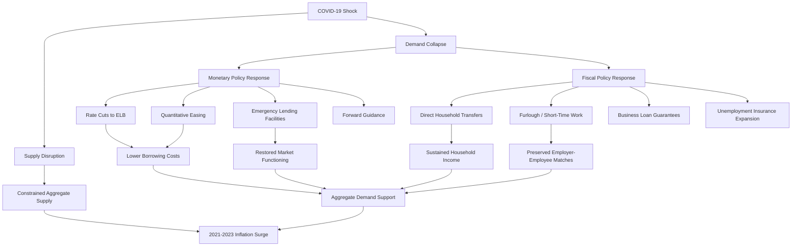

## Fiscal and Monetary Policy Responses to COVID-19

### Overview

The COVID-19 pandemic triggered the sharpest global output contraction since the Great Depression, compressed into weeks rather than years. Governments and central banks responded with fiscal and monetary interventions that were unprecedented in speed, scale, and instrument design. This topic covers the theoretical rationale, the specific policy tools deployed, their macroeconomic transmission, and the aftermath — most notably the 2021-2023 inflation surge that many attribute partly to these responses.

### The Nature of the Shock

#### Simultaneous Supply and Demand Shock

Unlike a typical demand-driven recession, COVID-19 produced a compound shock:

- **Negative supply shock**: Lockdowns, factory closures, and labor withdrawal reduced the economy's productive capacity directly. Global supply chains (semiconductors, shipping, labor-intensive manufacturing) were disrupted.
- **Negative demand shock**: Precautionary saving, income loss, and mobility restrictions reduced consumption, particularly in contact-intensive services (travel, hospitality, entertainment).
- **Financial market shock**: A liquidity crunch in March 2020 saw even safe assets like U.S. Treasuries experience unusual volatility, signaling a "dash for cash."

This dual nature complicated standard policy calculus: stimulating aggregate demand does not fix a supply-constrained economy, and can — as later observed — contribute to inflation once supply does not recover proportionally.

#### Why Standard Tools Were Insufficient

Central banks entered the crisis with policy rates already near the effective lower bound (ELB) in most advanced economies, following the 2008 Global Financial Crisis (GFC) and subsequent slow recovery. This constrained conventional interest-rate policy and pushed institutions toward unconventional tools used and refined since 2008, deployed now at far greater scale and speed.

### Monetary Policy Responses

#### Policy Rate Cuts

Central banks cut policy rates to or toward zero within weeks:

- **U.S. Federal Reserve**: Cut the federal funds rate target range from 1.50%-1.75% to 0%-0.25% in two emergency moves in March 2020.
- **Bank of England**: Cut Bank Rate from 0.75% to 0.10%.
- **European Central Bank and Bank of Japan**: Already near or below zero; relied more heavily on other tools.

#### Quantitative Easing (QE) at Scale

Large-scale asset purchases (LSAPs) expanded central bank balance sheets dramatically to suppress long-term yields and restore market functioning.

- The Fed's balance sheet grew from approximately $4.2 trillion in early 2020 to roughly $8.9 trillion by mid-2022.
- The ECB launched the **Pandemic Emergency Purchase Programme (PEPP)**, an envelope initially of €750 billion, later expanded to €1.85 trillion.
- The Bank of England restarted and expanded its Asset Purchase Facility.

**Transmission mechanism** for QE:

$$P_{bond} \uparrow \implies y_{bond} \downarrow \implies \text{portfolio rebalancing toward risk assets} \implies \text{lower borrowing costs, higher asset prices, wealth effect}$$

#### Emergency Lending Facilities

Beyond QE, central banks created targeted facilities to backstop specific market segments experiencing dysfunction:

- **Commercial Paper Funding Facility (CPFF)** and **Money Market Mutual Fund Liquidity Facility (MMLF)** (Fed): addressed short-term funding market freezes.
- **Primary and Secondary Market Corporate Credit Facilities (PMCCF/SMCCF)** (Fed): unprecedented direct purchases of corporate bonds and bond ETFs, extending central bank support into credit risk-bearing assets, a notable departure from pre-2020 practice.
- **Term Asset-Backed Securities Loan Facility (TALF)**: supported consumer and small business lending via asset-backed securities markets.
- **Paycheck Protection Program Liquidity Facility (PPPLF)**: financed banks originating small business loans under the U.S. Paycheck Protection Program.
- **Dollar swap lines**: expanded between the Fed and other major central banks (ECB, BoJ, BoE, SNB, BoC) to relieve global U.S. dollar funding shortages.

#### Forward Guidance

Central banks committed to keeping rates low "for an extended period" or until specific economic conditions (e.g., inflation sustainably at target, maximum employment achieved) were met, aiming to anchor expectations and flatten the yield curve further out.

#### Regulatory and Prudential Easing

Bank capital and liquidity buffers (built up post-GFC under Basel III) were temporarily relaxed to encourage banks to draw down buffers and continue lending rather than retrench.

### Fiscal Policy Responses

#### Direct Income Support

- **United States**: The CARES Act (March 2020, approximately $2.2 trillion) included direct stimulus checks to households, expanded and federally supplemented unemployment insurance (Federal Pandemic Unemployment Compensation), and the Paycheck Protection Program (forgivable loans to small businesses conditioned on payroll retention).
- **United Kingdom**: The Coronavirus Job Retention Scheme ("furlough scheme") paid up to 80% of furloughed employees' wages directly through employers.
- **Germany and other EU states**: Expanded existing short-time work schemes (*Kurzarbeit*), subsidizing reduced hours rather than layoffs.

**Job retention/furlough schemes vs. direct unemployment benefits** represent two different policy philosophies:

| Approach | Mechanism | Labor Market Effect |
| --- | --- | --- |
| Furlough/short-time work | Subsidizes existing employer-employee match | Preserves job matches; faster rehiring post-crisis |
| Unemployment insurance expansion | Pays individuals after job separation | More flexible but risks match destruction and rehiring frictions |

#### Business Support

- Loan guarantee programs (e.g., UK's Bounce Back Loans, various EU state-guaranteed credit lines) shifted default risk from lenders to governments to keep credit flowing to otherwise-viable firms facing temporary liquidity shortfalls.
- Tax deferrals and moratoria on debt/rent obligations provided liquidity relief without requiring new borrowing.

#### Scale of Fiscal Response

Total discretionary fiscal support (spending plus revenue measures, excluding liquidity support like loan guarantees) is estimated by the IMF to have reached roughly 10-16% of GDP in major advanced economies during 2020-2021, with the U.S. among the largest at over 25% of GDP when including multiple rounds of legislation (CARES Act, December 2020 relief, and the American Rescue Plan of March 2021).

#### Automatic Stabilizers vs. Discretionary Action

Standard automatic stabilizers (progressive taxation, existing unemployment insurance) operated as usual, but their scale was judged insufficient for a shock of this magnitude, necessitating extraordinary discretionary legislation — a departure from the more restrained discretionary response seen in some countries after 2008.

### Coordination and Interaction Between Fiscal and Monetary Policy

#### Fiscal Dominance and Deficit Monetization Concerns

Massive fiscal deficits were financed by government bond issuance that occurred alongside, though not directly as, central bank asset purchases. While central banks purchased sovereign debt in secondary markets (not directly from treasuries, preserving formal central bank independence), the scale of QE effectively absorbed a large share of new issuance, keeping sovereign borrowing costs low despite historic deficit levels.

[Inference] Whether this constituted de facto fiscal dominance — where monetary policy is subordinated to financing government deficits rather than independently targeting price stability — remains debated among economists, and views differ by country and by the persistence of the arrangement after the acute crisis phase passed.

#### The "Helicopter Money" Debate

Direct stimulus checks funded by deficit spending, occurring simultaneously with large-scale central bank asset purchases, led some commentators to describe the combined effect as resembling "helicopter money" (direct, unsterilized transfers to households financed by money creation), even though the formal mechanisms (bond issuance and separate central bank purchases) differed from a pure helicopter drop.

### Diagrammatic Summary of Transmission Channels

### The Withdrawal Phase and Inflationary Aftermath

#### Timing Mismatch

[Inference] A widely discussed critique, articulated prominently by economists such as Lawrence Summers in early 2021, is that the scale of U.S. fiscal stimulus (particularly the American Rescue Plan) relative to the pandemic-era output gap risked overheating demand. This remains a subject of active debate regarding the relative contribution of fiscal stimulus versus supply-chain disruptions and energy price shocks to the subsequent inflation.

#### Monetary Tightening Cycle

Beginning in 2022, major central banks reversed course sharply:

- The Fed raised the federal funds rate from near zero to a peak range of 5.25%-5.50% between March 2022 and July 2023, one of the fastest tightening cycles in its history.
- Quantitative tightening (QT) — allowing balance sheets to shrink via non-reinvestment of maturing securities — began alongside rate hikes.
- The ECB and Bank of England followed with their own hiking cycles, though timing and magnitude differed based on domestic inflation dynamics and energy price exposure (particularly acute in Europe following the 2022 energy crisis).

#### Debt Sustainability Concerns

Public debt-to-GDP ratios rose sharply across advanced economies (the U.S. federal debt held by the public rose from about 79% of GDP in 2019 to over 100% by 2021). This renewed academic and policy debate around the $r - g$ differential (interest rate minus growth rate) as a determinant of debt sustainability, since a persistently negative differential — as observed for much of the 2010s and into the pandemic — allows debt ratios to stabilize or decline even with primary deficits, whereas the higher-rate environment following 2022 tightened this constraint.

### Cross-Country Comparison

| Country/Region | Key Monetary Tool | Key Fiscal Tool | Approx. Discretionary Fiscal Support (% GDP, 2020-21) |
| --- | --- | --- | --- |
| United States | Fed funds rate to 0-0.25%, QE, corporate credit facilities | Direct checks, expanded UI, PPP | ~25%+ (cumulative) |
| United Kingdom | Bank Rate to 0.10%, expanded APF | Furlough scheme, loan guarantees | ~16% |
| Eurozone | Deposit rate unchanged (already negative), PEPP | Kurzarbeit-style schemes (national level) | ~11% |
| Japan | Yield curve control maintained, expanded asset purchases | Cash transfers, employment adjustment subsidies | ~16% |

[Unverified] Precise percentages vary by source and methodology (IMF Fiscal Monitor vs. national accounts vs. OECD estimates); figures above are indicative orders of magnitude rather than precise reconciled statistics.

### Key Points

- The pandemic combined a negative supply shock and a negative demand shock, complicating the choice and calibration of stabilization tools.
- Monetary responses reused the post-2008 unconventional toolkit (rate cuts to the ELB, QE, forward guidance) but added novel elements, notably direct central bank purchases of corporate credit instruments.
- Fiscal responses emphasized direct income replacement (checks, furlough schemes) at a scale far exceeding prior recessions, reaching double-digit percentages of GDP in most advanced economies.
- The near-simultaneous deployment of large deficit-financed fiscal transfers and large-scale central bank asset purchases raised debates about fiscal dominance and helicopter-money-like effects, though formal independence and separate mechanisms were maintained.
- The withdrawal phase (2022-2023) required historically rapid monetary tightening, which interacted with elevated public debt loads to renew focus on debt sustainability metrics such as the $r-g$ differential.

### Example: Simple IS-LM/AD-AS Interpretation

A stylized way to represent the initial shock and stimulus response:

$$Y = C(Y-T) + I(r) + G + NX$$

The pandemic reduced $C$ (precautionary saving, restricted spending opportunities) and $I$ (uncertainty-driven investment freeze) while simultaneously constraining potential output $Y^*$ (supply shock). Fiscal policy raised $G$ and effectively lowered $T$ (net of transfers), while monetary policy lowered $r$ to support $I$ and interest-sensitive consumption. Because $Y^*$ fell alongside the demand-supportive push, the aggregate demand curve's rightward shift, once supply began normalizing more slowly than demand, is one contributing explanation offered for the subsequent inflationary episode, alongside supply-side factors like shipping bottlenecks and energy prices.

### Related Topics

- Modern Monetary Theory (MMT) and its relevance to pandemic-era financing debates
- The 2021-2023 global inflation surge: demand-pull vs. cost-push decomposition
- Quantitative tightening (QT) mechanics and balance sheet normalization
- Sovereign debt sustainability analysis and the $r - g$ framework
- Comparative labor market recovery: job retention schemes vs. UI-based systems
- Central bank independence and fiscal dominance theory
- Effective lower bound (ELB) constraints and unconventional monetary policy toolkits
- Global dollar funding markets and central bank swap line networks