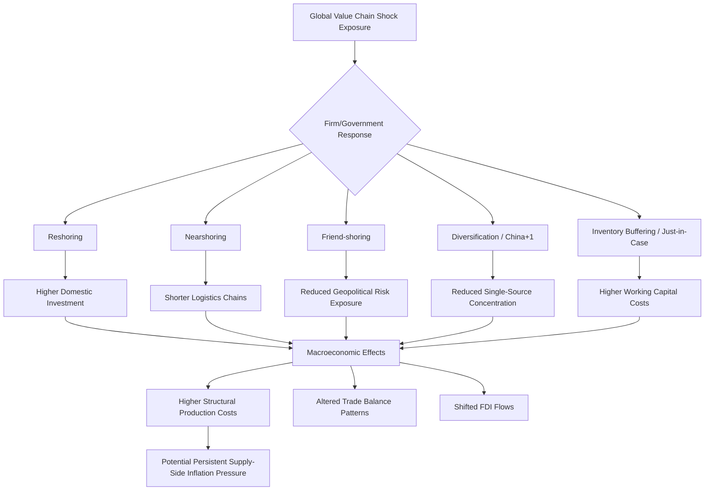

## Deglobalization and Supply Chain Reconfiguration

### Overview

Deglobalization refers to a slowdown, stagnation, or partial reversal in the growth of cross-border trade, capital flows, and production integration relative to global GDP — a pattern that stands in contrast to the rapid globalization that characterized the decades from roughly 1990 to the 2008 Global Financial Crisis. Supply chain reconfiguration refers to the specific corporate and policy responses that redirect, shorten, or diversify production networks. These trends have accelerated due to a series of shocks (the 2008 GFC, U.S.-China trade tensions from 2018, COVID-19, and the 2022 Russian invasion of Ukraine) and are now central to contemporary macroeconomic analysis.

### Historical Context: Peak Globalization to Slowbalization

#### The Hyperglobalization Era (~1990-2008)

Global trade-to-GDP ratios rose sharply following trade liberalization (WTO formation in 1995, China's WTO accession in 2001), falling transportation costs, the rise of just-in-time (JIT) manufacturing, and the fragmentation of production into global value chains (GVCs).

#### Slowbalization (2008-2018)

Global trade-to-GDP growth flattened after the GFC. [Inference] Explanations offered in the literature include the maturation of GVC fragmentation (most easy gains from offshoring had already been captured), rising protectionism, and China's shift toward domestic consumption-led growth, though the relative weight of each factor is debated among trade economists.

#### Active Reconfiguration (2018-present)

A distinct phase marked by deliberate policy-driven and firm-driven restructuring:

- **2018-2019**: U.S.-China tariff escalation ("trade war") under Section 301 and Section 232 actions.
- **2020**: COVID-19 exposed acute vulnerabilities in concentrated supply chains (e.g., personal protective equipment, semiconductors, active pharmaceutical ingredients).
- **2021-2022**: Global shipping congestion, container shortages, and semiconductor shortages disrupted production across the automotive and electronics sectors.
- **2022**: Russia's invasion of Ukraine disrupted energy, grain, and fertilizer markets, and accelerated a security-driven reassessment of trade dependencies, particularly in Europe.

### Key Conceptual Frameworks

#### Reshoring, Nearshoring, and Friend-shoring

| Term | Definition | Primary Driver |
| --- | --- | --- |
| Reshoring | Returning production to the home country | Cost changes, automation, resilience |
| Nearshoring | Relocating production to geographically closer countries | Logistics cost/time reduction, resilience |
| Friend-shoring | Relocating production to politically aligned countries | Geopolitical risk mitigation |
| Diversification | Spreading suppliers across multiple countries rather than concentrating in one | Resilience without full relocation |

[Inference] The relative prevalence of each strategy varies significantly by industry; semiconductors and critical minerals show stronger friend-shoring and reshoring dynamics (often policy-induced), while many labor-intensive manufacturing sectors have shown more diversification (e.g., "China+1" strategies favoring Vietnam, India, or Mexico) than full reshoring, given persistent cost differentials.

#### Resilience vs. Efficiency Trade-off

Global value chains built primarily for cost-minimization under JIT principles proved vulnerable to shocks. The reconfiguration debate is often framed as a trade-off:

$$\text{Total Cost} = \text{Production Cost} + \text{Risk-Adjusted Disruption Cost}$$

Firms and policymakers increasingly incorporate the second term explicitly, favoring redundancy (multiple suppliers, buffer inventories — sometimes termed "just-in-case" rather than "just-in-time") even at higher steady-state cost.

#### Economic Security and Strategic Autonomy

Governments increasingly treat certain supply chains (semiconductors, critical minerals, pharmaceuticals, energy) as matters of national security rather than pure economic efficiency, leading to industrial policy interventions that would have been less common in the pre-2018 policy consensus.

### Policy Instruments Driving Reconfiguration

#### Industrial Subsidies and Domestic Production Incentives

- **U.S. CHIPS and Science Act (2022)**: Approximately $52 billion in subsidies and tax credits for domestic semiconductor manufacturing and research.
- **U.S. Inflation Reduction Act (2022)**: Contains local-content requirements for clean energy tax credits, incentivizing North American battery and EV supply chains.
- **EU Chips Act**: Aims to double the EU's share of global semiconductor production capacity by 2030.

#### Trade Restrictions and Export Controls

- Export controls on advanced semiconductor technology (e.g., U.S. restrictions on advanced chips and chipmaking equipment to China, tightened progressively from October 2022) represent a shift from tariff-based trade policy toward technology-access restrictions justified on national security grounds.
- Critical mineral export restrictions (e.g., China's controls on gallium, germanium, and rare earth elements) illustrate reciprocal use of supply chain leverage.

#### Tariffs

Tariff levels between major economies rose substantially from 2018 levels and, [Unverified] as of the available data, remain elevated relative to the pre-2018 baseline, with the specific rate structure subject to frequent revision depending on the political administration in office — a detail readers should verify against current sources given the volatility of this policy area.

### Macroeconomic Transmission Channels

#### Inflation and Price Level Effects

Reduced reliance on the lowest-cost global supplier raises average production costs, functioning similarly to a persistent negative supply shock on the aggregate supply curve. [Inference] Some economists argue this contributes to a structurally higher steady-state inflation rate or altered Phillips curve dynamics relative to the hyperglobalization era, though the magnitude remains contested and difficult to isolate from other post-pandemic inflation drivers.

#### Productivity and Growth Effects

Global value chain fragmentation historically allowed countries to specialize according to comparative advantage at a finer level (specific production stages rather than entire industries), raising aggregate productivity. Reconfiguration that reduces this fine-grained specialization implies a potential productivity cost:

$$\Delta \text{TFP} = f(\text{specialization loss}, \text{resilience gain}, \text{automation offset})$$

[Speculation] Whether automation and reshoring-linked capital investment can offset the specialization loss is an open empirical question, with estimates varying widely across studies and time horizons.

#### Current Account and Capital Flow Implications

Reconfiguration alters bilateral trade balances (e.g., a declining U.S. trade deficit with China alongside a rising deficit with Vietnam and Mexico, reflecting supply chain rerouting rather than net demand changes) and can affect capital flow patterns as foreign direct investment shifts toward "friend-shored" or nearshored locations.

#### Exchange Rate and External Balance Considerations

Structural shifts in trade patterns can alter a country's real effective exchange rate equilibrium over time, as goods trade balances rebalance across different trading partner baskets.

### Diagram: Reconfiguration Decision Framework

### Sectoral Case Studies

#### Semiconductors

The semiconductor supply chain is highly concentrated geographically: advanced logic chip fabrication is dominated by Taiwan (notably TSMC), creating a widely discussed strategic vulnerability given geopolitical tensions across the Taiwan Strait. This concentration has driven the most aggressive reshoring/friend-shoring policy response of any sector (CHIPS Act, EU Chips Act, Japan's subsidies to domestic and allied fabs).

#### Automotive and Electric Vehicle Battery Supply Chains

Battery supply chains are heavily dependent on critical mineral processing concentrated in China (particularly lithium, cobalt, and graphite processing capacity, as distinct from raw extraction, which is more geographically dispersed). Policy responses (e.g., IRA local-content rules) aim to build alternative processing capacity in North America and allied countries, though [Inference] the timeline for meaningfully reducing processing concentration is generally viewed as a multi-year to multi-decade undertaking given the capital intensity and technical complexity of refining infrastructure.

#### Pharmaceuticals and Active Pharmaceutical Ingredients (APIs)

COVID-19 exposed concentration of API production in China and India for many essential medicines, prompting several countries to explore domestic production incentives, though cost differentials have limited the pace of actual reshoring in this sector.

### Key Points

- Deglobalization is better characterized as "slowbalization" and selective reconfiguration rather than a uniform retreat from international trade; global trade volumes have not collapsed, but growth has decelerated and patterns have shifted.
- Reshoring, nearshoring, friend-shoring, and diversification represent distinct strategic responses with different cost, speed, and resilience profiles.
- Policy tools (subsidies, export controls, tariffs) increasingly frame supply chains through an economic security lens rather than pure comparative-advantage efficiency.
- The macroeconomic consequence most emphasized in current literature is a potential structural upward pressure on production costs and inflation, alongside possible productivity losses from reduced fine-grained specialization.
- Semiconductor and critical mineral supply chains represent the most policy-intensive reconfiguration efforts due to their classification as strategically critical inputs.

### Example: Cost Decomposition for a Reshoring Decision

Consider a firm evaluating whether to reshore a component currently produced offshore at unit cost $C_{offshore}$, versus domestic production at $C_{domestic}$, where $C_{domestic} > C_{offshore}$ under normal conditions. The firm's decision incorporates the probability $p$ of a disruption event and the associated cost $D$ of that disruption (lost sales, contractual penalties, reputational damage):

$$E[\text{Total Cost}]_{offshore} = C_{offshore} + p \cdot D$$

$$E[\text{Total Cost}]_{domestic} = C_{domestic}$$

Reshoring becomes economically rational when:

$$C_{domestic} < C_{offshore} + p \cdot D$$

Post-2020 reassessments of $p$ (perceived disruption probability) rose substantially across many industries, shifting this calculus toward reshoring/diversification even without a change in underlying cost structures $C_{domestic}$ or $C_{offshore}$.

### Related Topics

- Global value chains (GVCs) and the economics of production fragmentation
- Industrial policy and the return of state intervention in trade (CHIPS Act, IRA, EU Chips Act)
- Critical minerals geopolitics and processing capacity concentration
- Trade wars and tariff economics: welfare effects and terms-of-trade analysis
- The relationship between deglobalization and structural inflation (supply-side Phillips curve shifts)
- Foreign direct investment (FDI) screening regimes and national security reviews (e.g., CFIUS)
- Regional trade agreement proliferation as a hedge against multilateral trade system fragmentation
- The "China+1" strategy and Southeast Asian manufacturing growth (Vietnam, India)