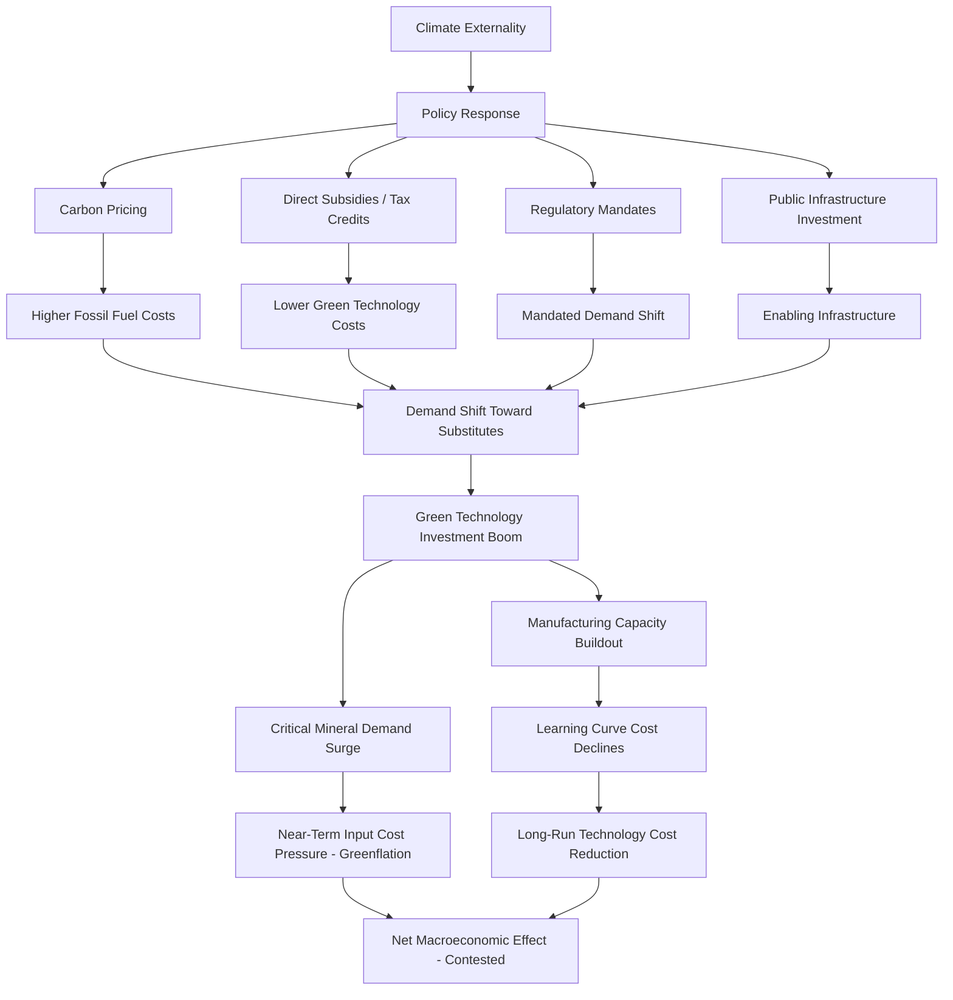

## Green Transition and Industrial Policy

### Overview

The green transition refers to the structural shift of an economy away from fossil-fuel-intensive production and consumption toward low-carbon technologies and processes. Industrial policy, in this context, refers to deliberate government intervention — subsidies, mandates, public investment, trade measures — aimed at accelerating this shift and building domestic capacity in green technologies. The two have become tightly linked in contemporary macroeconomic policy, marking a broader revival of industrial policy after several decades in which it was viewed with skepticism by mainstream policy consensus.

### Rationale for Industrial Policy in the Green Transition

#### Market Failures Justifying Intervention

Standard economic theory identifies several market failures that justify government action beyond a pure carbon price:

- **Negative externality (the core failure)**: Greenhouse gas emissions impose costs on third parties not reflected in market prices, the textbook rationale for Pigouvian carbon pricing.
- **Learning-by-doing and dynamic increasing returns**: Costs of green technologies (solar panels, batteries, electrolyzers) fall with cumulative production experience, not just time — a phenomenon captured empirically by experience curves. Early-stage support can accelerate movement down the cost curve.

$$C(Q) = C_0 \cdot Q^{-b}$$

where $C(Q)$ is unit cost at cumulative production $Q$, $C_0$ is the initial cost, and $b$ is the learning elasticity. Solar photovoltaic costs, for example, have historically exhibited a learning rate implying substantial cost reduction with each doubling of cumulative installed capacity, though the precise learning rate estimate varies across studies and time periods. [Unverified] Readers should consult current empirical literature for the latest learning-rate estimates given ongoing technology change.

- **Coordination failures**: Complementary infrastructure (charging networks, hydrogen pipelines, grid capacity) requires simultaneous investment by multiple actors; no single firm captures enough of the return to invest unilaterally.
- **Capital market imperfections**: Long-payback, capital-intensive green infrastructure projects may be underfunded by private capital markets, particularly under uncertainty about future carbon policy.
- **Strategic/security rationale**: Governments increasingly treat clean energy supply chains (batteries, critical minerals, solar manufacturing) as matters of economic security, paralleling the semiconductor policy logic discussed under deglobalization.

#### The "New Industrial Policy" Debate

[Inference] There is active debate among economists about whether the recent wave of green industrial policy represents sound correction of the market failures above, or risks the classic industrial policy pitfalls (rent-seeking, picking losers, trade retaliation, and fiscal cost) documented in earlier waves of import-substitution and national-champion policies. Both perspectives appear in contemporary academic and policy literature, and the empirical verdict on recent programs (many enacted post-2020) will only become clear over a multi-year horizon.

### Carbon Pricing Mechanisms

#### Carbon Taxes

A direct price per ton of $CO_2$-equivalent emissions, applied at a point in the value chain (extraction, import, or combustion).

$$\text{Tax Revenue} = \tau \cdot E$$

where $\tau$ is the tax rate per ton and $E$ is total taxable emissions. Advantages include price certainty and administrative simplicity; the main drawback is emissions-quantity uncertainty (the tax rate must be estimated/adjusted to hit a given abatement target).

#### Cap-and-Trade (Emissions Trading Systems)

Sets a quantity limit (cap) on total emissions and allows firms to trade allowances, letting the market determine price.

- **EU Emissions Trading System (EU ETS)**: The largest and longest-running cap-and-trade system, covering power generation, industry, and (progressively) aviation and maritime transport.
- **California Cap-and-Trade Program** and other regional/national systems operate on similar principles with varying coverage and stringency.

| Feature | Carbon Tax | Cap-and-Trade |
| --- | --- | --- |
| Price certainty | High | Low (market-determined) |
| Quantity certainty | Low | High (capped by design) |
| Administrative complexity | Lower | Higher (allowance allocation, monitoring, trading infrastructure) |
| Revenue use flexibility | High | High (auction revenue) |

#### Carbon Border Adjustment Mechanisms (CBAM)

The EU's CBAM (phasing in fully from 2026) imposes a carbon price on imports of specific carbon-intensive goods (steel, cement, aluminum, fertilizers, electricity, hydrogen) equivalent to what domestic producers pay under the EU ETS. This addresses **carbon leakage** — the risk that domestic carbon pricing simply shifts production (and emissions) to jurisdictions without comparable pricing, rather than reducing global emissions.

### Direct Industrial Policy Instruments

#### Subsidies and Tax Credits

- **U.S. Inflation Reduction Act (IRA, 2022)**: Uses primarily tax credits (e.g., production tax credits for clean electricity, investment tax credits, the Section 45X advanced manufacturing credit, and consumer EV credits with domestic content and sourcing requirements) rather than direct grants, channeling support through the tax code.
- **EU Green Deal Industrial Plan and Net-Zero Industry Act**: Aim to streamline permitting and set benchmark domestic manufacturing capacity targets for strategic net-zero technologies.
- **China's industrial policy for solar, batteries, and EVs**: Sustained state support since the mid-2000s is widely credited with China's dominant global manufacturing share in these sectors, illustrating both the potential effectiveness and the trade-friction consequences of large-scale, long-horizon industrial policy.

#### Public Investment

Direct government investment or co-investment in infrastructure with public-good characteristics: transmission grids, charging networks, hydrogen infrastructure, and public research funding for early-stage technology (e.g., government-funded R&D for next-generation battery chemistries or green hydrogen electrolysis).

#### Regulatory Mandates and Standards

- Renewable portfolio standards requiring utilities to source a minimum share of electricity from renewables.
- Vehicle emissions standards and, in some jurisdictions, outright timelines for phasing out internal combustion engine vehicle sales.
- Building energy efficiency codes.

#### Local Content Requirements

Increasingly common in green subsidy programs (e.g., IRA EV tax credit eligibility tied to North American battery component and critical mineral sourcing thresholds), local content rules blend climate objectives with industrial policy objectives, and have drawn criticism from trading partners as a form of protectionism inconsistent with WTO non-discrimination principles.

### Macroeconomic Effects

#### Investment and Growth

Green transition spending represents a large, sustained investment demand shock. [Inference] Estimates of required global annual clean energy investment to meet net-zero pathways vary substantially by source and scenario (IEA, IPCC, and various financial institutions publish differing figures), so specific investment-gap figures should be sourced from current, dated reports rather than treated as fixed.

#### Employment Effects and Just Transition

Structural change creates winners and losers across regions and sectors: fossil-fuel-dependent regions face job displacement, while renewable manufacturing and installation create new employment, often in different geographic locations and requiring different skills. "Just transition" policy frameworks aim to address this reallocation friction through retraining programs, transition funds for affected communities, and phased timelines.

#### Inflation and Relative Price Effects

Two offsetting forces are commonly discussed in the literature:

- **"Greenflation"**: Near-term demand for critical minerals (lithium, copper, nickel, cobalt) and green technology components can outstrip supply, raising input costs during the transition period.
- **"Fossilflation" mitigation**: Reduced long-run dependence on volatile fossil fuel prices could, over a longer horizon, reduce exposure to energy-price-driven inflation shocks (such as those experienced in 2022).

[Speculation] The net inflationary effect of the green transition over any given medium-term horizon depends heavily on the pace of critical mineral supply expansion relative to demand growth, and is not resolved in the current literature.

#### Fiscal Costs and Budgetary Trade-offs

Large-scale subsidy programs carry direct fiscal costs (the IRA's clean energy provisions, initially estimated in the tens of billions of dollars, have seen cost estimates revised upward substantially as uptake of uncapped tax credits exceeded initial projections — illustrating a common feature of open-ended tax-credit-based industrial policy, where fiscal cost is a function of behavioral uptake rather than a fixed appropriation).

### Trade Policy Tensions

The convergence of green and industrial policy has generated significant international friction:

- The EU and other trading partners raised concerns that IRA local-content requirements discriminate against foreign (including allied-country) producers, prompting negotiations and partial carve-outs.
- China's dominance in solar panel and EV manufacturing, built on sustained domestic industrial policy, has led the EU and the U.S. to impose tariffs and anti-subsidy duties on Chinese EVs and solar components, citing overcapacity and unfair subsidization.
- CBAM has drawn objections from trading partners (particularly developing economies with carbon-intensive export sectors) concerned about disproportionate impact and consistency with WTO rules and common-but-differentiated-responsibility principles under international climate agreements.

### Diagram: Green Industrial Policy Transmission

### Key Points

- Green industrial policy is justified in economic theory primarily by externalities, but increasingly also by learning-curve dynamics, coordination failures, and strategic/security considerations.
- Carbon pricing (tax or cap-and-trade) and direct industrial policy (subsidies, mandates, public investment) are complementary rather than substitute tools in most current policy frameworks.
- Carbon border adjustment mechanisms address carbon leakage but introduce new trade policy friction.
- The macroeconomic net effect involves competing forces: near-term "greenflation" from critical mineral demand versus long-run cost reduction from learning curves and reduced fossil fuel price exposure.
- Local content requirements tied to green subsidies blend climate and industrial policy goals but generate trade tension with allied and non-allied trading partners alike.

### Example: Learning Curve Application

Suppose battery pack costs follow a learning rate of 18% per doubling of cumulative production (a commonly cited historical approximation for lithium-ion batteries, though current-period rates should be checked against up-to-date sources). If cumulative production doubles from $Q_0$ to $2Q_0$:

$$\frac{C(2Q_0)}{C(Q_0)} = 2^{-b}, \quad \text{where } (1 - 2^{-b}) = 0.18 \implies 2^{-b} = 0.82$$

This implies that each doubling of cumulative production reduces unit cost to approximately 82% of its prior level. Industrial policy that accelerates the pace of cumulative production (via subsidized demand or manufacturing investment) therefore accelerates the timeline to cost parity with incumbent technologies, which is a central theoretical justification for early-stage subsidy programs.

### Related Topics

- Pigouvian taxation and the theory of externality correction
- Carbon Border Adjustment Mechanism (CBAM) design and WTO compatibility
- Just transition policy frameworks and regional labor market adjustment
- Critical minerals supply chains (overlap with deglobalization and supply chain reconfiguration)
- The economics of learning curves and experience-based cost decline
- Comparative industrial policy: IRA (U.S.) vs. EU Green Deal vs. China's state-led model
- Stranded fossil fuel assets and transition risk in financial markets
- Green finance and the role of central banks in climate-related financial risk (e.g., climate stress testing)