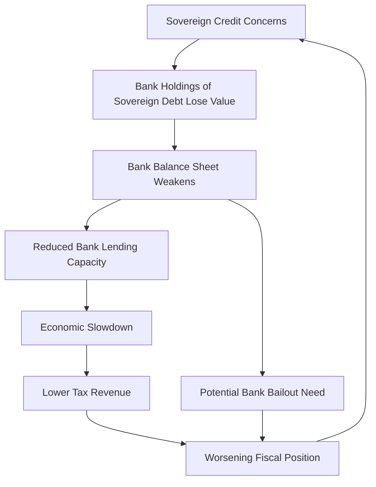
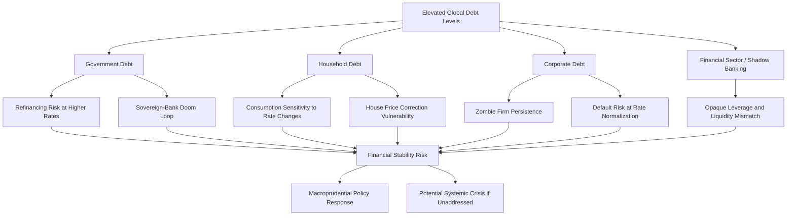

## Rising Global Debt Levels and Financial Stability Risks

### Overview

Global debt — encompassing government, household, non-financial corporate, and financial sector liabilities — has risen substantially relative to GDP since the early 2000s, with notable step-increases following the 2008 Global Financial Crisis and the COVID-19 pandemic. This topic examines the composition and drivers of this debt buildup, the channels through which elevated debt can threaten macroeconomic and financial stability, and the policy frameworks used to monitor and mitigate these risks.

### Composition of Global Debt

#### The Four Sectoral Components

| Sector | Description | Primary Stability Concern |
| --- | --- | --- |
| Government (sovereign) debt | Borrowing by national and sub-national governments | Debt sustainability, sovereign default/restructuring risk |
| Household debt | Mortgages, consumer credit, student loans | Consumption vulnerability, mortgage default risk |
| Non-financial corporate debt | Bonds and loans issued by firms outside the financial sector | Investment vulnerability, corporate default/bankruptcy risk |
| Financial sector debt | Liabilities of banks and non-bank financial institutions | Contagion, systemic banking crises |

[Unverified] Precise global debt-to-GDP figures (commonly tracked by the Institute of International Finance and IMF Global Debt Database) fluctuate with each reporting cycle and should be sourced from the latest release rather than treated as static, given both genuine debt growth and periodic data revisions.

#### Drivers of the Debt Buildup

- **Post-GFC low interest rate environment (2009-2021)**: Historically low borrowing costs across advanced economies reduced the debt-service burden of a given debt stock, encouraging both public and private leverage.
- **COVID-19 fiscal and monetary response**: As covered under pandemic policy responses, large deficit-financed fiscal support pushed sovereign debt-to-GDP ratios sharply higher across most economies simultaneously.
- **Demographic and pension pressures**: Aging populations in many advanced economies increase structural fiscal spending on pensions and healthcare, contributing to persistent deficits independent of cyclical conditions.
- **Emerging market dollar-denominated borrowing**: Many emerging market sovereigns and corporates borrow in foreign currency (predominantly USD), creating currency mismatch risk distinct from advanced economy debt dynamics.

### Debt Sustainability Analysis

#### The Debt Dynamics Equation

The evolution of the public debt-to-GDP ratio follows a standard decomposition:

$$\Delta d_t = \left(\frac{r - g}{1+g}\right) d_{t-1} - pb_t$$

where $d_t$ is the debt-to-GDP ratio, $r$ is the effective nominal (or real, if $d$ and $pb$ are both expressed in real terms consistently) interest rate on debt, $g$ is the nominal (or real) GDP growth rate, and $pb_t$ is the primary balance (revenue minus non-interest spending) as a share of GDP.

**Interpretation**: When $r > g$, debt-to-GDP tends to rise unless offset by sufficiently large primary surpluses. When $r < g$ (as was broadly the case for many advanced economies through much of the 2010s), debt-to-GDP can stabilize or even decline despite ongoing primary deficits — a condition sometimes described in the literature as favorable for debt sustainability, though it is not a permanent guarantee, since $r$ and $g$ both vary with the interest rate cycle and growth conditions.

#### Debt Sustainability Analysis (DSA) Framework

The IMF and World Bank employ formal Debt Sustainability Analysis frameworks combining:

- Baseline debt projections under central macroeconomic assumptions.
- Stress tests / sensitivity analysis (shocks to growth, interest rates, exchange rates, and contingent liabilities).
- Assessment of financing needs (gross financing requirement) relative to available financing sources.
- For low-income countries, a distinct Debt Sustainability Framework incorporates external and total public debt thresholds calibrated to country-specific debt-carrying capacity.

#### Contingent Liabilities

Reported sovereign debt figures often understate total fiscal exposure due to contingent liabilities: state-owned enterprise debt, government loan guarantees (including COVID-era business loan guarantee programs), pension obligations, and implicit backstops to systemically important financial institutions ("too big to fail" guarantees).

### Channels From Elevated Debt to Financial Instability

#### Interest Rate Sensitivity and Refinancing Risk

As debt matures and requires refinancing, higher prevailing interest rates translate into higher debt-service costs, which can crowd out other spending (for governments) or reduce cash flow available for investment and operations (for firms and households). Countries or firms with shorter average debt maturity face faster transmission of rate increases into realized debt-service costs.

#### Sovereign-Bank Nexus ("Doom Loop")

A well-documented channel, particularly salient during the 2010-2012 European sovereign debt crisis: domestic banks hold significant quantities of their own government's sovereign debt. If sovereign creditworthiness deteriorates, bank balance sheets weaken (via mark-to-market or credit risk losses on sovereign holdings), which can trigger a credit crunch that weakens the domestic economy and further strains government finances (via reduced tax revenue and potential bank bailout costs), reinforcing the initial sovereign stress.

#### Corporate Debt Overhang and Zombie Firms

Extended periods of low interest rates can sustain highly leveraged, low-productivity firms ("zombie firms") that would not survive under normal financing conditions, misallocating capital and credit away from more productive uses. Rate normalization exposes these firms to elevated default risk, with potential knock-on effects for bank asset quality.

#### Household Debt and Consumption Amplification

High household debt-to-income ratios amplify the transmission of interest rate changes into consumption (via debt-service costs on variable-rate or refinancing mortgages) and increase vulnerability to house price corrections, given the collateral role of housing in mortgage lending.

#### Emerging Market Currency Mismatch and Capital Flow Reversal

Emerging market entities with USD-denominated debt but local-currency revenue face a direct balance sheet channel: local currency depreciation raises the local-currency value of debt service and principal, independent of any change in the entity's underlying business performance. Sudden capital flow reversals ("sudden stops"), often triggered by shifts in advanced-economy monetary policy (e.g., Fed tightening cycles), can trigger currency depreciation and debt distress simultaneously — a pattern observed repeatedly across historical emerging market crises.

#### Non-Bank Financial Intermediation (Shadow Banking) Risk

A growing share of global credit intermediation occurs outside traditional regulated banking (private credit funds, money market funds, hedge funds, insurance companies engaging in credit strategies). This sector is generally subject to lighter prudential regulation than banks, and its rapid growth since the GFC has drawn increasing attention from financial stability authorities (IMF, Financial Stability Board) due to limited visibility into leverage, liquidity mismatches, and interconnections with the regulated banking sector.

### Policy and Institutional Responses

#### Macroprudential Regulation

Distinct from monetary policy (which targets price stability) and microprudential regulation (which targets individual institution soundness), macroprudential policy targets systemic financial stability:

- **Countercyclical capital buffers**: Require banks to hold additional capital during credit booms, released during downturns to support continued lending.
- **Loan-to-value (LTV) and debt-to-income (DTI) limits**: Constrain household leverage directly at loan origination, used extensively in housing markets prone to boom-bust cycles.
- **Systemic risk buffers** for globally and domestically systemically important banks (G-SIBs, D-SIBs), requiring additional capital proportional to a bank's systemic footprint.

#### Fiscal Rules and Frameworks

Numerical fiscal rules (debt-to-GDP ceilings, structural balance targets, expenditure rules) aim to constrain the pace of sovereign debt accumulation. [Inference] The effectiveness of such rules is debated in the literature, given frequent revision, suspension during crises (as occurred with the EU's Stability and Growth Pact during COVID-19), and the difficulty of enforcement against sovereign governments.

#### Sovereign Debt Restructuring Mechanisms

For countries facing unsustainable debt, restructuring mechanisms include:

- Bilateral and multilateral restructuring processes (e.g., the Paris Club for official bilateral debt).
- The G20 Common Framework for Debt Treatment (established 2020), intended to coordinate restructuring involving both traditional (Paris Club) and non-traditional (notably Chinese) official bilateral creditors, though [Inference] the Common Framework's implementation has been widely characterized in policy commentary as slower and more contentious than originally intended, reflecting coordination challenges among a more diverse creditor base than in prior restructuring episodes.
- Private sector involvement via collective action clauses in sovereign bond contracts, designed to reduce holdout creditor problems during restructuring negotiations.

#### Central Bank Financial Stability Tools

Beyond monetary policy proper, central banks conduct regular financial stability assessments (e.g., the Fed's Financial Stability Report, the ECB's Financial Stability Review) and stress testing of major banks to assess resilience to adverse macroeconomic and financial scenarios.

### Diagram: Debt-to-Financial-Instability Transmission Map

### Cross-Country Risk Differentiation

| Risk Factor | Higher Risk Profile | Lower Risk Profile |
| --- | --- | --- |
| Debt currency denomination | Foreign-currency-denominated (typical emerging markets) | Domestic-currency-denominated (typical advanced economies with own central bank) |
| Debt holder base | Concentrated foreign holders, short maturity | Diversified domestic holder base, long average maturity |
| Monetary sovereignty | No independent central bank / currency union member without fiscal transfers | Independent central bank and floating currency |
| Growth-interest rate differential ($g - r$) | Persistently negative | Persistently positive or near zero |

### Key Points

- Global debt has risen across all four major sectors (government, household, corporate, financial), with COVID-19 producing the most recent sharp step-increase, primarily in government debt.
- The $r - g$ differential is the central analytical tool for assessing sovereign debt sustainability trajectories, though it is not a fixed or guaranteed condition.
- The sovereign-bank "doom loop" and shadow banking opacity are two of the most closely monitored contemporary channels for financial contagion.
- Macroprudential policy (distinct from monetary and microprudential policy) is the primary tool for addressing systemic risk arising from debt buildups, operating through capital buffers and borrower-level lending constraints.
- Emerging market debt sustainability is further complicated by currency mismatch risk and vulnerability to advanced-economy monetary policy spillovers via capital flow reversals.

### Example: Debt Dynamics Under Different Rate Scenarios

Consider a country with an initial debt-to-GDP ratio $d_0 = 80\%$ and a primary balance of $pb = -1\%$ of GDP (i.e., a 1% primary deficit).

**Scenario A** ($r = 2\%$, $g = 3\%$, so $r < g$):

$$\Delta d = \left(\frac{0.02 - 0.03}{1.03}\right)(0.80) - (-0.01) \approx -0.0078 + 0.01 = 0.0022$$

Debt-to-GDP rises only marginally (~0.22 percentage points) despite the primary deficit, because favorable growth-interest differential largely offsets it.

**Scenario B** ($r = 5\%$, $g = 2\%$, so $r > g$):

$$\Delta d = \left(\frac{0.05 - 0.02}{1.02}\right)(0.80) - (-0.01) \approx 0.0235 + 0.01 = 0.0335$$

Debt-to-GDP rises substantially faster (~3.35 percentage points) under the same primary deficit, illustrating how a shift from a favorable to an unfavorable $r - g$ differential — such as occurred with the 2022-2023 global tightening cycle — can materially worsen debt trajectories without any change in fiscal policy stance itself.

### Related Topics

- Fiscal and monetary policy responses to COVID-19 (direct driver of the recent debt step-increase)
- Sovereign debt restructuring mechanisms and the G20 Common Framework
- Macroprudential policy tools and countercyclical capital buffers
- Shadow banking / non-bank financial intermediation and systemic risk monitoring
- Currency mismatch and emerging market "sudden stop" crises
- The European sovereign debt crisis (2010-2012) as a historical case study of the sovereign-bank doom loop
- Central bank stress testing methodologies
- Modern Monetary Theory and alternative perspectives on sovereign debt constraints (cross-reference with monetary policy debates)