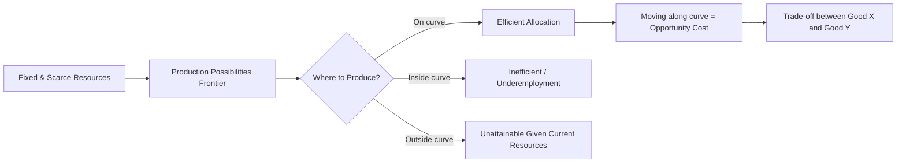

## Scarcity, Choice, and Opportunity Cost

### Definition and Core Concept

**Scarcity** is the fundamental economic condition in which human wants for goods and services exceed the finite resources available to satisfy them. It is universal — applying to individuals, firms, and governments regardless of income or wealth level — because resources (land, labor, capital, entrepreneurship, and time) are limited while wants are effectively unlimited.

Because resources are scarce, **choice** becomes unavoidable: every economic agent must decide how to allocate limited resources among competing uses. Every choice, in turn, generates an **opportunity cost** — the value of the next-best alternative that is forgone when a decision is made.

**Key Points**

- Scarcity is not the same as poverty or shortage; it exists even for the wealthiest individuals and nations because desires always outpace available means.
- Scarcity necessitates choice; choice necessitates cost — this is the causal chain at the heart of economics.
- Opportunity cost is measured in terms of the forgone alternative, not merely in money.

### The Economic Problem

The "economic problem" refers to the basic questions every society must answer because of scarcity:

1. **What** to produce (which goods and services, and in what quantities)
2. **How** to produce (which resource combinations and production techniques)
3. **For whom** to produce (how output is distributed among members of society)

Different economic systems (market, command, mixed) answer these questions through different mechanisms — prices and markets, central planning, or a combination of both — but no system can escape the underlying scarcity constraint.

### Resources (Factors of Production)

Scarcity applies to the four broad categories of productive resources:

| Factor | Description | Payment/Return |
| --- | --- | --- |
| Land | Natural resources (raw materials, land, water) | Rent |
| Labor | Human physical and mental effort | Wages |
| Capital | Man-made tools, machinery, infrastructure | Interest |
| Entrepreneurship | Risk-taking and organization of other factors | Profit |

Each factor is finite at any given point in time, which is the root technical cause of scarcity.

### Opportunity Cost: Formal Treatment

Opportunity cost is defined as:

$$OC = \text{Value of Best Forgone Alternative}$$

It is important to distinguish opportunity cost from simple accounting or monetary cost:

- **Explicit cost**: Direct monetary outlay (e.g., wages paid, rent paid).
- **Implicit cost**: The value of resources already owned that are used without direct payment (e.g., the forgone salary of an entrepreneur who works in their own business).
- **Economic cost** = Explicit cost + Implicit cost, and opportunity cost is the broader concept underlying both.

**Example**

A student has 3 hours free before an exam and can either study economics or work a part-time job paying $15/hour.

- If she chooses to study, the opportunity cost is the $45 in forgone wages (plus any other benefits of working, like experience).
- If she chooses to work, the opportunity cost is the potential improvement in her exam grade from studying.

Opportunity cost need not be monetary — it can be measured in utility, time, or any unit relevant to the decision.

### The Production Possibilities Frontier (PPF)

The PPF is the primary graphical and analytical tool for illustrating scarcity, choice, and opportunity cost simultaneously. It shows the maximum feasible combinations of two goods an economy can produce given fixed resources and technology.

**Key Points**

- Points **on** the curve represent productive efficiency (all resources fully and efficiently employed).
- Points **inside** the curve represent inefficiency or underutilized resources (unemployment, idle capital).
- Points **outside** the curve are currently unattainable given existing resources/technology.
- The **shape** of the PPF reveals the behavior of opportunity cost as production shifts between goods.

<svg xmlns="http://www.w3.org/2000/svg" viewBox="0 0 520 420" font-family="sans-serif">
<text x="260" y="24" font-size="15" font-weight="bold" text-anchor="middle">Production Possibilities Frontier (svg_diagram)</text>

<line x1="70" y1="360" x2="70" y2="50" stroke="black" stroke-width="2" />
<line x1="70" y1="360" x2="470" y2="360" stroke="black" stroke-width="2" />
<text x="30" y="60" font-size="12">Good Y</text>
<text x="440" y="380" font-size="12">Good X</text>

<path d="M 70 90 Q 150 100 240 160 Q 340 230 440 355" stroke="#1f77b4" stroke-width="3" fill="none" />

<circle cx="150" cy="120" r="5" fill="#d62728" />
<text x="158" y="115" font-size="12">A (efficient)</text>

<circle cx="300" cy="200" r="5" fill="#d62728" />
<text x="308" y="195" font-size="12">B (efficient)</text>

<circle cx="220" cy="260" r="5" fill="#2ca02c" />
<text x="228" y="270" font-size="12">C (inefficient/idle resources)</text>

<circle cx="330" cy="120" r="5" fill="#7f7f7f" />
<text x="338" y="115" font-size="12">D (unattainable)</text>

<line x1="220" y1="260" x2="220" y2="360" stroke="#999" stroke-dasharray="4,4" />
<line x1="70" y1="260" x2="220" y2="260" stroke="#999" stroke-dasharray="4,4" />
</svg>

#### Constant vs. Increasing Opportunity Cost

- A **straight-line (linear) PPF** implies **constant opportunity cost** — resources are perfect substitutes between the two goods.
- A **bowed-out (concave) PPF** implies **increasing opportunity cost** — as more of one good is produced, increasingly larger amounts of the other good must be sacrificed. This occurs because resources are not equally well-suited (specialized) for producing both goods.

The law of increasing opportunity cost is the standard assumption in introductory microeconomics and explains the typical concave shape of the PPF.

### Shifts of the PPF

The PPF itself can shift, representing changes in the economy's productive capacity — distinct from movements *along* the curve (which represent opportunity cost trade-offs at a fixed capacity):

- **Outward shift**: Economic growth, caused by an increase in resources (population growth, resource discovery) or technological improvement.
- **Inward shift**: Contraction, caused by resource depletion, natural disaster, or war.
- A shift can be **parallel** (both goods' production capacity rises equally) or **biased/skewed** (technology or resources improve production of one good more than the other).

### Marginal Analysis and Opportunity Cost

Rational decision-making in microeconomics relies on comparing **marginal benefit (MB)** and **marginal cost (MC)**, where marginal cost fundamentally reflects opportunity cost. The decision rule is:

$$\text{Continue activity while } MB > MC; \text{ stop when } MB = MC$$

This is the foundation of the **marginal decision rule**, used throughout microeconomics (consumer choice, firm output decisions, resource allocation).

### Comparative Advantage and Opportunity Cost

Opportunity cost is the basis for determining **comparative advantage** — the ability to produce a good at a *lower opportunity cost* than another producer (as opposed to **absolute advantage**, which is about producing more output with the same resources).

**Example**

|  | Cost to produce 1 unit of Cloth (hours) | Cost to produce 1 unit of Wine (hours) |
| --- | --- | --- |
| Country A | 2 | 4 |
| Country B | 3 | 3 |

- Opportunity cost of 1 Cloth in Country A = 0.5 Wine; in Country B = 1 Wine → Country A has comparative advantage in Cloth.
- Opportunity cost of 1 Wine in Country A = 2 Cloth; in Country B = 1 Cloth → Country B has comparative advantage in Wine.

Specialization according to comparative advantage, followed by trade, allows both parties to consume beyond their individual PPFs — a core justification for the gains from trade.

### Sunk Cost vs. Opportunity Cost

A common analytical error is confusing **sunk costs** (costs already incurred and irrecoverable) with opportunity costs (forward-looking, relevant to current decisions).

**Key Points**

- Rational decision-making should ignore sunk costs entirely, since they do not change regardless of the choice made going forward.
- Opportunity cost is always about the *next* best alternative available *now*, not what has already been spent.
- The "sunk cost fallacy" occurs when decision-makers continue an activity because of resources already committed, rather than evaluating current marginal costs and benefits.

### Time as a Scarce Resource

Time is a universally scarce resource distinct from money, and it generates opportunity costs independent of monetary cost. This is central to labor supply theory (the trade-off between work and leisure) and consumer theory (time spent shopping, cooking, or commuting has an implicit cost equal to the best alternative use of that time, often approximated by the wage rate).

### Applications in Everyday Decision-Making

- **Consumer choice**: Deciding to buy a laptop implies forgoing the next-best purchase (e.g., a vacation) of equivalent value.
- **Firm decisions**: A firm allocating capital to Project A forgoes the returns it could have earned on Project B.
- **Government policy**: Public spending on defense implies forgone spending on healthcare or education — often illustrated with a PPF between "guns and butter."
- **Career and education choices**: Attending university involves not only explicit costs (tuition) but implicit costs (forgone wages from full-time work), which together constitute the full economic cost of a degree. [Inference: the precise magnitude of forgone wages varies significantly by individual circumstances and cannot be generalized numerically.]

### Common Misconceptions

- **Scarcity ≠ Rarity**: A good can be rare (e.g., a specific painting) without being economically scarce in the technical sense if there's no competing demand; conversely, common goods (like clean water in some contexts) can be economically scarce relative to demand.
- **Free goods**: Very few goods are truly "free" in the economic sense (zero opportunity cost); most goods that appear free (e.g., ambient air) may still be non-scarce ("free goods") in specific contexts, but this is the exception rather than the rule addressed by economic analysis.
- **Cost = Money**: As emphasized above, opportunity cost is broader than monetary expenditure and includes forgone alternatives measured in time, utility, or other resources.

### Related Topics

- The Production Possibilities Frontier and Economic Growth
- Absolute Advantage vs. Comparative Advantage
- Marginal Analysis and the Marginal Decision Rule
- Sunk Cost Fallacy in Behavioral Economics
- Factors of Production and Factor Markets
- Economic Systems: Market, Command, and Mixed Economies
- Gains from Trade and Specialization
- Positive vs. Normative Economics