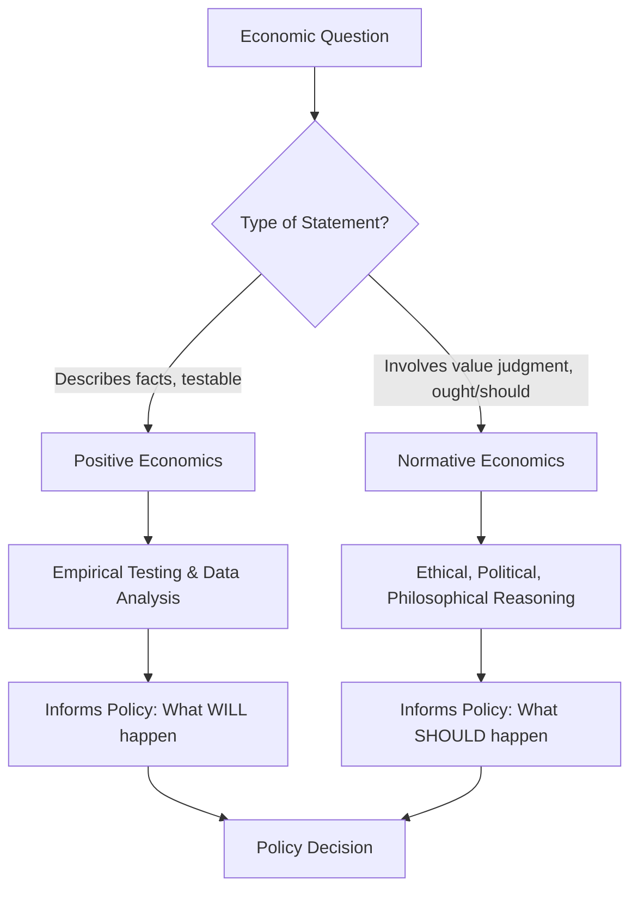

## Positive vs Normative Economics

### Definition and Core Distinction

**Positive economics** is the branch of economic analysis concerned with objective, fact-based statements about how the economy actually works. Positive statements are descriptive, testable, and verifiable (or falsifiable) against data — they concern "what is," "what was," or "what will be" under given conditions.

**Normative economics** is the branch concerned with value judgments about what economic outcomes or policies *ought to* be. Normative statements are prescriptive, involve subjective opinion or ethical considerations, and cannot be proven true or false using empirical evidence alone.

**Key Points**

- Positive economics = descriptive ("what is")
- Normative economics = prescriptive ("what should be")
- Positive statements can, in principle, be tested against real-world data; normative statements rest on value judgments that vary across individuals and cultures.
- Most real-world economic policy debates blend both: positive analysis establishes the likely effects of a policy, while normative judgment determines whether those effects are desirable.

### Distinguishing Criteria

| Criterion | Positive Economics | Normative Economics |
| --- | --- | --- |
| Nature | Descriptive/factual | Prescriptive/value-based |
| Testability | Empirically verifiable | Not empirically verifiable |
| Language cues | "is," "will," "causes," "results in" | "should," "ought," "better," "fair," "must" |
| Objectivity | Aims for objectivity | Inherently subjective |
| Role in policy | Predicts consequences | Judges desirability of consequences |

### Examples

**Example**

Positive statements:

- "An increase in the minimum wage above the equilibrium wage tends to reduce the quantity of low-skilled labor demanded, holding other factors constant."
- "Inflation in the country was 4.2% last year."
- "A $1 increase in the price of gasoline reduces quantity demanded by X% in the short run, based on estimated price elasticity."

Normative statements:

- "The government should raise the minimum wage to reduce poverty."
- "Income inequality is unfair and must be corrected through taxation."
- "Healthcare ought to be provided free of charge to all citizens."

Note that the positive statement about the minimum wage does not say whether the policy is good or bad — it only describes an expected causal relationship. The normative statement adds a judgment about what policymakers *should* do.

### Why the Distinction Matters

**Key Points**

- **Analytical clarity**: Separating facts from values helps identify exactly where disagreements in economic debates originate — from differing empirical predictions (a positive dispute) or differing values/priorities (a normative dispute).
- **Scientific method in economics**: Positive economics allows economists to build, test, and refine models using data, similar to natural sciences, even though economics deals with human behavior.
- **Policy formulation**: Sound policy design typically requires positive analysis (to predict what will happen) *combined with* normative criteria (to judge whether the predicted outcome is desirable) — the two are complementary, not mutually exclusive, in real decision-making.

### The Positive-Normative Spectrum in Practice

Few real-world economic statements are purely one or the other; many blend both elements, and identifying the blend is itself a key analytical skill.

**Example**

"Raising taxes on the wealthy to fund public education will likely reduce measured income inequality (positive claim), and this outcome is desirable because it promotes social equity (normative claim)."

Breaking down compound statements like this into their positive and normative components is a standard exercise in introductory microeconomics, as it clarifies which part of an argument is subject to empirical testing and which part depends on values.

### Role of Economists

- Economists, in their professional/scientific capacity, primarily aim to produce **positive** analysis: building models, deriving predictions, and testing them against data.
- When economists make **policy recommendations**, they necessarily incorporate normative elements (their own or society's values about desirable outcomes), even if the underlying analysis of *effects* is positive.
- Economic advisors often try to make the positive/normative boundary explicit — e.g., presenting several policy options with their predicted (positive) effects, while leaving the ultimate value judgment about which effect is most desirable to elected policymakers or the public.

### Common Sources of Disagreement Among Economists

**Key Points**

- **Positive disagreements**: Arise from different theoretical models, different data, different assumptions, or different empirical methods used to estimate effects (e.g., disagreement over the exact magnitude of the minimum wage's effect on employment).
- **Normative disagreements**: Arise from different underlying values or ethical frameworks (e.g., how much weight to give equity versus efficiency).
- Media and political debates often present normative disagreements (a difference in values) as if they were positive disagreements (a difference in facts), which can obscure the real nature of the disagreement.

### Limitations and Nuances

- **Value-ladenness of positive economics**: [Inference: Some philosophers of economics argue that even seemingly positive economic analysis can be subtly shaped by the values embedded in model assumptions or the choice of what to study — this is a matter of ongoing methodological debate rather than settled empirical fact.]
- **Welfare economics** is a subfield that explicitly attempts to build a bridge between positive analysis and normative evaluation, using tools like Pareto efficiency to evaluate outcomes with a minimal (though still present) set of value judgments.
- Testability does not guarantee current verification: some positive statements may be currently *untested* or difficult to test empirically (e.g., due to lack of data or confounding variables), but they remain positive in principle because they describe a claim that could be tested by evidence.

### Related Topics

- Welfare Economics and Pareto Efficiency
- Scarcity, Choice, and Opportunity Cost
- The Role of Assumptions in Economic Models
- Economic Methodology and the Scientific Method in Social Science
- Market Failure and the Case for Government Intervention
- Equity vs. Efficiency Trade-offs