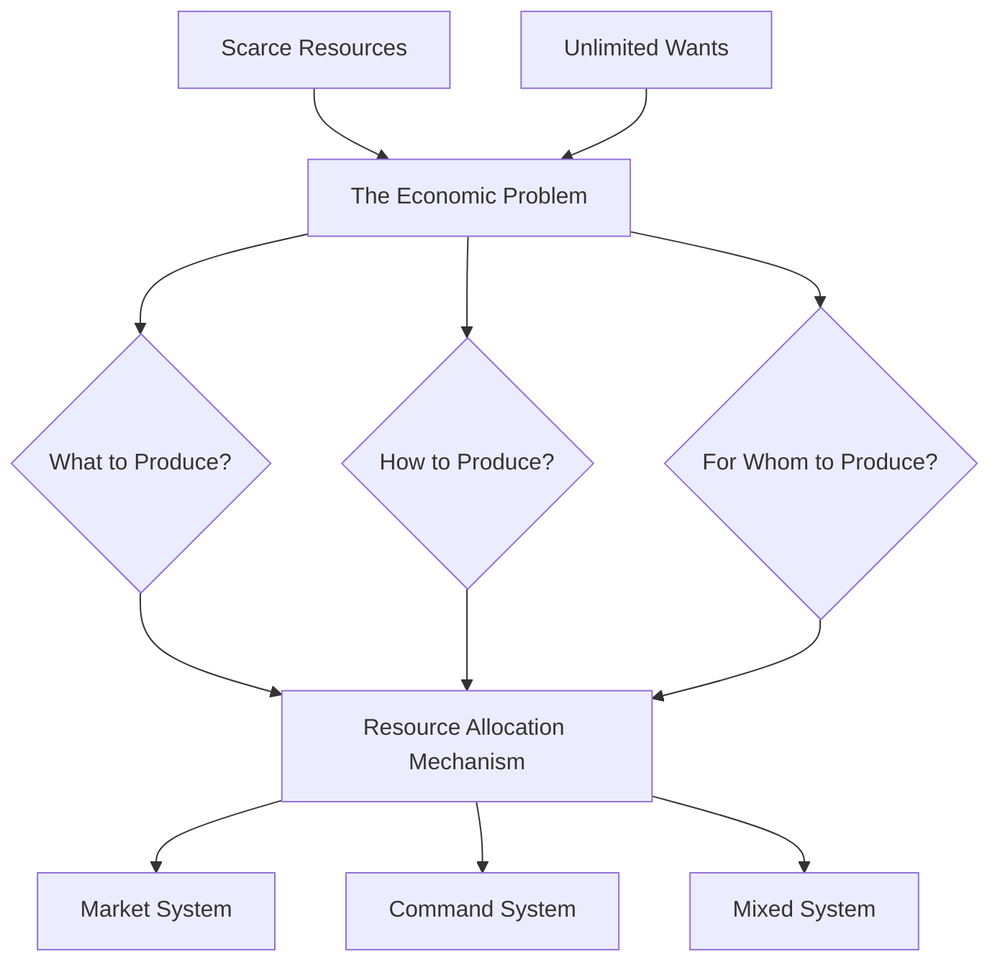

## The Economic Problem and Resource Allocation

### Definition and Core Concept

The **economic problem** refers to the fundamental challenge faced by every society: how to allocate **scarce resources** among **unlimited and competing wants**. Because no economy possesses infinite resources, every society — regardless of its political or economic system — must develop mechanisms to decide how resources are used, what is produced, and who receives the resulting output.

**Resource allocation** is the process by which an economy answers these questions in practice — distributing land, labor, capital, and entrepreneurship among alternative uses.

**Key Points**

- The economic problem exists at every level: individual, household, firm, and national/global economy.
- It arises directly from the combination of scarcity (finite resources) and infinite wants.
- Different economic systems represent different institutional *solutions* to the same underlying economic problem.

### The Three Fundamental Questions

Every economy, regardless of its system, must answer three core allocation questions:

1. **What to produce?** — Which goods and services should be produced, and in what quantities, given limited resources?
2. **How to produce?** — Which techniques, resource combinations, and production methods should be used (labor-intensive vs. capital-intensive, for example)?
3. **For whom to produce?** — How should the resulting output be distributed among members of society (by income, need, political allocation, etc.)?

### Resource Allocation Mechanisms

Economies use different mechanisms to answer the three fundamental questions, generally falling along a spectrum:

#### Market Economy (Price Mechanism)

- Resource allocation is decentralized, driven by the interaction of supply and demand.
- Prices act as **signals** (indicating relative scarcity and value), **incentives** (motivating producers and consumers to act), and a **rationing mechanism** (allocating goods to those willing and able to pay).
- Decisions on what, how, and for whom are made by individual households and firms pursuing self-interest, coordinated through markets rather than central direction.

#### Command (Planned) Economy

- Resource allocation is centralized, with a government or planning authority directly determining production quotas, resource distribution, and pricing.
- The "what, how, for whom" questions are answered administratively rather than through price signals.
- Historical examples include centrally planned economies of the 20th century (e.g., the former Soviet Union).

#### Mixed Economy

- Most real-world economies combine market mechanisms with government intervention (regulation, public goods provision, redistribution, correcting market failures).
- The degree of market vs. government control varies significantly across countries and sectors.

**Key Points**

- No economy is a "pure" market or "pure" command economy in practice; the mixed economy is the empirically dominant model.
- The choice of allocation mechanism has significant implications for economic efficiency, equity, and individual freedom — a topic with substantial normative dimensions (see Positive vs. Normative Economics).

### The Price Mechanism in Detail

In a market-based system, the price mechanism performs three interrelated functions:

| Function | Description |
| --- | --- |
| Signaling | Prices convey information about relative scarcity and consumer preferences to producers and consumers. |
| Incentivizing | Rising prices incentivize producers to supply more and consumers to economize on use; falling prices do the reverse. |
| Rationing | Prices allocate a limited supply of goods to those consumers willing and able to pay the market price. |

**Example**

If a poor harvest reduces the supply of wheat, its price rises. This signals scarcity to bakers and consumers, incentivizes farmers to plant more wheat next season and encourages consumers to reduce consumption or substitute to other grains, and rations the now-scarcer wheat supply toward those with the highest willingness to pay.

### Opportunity Cost and Resource Allocation

Every allocation decision made by an economy carries an opportunity cost — the next-best alternative use of the resources forgone. Because resources allocated to producing Good A cannot simultaneously be used to produce Good B, resource allocation decisions and opportunity cost are two sides of the same underlying scarcity problem (see Scarcity, Choice, and Opportunity Cost).

This relationship is commonly illustrated using the **Production Possibilities Frontier (PPF)**, where any point on the frontier represents one feasible allocation of resources between two goods, and moving along the frontier represents the opportunity cost of reallocating resources from one good to another.

### Efficiency in Resource Allocation

Economists evaluate resource allocation outcomes using several efficiency concepts:

- **Productive efficiency**: Producing goods at the lowest possible cost, using the fewest resources for a given output (operating on the PPF).
- **Allocative efficiency**: Producing the combination of goods and services that best matches consumer preferences — i.e., producing what society actually values most, occurring where price equals marginal cost ($P = MC$) in competitive markets.
- **Pareto efficiency**: A resource allocation is Pareto efficient if no reallocation can make one person better off without making another person worse off.

$$\text{Allocative efficiency: } P = MC$$

### Market Failure and Allocation Problems

Resource allocation via the price mechanism can fail to achieve efficient or socially desirable outcomes under certain conditions, collectively termed **market failure**:

- **Externalities**: Costs or benefits affecting third parties not reflected in market prices (e.g., pollution).
- **Public goods**: Non-excludable, non-rivalrous goods (e.g., national defense) that markets tend to underprovide.
- **Information asymmetry**: Unequal information between buyers and sellers distorting efficient exchange.
- **Market power**: Monopolies or oligopolies that restrict output and allocate resources inefficiently relative to a competitive benchmark.

These failures provide the traditional economic rationale for government intervention in otherwise market-based allocation systems. [Inference: the appropriate scope and form of such intervention is a matter of extensive normative and empirical debate among economists and is not a settled, universally agreed-upon prescription.]

### Resource Allocation Across Time: Investment and Growth

Resource allocation decisions are not limited to current consumption; economies also allocate resources between **current consumption** and **investment** (capital accumulation), which affects future productive capacity. This trade-off is often illustrated using a PPF with "consumer goods" and "capital goods" as the two axes — an economy that allocates more resources to capital goods today shifts its PPF further outward in the future, at the cost of lower consumption now.

### Comparative Systems: A Summary

| Feature | Market | Command | Mixed |
| --- | --- | --- | --- |
| Allocation mechanism | Prices | Central planning | Prices + government intervention |
| Who decides "what/how/for whom" | Households & firms | State/planning authority | Both, in varying proportions |
| Efficiency incentives | Strong (profit motive) | Weak/administrative | Variable |
| Equity outcomes | Depends on income distribution | Can be directly targeted | Managed via redistribution/taxation |
| Real-world examples | Idealized model; few pure cases | Historical USSR, North Korea | Most modern economies (US, UK, EU, etc.) |

### Related Topics

- Scarcity, Choice, and Opportunity Cost
- Positive vs. Normative Economics
- The Production Possibilities Frontier
- Market Failure and Externalities
- Price Mechanism: Signaling, Incentives, and Rationing
- Comparative Economic Systems
- Allocative vs. Productive Efficiency
- Government Intervention in Markets