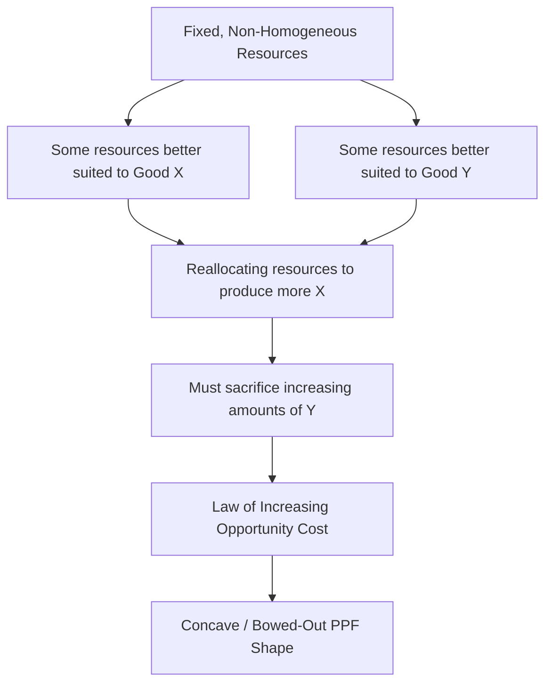

## Production Possibilities Frontier

### Definition and Core Concept

The **Production Possibilities Frontier (PPF)**, also called the **Production Possibilities Curve (PPC)**, is a graphical model illustrating the maximum feasible combinations of two goods (or categories of goods) that an economy can produce using all available resources efficiently, given a fixed quantity of resources and a fixed level of technology.

The PPF is one of the foundational models in microeconomics because it simultaneously visualizes **scarcity**, **choice**, **opportunity cost**, and **efficiency**.

**Key Points**

- The PPF assumes a fixed resource base and fixed technology at a given point in time.
- It models a simplified two-good economy for pedagogical clarity, though the underlying logic extends to multi-good economies.
- The PPF is a normative-free, purely positive analytical tool — it describes production possibilities, not what *should* be produced.

### Assumptions Underlying the PPF

1. Only two goods are produced (simplification for two-dimensional graphing).
2. Resources (factors of production) are fixed in quantity during the period analyzed.
3. Technology is held constant.
4. Resources are not perfectly adaptable between the two goods — some resources are better suited to producing one good than the other.
5. Full and efficient utilization of all resources is assumed at every point *on* the curve.

### Graphical Representation

Any point on or inside the PPF represents a feasible level of output; the frontier itself represents the boundary of what is achievable with full and efficient resource use.

<svg xmlns="http://www.w3.org/2000/svg" viewBox="0 0 540 420" font-family="sans-serif">
<text x="270" y="24" font-size="15" font-weight="bold" text-anchor="middle">PPF: Efficiency, Inefficiency, and Unattainability (svg_diagram)</text>

<line x1="70" y1="360" x2="70" y2="50" stroke="black" stroke-width="2" />
<line x1="70" y1="360" x2="480" y2="360" stroke="black" stroke-width="2" />
<text x="30" y="55" font-size="12">Good Y (Capital Goods)</text>
<text x="400" y="385" font-size="12">Good X (Consumer Goods)</text>

<path d="M 70 90 Q 160 100 260 165 Q 360 235 450 355" stroke="#1f77b4" stroke-width="3" fill="none" />

<circle cx="200" cy="130" r="5" fill="#d62728" />
<text x="208" y="125" font-size="12">A: Productively Efficient</text>

<circle cx="330" cy="215" r="5" fill="#d62728" />
<text x="338" y="210" font-size="12">B: Productively Efficient (different mix)</text>

<circle cx="230" cy="270" r="5" fill="#2ca02c" />
<text x="238" y="290" font-size="12">C: Inefficient (unemployed resources)</text>

<circle cx="330" cy="120" r="5" fill="#7f7f7f" />
<text x="338" y="115" font-size="12">D: Unattainable (given current resources)</text>
</svg>

### Interpreting Points Relative to the PPF

| Location | Interpretation |
| --- | --- |
| On the curve | Productive efficiency: all resources fully and efficiently employed |
| Inside the curve | Productive inefficiency: unemployed or underutilized resources |
| Outside the curve | Currently unattainable given existing resources and technology |

### Opportunity Cost and the Shape of the PPF

Movement **along** the PPF represents a trade-off: producing more of one good requires giving up some quantity of the other. This forgone quantity is the opportunity cost of the reallocation.

#### Constant Opportunity Cost (Linear PPF)

A straight-line PPF implies that resources are equally well-suited to producing either good — that is, they are **perfect substitutes** in production. The opportunity cost of one good in terms of the other remains constant along the entire curve.

$$OC_X = \frac{\Delta Y}{\Delta X} = \text{constant}$$

#### Increasing Opportunity Cost (Concave/Bowed-Out PPF)

Most real-world PPFs are drawn as concave (bowed outward from the origin), reflecting the **law of increasing opportunity cost**: as an economy produces more of one good, it must sacrifice increasing amounts of the other good for each additional unit.

This occurs because **resources are not perfectly adaptable** — some resources are relatively more efficient at producing Good X, others at producing Good Y. As production of Good X expands, resources less suited to producing X (but well-suited to Y) must be reallocated, causing the opportunity cost of X (in terms of forgone Y) to rise.

**Example**

Consider an economy producing Wheat and Automobiles. Initially, farmland resources highly suited to wheat but poorly suited to auto manufacturing are used for wheat. As the economy shifts more resources toward automobile production, it must eventually reallocate land and labor that are relatively inefficient at auto manufacturing, meaning each additional car "costs" progressively more forgone wheat.

### Shifts of the PPF

A shift of the entire PPF represents a change in the economy's productive capacity, distinct from movement along a fixed PPF.

#### Outward Shift (Economic Growth)

Caused by:

- An increase in the quantity of resources (population growth, new resource discovery, capital accumulation)
- Improvements in technology or productivity
- Increases in human capital (education, training, skill development)

#### Inward Shift (Economic Contraction)

Caused by:

- Depletion or destruction of resources (natural disaster, war, resource exhaustion)
- Population decline
- Significant negative productivity shocks

#### Parallel vs. Biased Shifts

- **Parallel shift**: Both goods' maximum attainable output increase proportionally (e.g., a general improvement in labor productivity affecting both sectors equally).
- **Biased/skewed shift**: An improvement specific to one good's production (e.g., a new technology only applicable to automobile manufacturing) shifts the frontier outward more on that good's axis, changing the curve's shape as well as its position.

<svg xmlns="http://www.w3.org/2000/svg" viewBox="0 0 540 380" font-family="sans-serif">
<text x="270" y="24" font-size="15" font-weight="bold" text-anchor="middle">PPF Shift: Economic Growth (svg_diagram)</text>
<line x1="70" y1="330" x2="70" y2="50" stroke="black" stroke-width="2" />
<line x1="70" y1="330" x2="480" y2="330" stroke="black" stroke-width="2" />
<text x="30" y="55" font-size="12">Good Y</text>
<text x="440" y="355" font-size="12">Good X</text>

<path d="M 70 100 Q 150 130 230 190 Q 300 240 350 325" stroke="#1f77b4" stroke-width="3" fill="none" />
<text x="140" y="120" font-size="11" fill="#1f77b4">Original PPF</text>

<path d="M 70 60 Q 200 100 300 170 Q 380 230 460 325" stroke="#2ca02c" stroke-width="3" fill="none" stroke-dasharray="6,3" />
<text x="330" y="150" font-size="11" fill="#2ca02c">New PPF (after growth)</text>
</svg>

### The PPF and Economic Efficiency Concepts

- **Productive efficiency**: Any point *on* the PPF, since output cannot be increased for one good without reducing the other, given full resource utilization.
- **Allocative efficiency**: A single specific point *on* the PPF that reflects the mix of goods most preferred by society (matching production to consumer preferences), typically identified using tools like community indifference curves in more advanced treatments.
- **Dynamic efficiency**: Relates to the PPF's movement over time, reflecting how efficiently an economy translates investment into future productive capacity (outward shifts).

### The PPF and Trade: Comparative Advantage

The PPF model extends naturally into international trade theory. Two countries with differently shaped or positioned PPFs (reflecting different opportunity costs of production) can each specialize in the good in which they hold a **comparative advantage** and trade, allowing both countries to consume at a point *outside* their individual domestic PPFs.

$$\text{Consumption Possibilities Frontier (with trade)} \supset \text{Production Possibilities Frontier (autarky)}$$

### Common Applications of the PPF Model

| Application | Typical Axis Pair |
| --- | --- |
| Guns vs. butter (military vs. civilian spending) | Defense goods / Consumer goods |
| Growth trade-off | Capital goods / Consumer goods |
| Macroeconomic policy framing | Public goods / Private goods |
| Environmental economics | Output / Environmental quality |

### Limitations of the PPF Model

- **Two-good simplification**: Real economies produce far more than two goods; the PPF is a pedagogical simplification, not a literal representation of an entire economy.
- **Static snapshot**: The PPF represents a fixed point in time; it does not by itself model the dynamic process of growth (only comparisons of PPFs across time).
- **Assumes full employment/efficiency on the curve**: Real economies are rarely operating exactly on their theoretical frontier at all times. [Inference: measuring an economy's actual position relative to its theoretical PPF in real time is empirically difficult and subject to significant estimation uncertainty.]
- **Does not specify the "for whom" question**: The PPF shows what combinations are *possible*, but says nothing about the distribution of goods among individuals in society (a normative/distributional issue, not addressed by the PPF itself).

### Related Topics

- Scarcity, Choice, and Opportunity Cost
- The Economic Problem and Resource Allocation
- Comparative Advantage and Gains from Trade
- Allocative vs. Productive Efficiency
- Economic Growth and Capital Accumulation
- Law of Increasing Opportunity Cost