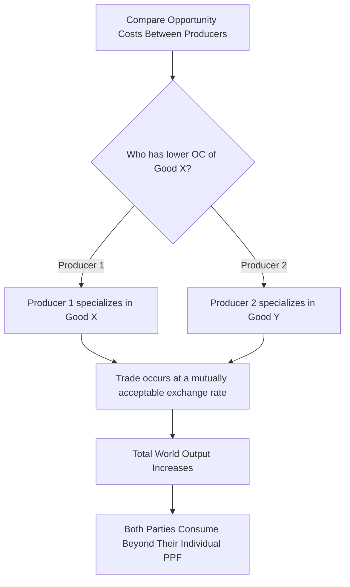

## Comparative Advantage and Gains From Trade

### Definition and Core Concept

**Comparative advantage** is the ability of an individual, firm, or country to produce a good or service at a **lower opportunity cost** than another producer — that is, by sacrificing less of an alternative good in the process of production. It is distinct from **absolute advantage**, which refers to the ability to produce more output using the same quantity of resources, or the same output using fewer resources.

The **theory of comparative advantage**, first formalized by David Ricardo, demonstrates that mutually beneficial trade — and gains for all parties involved — can occur even when one party is absolutely more efficient at producing *every* good, as long as *relative* efficiencies (opportunity costs) differ between the parties.

**Key Points**

- Comparative advantage is about relative (opportunity cost) efficiency, not absolute efficiency.
- Trade based on comparative advantage allows total output and consumption to increase beyond what either party could achieve alone.
- Comparative advantage is the theoretical foundation for the case for specialization and international trade in microeconomics.

### Absolute Advantage vs. Comparative Advantage

| Concept | Definition | Basis |
| --- | --- | --- |
| Absolute advantage | Producing more output per unit of input, or the same output with fewer inputs | Direct productivity comparison |
| Comparative advantage | Producing a good at a lower opportunity cost (in terms of the other good forgone) | Relative opportunity cost comparison |

A country (or individual) can have an absolute advantage in producing *both* goods relative to a trading partner, yet still only hold a comparative advantage in *one* of them — and this comparative advantage, not absolute advantage, is what determines mutually beneficial specialization patterns.

### Numerical Example: Deriving Comparative Advantage

Consider two countries, A and B, each with 100 labor hours available, producing two goods: Cloth and Wine. The table shows output per 100 labor hours if all resources are devoted to a single good.

|  | Cloth (units) | Wine (units) |
| --- | --- | --- |
| Country A | 100 | 50 |
| Country B | 60 | 60 |

**Step 1: Determine absolute advantage**

Country A produces more Cloth (100 > 60) and Country B produces more Wine (60 > 50). Country A has absolute advantage in Cloth; Country B has absolute advantage in Wine — in this particular example, absolute and comparative advantage happen to align, but this is not guaranteed (see the classic Ricardian case below where one country has *both* absolute advantages).

**Step 2: Calculate opportunity costs**

$$OC_{\text{Cloth in A}} = \frac{50 \text{ Wine}}{100 \text{ Cloth}} = 0.5 \text{ Wine per unit Cloth}$$

$$OC_{\text{Cloth in B}} = \frac{60 \text{ Wine}}{60 \text{ Cloth}} = 1.0 \text{ Wine per unit Cloth}$$

$$OC_{\text{Wine in A}} = \frac{100 \text{ Cloth}}{50 \text{ Wine}} = 2.0 \text{ Cloth per unit Wine}$$

$$OC_{\text{Wine in B}} = \frac{60 \text{ Cloth}}{60 \text{ Wine}} = 1.0 \text{ Cloth per unit Wine}$$

**Step 3: Identify comparative advantage**

- Country A has the lower opportunity cost of Cloth (0.5 < 1.0) → Country A should specialize in Cloth.
- Country B has the lower opportunity cost of Wine (1.0 < 2.0) → Country B should specialize in Wine.

### The Classic Ricardian Case: One Country Absolutely More Efficient at Everything

**Example**

|  | Cloth (units/hour) | Wine (units/hour) |
| --- | --- | --- |
| Country A | 6 | 4 |
| Country B | 2 | 1 |

Country A is absolutely more productive in *both* goods. However:

$$OC_{\text{Cloth in A}} = \frac{4}{6} = 0.67 \text{ Wine}, \quad OC_{\text{Cloth in B}} = \frac{1}{2} = 0.5 \text{ Wine}$$

Country B has the *lower* opportunity cost of Cloth despite being absolutely less productive at it. Country B should specialize in Cloth, and Country A — which has the comparative advantage in Wine ($OC_{\text{Wine in A}} = 1.5$ Cloth vs. $OC_{\text{Wine in B}} = 2$ Cloth) — should specialize in Wine. Both countries gain from trading according to this pattern, even though Country A is better at producing everything in absolute terms.

This result — that mutually beneficial trade can exist even with one-sided absolute advantage — is the central and most counterintuitive insight of comparative advantage theory.

### Gains From Trade

**Gains from trade** refer to the net increase in total output and consumption possibilities that results from specialization according to comparative advantage, followed by voluntary exchange.

**Key Points**

- Specialization according to comparative advantage increases total world/combined output of both goods compared to a no-trade (autarky) scenario.
- Trade allows each party to consume a combination of goods **outside** their individual domestic Production Possibilities Frontier (PPF) — something impossible without trade.
- The gains from trade are shared between trading partners, though the *distribution* of those gains depends on the terms of trade (the exchange rate/price at which goods are traded).

### The Terms of Trade

For mutually beneficial trade to occur, the **terms of trade** (the rate at which one good exchanges for another) must lie **between** the two countries' domestic opportunity costs.

Using the earlier example (Country A: OC of Cloth = 0.5 Wine; Country B: OC of Cloth = 1.0 Wine), any terms of trade between:

$$0.5 \text{ Wine} < \text{Terms of Trade (Cloth for Wine)} < 1.0 \text{ Wine}$$

will make trade beneficial for both parties, since each country obtains the good it is not specializing in at a more favorable rate than it could produce it domestically.

**Key Points**

- If the terms of trade equal one country's domestic opportunity cost exactly, that country gains nothing from trade at the margin (though it does not lose either).
- The actual terms of trade are typically determined by relative supply and demand conditions in the international market, bargaining power, and other institutional factors.

### Graphical Illustration: PPF and Consumption Possibilities

<svg xmlns="http://www.w3.org/2000/svg" viewBox="0 0 560 400" font-family="sans-serif">
<text x="280" y="24" font-size="15" font-weight="bold" text-anchor="middle">Gains from Trade: PPF vs. Consumption Possibilities (svg_diagram)</text>
<line x1="80" y1="350" x2="80" y2="50" stroke="black" stroke-width="2" />
<line x1="80" y1="350" x2="500" y2="350" stroke="black" stroke-width="2" />
<text x="40" y="55" font-size="12">Wine</text>
<text x="460" y="375" font-size="12">Cloth</text>

<line x1="80" y1="100" x2="300" y2="350" stroke="#1f77b4" stroke-width="3" />
<text x="140" y="150" font-size="11" fill="#1f77b4">Domestic PPF</text>

<line x1="80" y1="70" x2="430" y2="350" stroke="#2ca02c" stroke-width="3" stroke-dasharray="6,3" />
<text x="330" y="220" font-size="11" fill="#2ca02c">Consumption Possibilities (with trade)</text>

<circle cx="190" cy="225" r="5" fill="#d62728" />
<text x="198" y="220" font-size="11">Pre-Trade (on PPF)</text>

<circle cx="280" cy="180" r="5" fill="#ff7f0e" />
<text x="288" y="175" font-size="11">Post-Trade Consumption (beyond PPF)</text>
</svg>

### Specialization: Benefits and Limits

**Key Points**

- Complete specialization (a country devoting *all* resources to a single good) is the theoretical prediction under constant opportunity costs (linear PPF), but real-world economies typically exhibit increasing opportunity costs (concave PPF), which leads to only *partial* specialization in practice.
- As a country specializes further, its opportunity cost of the specialized good rises (per the law of increasing opportunity cost), eventually equaling the international terms of trade — at which point further specialization ceases to be beneficial.

### Assumptions and Simplifications of the Basic Model

- Two countries, two goods (extendable to more, with more complex mathematics).
- No transportation costs.
- Perfectly mobile resources within a country, but immobile between countries.
- Constant opportunity costs (in the simplest Ricardian model) — relaxed in more advanced trade models (e.g., Heckscher-Ohlin) that allow increasing opportunity costs and multiple factors of production.
- No trade barriers (tariffs, quotas) in the baseline model.

### Real-World Complications and Critiques

- **Distributional effects**: While comparative advantage predicts net gains from trade, the gains are not necessarily evenly distributed — some domestic industries and workers in the non-comparative-advantage sector may face job losses or wage pressure, even as the economy overall gains. [Inference: the precise magnitude and duration of such distributional effects vary substantially by country, sector, and time period, and are subjects of ongoing empirical research and policy debate.]
- **Transitional costs**: Reallocating resources (labor, capital) toward the comparative-advantage sector is not instantaneous or costless in practice, unlike the frictionless assumption of the basic model.
- **Dynamic comparative advantage**: Some economists and policymakers argue that comparative advantage can change over time through deliberate industrial policy, investment in education, or infrastructure — an area of normative and empirical debate rather than settled consensus.
- **Trade barriers**: Tariffs, quotas, and subsidies can prevent an economy from fully realizing the theoretical gains from trade predicted by comparative advantage, and are often justified (rightly or wrongly, a normative question) on grounds such as protecting domestic industries or national security.

### Related Topics

- The Production Possibilities Frontier
- Scarcity, Choice, and Opportunity Cost
- Absolute Advantage
- International Trade Policy: Tariffs and Quotas
- The Heckscher-Ohlin Model
- Terms of Trade and Exchange Rate Determination
- Positive vs. Normative Economics