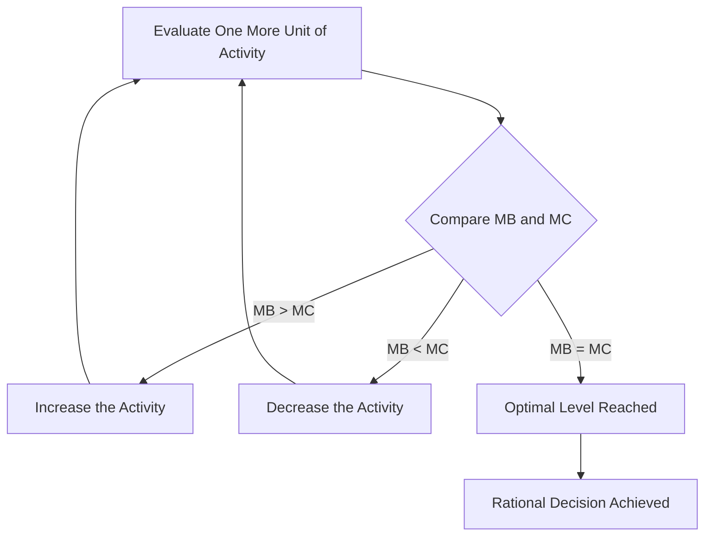

## Marginal Analysis and Rational Decision-Making

### Definition and Core Concept

**Marginal analysis** is the economic method of evaluating decisions by examining the additional (incremental) benefit and additional (incremental) cost of a small change in an activity, rather than the total benefit or total cost. It is the central analytical technique used throughout microeconomics to model how rational agents — consumers, firms, and policymakers — make optimal decisions.

**Rational decision-making**, in the standard microeconomic framework, assumes that agents seek to maximize their objective (utility for consumers, profit for firms) by comparing the marginal benefit and marginal cost of each additional unit of an activity, and adjusting behavior until no further net gain is possible.

**Key Points**

- Marginal means "additional" or "one more unit" — marginal analysis is fundamentally about incremental, not total, changes.
- Optimal decisions occur at the margin, not by comparing totals.
- This framework underlies consumer choice theory, firm production/pricing decisions, and public policy analysis alike.

### Marginal Benefit and Marginal Cost

- **Marginal Benefit (MB)**: The additional benefit (utility, revenue) gained from consuming or producing one more unit of a good or activity.
- **Marginal Cost (MC)**: The additional cost incurred from consuming or producing one more unit.

$$MB = \frac{\Delta \text{Total Benefit}}{\Delta Q}, \quad MC = \frac{\Delta \text{Total Cost}}{\Delta Q}$$

### The Marginal Decision Rule

The core decision rule of marginal analysis states that a rational agent should continue an activity as long as the marginal benefit exceeds the marginal cost, and stop (or reduce the activity) once marginal cost exceeds marginal benefit. The optimal level of the activity occurs where:

$$MB = MC$$

**Key Points**

- If $MB > MC$: increasing the activity by one more unit adds more benefit than cost — the agent should do more.
- If $MB < MC$: increasing the activity adds more cost than benefit — the agent should do less.
- If $MB = MC$: the agent has reached the optimal (utility- or profit-maximizing) level of the activity; this is the equilibrium condition.

### Graphical Representation

<svg xmlns="http://www.w3.org/2000/svg" viewBox="0 0 540 400" font-family="sans-serif">
<text x="270" y="24" font-size="15" font-weight="bold" text-anchor="middle">Marginal Benefit and Marginal Cost (svg_diagram)</text>
<line x1="80" y1="340" x2="80" y2="50" stroke="black" stroke-width="2" />
<line x1="80" y1="340" x2="480" y2="340" stroke="black" stroke-width="2" />
<text x="30" y="55" font-size="12">$ / Unit</text>
<text x="440" y="365" font-size="12">Quantity</text>

<line x1="100" y1="90" x2="440" y2="300" stroke="#1f77b4" stroke-width="3" />
<text x="380" y="290" font-size="12" fill="#1f77b4">MB (declining)</text>

<line x1="100" y1="300" x2="440" y2="100" stroke="#d62728" stroke-width="3" />
<text x="360" y="115" font-size="12" fill="#d62728">MC (rising)</text>

<circle cx="270" cy="200" r="5" fill="black" />
<line x1="270" y1="200" x2="270" y2="340" stroke="#999" stroke-dasharray="4,4" />
<line x1="80" y1="200" x2="270" y2="200" stroke="#999" stroke-dasharray="4,4" />
<text x="200" y="195" font-size="12" font-weight="bold">MB = MC (Optimal Q*)</text>
<text x="255" y="358" font-size="11">Q*</text>
</svg>

### Application: Consumer Choice

In consumer theory, marginal analysis explains how a utility-maximizing consumer allocates a limited budget across goods. The consumer optimum occurs when the marginal utility per dollar spent is equalized across all goods purchased:

$$\frac{MU_X}{P_X} = \frac{MU_Y}{P_Y}$$

**Example**

Suppose a consumer buys Apples ($P = \$2$) and Bananas ($P = \$1$). If $MU_{\text{Apples}} = 10$ and $MU_{\text{Bananas}} = 4$:

$$\frac{MU_A}{P_A} = \frac{10}{2} = 5, \quad \frac{MU_B}{P_B} = \frac{4}{1} = 4$$

Since apples yield more marginal utility per dollar (5 > 4), the consumer should buy more apples and fewer bananas, reallocating spending until the ratios are equal — this reallocation is diminishing marginal utility in action, since consuming more apples eventually lowers $MU_A$ toward equilibrium.

### Application: Firm Output and Pricing Decisions

Firms use marginal analysis to determine the profit-maximizing level of output, by comparing **Marginal Revenue (MR)** — the additional revenue from selling one more unit — to **Marginal Cost (MC)** — the additional cost of producing one more unit.

$$\text{Profit-maximizing output: } MR = MC$$

**Key Points**

- In perfectly competitive markets, $MR = P$ (price), so the profit-maximizing condition simplifies to $P = MC$.
- In markets with market power (monopoly, monopolistic competition), $MR < P$, since selling additional units typically requires lowering price on all units sold.
- Producing beyond the point where $MR = MC$ reduces profit, since the additional units cost more to produce than they generate in revenue.

### Application: Public Policy and Cost-Benefit Analysis

Marginal analysis extends to public policy evaluation, where policymakers (in principle) compare the marginal social benefit (MSB) and marginal social cost (MSC) of a policy or level of provision (e.g., pollution abatement, public goods provision) to identify the socially optimal level:

$$\text{Socially optimal level: } MSB = MSC$$

This framework underlies analysis of externalities and the case for corrective taxes or subsidies (Pigouvian taxes), where the private marginal cost/benefit diverges from the social marginal cost/benefit.

### Sunk Costs and the Marginal Decision Rule

A key implication of marginal analysis is that **sunk costs** — costs already incurred and unrecoverable — should be excluded from marginal decision-making, since they do not affect the marginal cost or marginal benefit of future choices.

**Example**

A firm has already spent $1 million developing a product prototype. If completing the product requires an additional $200,000 in marginal cost but is only expected to generate $150,000 in marginal revenue, a rational decision-maker should abandon the project — the $1 million already spent is irrelevant to the forward-looking marginal comparison, even though it may feel psychologically difficult to "walk away" from a large prior investment (the **sunk cost fallacy**).

### Diminishing Marginal Returns and Diminishing Marginal Utility

Marginal analysis is closely tied to two foundational "diminishing marginal" principles:

- **Law of diminishing marginal utility**: Each additional unit of a good consumed yields progressively smaller increases in total utility, holding other consumption constant — explaining why demand curves slope downward.
- **Law of diminishing marginal returns**: In production, as more of a variable input (e.g., labor) is added to a fixed input (e.g., capital), the additional (marginal) output produced by each additional unit of the variable input eventually declines.

These declining marginal curves are what typically produce the downward-sloping MB curves and upward-sloping MC curves seen in standard marginal analysis diagrams.

### Assumptions of the Rational Decision-Making Model

**Key Points**

- Agents are assumed to have well-defined, consistent preferences (completeness and transitivity in consumer theory).
- Agents are assumed to have sufficient information to evaluate marginal benefits and costs accurately.
- Agents are assumed to act to maximize their own objective function (utility, profit) — the standard "homo economicus" assumption.
- These assumptions are simplifications; behavioral economics research has documented systematic ways in which real-world decision-making deviates from strict marginal rationality (e.g., loss aversion, bounded rationality, present bias). [Inference: the extent to which these deviations undermine the practical predictive usefulness of the marginal framework is a matter of ongoing debate within the economics profession, rather than a settled conclusion.]

### Marginal vs. Average and Total Measures

A common analytical pitfall is confusing marginal, average, and total measures. Marginal analysis is distinct because it isolates the effect of the *next* unit, rather than describing the *overall* or *typical* level of benefit/cost.

| Measure | Definition | Formula |
| --- | --- | --- |
| Total | Cumulative benefit/cost across all units | $TB, TC$ |
| Average | Total divided by quantity | $AB = TB/Q$, $AC = TC/Q$ |
| Marginal | Change in total from one additional unit | $MB = \Delta TB/\Delta Q$, $MC = \Delta TC/\Delta Q$ |

**Key Points**

- Optimal decisions are always found by comparing marginal, not average or total, values.
- A classic error is deciding to continue an activity because "total benefit still exceeds total cost," even when marginal cost already exceeds marginal benefit at the current level — this leads to overproduction/overconsumption relative to the true optimum.

### Related Topics

- Scarcity, Choice, and Opportunity Cost
- Consumer Choice Theory and Utility Maximization
- Law of Diminishing Marginal Utility
- Law of Diminishing Marginal Returns
- Profit Maximization: MR = MC Rule
- Sunk Cost Fallacy in Behavioral Economics
- Externalities and Pigouvian Taxation